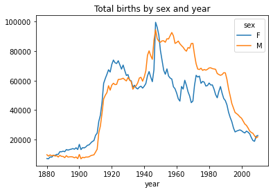
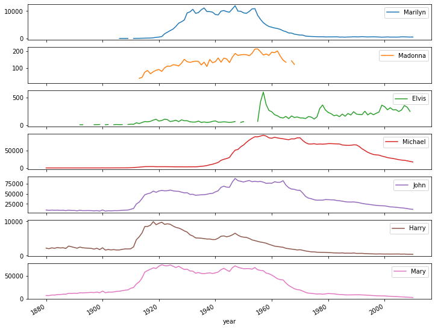
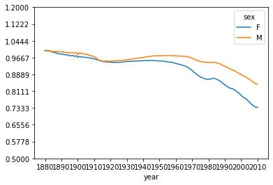

```python
"""
데이터 출처 : 사회보장국(www.ssa.gov)
이름 데이터 분석
1) 시대별 흔한 이름 -> 각 년도별로 가장 인기있는(비율이 높은) 이름 추출
2) 년도별로 이름 순위 -> 가장 빈도가 높거나 낮은 이름
3) 특정 이름의 유행(엘비스, 마이클잭슨, 마릴린먼로, 마돈나, 성서 이름)
4) 모음, 자음, 길이, 철자 변화, 첫/마지막 글자
5) 이름의 다양성
6) 남성 <-> 여성 크로스가 이루어진 이름
...

1)각 년도별로 가장 인기있는(비율이 높은) 이름 추출 ->
가장 빈도수가 높은 이름부터 낮은 이름순으로 10개 이름 출력
1880년~2010년 남자 아이 이름 1등=>['John','John', ..., 'Mary']

2) 
- names에서 성별로 나누었을때, 이름에 대한 모음 및 자음 비율?
- 남자 아이 이름에 대해 가장 많이 사용된 알파벳 문자?
- 여자 아이 이름에 대해 가장 많이 사용된 알파벳 문자?

3) adv.
남성 <-> 여성 크로스가 이루어진 이름
"""
```


```python
import pandas as pd
import numpy as np
```


```python
#!head -n 10 yob/yob1880.txt
#path 지정해주면 에러 해결됨

names1880=pd.read_csv("../Data/yob/yob1880.txt", 
            header=None, 
            names=['name', 'sex', 'births'])
names1880
```


<div>
<style scoped>
    .dataframe tbody tr th:only-of-type {
        vertical-align: middle;
    }

    .dataframe tbody tr th {
        vertical-align: top;
    }

    .dataframe thead th {
        text-align: right;
    }
</style>
<table border="1" class="dataframe">
  <thead>
    <tr style="text-align: right;">
      <th></th>
      <th>name</th>
      <th>sex</th>
      <th>births</th>
    </tr>
  </thead>
  <tbody>
    <tr>
      <th>0</th>
      <td>Mary</td>
      <td>F</td>
      <td>7065</td>
    </tr>
    <tr>
      <th>1</th>
      <td>Anna</td>
      <td>F</td>
      <td>2604</td>
    </tr>
    <tr>
      <th>2</th>
      <td>Emma</td>
      <td>F</td>
      <td>2003</td>
    </tr>
    <tr>
      <th>3</th>
      <td>Elizabeth</td>
      <td>F</td>
      <td>1939</td>
    </tr>
    <tr>
      <th>4</th>
      <td>Minnie</td>
      <td>F</td>
      <td>1746</td>
    </tr>
    <tr>
      <th>...</th>
      <td>...</td>
      <td>...</td>
      <td>...</td>
    </tr>
    <tr>
      <th>1995</th>
      <td>Woodie</td>
      <td>M</td>
      <td>5</td>
    </tr>
    <tr>
      <th>1996</th>
      <td>Worthy</td>
      <td>M</td>
      <td>5</td>
    </tr>
    <tr>
      <th>1997</th>
      <td>Wright</td>
      <td>M</td>
      <td>5</td>
    </tr>
    <tr>
      <th>1998</th>
      <td>York</td>
      <td>M</td>
      <td>5</td>
    </tr>
    <tr>
      <th>1999</th>
      <td>Zachariah</td>
      <td>M</td>
      <td>5</td>
    </tr>
  </tbody>
</table>
<p>2000 rows × 3 columns</p>
</div>


```python
names1880.groupby('sex').name.max()

```


    sex
    F    Zula
    M    Zeke
    Name: name, dtype: object


```python
names1880.groupby('sex').births.sum()
```


    sex
    F     90993
    M    110493
    Name: births, dtype: int64


```python
names1880.info()
```

    <class 'pandas.core.frame.DataFrame'>
    RangeIndex: 2000 entries, 0 to 1999
    Data columns (total 3 columns):
     #   Column  Non-Null Count  Dtype 
    ---  ------  --------------  ----- 
     0   name    2000 non-null   object
     1   sex     2000 non-null   object
     2   births  2000 non-null   int64 
    dtypes: int64(1), object(2)
    memory usage: 31.3+ KB
    


```python
names1880.groupby('sex').births.sum()/names1880.groupby('sex').name.count()
```


    sex
    F     96.595541
    M    104.435728
    dtype: float64


```python
#데이터를 특정 기준(컬럼)으로 그룹화(groupby) -> 그룹 단위의 연산(sum, max, count,...)
names1880.groupby('sex').name.count()
names1880.groupby('sex').births.sum()
#names1880.info()
names1880.groupby('sex').births.sum()/names1880.groupby('sex').name.count()


```


```python
type(names1880)
names1880
```


```python
#1880년~2010년까지 데이터 파일 읽어들이기

pieces=[]
#리스트에 131개의 데이터프레임을 담기 위한 변수
#리스트에 데이터프레임을 요소로 저장

#feature engineering(특성 공학) :데이터의 기존 변수로부터 연산을 통해
#새로운 변수를 생성하는 작업. ex)국어, 영어 => 평균


for year in range(1880, 2011):
    path="../Data/yob/yob%d.txt" % year
    df=pd.read_csv(path,
                   header=None,
                   names=['name', 'sex', 'births'])
    df['year']=year
    pieces.append(df)
len(pieces)
pieces
```


    [           name sex  births  year
     0          Mary   F    7065  1880
     1          Anna   F    2604  1880
     2          Emma   F    2003  1880
     3     Elizabeth   F    1939  1880
     4        Minnie   F    1746  1880
     ...         ...  ..     ...   ...
     1995     Woodie   M       5  1880
     1996     Worthy   M       5  1880
     1997     Wright   M       5  1880
     1998       York   M       5  1880
     1999  Zachariah   M       5  1880
     
     [2000 rows x 4 columns],
                name sex  births  year
     0          Mary   F    6919  1881
     1          Anna   F    2698  1881
     2          Emma   F    2034  1881
     3     Elizabeth   F    1852  1881
     4      Margaret   F    1658  1881
     ...         ...  ..     ...   ...
     1930     Wiliam   M       5  1881
     1931     Wilton   M       5  1881
     1932       Wing   M       5  1881
     1933       Wood   M       5  1881
     1934     Wright   M       5  1881
     
     [1935 rows x 4 columns],
                name sex  births  year
     0          Mary   F    8149  1882
     1          Anna   F    3143  1882
     2          Emma   F    2303  1882
     3     Elizabeth   F    2187  1882
     4        Minnie   F    2004  1882
     ...         ...  ..     ...   ...
     2122       Wirt   M       5  1882
     2123    Woodson   M       5  1882
     2124      Woody   M       5  1882
     2125     Worley   M       5  1882
     2126        Zed   M       5  1882
     
     [2127 rows x 4 columns],
                name sex  births  year
     0          Mary   F    8012  1883
     1          Anna   F    3306  1883
     2          Emma   F    2367  1883
     3     Elizabeth   F    2255  1883
     4        Minnie   F    2035  1883
     ...         ...  ..     ...   ...
     2079      Titus   M       5  1883
     2080      Toney   M       5  1883
     2081      Verna   M       5  1883
     2082     Winnie   M       5  1883
     2083   Winthrop   M       5  1883
     
     [2084 rows x 4 columns],
                name sex  births  year
     0          Mary   F    9217  1884
     1          Anna   F    3860  1884
     2          Emma   F    2587  1884
     3     Elizabeth   F    2549  1884
     4        Minnie   F    2243  1884
     ...         ...  ..     ...   ...
     2292   Williard   M       5  1884
     2293      Willy   M       5  1884
     2294    Winston   M       5  1884
     2295       York   M       5  1884
     2296  Zachariah   M       5  1884
     
     [2297 rows x 4 columns],
                name sex  births  year
     0          Mary   F    9128  1885
     1          Anna   F    3994  1885
     2          Emma   F    2728  1885
     3     Elizabeth   F    2582  1885
     4      Margaret   F    2204  1885
     ...         ...  ..     ...   ...
     2289     Wallie   M       5  1885
     2290    Willian   M       5  1885
     2291       Wirt   M       5  1885
     2292        Yee   M       5  1885
     2293        Zeb   M       5  1885
     
     [2294 rows x 4 columns],
                name sex  births  year
     0          Mary   F    9891  1886
     1          Anna   F    4283  1886
     2          Emma   F    2764  1886
     3     Elizabeth   F    2680  1886
     4        Minnie   F    2372  1886
     ...         ...  ..     ...   ...
     2387       Wood   M       5  1886
     2388      Worth   M       5  1886
     2389     Wright   M       5  1886
     2390     Xavier   M       5  1886
     2391      Yancy   M       5  1886
     
     [2392 rows x 4 columns],
                name sex  births  year
     0          Mary   F    9888  1887
     1          Anna   F    4227  1887
     2     Elizabeth   F    2681  1887
     3          Emma   F    2647  1887
     4      Margaret   F    2419  1887
     ...         ...  ..     ...   ...
     2368    Wheeler   M       5  1887
     2369    Wilfrid   M       5  1887
     2370    Wilhelm   M       5  1887
     2371       Wirt   M       5  1887
     2372        Zed   M       5  1887
     
     [2373 rows x 4 columns],
                name sex  births  year
     0          Mary   F   11754  1888
     1          Anna   F    4982  1888
     2     Elizabeth   F    3224  1888
     3          Emma   F    3087  1888
     4      Margaret   F    2904  1888
     ...         ...  ..     ...   ...
     2646     Vaughn   M       5  1888
     2647     Vernie   M       5  1888
     2648       Watt   M       5  1888
     2649    Winston   M       5  1888
     2650      Zelma   M       5  1888
     
     [2651 rows x 4 columns],
                name sex  births  year
     0          Mary   F   11649  1889
     1          Anna   F    5062  1889
     2     Elizabeth   F    3058  1889
     3      Margaret   F    2917  1889
     4          Emma   F    2884  1889
     ...         ...  ..     ...   ...
     2585     Weldon   M       5  1889
     2586    Wendell   M       5  1889
     2587    Wilhelm   M       5  1889
     2588       Zeke   M       5  1889
     2589      Zenas   M       5  1889
     
     [2590 rows x 4 columns],
                name sex  births  year
     0          Mary   F   12078  1890
     1          Anna   F    5233  1890
     2     Elizabeth   F    3112  1890
     3      Margaret   F    3100  1890
     4          Emma   F    2980  1890
     ...         ...  ..     ...   ...
     2690  Whitfield   M       5  1890
     2691    Wilhelm   M       5  1890
     2692    Woodfin   M       5  1890
     2693     Woodie   M       5  1890
     2694    Woodson   M       5  1890
     
     [2695 rows x 4 columns],
                name sex  births  year
     0          Mary   F   11704  1891
     1          Anna   F    5099  1891
     2      Margaret   F    3066  1891
     3     Elizabeth   F    3059  1891
     4          Emma   F    2884  1891
     ...         ...  ..     ...   ...
     2655    Willian   M       5  1891
     2656    Winford   M       5  1891
     2657    Winston   M       5  1891
     2658      Wyatt   M       5  1891
     2659      Wylie   M       5  1891
     
     [2660 rows x 4 columns],
                name sex  births  year
     0          Mary   F   13174  1892
     1          Anna   F    5542  1892
     2     Elizabeth   F    3461  1892
     3      Margaret   F    3435  1892
     4          Ruth   F    3291  1892
     ...         ...  ..     ...   ...
     2916       Wint   M       5  1892
     2917     Winton   M       5  1892
     2918     Worley   M       5  1892
     2919       York   M       5  1892
     2920  Zachariah   M       5  1892
     
     [2921 rows x 4 columns],
                name sex  births  year
     0          Mary   F   12784  1893
     1          Anna   F    5695  1893
     2          Ruth   F    3658  1893
     3      Margaret   F    3565  1893
     4     Elizabeth   F    3361  1893
     ...         ...  ..     ...   ...
     2826  Whitfield   M       5  1893
     2827    Whitney   M       5  1893
     2828     Willia   M       5  1893
     2829       Wing   M       5  1893
     2830       Zora   M       5  1893
     
     [2831 rows x 4 columns],
                name sex  births  year
     0          Mary   F   13151  1894
     1          Anna   F    5565  1894
     2      Margaret   F    3701  1894
     3         Helen   F    3676  1894
     4     Elizabeth   F    3425  1894
     ...         ...  ..     ...   ...
     2936      Worth   M       5  1894
     2937     Xavier   M       5  1894
     2938     Yancey   M       5  1894
     2939      Yancy   M       5  1894
     2940      Young   M       5  1894
     
     [2941 rows x 4 columns],
                name sex  births  year
     0          Mary   F   13446  1895
     1          Anna   F    5949  1895
     2         Helen   F    4023  1895
     3      Margaret   F    3931  1895
     4     Elizabeth   F    3603  1895
     ...         ...  ..     ...   ...
     3044       Whit   M       5  1895
     3045    Wilfrid   M       5  1895
     3046    Wilhelm   M       5  1895
     3047       Wong   M       5  1895
     3048        Yee   M       5  1895
     
     [3049 rows x 4 columns],
               name sex  births  year
     0         Mary   F   13811  1896
     1         Anna   F    5860  1896
     2        Helen   F    4392  1896
     3     Margaret   F    4051  1896
     4         Ruth   F    3905  1896
     ...        ...  ..     ...   ...
     3086    Worley   M       5  1896
     3087    Wright   M       5  1896
     3088    Xavier   M       5  1896
     3089      York   M       5  1896
     3090    Zollie   M       5  1896
     
     [3091 rows x 4 columns],
               name sex  births  year
     0         Mary   F   13412  1897
     1         Anna   F    5429  1897
     2        Helen   F    4518  1897
     3     Margaret   F    4145  1897
     4         Ruth   F    3878  1897
     ...        ...  ..     ...   ...
     3023    Woodie   M       5  1897
     3024     Woody   M       5  1897
     3025    Worley   M       5  1897
     3026     Worth   M       5  1897
     3027    Xavier   M       5  1897
     
     [3028 rows x 4 columns],
               name sex  births  year
     0         Mary   F   14406  1898
     1         Anna   F    5773  1898
     2        Helen   F    5230  1898
     3     Margaret   F    4696  1898
     4         Ruth   F    4249  1898
     ...        ...  ..     ...   ...
     3260     Wince   M       5  1898
     3261   Winford   M       5  1898
     3262      Wing   M       5  1898
     3263     Wyman   M       5  1898
     3264       Zed   M       5  1898
     
     [3265 rows x 4 columns],
               name sex  births  year
     0         Mary   F   13172  1899
     1         Anna   F    5115  1899
     2        Helen   F    5048  1899
     3     Margaret   F    4249  1899
     4         Ruth   F    3912  1899
     ...        ...  ..     ...   ...
     3037    Waddie   M       5  1899
     3038   Wilhelm   M       5  1899
     3039   Winford   M       5  1899
     3040    Winton   M       5  1899
     3041     Young   M       5  1899
     
     [3042 rows x 4 columns],
               name sex  births  year
     0         Mary   F   16710  1900
     1        Helen   F    6343  1900
     2         Anna   F    6115  1900
     3     Margaret   F    5305  1900
     4         Ruth   F    4765  1900
     ...        ...  ..     ...   ...
     3728     White   M       5  1900
     3729   Wilhelm   M       5  1900
     3730  Winifred   M       5  1900
     3731    Woodie   M       5  1900
     3732      Zeno   M       5  1900
     
     [3733 rows x 4 columns],
               name sex  births  year
     0         Mary   F   13137  1901
     1        Helen   F    5247  1901
     2         Anna   F    4923  1901
     3     Margaret   F    4424  1901
     4         Ruth   F    3974  1901
     ...        ...  ..     ...   ...
     3148     Welby   M       5  1901
     3149   Westley   M       5  1901
     3150  Williard   M       5  1901
     3151     Young   M       5  1901
     3152       Zeb   M       5  1901
     
     [3153 rows x 4 columns],
               name sex  births  year
     0         Mary   F   14485  1902
     1        Helen   F    5967  1902
     2         Anna   F    5288  1902
     3     Margaret   F    5011  1902
     4         Ruth   F    4384  1902
     ...        ...  ..     ...   ...
     3357   Woodrow   M       5  1902
     3358    Wright   M       5  1902
     3359     Wyman   M       5  1902
     3360     Yancy   M       5  1902
     3361    Zollie   M       5  1902
     
     [3362 rows x 4 columns],
               name sex  births  year
     0         Mary   F   14275  1903
     1        Helen   F    6129  1903
     2         Anna   F    5098  1903
     3     Margaret   F    5046  1903
     4         Ruth   F    4518  1903
     ...        ...  ..     ...   ...
     3384      Webb   M       5  1903
     3385   Wilburt   M       5  1903
     3386    Worthy   M       5  1903
     3387     Young   M       5  1903
     3388    Zollie   M       5  1903
     
     [3389 rows x 4 columns],
               name sex  births  year
     0         Mary   F   14962  1904
     1        Helen   F    6489  1904
     2         Anna   F    5330  1904
     3     Margaret   F    5302  1904
     4         Ruth   F    4900  1904
     ...        ...  ..     ...   ...
     3556   Willian   M       5  1904
     3557    Woodie   M       5  1904
     3558     Woody   M       5  1904
     3559    Worley   M       5  1904
     3560       Yee   M       5  1904
     
     [3561 rows x 4 columns],
               name sex  births  year
     0         Mary   F   16067  1905
     1        Helen   F    6811  1905
     2     Margaret   F    5690  1905
     3         Anna   F    5424  1905
     4         Ruth   F    5068  1905
     ...        ...  ..     ...   ...
     3651   Wilburt   M       5  1905
     3652   Wilfrid   M       5  1905
     3653   Willian   M       5  1905
     3654  Winifred   M       5  1905
     3655   Woodson   M       5  1905
     
     [3656 rows x 4 columns],
               name sex  births  year
     0         Mary   F   16371  1906
     1        Helen   F    7176  1906
     2     Margaret   F    6096  1906
     3         Anna   F    5502  1906
     4         Ruth   F    5140  1906
     ...        ...  ..     ...   ...
     3628  Winifred   M       5  1906
     3629   Winslow   M       5  1906
     3630      Wray   M       5  1906
     3631     Wyman   M       5  1906
     3632    Zeddie   M       5  1906
     
     [3633 rows x 4 columns],
               name sex  births  year
     0         Mary   F   17579  1907
     1        Helen   F    7579  1907
     2     Margaret   F    6713  1907
     3         Anna   F    5575  1907
     4         Ruth   F    5573  1907
     ...        ...  ..     ...   ...
     3943      Wray   M       5  1907
     3944     Wyman   M       5  1907
     3945       Zeb   M       5  1907
     3946      Zeke   M       5  1907
     3947      Zeno   M       5  1907
     
     [3948 rows x 4 columns],
               name sex  births  year
     0         Mary   F   18664  1908
     1        Helen   F    8436  1908
     2     Margaret   F    6976  1908
     3         Ruth   F    6179  1908
     4         Anna   F    5858  1908
     ...        ...  ..     ...   ...
     4013   Wilhelm   M       5  1908
     4014     Wilma   M       5  1908
     4015    Worthy   M       5  1908
     4016    Yancey   M       5  1908
     4017      Zeno   M       5  1908
     
     [4018 rows x 4 columns],
               name sex  births  year
     0         Mary   F   19256  1909
     1        Helen   F    9249  1909
     2     Margaret   F    7358  1909
     3         Ruth   F    6508  1909
     4      Dorothy   F    6252  1909
     ...        ...  ..     ...   ...
     4221   Wilfrid   M       5  1909
     4222     Wilma   M       5  1909
     4223  Winthrop   M       5  1909
     4224    Winton   M       5  1909
     4225   Zygmund   M       5  1909
     
     [4226 rows x 4 columns],
               name sex  births  year
     0         Mary   F   22840  1910
     1        Helen   F   10477  1910
     2     Margaret   F    8226  1910
     3      Dorothy   F    7315  1910
     4         Ruth   F    7210  1910
     ...        ...  ..     ...   ...
     4623   Woodson   M       5  1910
     4624     Woody   M       5  1910
     4625     Wyman   M       5  1910
     4626    Yoshio   M       5  1910
     4627    Zennie   M       5  1910
     
     [4628 rows x 4 columns],
               name sex  births  year
     0         Mary   F   24385  1911
     1        Helen   F   11799  1911
     2     Margaret   F    9276  1911
     3      Dorothy   F    8869  1911
     4         Ruth   F    7999  1911
     ...        ...  ..     ...   ...
     4863  Woodford   M       5  1911
     4864     Woody   M       5  1911
     4865    Yoshio   M       5  1911
     4866     Zenas   M       5  1911
     4867     Zenon   M       5  1911
     
     [4868 rows x 4 columns],
               name sex  births  year
     0         Mary   F   32295  1912
     1        Helen   F   16130  1912
     2      Dorothy   F   12642  1912
     3     Margaret   F   12532  1912
     4         Ruth   F   11274  1912
     ...        ...  ..     ...   ...
     6344     Woods   M       5  1912
     6345      Wray   M       5  1912
     6346      Wynn   M       5  1912
     6347      York   M       5  1912
     6348    Yutaka   M       5  1912
     
     [6349 rows x 4 columns],
               name sex  births  year
     0         Mary   F   36631  1913
     1        Helen   F   18879  1913
     2      Dorothy   F   14670  1913
     3     Margaret   F   14484  1913
     4         Ruth   F   12601  1913
     ...        ...  ..     ...   ...
     6960    Yutaka   M       5  1913
     6961      Zach   M       5  1913
     6962    Zeddie   M       5  1913
     6963     Zenas   M       5  1913
     6964     Zenus   M       5  1913
     
     [6965 rows x 4 columns],
               name sex  births  year
     0         Mary   F   45341  1914
     1        Helen   F   23218  1914
     2      Dorothy   F   18779  1914
     3     Margaret   F   17756  1914
     4         Ruth   F   15835  1914
     ...        ...  ..     ...   ...
     7959    Wister   M       5  1914
     7960   Wofford   M       5  1914
     7961     Yasuo   M       5  1914
     7962      Zell   M       5  1914
     7963    Zenith   M       5  1914
     
     [7964 rows x 4 columns],
                name sex  births  year
     0          Mary   F   58184  1915
     1         Helen   F   30865  1915
     2       Dorothy   F   25150  1915
     3      Margaret   F   23052  1915
     4          Ruth   F   21881  1915
     ...         ...  ..     ...   ...
     9356     Yewell   M       5  1915
     9357  Zachariah   M       5  1915
     9358      Zelma   M       5  1915
     9359       Zora   M       5  1915
     9360    Zygmont   M       5  1915
     
     [9361 rows x 4 columns],
               name sex  births  year
     0         Mary   F   61428  1916
     1        Helen   F   32662  1916
     2      Dorothy   F   27415  1916
     3     Margaret   F   24954  1916
     4         Ruth   F   23185  1916
     ...        ...  ..     ...   ...
     9691     Zelma   M       5  1916
     9692      Zera   M       5  1916
     9693    Zettie   M       5  1916
     9694      Ziba   M       5  1916
     9695      Zina   M       5  1916
     
     [9696 rows x 4 columns],
                name sex  births  year
     0          Mary   F   64270  1917
     1         Helen   F   34241  1917
     2       Dorothy   F   28851  1917
     3      Margaret   F   25561  1917
     4          Ruth   F   23562  1917
     ...         ...  ..     ...   ...
     9909  Yoshiharu   M       5  1917
     9910    Zebulon   M       5  1917
     9911     Zeddie   M       5  1917
     9912       Zeke   M       5  1917
     9913       Zola   M       5  1917
     
     [9914 rows x 4 columns],
                name sex  births  year
     0          Mary   F   67375  1918
     1         Helen   F   36152  1918
     2       Dorothy   F   32031  1918
     3      Margaret   F   27136  1918
     4          Ruth   F   25538  1918
     ...         ...  ..     ...   ...
     10397      Zach   M       5  1918
     10398     Zaven   M       5  1918
     10399    Zellie   M       5  1918
     10400    Zelmer   M       5  1918
     10401     Zenas   M       5  1918
     
     [10402 rows x 4 columns],
                name sex  births  year
     0          Mary   F   65839  1919
     1         Helen   F   33705  1919
     2       Dorothy   F   31733  1919
     3      Margaret   F   26240  1919
     4          Ruth   F   24569  1919
     ...         ...  ..     ...   ...
     10364    Zebbie   M       5  1919
     10365       Zed   M       5  1919
     10366  Zeferino   M       5  1919
     10367    Zelmer   M       5  1919
     10368    Ziggie   M       5  1919
     
     [10369 rows x 4 columns],
                name sex  births  year
     0          Mary   F   70974  1920
     1       Dorothy   F   36646  1920
     2         Helen   F   35093  1920
     3      Margaret   F   27998  1920
     4          Ruth   F   26105  1920
     ...         ...  ..     ...   ...
     10751     Zearl   M       5  1920
     10752  Zeferino   M       5  1920
     10753      Zeke   M       5  1920
     10754      Zera   M       5  1920
     10755   Zygmont   M       5  1920
     
     [10756 rows x 4 columns],
                name sex  births  year
     0          Mary   F   73980  1921
     1       Dorothy   F   39082  1921
     2         Helen   F   34812  1921
     3      Margaret   F   28462  1921
     4          Ruth   F   25780  1921
     ...         ...  ..     ...   ...
     10851   Zackary   M       5  1921
     10852    Zebdee   M       5  1921
     10853      Zell   M       5  1921
     10854   Zigmont   M       5  1921
     10855   Zygmont   M       5  1921
     
     [10856 rows x 4 columns],
                 name sex  births  year
     0           Mary   F   72156  1922
     1        Dorothy   F   37711  1922
     2          Helen   F   32501  1922
     3       Margaret   F   26858  1922
     4           Ruth   F   23622  1922
     ...          ...  ..     ...   ...
     10754  Yoshiyuki   M       5  1922
     10755      Zenas   M       5  1922
     10756     Zenith   M       5  1922
     10757       Zola   M       5  1922
     10758     Zolton   M       5  1922
     
     [10759 rows x 4 columns],
                name sex  births  year
     0          Mary   F   71636  1923
     1       Dorothy   F   39023  1923
     2         Helen   F   31493  1923
     3      Margaret   F   26131  1923
     4         Betty   F   25992  1923
     ...         ...  ..     ...   ...
     10646    Zeddie   M       5  1923
     10647      Zeke   M       5  1923
     10648      Zell   M       5  1923
     10649      Zola   M       5  1923
     10650    Zolton   M       5  1923
     
     [10651 rows x 4 columns],
                name sex  births  year
     0          Mary   F   73505  1924
     1       Dorothy   F   40005  1924
     2         Helen   F   31199  1924
     3         Betty   F   30595  1924
     4      Margaret   F   26551  1924
     ...         ...  ..     ...   ...
     10857  Zaragoza   M       5  1924
     10858    Zeddie   M       5  1924
     10859     Zelma   M       5  1924
     10860    Zelmer   M       5  1924
     10861    Zenith   M       5  1924
     
     [10862 rows x 4 columns],
                name sex  births  year
     0          Mary   F   70594  1925
     1       Dorothy   F   38571  1925
     2         Betty   F   32816  1925
     3         Helen   F   29159  1925
     4      Margaret   F   24461  1925
     ...         ...  ..     ...   ...
     10638     Zenon   M       5  1925
     10639   Zigmunt   M       5  1925
     10640    Zolton   M       5  1925
     10641   Zygmont   M       5  1925
     10642   Zygmund   M       5  1925
     
     [10643 rows x 4 columns],
                 name sex  births  year
     0           Mary   F   67830  1926
     1        Dorothy   F   36608  1926
     2          Betty   F   32947  1926
     3          Helen   F   26872  1926
     4       Margaret   F   23061  1926
     ...          ...  ..     ...   ...
     10455       Yves   M       5  1926
     10456  Zachariah   M       5  1926
     10457        Zan   M       5  1926
     10458   Zeferino   M       5  1926
     10459     Zelmer   M       5  1926
     
     [10460 rows x 4 columns],
                name sex  births  year
     0          Mary   F   70594  1927
     1       Dorothy   F   35980  1927
     2         Betty   F   35414  1927
     3         Helen   F   25302  1927
     4      Margaret   F   21972  1927
     ...         ...  ..     ...   ...
     10402     Zaven   M       5  1927
     10403  Zeferino   M       5  1927
     10404    Zeldon   M       5  1927
     10405     Zenis   M       5  1927
     10406   Zygmund   M       5  1927
     
     [10407 rows x 4 columns],
                 name sex  births  year
     0           Mary   F   66867  1928
     1          Betty   F   36074  1928
     2        Dorothy   F   33726  1928
     3          Helen   F   22922  1928
     4       Margaret   F   20290  1928
     ...          ...  ..     ...   ...
     10155     Yvonne   M       5  1928
     10156   Zacarias   M       5  1928
     10157  Zachariah   M       5  1928
     10158     Zebbie   M       5  1928
     10159     Zolton   M       5  1928
     
     [10160 rows x 4 columns],
               name sex  births  year
     0         Mary   F   63502  1929
     1        Betty   F   36665  1929
     2      Dorothy   F   31467  1929
     3        Helen   F   20994  1929
     4     Margaret   F   19196  1929
     ...        ...  ..     ...   ...
     9805   Yoshimi   M       5  1929
     9806   Yoshiro   M       5  1929
     9807  Zeferino   M       5  1929
     9808      Zell   M       5  1929
     9809   Zygmund   M       5  1929
     
     [9810 rows x 4 columns],
                name sex  births  year
     0          Mary   F   64110  1930
     1         Betty   F   38239  1930
     2       Dorothy   F   30390  1930
     3         Helen   F   19907  1930
     4      Margaret   F   18353  1930
     ...         ...  ..     ...   ...
     9781       Ynez   M       5  1930
     9782    Yoshito   M       5  1930
     9783  Zacharias   M       5  1930
     9784      Zelma   M       5  1930
     9785     Zelmer   M       5  1930
     
     [9786 rows x 4 columns],
                  name sex  births  year
     0            Mary   F   60303  1931
     1           Betty   F   36082  1931
     2         Dorothy   F   26511  1931
     3         Barbara   F   21788  1931
     4            Joan   F   19102  1931
     ...           ...  ..     ...   ...
     9273      Worthie   M       5  1931
     9274  Worthington   M       5  1931
     9275       Wyllis   M       5  1931
     9276     Xenophon   M       5  1931
     9277       Zackie   M       5  1931
     
     [9278 rows x 4 columns],
              name sex  births  year
     0        Mary   F   59859  1932
     1       Betty   F   34411  1932
     2     Barbara   F   26310  1932
     3     Dorothy   F   24972  1932
     4        Joan   F   21043  1932
     ...       ...  ..     ...   ...
     9376     Yves   M       5  1932
     9377   Yvonne   M       5  1932
     9378      Zed   M       5  1932
     9379    Zelda   M       5  1932
     9380    Zenas   M       5  1932
     
     [9381 rows x 4 columns],
              name sex  births  year
     0        Mary   F   55477  1933
     1       Betty   F   31520  1933
     2     Barbara   F   26946  1933
     3     Dorothy   F   22039  1933
     4        Joan   F   19287  1933
     ...       ...  ..     ...   ...
     9002     Zach   M       5  1933
     9003      Zan   M       5  1933
     9004   Zannie   M       5  1933
     9005   Zebbie   M       5  1933
     9006     Zeke   M       5  1933
     
     [9007 rows x 4 columns],
              name sex  births  year
     0        Mary   F   56898  1934
     1       Betty   F   31082  1934
     2     Barbara   F   29222  1934
     3     Shirley   F   22837  1934
     4     Dorothy   F   21283  1934
     ...       ...  ..     ...   ...
     9173      Zan   M       5  1934
     9174   Zeddie   M       5  1934
     9175    Zenon   M       5  1934
     9176  Zigmund   M       5  1934
     9177  Zygmunt   M       5  1934
     
     [9178 rows x 4 columns],
               name sex  births  year
     0         Mary   F   55055  1935
     1      Shirley   F   42343  1935
     2      Barbara   F   30686  1935
     3        Betty   F   28660  1935
     4     Patricia   F   22876  1935
     ...        ...  ..     ...   ...
     9026    Wilman   M       5  1935
     9027   Winfrey   M       5  1935
     9028    Yazzie   M       5  1935
     9029  Zaragoza   M       5  1935
     9030     Zenas   M       5  1935
     
     [9031 rows x 4 columns],
               name sex  births  year
     0         Mary   F   54356  1936
     1      Shirley   F   35150  1936
     2      Barbara   F   31672  1936
     3        Betty   F   25862  1936
     4     Patricia   F   23903  1936
     ...        ...  ..     ...   ...
     8886    Wilman   M       5  1936
     8887    Wister   M       5  1936
     8888    Worthy   M       5  1936
     8889     Wyley   M       5  1936
     8890      Zeke   M       5  1936
     
     [8891 rows x 4 columns],
               name sex  births  year
     0         Mary   F   55635  1937
     1      Barbara   F   34902  1937
     2     Patricia   F   26838  1937
     3      Shirley   F   26808  1937
     4        Betty   F   25313  1937
     ...        ...  ..     ...   ...
     8936     Wyley   M       5  1937
     8937      Ynes   M       5  1937
     8938   Yoshito   M       5  1937
     8939  Zacarias   M       5  1937
     8940     Zelma   M       5  1937
     
     [8941 rows x 4 columns],
               name sex  births  year
     0         Mary   F   56199  1938
     1      Barbara   F   39262  1938
     2     Patricia   F   27547  1938
     3        Betty   F   25497  1938
     4      Shirley   F   23762  1938
     ...        ...  ..     ...   ...
     9021     Yukio   M       5  1938
     9022      Zach   M       5  1938
     9023    Zannie   M       5  1938
     9024  Zeferino   M       5  1938
     9025     Zenon   M       5  1938
     
     [9026 rows x 4 columns],
                name sex  births  year
     0          Mary   F   54903  1939
     1       Barbara   F   37262  1939
     2      Patricia   F   29699  1939
     3         Betty   F   23637  1939
     4       Shirley   F   20442  1939
     ...         ...  ..     ...   ...
     8915     Yoshio   M       5  1939
     8916      Yukio   M       5  1939
     8917  Zachariah   M       5  1939
     8918      Zelma   M       5  1939
     8919      Zenon   M       5  1939
     
     [8920 rows x 4 columns],
                  name sex  births  year
     0            Mary   F   56203  1940
     1         Barbara   F   36730  1940
     2        Patricia   F   32658  1940
     3          Judith   F   22376  1940
     4           Betty   F   22067  1940
     ...           ...  ..     ...   ...
     8955  Worthington   M       5  1940
     8956        Wynne   M       5  1940
     8957       Ysabel   M       5  1940
     8958       Zackie   M       5  1940
     8959        Zenas   M       5  1940
     
     [8960 rows x 4 columns],
               name sex  births  year
     0         Mary   F   58025  1941
     1      Barbara   F   39534  1941
     2     Patricia   F   36896  1941
     3        Carol   F   24186  1941
     4        Linda   F   23724  1941
     ...        ...  ..     ...   ...
     9078   Ygnacio   M       5  1941
     9079      Yong   M       5  1941
     9080      Yvon   M       5  1941
     9081    Zannie   M       5  1941
     9082      Zell   M       5  1941
     
     [9083 rows x 4 columns],
               name sex  births  year
     0         Mary   F   63236  1942
     1      Barbara   F   44732  1942
     2     Patricia   F   39454  1942
     3        Linda   F   31607  1942
     4        Carol   F   30266  1942
     ...        ...  ..     ...   ...
     9416    Winnie   M       5  1942
     9417     Wymon   M       5  1942
     9418    Yancey   M       5  1942
     9419    Yoshio   M       5  1942
     9420       Zed   M       5  1942
     
     [9421 rows x 4 columns],
               name sex  births  year
     0         Mary   F   66156  1943
     1      Barbara   F   43422  1943
     2     Patricia   F   39615  1943
     3        Linda   F   38433  1943
     4        Carol   F   31673  1943
     ...        ...  ..     ...   ...
     9404   Wyndell   M       5  1943
     9405   Yolanda   M       5  1943
     9406    Ysmael   M       5  1943
     9407  Zaragoza   M       5  1943
     9408   Zygmunt   M       5  1943
     
     [9409 rows x 4 columns],
               name sex  births  year
     0         Mary   F   62476  1944
     1      Barbara   F   39186  1944
     2        Linda   F   38408  1944
     3     Patricia   F   36875  1944
     4        Carol   F   30457  1944
     ...        ...  ..     ...   ...
     9148     Yancy   M       5  1944
     9149    Zackie   M       5  1944
     9150    Zennie   M       5  1944
     9151      Zeno   M       5  1944
     9152   Zigmund   M       5  1944
     
     [9153 rows x 4 columns],
                name sex  births  year
     0          Mary   F   59285  1945
     1         Linda   F   41485  1945
     2       Barbara   F   38283  1945
     3      Patricia   F   35849  1945
     4         Carol   F   30404  1945
     ...         ...  ..     ...   ...
     9028     Ysmael   M       5  1945
     9029   Zacarias   M       5  1945
     9030       Zach   M       5  1945
     9031  Zachariah   M       5  1945
     9032      Zenon   M       5  1945
     
     [9033 rows x 4 columns],
               name sex  births  year
     0         Mary   F   67437  1946
     1        Linda   F   52702  1946
     2     Patricia   F   46272  1946
     3      Barbara   F   45103  1946
     4        Carol   F   34246  1946
     ...        ...  ..     ...   ...
     9694      Yvon   M       5  1946
     9695    Yvonne   M       5  1946
     9696    Zebbie   M       5  1946
     9697   Zebulon   M       5  1946
     9698  Zeferino   M       5  1946
     
     [9699 rows x 4 columns],
                name sex  births  year
     0         Linda   F   99651  1947
     1          Mary   F   71654  1947
     2      Patricia   F   51269  1947
     3       Barbara   F   48778  1947
     4        Sandra   F   34755  1947
     ...         ...  ..     ...   ...
     10354  Zacarias   M       5  1947
     10355       Zan   M       5  1947
     10356    Zannie   M       5  1947
     10357    Zebbie   M       5  1947
     10358      Zell   M       5  1947
     
     [10359 rows x 4 columns],
                name sex  births  year
     0         Linda   F   96185  1948
     1          Mary   F   68582  1948
     2       Barbara   F   46811  1948
     3      Patricia   F   46127  1948
     4         Susan   F   35972  1948
     ...         ...  ..     ...   ...
     10238   Wyndell   M       5  1948
     10239     Yancy   M       5  1948
     10240   Zachery   M       5  1948
     10241   Zebulon   M       5  1948
     10242      Zell   M       5  1948
     
     [10243 rows x 4 columns],
                name sex  births  year
     0         Linda   F   90952  1949
     1          Mary   F   66809  1949
     2      Patricia   F   46315  1949
     3       Barbara   F   42562  1949
     4         Susan   F   37685  1949
     ...         ...  ..     ...   ...
     10244   Ygnacio   M       5  1949
     10245     Yusuf   M       5  1949
     10246      Yves   M       5  1949
     10247    Zannie   M       5  1949
     10248  Zeferino   M       5  1949
     
     [10249 rows x 4 columns],
                name sex  births  year
     0         Linda   F   80408  1950
     1          Mary   F   65444  1950
     2      Patricia   F   47910  1950
     3       Barbara   F   41558  1950
     4         Susan   F   38010  1950
     ...         ...  ..     ...   ...
     10295   Zachery   M       5  1950
     10296   Zackary   M       5  1950
     10297    Zannie   M       5  1950
     10298      Zeke   M       5  1950
     10299   Zygmunt   M       5  1950
     
     [10300 rows x 4 columns],
                name sex  births  year
     0         Linda   F   73858  1951
     1          Mary   F   65624  1951
     2      Patricia   F   56394  1951
     3       Deborah   F   42017  1951
     4       Barbara   F   40529  1951
     ...         ...  ..     ...   ...
     10447   Woodley   M       5  1951
     10448    Worthy   M       5  1951
     10449    Yancey   M       5  1951
     10450   Yisroel   M       5  1951
     10451   Zackery   M       5  1951
     
     [10452 rows x 4 columns],
                name sex  births  year
     0         Linda   F   67071  1952
     1          Mary   F   65699  1952
     2      Patricia   F   53083  1952
     3       Deborah   F   49796  1952
     4         Susan   F   41343  1952
     ...         ...  ..     ...   ...
     10643    Yehuda   M       5  1952
     10644      Zach   M       5  1952
     10645    Zannie   M       5  1952
     10646    Zebbie   M       5  1952
     10647      Zeke   M       5  1952
     
     [10648 rows x 4 columns],
                name sex  births  year
     0          Mary   F   64325  1953
     1         Linda   F   61243  1953
     2       Deborah   F   52170  1953
     3      Patricia   F   50979  1953
     4         Susan   F   44264  1953
     ...         ...  ..     ...   ...
     10823  Wwilliam   M       5  1953
     10824   Wwlliam   M       5  1953
     10825    Yehuda   M       5  1953
     10826      Yves   M       5  1953
     10827    Zackie   M       5  1953
     
     [10828 rows x 4 columns],
                name sex  births  year
     0          Mary   F   67988  1954
     1         Linda   F   55378  1954
     2       Deborah   F   54661  1954
     3      Patricia   F   49139  1954
     4         Susan   F   47156  1954
     ...         ...  ..     ...   ...
     10957     Wyley   M       5  1954
     10958   Yehudah   M       5  1954
     10959  Yitzchok   M       5  1954
     10960    Zalman   M       5  1954
     10961    Zeddie   M       5  1954
     
     [10962 rows x 4 columns],
                name sex  births  year
     0          Mary   F   63159  1955
     1       Deborah   F   52303  1955
     2         Linda   F   51271  1955
     3         Debra   F   50525  1955
     4         Susan   F   47382  1955
     ...         ...  ..     ...   ...
     11106   Zedrick   M       5  1955
     11107  Zeferino   M       5  1955
     11108      Zeke   M       5  1955
     11109      Zell   M       5  1955
     11110   Zephery   M       5  1955
     
     [11111 rows x 4 columns],
                name sex  births  year
     0          Mary   F   61752  1956
     1         Debra   F   48303  1956
     2         Linda   F   48067  1956
     3       Deborah   F   47836  1956
     4         Susan   F   46557  1956
     ...         ...  ..     ...   ...
     11337    Yvette   M       5  1956
     11338    Zalmen   M       5  1956
     11339  Zaragosa   M       5  1956
     11340     Zenas   M       5  1956
     11341       Zvi   M       5  1956
     
     [11342 rows x 4 columns],
                 name sex  births  year
     0           Mary   F   61090  1957
     1          Susan   F   45946  1957
     2          Linda   F   44497  1957
     3          Debra   F   42715  1957
     4          Karen   F   40585  1957
     ...          ...  ..     ...   ...
     11562    Wwlliam   M       5  1957
     11563     Yancey   M       5  1957
     11564        Zac   M       5  1957
     11565  Zachariah   M       5  1957
     11566     Zackie   M       5  1957
     
     [11567 rows x 4 columns],
                 name sex  births  year
     0           Mary   F   55832  1958
     1          Susan   F   45158  1958
     2          Linda   F   41895  1958
     3          Karen   F   38449  1958
     4       Patricia   F   37916  1958
     ...          ...  ..     ...   ...
     11512  Zachariah   M       5  1958
     11513     Zannie   M       5  1958
     11514        Zed   M       5  1958
     11515     Zettie   M       5  1958
     11516     Zonnie   M       5  1958
     
     [11517 rows x 4 columns],
               name sex  births  year
     0         Mary   F   54469  1959
     1        Susan   F   41602  1959
     2        Linda   F   40407  1959
     3        Karen   F   36763  1959
     4        Donna   F   36459  1959
     ...        ...  ..     ...   ...
     11764   Ysabel   M       5  1959
     11765   Zalman   M       5  1959
     11766   Zebbie   M       5  1959
     11767  Zebulon   M       5  1959
     11768  Zyndall   M       5  1959
     
     [11769 rows x 4 columns],
              name sex  births  year
     0        Mary   F   51477  1960
     1       Susan   F   39197  1960
     2       Linda   F   37317  1960
     3       Karen   F   36384  1960
     4       Donna   F   34126  1960
     ...       ...  ..     ...   ...
     11913   Yates   M       5  1960
     11914  Ysabel   M       5  1960
     11915   Yusuf   M       5  1960
     11916  Zalmen   M       5  1960
     11917  Zandel   M       5  1960
     
     [11918 rows x 4 columns],
               name sex  births  year
     0         Mary   F   47651  1961
     1         Lisa   F   42685  1961
     2        Susan   F   37517  1961
     3        Linda   F   35558  1961
     4        Karen   F   34684  1961
     ...        ...  ..     ...   ...
     12164   Yehuda   M       5  1961
     12165     Yogi   M       5  1961
     12166     Yvan   M       5  1961
     12167   Zannie   M       5  1961
     12168  Zendell   M       5  1961
     
     [12169 rows x 4 columns],
                 name sex  births  year
     0           Lisa   F   46090  1962
     1           Mary   F   43488  1962
     2          Susan   F   35743  1962
     3          Karen   F   35185  1962
     4          Linda   F   31458  1962
     ...          ...  ..     ...   ...
     12193       Yvan   M       5  1962
     12194        Zac   M       5  1962
     12195   Zacarias   M       5  1962
     12196  Zachariah   M       5  1962
     12197     Zollie   M       5  1962
     
     [12198 rows x 4 columns],
                 name sex  births  year
     0           Lisa   F   56030  1963
     1           Mary   F   41553  1963
     2          Susan   F   33991  1963
     3          Karen   F   32483  1963
     4          Linda   F   27708  1963
     ...          ...  ..     ...   ...
     12274        Wyn   M       5  1963
     12275     Yaakov   M       5  1963
     12276        Zac   M       5  1963
     12277  Zachariah   M       5  1963
     12278       Zora   M       5  1963
     
     [12279 rows x 4 columns],
                name sex  births  year
     0          Lisa   F   54271  1964
     1          Mary   F   40978  1964
     2         Susan   F   31511  1964
     3         Karen   F   30235  1964
     4      Patricia   F   26081  1964
     ...         ...  ..     ...   ...
     12382       Zac   M       5  1964
     12383    Zalman   M       5  1964
     12384    Zedric   M       5  1964
     12385      Zeno   M       5  1964
     12386      Zina   M       5  1964
     
     [12387 rows x 4 columns],
                name sex  births  year
     0          Lisa   F   60265  1965
     1          Mary   F   34270  1965
     2         Karen   F   32881  1965
     3      Kimberly   F   28831  1965
     4         Susan   F   26329  1965
     ...         ...  ..     ...   ...
     11949    Willem   M       5  1965
     11950   Winferd   M       5  1965
     11951    Worley   M       5  1965
     11952    Worthy   M       5  1965
     11953  Wwilliam   M       5  1965
     
     [11954 rows x 4 columns],
                name sex  births  year
     0          Lisa   F   56899  1966
     1      Kimberly   F   32226  1966
     2          Mary   F   28881  1966
     3      Michelle   F   27149  1966
     4         Karen   F   25442  1966
     ...         ...  ..     ...   ...
     12141   Yarnell   M       5  1966
     12142   Yolanda   M       5  1966
     12143      Yvon   M       5  1966
     12144    Zalman   M       5  1966
     12145   Zygmunt   M       5  1966
     
     [12146 rows x 4 columns],
                name sex  births  year
     0          Lisa   F   52428  1967
     1      Kimberly   F   33099  1967
     2      Michelle   F   30813  1967
     3          Mary   F   25317  1967
     4         Susan   F   22258  1967
     ...         ...  ..     ...   ...
     12390  Zbigniew   M       5  1967
     12391   Zebedee   M       5  1967
     12392      Zeno   M       5  1967
     12393     Zenon   M       5  1967
     12394       Zev   M       5  1967
     
     [12395 rows x 4 columns],
                name sex  births  year
     0          Lisa   F   49523  1968
     1      Michelle   F   33206  1968
     2      Kimberly   F   31908  1968
     3      Jennifer   F   26841  1968
     4       Melissa   F   21730  1968
     ...         ...  ..     ...   ...
     12923     Wynne   M       5  1968
     12924      Zain   M       5  1968
     12925    Zalman   M       5  1968
     12926    Zavier   M       5  1968
     12927   Zedrick   M       5  1968
     
     [12928 rows x 4 columns],
                name sex  births  year
     0          Lisa   F   45036  1969
     1      Michelle   F   34315  1969
     2      Jennifer   F   33699  1969
     3      Kimberly   F   33075  1969
     4       Melissa   F   23024  1969
     ...         ...  ..     ...   ...
     13736    Zalmen   M       5  1969
     13737   Zedrick   M       5  1969
     13738       Zen   M       5  1969
     13739     Zenas   M       5  1969
     13740    Zolton   M       5  1969
     
     [13741 rows x 4 columns],
                name sex  births  year
     0      Jennifer   F   46151  1970
     1          Lisa   F   38951  1970
     2      Kimberly   F   34131  1970
     3      Michelle   F   34046  1970
     4           Amy   F   25209  1970
     ...         ...  ..     ...   ...
     14762      Zaid   M       5  1970
     14763    Zalmen   M       5  1970
     14764    Zavier   M       5  1970
     14765   Zebulon   M       5  1970
     14766       Zon   M       5  1970
     
     [14767 rows x 4 columns],
                name sex  births  year
     0      Jennifer   F   56779  1971
     1      Michelle   F   33157  1971
     2          Lisa   F   32906  1971
     3      Kimberly   F   30688  1971
     4           Amy   F   26231  1971
     ...         ...  ..     ...   ...
     15273    Zawdie   M       5  1971
     15274       Zel   M       5  1971
     15275      Zeno   M       5  1971
     15276     Zenon   M       5  1971
     15277   Zigmond   M       5  1971
     
     [15278 rows x 4 columns],
                 name sex  births  year
     0       Jennifer   F   63603  1972
     1       Michelle   F   29276  1972
     2           Lisa   F   27547  1972
     3       Kimberly   F   26293  1972
     4            Amy   F   25868  1972
     ...          ...  ..     ...   ...
     15404     Yvonne   M       5  1972
     15405   Zacarias   M       5  1972
     15406  Zacharian   M       5  1972
     15407        Zed   M       5  1972
     15408  Zimbalist   M       5  1972
     
     [15409 rows x 4 columns],
                name sex  births  year
     0      Jennifer   F   62447  1973
     1           Amy   F   26962  1973
     2      Michelle   F   26927  1973
     3      Kimberly   F   23530  1973
     4          Lisa   F   22660  1973
     ...         ...  ..     ...   ...
     15666       Zan   M       5  1973
     15667   Zerrick   M       5  1973
     15668      Zeus   M       5  1973
     15669      Zion   M       5  1973
     15670      Zuri   M       5  1973
     
     [15671 rows x 4 columns],
                name sex  births  year
     0      Jennifer   F   63098  1974
     1           Amy   F   29564  1974
     2      Michelle   F   25825  1974
     3       Heather   F   23187  1974
     4        Angela   F   22795  1974
     ...         ...  ..     ...   ...
     16234      Yero   M       5  1974
     16235     Yonah   M       5  1974
     16236   Yonatan   M       5  1974
     16237    Yousef   M       5  1974
     16238     Zenas   M       5  1974
     
     [16239 rows x 4 columns],
                name sex  births  year
     0      Jennifer   F   58176  1975
     1           Amy   F   32246  1975
     2       Heather   F   24303  1975
     3       Melissa   F   24168  1975
     4        Angela   F   23344  1975
     ...         ...  ..     ...   ...
     16917  Zederick   M       5  1975
     16918    Zedric   M       5  1975
     16919     Zenas   M       5  1975
     16920    Zollie   M       5  1975
     16921     Zoran   M       5  1975
     
     [16922 rows x 4 columns],
                name sex  births  year
     0      Jennifer   F   59468  1976
     1           Amy   F   31341  1976
     2       Melissa   F   25092  1976
     3       Heather   F   24198  1976
     4        Angela   F   22046  1976
     ...         ...  ..     ...   ...
     17383  Zacharie   M       5  1976
     17384   Zebulun   M       5  1976
     17385    Zedric   M       5  1976
     17386       Zee   M       5  1976
     17387     Zenas   M       5  1976
     
     [17388 rows x 4 columns],
                name sex  births  year
     0      Jennifer   F   58951  1977
     1       Melissa   F   26880  1977
     2           Amy   F   26729  1977
     3       Jessica   F   24838  1977
     4       Heather   F   23766  1977
     ...         ...  ..     ...   ...
     18158     Ziyad   M       5  1977
     18159       Zoe   M       5  1977
     18160    Zollie   M       5  1977
     18161      Zuri   M       5  1977
     18162    Zuriel   M       5  1977
     
     [18163 rows x 4 columns],
                name sex  births  year
     0      Jennifer   F   56307  1978
     1       Melissa   F   28323  1978
     2       Jessica   F   26102  1978
     3           Amy   F   23219  1978
     4       Heather   F   22265  1978
     ...         ...  ..     ...   ...
     18212       Zan   M       5  1978
     18213    Zerick   M       5  1978
     18214    Zikomo   M       5  1978
     18215    Zollie   M       5  1978
     18216       Zon   M       5  1978
     
     [18217 rows x 4 columns],
                name sex  births  year
     0      Jennifer   F   56709  1979
     1       Melissa   F   34045  1979
     2        Amanda   F   31922  1979
     3       Jessica   F   27774  1979
     4           Amy   F   21612  1979
     ...         ...  ..     ...   ...
     19004       Zed   M       5  1979
     19005   Zeeshan   M       5  1979
     19006   Zerrick   M       5  1979
     19007     Ziyad   M       5  1979
     19008       Zon   M       5  1979
     
     [19009 rows x 4 columns],
                name sex  births  year
     0      Jennifer   F   58375  1980
     1        Amanda   F   35817  1980
     2       Jessica   F   33914  1980
     3       Melissa   F   31625  1980
     4         Sarah   F   25737  1980
     ...         ...  ..     ...   ...
     19419    Zedric   M       5  1980
     19420      Zell   M       5  1980
     19421     Zenas   M       5  1980
     19422   Zhivago   M       5  1980
     19423       Zoe   M       5  1980
     
     [19424 rows x 4 columns],
                name sex  births  year
     0      Jennifer   F   57029  1981
     1       Jessica   F   42519  1981
     2        Amanda   F   34366  1981
     3         Sarah   F   28163  1981
     4       Melissa   F   28000  1981
     ...         ...  ..     ...   ...
     19447  Zeferino   M       5  1981
     19448   Zerrick   M       5  1981
     19449  Zimbabwe   M       5  1981
     19450    Zoltan   M       5  1981
     19451    Zuriel   M       5  1981
     
     [19452 rows x 4 columns],
                name sex  births  year
     0      Jennifer   F   57096  1982
     1       Jessica   F   45425  1982
     2        Amanda   F   34209  1982
     3         Sarah   F   28470  1982
     4       Melissa   F   25851  1982
     ...         ...  ..     ...   ...
     19663     Zaire   M       5  1982
     19664   Zebulin   M       5  1982
     19665  Zedekiah   M       5  1982
     19666     Zubin   M       5  1982
     19667    Zuriel   M       5  1982
     
     [19668 rows x 4 columns],
                name sex  births  year
     0      Jennifer   F   54325  1983
     1       Jessica   F   45271  1983
     2        Amanda   F   33735  1983
     3        Ashley   F   33280  1983
     4         Sarah   F   27214  1983
     ...         ...  ..     ...   ...
     19380  Zebediah   M       5  1983
     19381   Zebulan   M       5  1983
     19382       Zef   M       5  1983
     19383     Zenas   M       5  1983
     19384     Zoran   M       5  1983
     
     [19385 rows x 4 columns],
                name sex  births  year
     0      Jennifer   F   50546  1984
     1       Jessica   F   45841  1984
     2        Ashley   F   38757  1984
     3        Amanda   F   33893  1984
     4         Sarah   F   25860  1984
     ...         ...  ..     ...   ...
     19482      Zayd   M       5  1984
     19483   Zebedee   M       5  1984
     19484   Zebulan   M       5  1984
     19485      Zeno   M       5  1984
     19486    Zeshan   M       5  1984
     
     [19487 rows x 4 columns],
                name sex  births  year
     0       Jessica   F   48340  1985
     1        Ashley   F   46995  1985
     2      Jennifer   F   42645  1985
     3        Amanda   F   39042  1985
     4         Sarah   F   24868  1985
     ...         ...  ..     ...   ...
     20067    Zephyr   M       5  1985
     20068    Zeshan   M       5  1985
     20069      Zeus   M       5  1985
     20070       Zia   M       5  1985
     20071    Zubair   M       5  1985
     
     [20072 rows x 4 columns],
                name sex  births  year
     0       Jessica   F   52643  1986
     1        Ashley   F   49672  1986
     2        Amanda   F   40513  1986
     3      Jennifer   F   36172  1986
     4         Sarah   F   28122  1986
     ...         ...  ..     ...   ...
     20623       Zia   M       5  1986
     20624       Zoe   M       5  1986
     20625     Zoilo   M       5  1986
     20626    Zollie   M       5  1986
     20627    Zubair   M       5  1986
     
     [20628 rows x 4 columns],
                name sex  births  year
     0       Jessica   F   55983  1987
     1        Ashley   F   54826  1987
     2        Amanda   F   41784  1987
     3      Jennifer   F   32687  1987
     4         Sarah   F   27876  1987
     ...         ...  ..     ...   ...
     21376     Zakry   M       5  1987
     21377    Zander   M       5  1987
     21378   Zebulen   M       5  1987
     21379      Zeus   M       5  1987
     21380     Zubin   M       5  1987
     
     [21381 rows x 4 columns],
                name sex  births  year
     0       Jessica   F   51514  1988
     1        Ashley   F   49952  1988
     2        Amanda   F   39436  1988
     3         Sarah   F   28344  1988
     4      Jennifer   F   27879  1988
     ...         ...  ..     ...   ...
     22335     Ziggy   M       5  1988
     22336    Zishan   M       5  1988
     22337       Zoe   M       5  1988
     22338      Zong   M       5  1988
     22339     Zubin   M       5  1988
     
     [22340 rows x 4 columns],
                name sex  births  year
     0       Jessica   F   47888  1989
     1        Ashley   F   47585  1989
     2      Brittany   F   37786  1989
     3        Amanda   F   36832  1989
     4         Sarah   F   27788  1989
     ...         ...  ..     ...   ...
     23755   Zebulin   M       5  1989
     23756       Zek   M       5  1989
     23757       Zen   M       5  1989
     23758      Zeno   M       5  1989
     23759     Zerek   M       5  1989
     
     [23760 rows x 4 columns],
                name sex  births  year
     0       Jessica   F   46459  1990
     1        Ashley   F   45544  1990
     2      Brittany   F   36532  1990
     3        Amanda   F   34391  1990
     4      Samantha   F   25864  1990
     ...         ...  ..     ...   ...
     24704      Zeus   M       5  1990
     24705     Ziyad   M       5  1990
     24706     Zoilo   M       5  1990
     24707     Zoran   M       5  1990
     24708       Zvi   M       5  1990
     
     [24709 rows x 4 columns],
                name sex  births  year
     0        Ashley   F   43482  1991
     1       Jessica   F   43396  1991
     2      Brittany   F   29091  1991
     3        Amanda   F   28884  1991
     4      Samantha   F   25648  1991
     ...         ...  ..     ...   ...
     25097      Zeev   M       5  1991
     25098      Zein   M       5  1991
     25099    Zerick   M       5  1991
     25100    Zeshan   M       5  1991
     25101    Zuhair   M       5  1991
     
     [25102 rows x 4 columns],
                name sex  births  year
     0        Ashley   F   38449  1992
     1       Jessica   F   38342  1992
     2        Amanda   F   25030  1992
     3      Brittany   F   24972  1992
     4         Sarah   F   24625  1992
     ...         ...  ..     ...   ...
     25404     Ziyad   M       5  1992
     25405    Zohrab   M       5  1992
     25406     Zubin   M       5  1992
     25407    Zuhair   M       5  1992
     25408     Zyair   M       5  1992
     
     [25409 rows x 4 columns],
                name sex  births  year
     0       Jessica   F   34973  1993
     1        Ashley   F   34844  1993
     2         Sarah   F   24220  1993
     3      Samantha   F   23659  1993
     4         Emily   F   23589  1993
     ...         ...  ..     ...   ...
     25941     Ziare   M       5  1993
     25942    Zishan   M       5  1993
     25943     Zoheb   M       5  1993
     25944      Zuri   M       5  1993
     25945       Zvi   M       5  1993
     
     [25946 rows x 4 columns],
                name sex  births  year
     0       Jessica   F   32111  1994
     1        Ashley   F   30272  1994
     2         Emily   F   24148  1994
     3      Samantha   F   22818  1994
     4         Sarah   F   22259  1994
     ...         ...  ..     ...   ...
     25982    Zedric   M       5  1994
     25983       Zef   M       5  1994
     25984      Zoey   M       5  1994
     25985      Zong   M       5  1994
     25986    Zuhair   M       5  1994
     
     [25987 rows x 4 columns],
                name sex  births  year
     0       Jessica   F   27931  1995
     1        Ashley   F   26599  1995
     2         Emily   F   24377  1995
     3      Samantha   F   21642  1995
     4         Sarah   F   21348  1995
     ...         ...  ..     ...   ...
     26067     Zerek   M       5  1995
     26068      Zhen   M       5  1995
     26069     Ziggy   M       5  1995
     26070    Zuberi   M       5  1995
     26071      Zyon   M       5  1995
     
     [26072 rows x 4 columns],
                name sex  births  year
     0         Emily   F   25144  1996
     1       Jessica   F   24180  1996
     2        Ashley   F   23676  1996
     3         Sarah   F   21012  1996
     4      Samantha   F   20541  1996
     ...         ...  ..     ...   ...
     26411       Zhi   M       5  1996
     26412  Zildjian   M       5  1996
     26413     Zishe   M       5  1996
     26414     Zoran   M       5  1996
     26415     Zyler   M       5  1996
     
     [26416 rows x 4 columns],
               name sex  births  year
     0        Emily   F   25730  1997
     1      Jessica   F   21043  1997
     2       Ashley   F   20890  1997
     3        Sarah   F   20674  1997
     4       Hannah   F   20581  1997
     ...        ...  ..     ...   ...
     26956    Zhane   M       5  1997
     26957     Zian   M       5  1997
     26958     Ziar   M       5  1997
     26959   Zohair   M       5  1997
     26960    Zohar   M       5  1997
     
     [26961 rows x 4 columns],
                name sex  births  year
     0         Emily   F   26174  1998
     1        Hannah   F   21361  1998
     2      Samantha   F   20187  1998
     3        Ashley   F   19865  1998
     4         Sarah   F   19859  1998
     ...         ...  ..     ...   ...
     27881    Zayvon   M       5  1998
     27882    Ziaire   M       5  1998
     27883  Zildjian   M       5  1998
     27884    Zykeem   M       5  1998
     27885    Zyquan   M       5  1998
     
     [27886 rows x 4 columns],
                name sex  births  year
     0         Emily   F   26534  1999
     1        Hannah   F   21662  1999
     2        Alexis   F   19229  1999
     3         Sarah   F   19077  1999
     4      Samantha   F   19030  1999
     ...         ...  ..     ...   ...
     28535     Zyier   M       5  1999
     28536    Zyquan   M       5  1999
     28537    Zyquez   M       5  1999
     28538     Zyron   M       5  1999
     28539   Zyshaun   M       5  1999
     
     [28540 rows x 4 columns],
               name sex  births  year
     0        Emily   F   25949  2000
     1       Hannah   F   23066  2000
     2      Madison   F   19965  2000
     3       Ashley   F   17991  2000
     4        Sarah   F   17677  2000
     ...        ...  ..     ...   ...
     29753     Zeph   M       5  2000
     29754    Zeven   M       5  2000
     29755    Ziggy   M       5  2000
     29756       Zo   M       5  2000
     29757    Zyier   M       5  2000
     
     [29758 rows x 4 columns],
               name sex  births  year
     0        Emily   F   25048  2001
     1      Madison   F   22149  2001
     2       Hannah   F   20700  2001
     3       Ashley   F   16522  2001
     4       Alexis   F   16391  2001
     ...        ...  ..     ...   ...
     30246     Zyad   M       5  2001
     30247    Zyere   M       5  2001
     30248    Zykel   M       5  2001
     30249    Zyrek   M       5  2001
     30250  Zyshaun   M       5  2001
     
     [30251 rows x 4 columns],
               name sex  births  year
     0        Emily   F   24450  2002
     1      Madison   F   21771  2002
     2       Hannah   F   18802  2002
     3         Emma   F   16520  2002
     4       Alexis   F   15629  2002
     ...        ...  ..     ...   ...
     30542    Zimri   M       5  2002
     30543    Zoran   M       5  2002
     30544     Zyen   M       5  2002
     30545    Zylan   M       5  2002
     30546    Zyonn   M       5  2002
     
     [30547 rows x 4 columns],
               name sex  births  year
     0        Emily   F   25678  2003
     1         Emma   F   22690  2003
     2      Madison   F   20190  2003
     3       Hannah   F   17621  2003
     4       Olivia   F   16138  2003
     ...        ...  ..     ...   ...
     31157   Zorion   M       5  2003
     31158  Zxavian   M       5  2003
     31159     Zyad   M       5  2003
     31160   Zykeem   M       5  2003
     31161   Zysean   M       5  2003
     
     [31162 rows x 4 columns],
                name sex  births  year
     0         Emily   F   25009  2004
     1          Emma   F   21591  2004
     2       Madison   F   20607  2004
     3        Olivia   F   16098  2004
     4        Hannah   F   15593  2004
     ...         ...  ..     ...   ...
     32013     Zykee   M       5  2004
     32014  Zymarion   M       5  2004
     32015    Zymeir   M       5  2004
     32016    Zyrell   M       5  2004
     32017     Zyron   M       5  2004
     
     [32018 rows x 4 columns],
                 name sex  births  year
     0          Emily   F   23907  2005
     1           Emma   F   20318  2005
     2        Madison   F   19549  2005
     3        Abigail   F   15738  2005
     4         Olivia   F   15685  2005
     ...          ...  ..     ...   ...
     32503    Zymiere   M       5  2005
     32504     Zyrell   M       5  2005
     32505     Zyrian   M       5  2005
     32506     Zyshon   M       5  2005
     32507  Zytavious   M       5  2005
     
     [32508 rows x 4 columns],
                  name sex  births  year
     0           Emily   F   21365  2006
     1            Emma   F   19092  2006
     2         Madison   F   18599  2006
     3        Isabella   F   18200  2006
     4             Ava   F   16925  2006
     ...           ...  ..     ...   ...
     34034      Zymire   M       5  2006
     34035  Zyquavious   M       5  2006
     34036      Zyrell   M       5  2006
     34037     Zyshaun   M       5  2006
     34038     Zyshawn   M       5  2006
     
     [34039 rows x 4 columns],
                  name sex  births  year
     0           Emily   F   19322  2007
     1        Isabella   F   19105  2007
     2            Emma   F   18338  2007
     3             Ava   F   18031  2007
     4         Madison   F   17918  2007
     ...           ...  ..     ...   ...
     34878       Zylin   M       5  2007
     34879       Zyonn   M       5  2007
     34880   Zyquarius   M       5  2007
     34881  Zyquavious   M       5  2007
     34882      Zyrese   M       5  2007
     
     [34883 rows x 4 columns],
                 name sex  births  year
     0           Emma   F   18765  2008
     1       Isabella   F   18564  2008
     2          Emily   F   17397  2008
     3         Olivia   F   17030  2008
     4            Ava   F   17007  2008
     ...          ...  ..     ...   ...
     35001     Zymire   M       5  2008
     35002  Zyquarius   M       5  2008
     35003  Zyquavion   M       5  2008
     35004     Zyrell   M       5  2008
     35005      Zyren   M       5  2008
     
     [35006 rows x 4 columns],
                 name sex  births  year
     0       Isabella   F   22222  2009
     1           Emma   F   17830  2009
     2         Olivia   F   17374  2009
     3         Sophia   F   16869  2009
     4            Ava   F   15826  2009
     ...          ...  ..     ...   ...
     34597  Zyquarius   M       5  2009
     34598      Zyran   M       5  2009
     34599    Zyreion   M       5  2009
     34600     Zyrian   M       5  2009
     34601     Zyvion   M       5  2009
     
     [34602 rows x 4 columns],
                 name sex  births  year
     0       Isabella   F   22731  2010
     1         Sophia   F   20477  2010
     2           Emma   F   17179  2010
     3         Olivia   F   16860  2010
     4            Ava   F   15300  2010
     ...          ...  ..     ...   ...
     33833    Zymaire   M       5  2010
     33834     Zyonne   M       5  2010
     33835  Zyquarius   M       5  2010
     33836      Zyran   M       5  2010
     33837      Zzyzx   M       5  2010
     
     [33838 rows x 4 columns]]


```python
#pieces #리스트 안에 데이터프레임 131개가 요소로 저장

#리스트내의 데이터프레임을 모두 합쳐서 1개의 데이터프레임으로 만들자
names=pd.concat(pieces, ignore_index=True) #concatenate
names
```


<div>
<style scoped>
    .dataframe tbody tr th:only-of-type {
        vertical-align: middle;
    }

    .dataframe tbody tr th {
        vertical-align: top;
    }

    .dataframe thead th {
        text-align: right;
    }
</style>
<table border="1" class="dataframe">
  <thead>
    <tr style="text-align: right;">
      <th></th>
      <th>name</th>
      <th>sex</th>
      <th>births</th>
      <th>year</th>
    </tr>
  </thead>
  <tbody>
    <tr>
      <th>0</th>
      <td>Mary</td>
      <td>F</td>
      <td>7065</td>
      <td>1880</td>
    </tr>
    <tr>
      <th>1</th>
      <td>Anna</td>
      <td>F</td>
      <td>2604</td>
      <td>1880</td>
    </tr>
    <tr>
      <th>2</th>
      <td>Emma</td>
      <td>F</td>
      <td>2003</td>
      <td>1880</td>
    </tr>
    <tr>
      <th>3</th>
      <td>Elizabeth</td>
      <td>F</td>
      <td>1939</td>
      <td>1880</td>
    </tr>
    <tr>
      <th>4</th>
      <td>Minnie</td>
      <td>F</td>
      <td>1746</td>
      <td>1880</td>
    </tr>
    <tr>
      <th>...</th>
      <td>...</td>
      <td>...</td>
      <td>...</td>
      <td>...</td>
    </tr>
    <tr>
      <th>1690779</th>
      <td>Zymaire</td>
      <td>M</td>
      <td>5</td>
      <td>2010</td>
    </tr>
    <tr>
      <th>1690780</th>
      <td>Zyonne</td>
      <td>M</td>
      <td>5</td>
      <td>2010</td>
    </tr>
    <tr>
      <th>1690781</th>
      <td>Zyquarius</td>
      <td>M</td>
      <td>5</td>
      <td>2010</td>
    </tr>
    <tr>
      <th>1690782</th>
      <td>Zyran</td>
      <td>M</td>
      <td>5</td>
      <td>2010</td>
    </tr>
    <tr>
      <th>1690783</th>
      <td>Zzyzx</td>
      <td>M</td>
      <td>5</td>
      <td>2010</td>
    </tr>
  </tbody>
</table>
<p>1690784 rows × 4 columns</p>
</div>


```python
#성별에 따른 births의 합계
#1880~2010년까지 태어난 아이들의 수를 성별에 따라 비교

names.groupby('sex').births.sum()
```


    sex
    F    159990140
    M    162412587
    Name: births, dtype: int64


```python
import matplotlib.pyplot as plt
```


```python
names.groupby(['sex','year']).births.sum()
```


    sex  year
    F    1880      90993
         1881      91955
         1882     107851
         1883     112322
         1884     129021
                  ...   
    M    2006    2050234
         2007    2069242
         2008    2032310
         2009    1973359
         2010    1898382
    Name: births, Length: 262, dtype: int64


```python
names.pivot_table('births', index='year', columns='sex', aggfunc=max)
```


<div>
<style scoped>
    .dataframe tbody tr th:only-of-type {
        vertical-align: middle;
    }

    .dataframe tbody tr th {
        vertical-align: top;
    }

    .dataframe thead th {
        text-align: right;
    }
</style>
<table border="1" class="dataframe">
  <thead>
    <tr style="text-align: right;">
      <th>sex</th>
      <th>F</th>
      <th>M</th>
    </tr>
    <tr>
      <th>year</th>
      <th></th>
      <th></th>
    </tr>
  </thead>
  <tbody>
    <tr>
      <th>1880</th>
      <td>7065</td>
      <td>9655</td>
    </tr>
    <tr>
      <th>1881</th>
      <td>6919</td>
      <td>8769</td>
    </tr>
    <tr>
      <th>1882</th>
      <td>8149</td>
      <td>9557</td>
    </tr>
    <tr>
      <th>1883</th>
      <td>8012</td>
      <td>8894</td>
    </tr>
    <tr>
      <th>1884</th>
      <td>9217</td>
      <td>9387</td>
    </tr>
    <tr>
      <th>...</th>
      <td>...</td>
      <td>...</td>
    </tr>
    <tr>
      <th>2006</th>
      <td>21365</td>
      <td>24797</td>
    </tr>
    <tr>
      <th>2007</th>
      <td>19322</td>
      <td>24216</td>
    </tr>
    <tr>
      <th>2008</th>
      <td>18765</td>
      <td>22507</td>
    </tr>
    <tr>
      <th>2009</th>
      <td>22222</td>
      <td>21036</td>
    </tr>
    <tr>
      <th>2010</th>
      <td>22731</td>
      <td>21875</td>
    </tr>
  </tbody>
</table>
<p>131 rows × 2 columns</p>
</div>


```python
best_by_year = names.pivot_table('births', index='year', columns='name', aggfunc=max)
```


```python
total_births
```


<div>
<style scoped>
    .dataframe tbody tr th:only-of-type {
        vertical-align: middle;
    }

    .dataframe tbody tr th {
        vertical-align: top;
    }

    .dataframe thead th {
        text-align: right;
    }
</style>
<table border="1" class="dataframe">
  <thead>
    <tr style="text-align: right;">
      <th>sex</th>
      <th>F</th>
      <th>M</th>
    </tr>
    <tr>
      <th>year</th>
      <th></th>
      <th></th>
    </tr>
  </thead>
  <tbody>
    <tr>
      <th>1880</th>
      <td>7065</td>
      <td>9655</td>
    </tr>
    <tr>
      <th>1881</th>
      <td>6919</td>
      <td>8769</td>
    </tr>
    <tr>
      <th>1882</th>
      <td>8149</td>
      <td>9557</td>
    </tr>
    <tr>
      <th>1883</th>
      <td>8012</td>
      <td>8894</td>
    </tr>
    <tr>
      <th>1884</th>
      <td>9217</td>
      <td>9387</td>
    </tr>
    <tr>
      <th>...</th>
      <td>...</td>
      <td>...</td>
    </tr>
    <tr>
      <th>2006</th>
      <td>21365</td>
      <td>24797</td>
    </tr>
    <tr>
      <th>2007</th>
      <td>19322</td>
      <td>24216</td>
    </tr>
    <tr>
      <th>2008</th>
      <td>18765</td>
      <td>22507</td>
    </tr>
    <tr>
      <th>2009</th>
      <td>22222</td>
      <td>21036</td>
    </tr>
    <tr>
      <th>2010</th>
      <td>22731</td>
      <td>21875</td>
    </tr>
  </tbody>
</table>
<p>131 rows × 2 columns</p>
</div>


```python
#성별에 따른 년도별 births의 합계 (2*131개 그룹)
#과연 1880~2010년까지 태어난 아이들의 수를 연도로 나누어 성별에 따라 비교

#names.groupby('sex').groupby('year').births.sum() 에러발생

#두 개 이상의 컬럼을 기준으로 그룹화
names.groupby(['sex','year']).births.sum() 

#pivot_table함수를 이용한 연산
names.pivot_table('births', index='year', columns='sex', aggfunc=max)

#aggfunc=np.mean 값이 기본으로 설정
#데이터프레임.pivot_table(데이터, index=행, columns=열, aggfunc=연산함수)

total_births=names.pivot_table('births', index='year', columns='sex', aggfunc=max)


```


```python
total_births
```


<div>
<style scoped>
    .dataframe tbody tr th:only-of-type {
        vertical-align: middle;
    }

    .dataframe tbody tr th {
        vertical-align: top;
    }

    .dataframe thead th {
        text-align: right;
    }
</style>
<table border="1" class="dataframe">
  <thead>
    <tr style="text-align: right;">
      <th>sex</th>
      <th>F</th>
      <th>M</th>
    </tr>
    <tr>
      <th>year</th>
      <th></th>
      <th></th>
    </tr>
  </thead>
  <tbody>
    <tr>
      <th>1880</th>
      <td>7065</td>
      <td>9655</td>
    </tr>
    <tr>
      <th>1881</th>
      <td>6919</td>
      <td>8769</td>
    </tr>
    <tr>
      <th>1882</th>
      <td>8149</td>
      <td>9557</td>
    </tr>
    <tr>
      <th>1883</th>
      <td>8012</td>
      <td>8894</td>
    </tr>
    <tr>
      <th>1884</th>
      <td>9217</td>
      <td>9387</td>
    </tr>
    <tr>
      <th>...</th>
      <td>...</td>
      <td>...</td>
    </tr>
    <tr>
      <th>2006</th>
      <td>21365</td>
      <td>24797</td>
    </tr>
    <tr>
      <th>2007</th>
      <td>19322</td>
      <td>24216</td>
    </tr>
    <tr>
      <th>2008</th>
      <td>18765</td>
      <td>22507</td>
    </tr>
    <tr>
      <th>2009</th>
      <td>22222</td>
      <td>21036</td>
    </tr>
    <tr>
      <th>2010</th>
      <td>22731</td>
      <td>21875</td>
    </tr>
  </tbody>
</table>
<p>131 rows × 2 columns</p>
</div>


```python
total_births
#시각화 방법
#matplotlib, seaborn, 데이터프레임, plotly, 타블로, ...

total_births.plot(title='Total births by sex and year')
```


    <AxesSubplot:title={'center':'Total births by sex and year'}, xlabel='year'>


    

    


```python
def add_prop(gr):
    gr['prop']=gr.births/gr.births.sum()
    return gr

names=names.groupby(['year', 'sex']).apply(add_prop)
#데이터프레임.groupby().apply(함수)
```


```python
names
#연도별/성별 각 그룹별 prop값의 합을 출력
```


<div>
<style scoped>
    .dataframe tbody tr th:only-of-type {
        vertical-align: middle;
    }

    .dataframe tbody tr th {
        vertical-align: top;
    }

    .dataframe thead th {
        text-align: right;
    }
</style>
<table border="1" class="dataframe">
  <thead>
    <tr style="text-align: right;">
      <th></th>
      <th>name</th>
      <th>sex</th>
      <th>births</th>
      <th>year</th>
      <th>prop</th>
    </tr>
  </thead>
  <tbody>
    <tr>
      <th>0</th>
      <td>Mary</td>
      <td>F</td>
      <td>7065</td>
      <td>1880</td>
      <td>0.077643</td>
    </tr>
    <tr>
      <th>1</th>
      <td>Anna</td>
      <td>F</td>
      <td>2604</td>
      <td>1880</td>
      <td>0.028618</td>
    </tr>
    <tr>
      <th>2</th>
      <td>Emma</td>
      <td>F</td>
      <td>2003</td>
      <td>1880</td>
      <td>0.022013</td>
    </tr>
    <tr>
      <th>3</th>
      <td>Elizabeth</td>
      <td>F</td>
      <td>1939</td>
      <td>1880</td>
      <td>0.021309</td>
    </tr>
    <tr>
      <th>4</th>
      <td>Minnie</td>
      <td>F</td>
      <td>1746</td>
      <td>1880</td>
      <td>0.019188</td>
    </tr>
    <tr>
      <th>...</th>
      <td>...</td>
      <td>...</td>
      <td>...</td>
      <td>...</td>
      <td>...</td>
    </tr>
    <tr>
      <th>1690779</th>
      <td>Zymaire</td>
      <td>M</td>
      <td>5</td>
      <td>2010</td>
      <td>0.000003</td>
    </tr>
    <tr>
      <th>1690780</th>
      <td>Zyonne</td>
      <td>M</td>
      <td>5</td>
      <td>2010</td>
      <td>0.000003</td>
    </tr>
    <tr>
      <th>1690781</th>
      <td>Zyquarius</td>
      <td>M</td>
      <td>5</td>
      <td>2010</td>
      <td>0.000003</td>
    </tr>
    <tr>
      <th>1690782</th>
      <td>Zyran</td>
      <td>M</td>
      <td>5</td>
      <td>2010</td>
      <td>0.000003</td>
    </tr>
    <tr>
      <th>1690783</th>
      <td>Zzyzx</td>
      <td>M</td>
      <td>5</td>
      <td>2010</td>
      <td>0.000003</td>
    </tr>
  </tbody>
</table>
<p>1690784 rows × 5 columns</p>
</div>


```python
names.groupby(['year','sex']).prop.sum()
```


    year  sex
    1880  F      1.0
          M      1.0
    1881  F      1.0
          M      1.0
    1882  F      1.0
                ... 
    2008  M      1.0
    2009  F      1.0
          M      1.0
    2010  F      1.0
          M      1.0
    Name: prop, Length: 262, dtype: float64


```python
names.groupby(['year','sex'])['prop'].sum()
```


    year  sex
    1880  F      1.0
          M      1.0
    1881  F      1.0
          M      1.0
    1882  F      1.0
                ... 
    2008  M      1.0
    2009  F      1.0
          M      1.0
    2010  F      1.0
          M      1.0
    Name: prop, Length: 262, dtype: float64


```python
names.pivot_table('prop', index='year', columns='sex', aggfunc=sum)
```


<div>
<style scoped>
    .dataframe tbody tr th:only-of-type {
        vertical-align: middle;
    }

    .dataframe tbody tr th {
        vertical-align: top;
    }

    .dataframe thead th {
        text-align: right;
    }
</style>
<table border="1" class="dataframe">
  <thead>
    <tr style="text-align: right;">
      <th>sex</th>
      <th>F</th>
      <th>M</th>
    </tr>
    <tr>
      <th>year</th>
      <th></th>
      <th></th>
    </tr>
  </thead>
  <tbody>
    <tr>
      <th>1880</th>
      <td>1.0</td>
      <td>1.0</td>
    </tr>
    <tr>
      <th>1881</th>
      <td>1.0</td>
      <td>1.0</td>
    </tr>
    <tr>
      <th>1882</th>
      <td>1.0</td>
      <td>1.0</td>
    </tr>
    <tr>
      <th>1883</th>
      <td>1.0</td>
      <td>1.0</td>
    </tr>
    <tr>
      <th>1884</th>
      <td>1.0</td>
      <td>1.0</td>
    </tr>
    <tr>
      <th>...</th>
      <td>...</td>
      <td>...</td>
    </tr>
    <tr>
      <th>2006</th>
      <td>1.0</td>
      <td>1.0</td>
    </tr>
    <tr>
      <th>2007</th>
      <td>1.0</td>
      <td>1.0</td>
    </tr>
    <tr>
      <th>2008</th>
      <td>1.0</td>
      <td>1.0</td>
    </tr>
    <tr>
      <th>2009</th>
      <td>1.0</td>
      <td>1.0</td>
    </tr>
    <tr>
      <th>2010</th>
      <td>1.0</td>
      <td>1.0</td>
    </tr>
  </tbody>
</table>
<p>131 rows × 2 columns</p>
</div>


```python
names.groupby(['year','sex']).prop.sum()

names.groupby(['year','sex'])['prop'].sum()

names.pivot_table('prop', index='year', columns='sex', aggfunc=sum)
```


```python
#각 연도/성별에 따라 그룹화 -> births 기준 내림차순 정렬
#-> 각 그룹별 상위 1000개의 데이터만 추출
```


```python
names
```


<div>
<style scoped>
    .dataframe tbody tr th:only-of-type {
        vertical-align: middle;
    }

    .dataframe tbody tr th {
        vertical-align: top;
    }

    .dataframe thead th {
        text-align: right;
    }
</style>
<table border="1" class="dataframe">
  <thead>
    <tr style="text-align: right;">
      <th></th>
      <th>name</th>
      <th>sex</th>
      <th>births</th>
      <th>year</th>
      <th>prop</th>
    </tr>
  </thead>
  <tbody>
    <tr>
      <th>0</th>
      <td>Mary</td>
      <td>F</td>
      <td>7065</td>
      <td>1880</td>
      <td>0.077643</td>
    </tr>
    <tr>
      <th>1</th>
      <td>Anna</td>
      <td>F</td>
      <td>2604</td>
      <td>1880</td>
      <td>0.028618</td>
    </tr>
    <tr>
      <th>2</th>
      <td>Emma</td>
      <td>F</td>
      <td>2003</td>
      <td>1880</td>
      <td>0.022013</td>
    </tr>
    <tr>
      <th>3</th>
      <td>Elizabeth</td>
      <td>F</td>
      <td>1939</td>
      <td>1880</td>
      <td>0.021309</td>
    </tr>
    <tr>
      <th>4</th>
      <td>Minnie</td>
      <td>F</td>
      <td>1746</td>
      <td>1880</td>
      <td>0.019188</td>
    </tr>
    <tr>
      <th>...</th>
      <td>...</td>
      <td>...</td>
      <td>...</td>
      <td>...</td>
      <td>...</td>
    </tr>
    <tr>
      <th>1690779</th>
      <td>Zymaire</td>
      <td>M</td>
      <td>5</td>
      <td>2010</td>
      <td>0.000003</td>
    </tr>
    <tr>
      <th>1690780</th>
      <td>Zyonne</td>
      <td>M</td>
      <td>5</td>
      <td>2010</td>
      <td>0.000003</td>
    </tr>
    <tr>
      <th>1690781</th>
      <td>Zyquarius</td>
      <td>M</td>
      <td>5</td>
      <td>2010</td>
      <td>0.000003</td>
    </tr>
    <tr>
      <th>1690782</th>
      <td>Zyran</td>
      <td>M</td>
      <td>5</td>
      <td>2010</td>
      <td>0.000003</td>
    </tr>
    <tr>
      <th>1690783</th>
      <td>Zzyzx</td>
      <td>M</td>
      <td>5</td>
      <td>2010</td>
      <td>0.000003</td>
    </tr>
  </tbody>
</table>
<p>1690784 rows × 5 columns</p>
</div>


```python
def getTop1000(gr):
    return gr.sort_values('births', ascending=False)[:1000]   

top1000=names.groupby(['year', 'sex']).apply(getTop1000)
top1000
```


<div>
<style scoped>
    .dataframe tbody tr th:only-of-type {
        vertical-align: middle;
    }

    .dataframe tbody tr th {
        vertical-align: top;
    }

    .dataframe thead th {
        text-align: right;
    }
</style>
<table border="1" class="dataframe">
  <thead>
    <tr style="text-align: right;">
      <th></th>
      <th></th>
      <th></th>
      <th>name</th>
      <th>sex</th>
      <th>births</th>
      <th>year</th>
      <th>prop</th>
    </tr>
    <tr>
      <th>year</th>
      <th>sex</th>
      <th></th>
      <th></th>
      <th></th>
      <th></th>
      <th></th>
      <th></th>
    </tr>
  </thead>
  <tbody>
    <tr>
      <th rowspan="5" valign="top">1880</th>
      <th rowspan="5" valign="top">F</th>
      <th>0</th>
      <td>Mary</td>
      <td>F</td>
      <td>7065</td>
      <td>1880</td>
      <td>0.077643</td>
    </tr>
    <tr>
      <th>1</th>
      <td>Anna</td>
      <td>F</td>
      <td>2604</td>
      <td>1880</td>
      <td>0.028618</td>
    </tr>
    <tr>
      <th>2</th>
      <td>Emma</td>
      <td>F</td>
      <td>2003</td>
      <td>1880</td>
      <td>0.022013</td>
    </tr>
    <tr>
      <th>3</th>
      <td>Elizabeth</td>
      <td>F</td>
      <td>1939</td>
      <td>1880</td>
      <td>0.021309</td>
    </tr>
    <tr>
      <th>4</th>
      <td>Minnie</td>
      <td>F</td>
      <td>1746</td>
      <td>1880</td>
      <td>0.019188</td>
    </tr>
    <tr>
      <th>...</th>
      <th>...</th>
      <th>...</th>
      <td>...</td>
      <td>...</td>
      <td>...</td>
      <td>...</td>
      <td>...</td>
    </tr>
    <tr>
      <th rowspan="5" valign="top">2010</th>
      <th rowspan="5" valign="top">M</th>
      <th>1677639</th>
      <td>Camilo</td>
      <td>M</td>
      <td>194</td>
      <td>2010</td>
      <td>0.000102</td>
    </tr>
    <tr>
      <th>1677640</th>
      <td>Destin</td>
      <td>M</td>
      <td>194</td>
      <td>2010</td>
      <td>0.000102</td>
    </tr>
    <tr>
      <th>1677641</th>
      <td>Jaquan</td>
      <td>M</td>
      <td>194</td>
      <td>2010</td>
      <td>0.000102</td>
    </tr>
    <tr>
      <th>1677642</th>
      <td>Jaydan</td>
      <td>M</td>
      <td>194</td>
      <td>2010</td>
      <td>0.000102</td>
    </tr>
    <tr>
      <th>1677645</th>
      <td>Maxton</td>
      <td>M</td>
      <td>193</td>
      <td>2010</td>
      <td>0.000102</td>
    </tr>
  </tbody>
</table>
<p>261877 rows × 5 columns</p>
</div>


```python
top1000.reset_index(drop=True, inplace=True)
```


```python
top1000
```


<div>
<style scoped>
    .dataframe tbody tr th:only-of-type {
        vertical-align: middle;
    }

    .dataframe tbody tr th {
        vertical-align: top;
    }

    .dataframe thead th {
        text-align: right;
    }
</style>
<table border="1" class="dataframe">
  <thead>
    <tr style="text-align: right;">
      <th></th>
      <th>name</th>
      <th>sex</th>
      <th>births</th>
      <th>year</th>
      <th>prop</th>
    </tr>
  </thead>
  <tbody>
    <tr>
      <th>0</th>
      <td>Mary</td>
      <td>F</td>
      <td>7065</td>
      <td>1880</td>
      <td>0.077643</td>
    </tr>
    <tr>
      <th>1</th>
      <td>Anna</td>
      <td>F</td>
      <td>2604</td>
      <td>1880</td>
      <td>0.028618</td>
    </tr>
    <tr>
      <th>2</th>
      <td>Emma</td>
      <td>F</td>
      <td>2003</td>
      <td>1880</td>
      <td>0.022013</td>
    </tr>
    <tr>
      <th>3</th>
      <td>Elizabeth</td>
      <td>F</td>
      <td>1939</td>
      <td>1880</td>
      <td>0.021309</td>
    </tr>
    <tr>
      <th>4</th>
      <td>Minnie</td>
      <td>F</td>
      <td>1746</td>
      <td>1880</td>
      <td>0.019188</td>
    </tr>
    <tr>
      <th>...</th>
      <td>...</td>
      <td>...</td>
      <td>...</td>
      <td>...</td>
      <td>...</td>
    </tr>
    <tr>
      <th>261872</th>
      <td>Camilo</td>
      <td>M</td>
      <td>194</td>
      <td>2010</td>
      <td>0.000102</td>
    </tr>
    <tr>
      <th>261873</th>
      <td>Destin</td>
      <td>M</td>
      <td>194</td>
      <td>2010</td>
      <td>0.000102</td>
    </tr>
    <tr>
      <th>261874</th>
      <td>Jaquan</td>
      <td>M</td>
      <td>194</td>
      <td>2010</td>
      <td>0.000102</td>
    </tr>
    <tr>
      <th>261875</th>
      <td>Jaydan</td>
      <td>M</td>
      <td>194</td>
      <td>2010</td>
      <td>0.000102</td>
    </tr>
    <tr>
      <th>261876</th>
      <td>Maxton</td>
      <td>M</td>
      <td>193</td>
      <td>2010</td>
      <td>0.000102</td>
    </tr>
  </tbody>
</table>
<p>261877 rows × 5 columns</p>
</div>


```python
top1000[(top1000['sex']=='F') & (top1000['year']==1880)]


#top1000[(top1000['year'] == 2010) & (top1000['sex'] == 'F')] 

```


<div>
<style scoped>
    .dataframe tbody tr th:only-of-type {
        vertical-align: middle;
    }

    .dataframe tbody tr th {
        vertical-align: top;
    }

    .dataframe thead th {
        text-align: right;
    }
</style>
<table border="1" class="dataframe">
  <thead>
    <tr style="text-align: right;">
      <th></th>
      <th>name</th>
      <th>sex</th>
      <th>births</th>
      <th>year</th>
      <th>prop</th>
    </tr>
  </thead>
  <tbody>
    <tr>
      <th>0</th>
      <td>Mary</td>
      <td>F</td>
      <td>7065</td>
      <td>1880</td>
      <td>0.077643</td>
    </tr>
    <tr>
      <th>1</th>
      <td>Anna</td>
      <td>F</td>
      <td>2604</td>
      <td>1880</td>
      <td>0.028618</td>
    </tr>
    <tr>
      <th>2</th>
      <td>Emma</td>
      <td>F</td>
      <td>2003</td>
      <td>1880</td>
      <td>0.022013</td>
    </tr>
    <tr>
      <th>3</th>
      <td>Elizabeth</td>
      <td>F</td>
      <td>1939</td>
      <td>1880</td>
      <td>0.021309</td>
    </tr>
    <tr>
      <th>4</th>
      <td>Minnie</td>
      <td>F</td>
      <td>1746</td>
      <td>1880</td>
      <td>0.019188</td>
    </tr>
    <tr>
      <th>...</th>
      <td>...</td>
      <td>...</td>
      <td>...</td>
      <td>...</td>
      <td>...</td>
    </tr>
    <tr>
      <th>937</th>
      <td>Georgina</td>
      <td>F</td>
      <td>5</td>
      <td>1880</td>
      <td>0.000055</td>
    </tr>
    <tr>
      <th>938</th>
      <td>Genie</td>
      <td>F</td>
      <td>5</td>
      <td>1880</td>
      <td>0.000055</td>
    </tr>
    <tr>
      <th>939</th>
      <td>Etter</td>
      <td>F</td>
      <td>5</td>
      <td>1880</td>
      <td>0.000055</td>
    </tr>
    <tr>
      <th>940</th>
      <td>Estie</td>
      <td>F</td>
      <td>5</td>
      <td>1880</td>
      <td>0.000055</td>
    </tr>
    <tr>
      <th>941</th>
      <td>Wilma</td>
      <td>F</td>
      <td>5</td>
      <td>1880</td>
      <td>0.000055</td>
    </tr>
  </tbody>
</table>
<p>942 rows × 5 columns</p>
</div>


```python
top1000[(top1000['name']=='Madonna')]

```


<div>
<style scoped>
    .dataframe tbody tr th:only-of-type {
        vertical-align: middle;
    }

    .dataframe tbody tr th {
        vertical-align: top;
    }

    .dataframe thead th {
        text-align: right;
    }
</style>
<table border="1" class="dataframe">
  <thead>
    <tr style="text-align: right;">
      <th></th>
      <th>name</th>
      <th>sex</th>
      <th>births</th>
      <th>year</th>
      <th>prop</th>
    </tr>
  </thead>
  <tbody>
    <tr>
      <th>58794</th>
      <td>Madonna</td>
      <td>F</td>
      <td>20</td>
      <td>1909</td>
      <td>0.000058</td>
    </tr>
    <tr>
      <th>62705</th>
      <td>Madonna</td>
      <td>F</td>
      <td>27</td>
      <td>1911</td>
      <td>0.000065</td>
    </tr>
    <tr>
      <th>66719</th>
      <td>Madonna</td>
      <td>F</td>
      <td>39</td>
      <td>1913</td>
      <td>0.000062</td>
    </tr>
    <tr>
      <th>68746</th>
      <td>Madonna</td>
      <td>F</td>
      <td>45</td>
      <td>1914</td>
      <td>0.000059</td>
    </tr>
    <tr>
      <th>70634</th>
      <td>Madonna</td>
      <td>F</td>
      <td>76</td>
      <td>1915</td>
      <td>0.000077</td>
    </tr>
    <tr>
      <th>72609</th>
      <td>Madonna</td>
      <td>F</td>
      <td>85</td>
      <td>1916</td>
      <td>0.000081</td>
    </tr>
    <tr>
      <th>74724</th>
      <td>Madonna</td>
      <td>F</td>
      <td>66</td>
      <td>1917</td>
      <td>0.000061</td>
    </tr>
    <tr>
      <th>76690</th>
      <td>Madonna</td>
      <td>F</td>
      <td>78</td>
      <td>1918</td>
      <td>0.000067</td>
    </tr>
    <tr>
      <th>78631</th>
      <td>Madonna</td>
      <td>F</td>
      <td>87</td>
      <td>1919</td>
      <td>0.000077</td>
    </tr>
    <tr>
      <th>80641</th>
      <td>Madonna</td>
      <td>F</td>
      <td>91</td>
      <td>1920</td>
      <td>0.000076</td>
    </tr>
    <tr>
      <th>82701</th>
      <td>Madonna</td>
      <td>F</td>
      <td>80</td>
      <td>1921</td>
      <td>0.000065</td>
    </tr>
    <tr>
      <th>84599</th>
      <td>Madonna</td>
      <td>F</td>
      <td>101</td>
      <td>1922</td>
      <td>0.000084</td>
    </tr>
    <tr>
      <th>86573</th>
      <td>Madonna</td>
      <td>F</td>
      <td>111</td>
      <td>1923</td>
      <td>0.000092</td>
    </tr>
    <tr>
      <th>88586</th>
      <td>Madonna</td>
      <td>F</td>
      <td>110</td>
      <td>1924</td>
      <td>0.000088</td>
    </tr>
    <tr>
      <th>90555</th>
      <td>Madonna</td>
      <td>F</td>
      <td>119</td>
      <td>1925</td>
      <td>0.000098</td>
    </tr>
    <tr>
      <th>92548</th>
      <td>Madonna</td>
      <td>F</td>
      <td>117</td>
      <td>1926</td>
      <td>0.000099</td>
    </tr>
    <tr>
      <th>94562</th>
      <td>Madonna</td>
      <td>F</td>
      <td>112</td>
      <td>1927</td>
      <td>0.000094</td>
    </tr>
    <tr>
      <th>96500</th>
      <td>Madonna</td>
      <td>F</td>
      <td>128</td>
      <td>1928</td>
      <td>0.000111</td>
    </tr>
    <tr>
      <th>98433</th>
      <td>Madonna</td>
      <td>F</td>
      <td>151</td>
      <td>1929</td>
      <td>0.000135</td>
    </tr>
    <tr>
      <th>100462</th>
      <td>Madonna</td>
      <td>F</td>
      <td>137</td>
      <td>1930</td>
      <td>0.000122</td>
    </tr>
    <tr>
      <th>102448</th>
      <td>Madonna</td>
      <td>F</td>
      <td>133</td>
      <td>1931</td>
      <td>0.000125</td>
    </tr>
    <tr>
      <th>104435</th>
      <td>Madonna</td>
      <td>F</td>
      <td>137</td>
      <td>1932</td>
      <td>0.000128</td>
    </tr>
    <tr>
      <th>106414</th>
      <td>Madonna</td>
      <td>F</td>
      <td>140</td>
      <td>1933</td>
      <td>0.000139</td>
    </tr>
    <tr>
      <th>108422</th>
      <td>Madonna</td>
      <td>F</td>
      <td>139</td>
      <td>1934</td>
      <td>0.000133</td>
    </tr>
    <tr>
      <th>110477</th>
      <td>Madonna</td>
      <td>F</td>
      <td>118</td>
      <td>1935</td>
      <td>0.000113</td>
    </tr>
    <tr>
      <th>112441</th>
      <td>Madonna</td>
      <td>F</td>
      <td>134</td>
      <td>1936</td>
      <td>0.000129</td>
    </tr>
    <tr>
      <th>114529</th>
      <td>Madonna</td>
      <td>F</td>
      <td>109</td>
      <td>1937</td>
      <td>0.000102</td>
    </tr>
    <tr>
      <th>116436</th>
      <td>Madonna</td>
      <td>F</td>
      <td>150</td>
      <td>1938</td>
      <td>0.000136</td>
    </tr>
    <tr>
      <th>118463</th>
      <td>Madonna</td>
      <td>F</td>
      <td>131</td>
      <td>1939</td>
      <td>0.000119</td>
    </tr>
    <tr>
      <th>120470</th>
      <td>Madonna</td>
      <td>F</td>
      <td>137</td>
      <td>1940</td>
      <td>0.000120</td>
    </tr>
    <tr>
      <th>122431</th>
      <td>Madonna</td>
      <td>F</td>
      <td>159</td>
      <td>1941</td>
      <td>0.000132</td>
    </tr>
    <tr>
      <th>124522</th>
      <td>Madonna</td>
      <td>F</td>
      <td>134</td>
      <td>1942</td>
      <td>0.000099</td>
    </tr>
    <tr>
      <th>126476</th>
      <td>Madonna</td>
      <td>F</td>
      <td>158</td>
      <td>1943</td>
      <td>0.000113</td>
    </tr>
    <tr>
      <th>128472</th>
      <td>Madonna</td>
      <td>F</td>
      <td>153</td>
      <td>1944</td>
      <td>0.000115</td>
    </tr>
    <tr>
      <th>130510</th>
      <td>Madonna</td>
      <td>F</td>
      <td>132</td>
      <td>1945</td>
      <td>0.000101</td>
    </tr>
    <tr>
      <th>132497</th>
      <td>Madonna</td>
      <td>F</td>
      <td>163</td>
      <td>1946</td>
      <td>0.000104</td>
    </tr>
    <tr>
      <th>134495</th>
      <td>Madonna</td>
      <td>F</td>
      <td>185</td>
      <td>1947</td>
      <td>0.000104</td>
    </tr>
    <tr>
      <th>136501</th>
      <td>Madonna</td>
      <td>F</td>
      <td>174</td>
      <td>1948</td>
      <td>0.000102</td>
    </tr>
    <tr>
      <th>138499</th>
      <td>Madonna</td>
      <td>F</td>
      <td>177</td>
      <td>1949</td>
      <td>0.000104</td>
    </tr>
    <tr>
      <th>140515</th>
      <td>Madonna</td>
      <td>F</td>
      <td>179</td>
      <td>1950</td>
      <td>0.000104</td>
    </tr>
    <tr>
      <th>142526</th>
      <td>Madonna</td>
      <td>F</td>
      <td>178</td>
      <td>1951</td>
      <td>0.000099</td>
    </tr>
    <tr>
      <th>144557</th>
      <td>Madonna</td>
      <td>F</td>
      <td>172</td>
      <td>1952</td>
      <td>0.000093</td>
    </tr>
    <tr>
      <th>146539</th>
      <td>Madonna</td>
      <td>F</td>
      <td>186</td>
      <td>1953</td>
      <td>0.000099</td>
    </tr>
    <tr>
      <th>148503</th>
      <td>Madonna</td>
      <td>F</td>
      <td>211</td>
      <td>1954</td>
      <td>0.000109</td>
    </tr>
    <tr>
      <th>150513</th>
      <td>Madonna</td>
      <td>F</td>
      <td>212</td>
      <td>1955</td>
      <td>0.000108</td>
    </tr>
    <tr>
      <th>152563</th>
      <td>Madonna</td>
      <td>F</td>
      <td>195</td>
      <td>1956</td>
      <td>0.000097</td>
    </tr>
    <tr>
      <th>154628</th>
      <td>Madonna</td>
      <td>F</td>
      <td>176</td>
      <td>1957</td>
      <td>0.000086</td>
    </tr>
    <tr>
      <th>156609</th>
      <td>Madonna</td>
      <td>F</td>
      <td>182</td>
      <td>1958</td>
      <td>0.000091</td>
    </tr>
    <tr>
      <th>158650</th>
      <td>Madonna</td>
      <td>F</td>
      <td>174</td>
      <td>1959</td>
      <td>0.000086</td>
    </tr>
    <tr>
      <th>160605</th>
      <td>Madonna</td>
      <td>F</td>
      <td>193</td>
      <td>1960</td>
      <td>0.000095</td>
    </tr>
    <tr>
      <th>162632</th>
      <td>Madonna</td>
      <td>F</td>
      <td>190</td>
      <td>1961</td>
      <td>0.000094</td>
    </tr>
    <tr>
      <th>164607</th>
      <td>Madonna</td>
      <td>F</td>
      <td>200</td>
      <td>1962</td>
      <td>0.000102</td>
    </tr>
    <tr>
      <th>166673</th>
      <td>Madonna</td>
      <td>F</td>
      <td>170</td>
      <td>1963</td>
      <td>0.000088</td>
    </tr>
    <tr>
      <th>168735</th>
      <td>Madonna</td>
      <td>F</td>
      <td>146</td>
      <td>1964</td>
      <td>0.000077</td>
    </tr>
    <tr>
      <th>170739</th>
      <td>Madonna</td>
      <td>F</td>
      <td>134</td>
      <td>1965</td>
      <td>0.000076</td>
    </tr>
    <tr>
      <th>174724</th>
      <td>Madonna</td>
      <td>F</td>
      <td>142</td>
      <td>1967</td>
      <td>0.000086</td>
    </tr>
    <tr>
      <th>176820</th>
      <td>Madonna</td>
      <td>F</td>
      <td>121</td>
      <td>1968</td>
      <td>0.000074</td>
    </tr>
  </tbody>
</table>
</div>


```python
#마릴린, 마돈나, 마이클잭슨, 엘비스
#Marilyn, Madonna, Elvis, Michael
#
#names에서 Marilyn, Madonna, Elvis, Michael 이름이 존재?


top1000.name
top1000[(top1000['name']=='Michael') & (top1000['year']==2000)]
```


<div>
<style scoped>
    .dataframe tbody tr th:only-of-type {
        vertical-align: middle;
    }

    .dataframe tbody tr th {
        vertical-align: top;
    }

    .dataframe thead th {
        text-align: right;
    }
</style>
<table border="1" class="dataframe">
  <thead>
    <tr style="text-align: right;">
      <th></th>
      <th>name</th>
      <th>sex</th>
      <th>births</th>
      <th>year</th>
      <th>prop</th>
    </tr>
  </thead>
  <tbody>
    <tr>
      <th>240878</th>
      <td>Michael</td>
      <td>M</td>
      <td>32016</td>
      <td>2000</td>
      <td>0.016321</td>
    </tr>
  </tbody>
</table>
</div>


```python
#과거(남자) -> 현재(여자)
#과거(여자) -> 현재(남자)
#성별에 따른 이름 선호도 변화

#분석 대상 데이터 : 남자, 여자 모두에서 등장하는 이름
```


```python
girls=top1000[top1000.sex=='F']
boys=top1000[top1000.sex=='M']
```


```python
boys
```


<div>
<style scoped>
    .dataframe tbody tr th:only-of-type {
        vertical-align: middle;
    }

    .dataframe tbody tr th {
        vertical-align: top;
    }

    .dataframe thead th {
        text-align: right;
    }
</style>
<table border="1" class="dataframe">
  <thead>
    <tr style="text-align: right;">
      <th></th>
      <th>name</th>
      <th>sex</th>
      <th>births</th>
      <th>year</th>
      <th>prop</th>
    </tr>
  </thead>
  <tbody>
    <tr>
      <th>942</th>
      <td>John</td>
      <td>M</td>
      <td>9655</td>
      <td>1880</td>
      <td>0.087381</td>
    </tr>
    <tr>
      <th>943</th>
      <td>William</td>
      <td>M</td>
      <td>9533</td>
      <td>1880</td>
      <td>0.086277</td>
    </tr>
    <tr>
      <th>944</th>
      <td>James</td>
      <td>M</td>
      <td>5927</td>
      <td>1880</td>
      <td>0.053641</td>
    </tr>
    <tr>
      <th>945</th>
      <td>Charles</td>
      <td>M</td>
      <td>5348</td>
      <td>1880</td>
      <td>0.048401</td>
    </tr>
    <tr>
      <th>946</th>
      <td>George</td>
      <td>M</td>
      <td>5126</td>
      <td>1880</td>
      <td>0.046392</td>
    </tr>
    <tr>
      <th>...</th>
      <td>...</td>
      <td>...</td>
      <td>...</td>
      <td>...</td>
      <td>...</td>
    </tr>
    <tr>
      <th>261872</th>
      <td>Camilo</td>
      <td>M</td>
      <td>194</td>
      <td>2010</td>
      <td>0.000102</td>
    </tr>
    <tr>
      <th>261873</th>
      <td>Destin</td>
      <td>M</td>
      <td>194</td>
      <td>2010</td>
      <td>0.000102</td>
    </tr>
    <tr>
      <th>261874</th>
      <td>Jaquan</td>
      <td>M</td>
      <td>194</td>
      <td>2010</td>
      <td>0.000102</td>
    </tr>
    <tr>
      <th>261875</th>
      <td>Jaydan</td>
      <td>M</td>
      <td>194</td>
      <td>2010</td>
      <td>0.000102</td>
    </tr>
    <tr>
      <th>261876</th>
      <td>Maxton</td>
      <td>M</td>
      <td>193</td>
      <td>2010</td>
      <td>0.000102</td>
    </tr>
  </tbody>
</table>
<p>130997 rows × 5 columns</p>
</div>


```python
totalBirths=top1000.pivot_table('births', 
                    aggfunc=sum, 
                    index='year', 
                    columns='name')
```


```python
totalBirths.info()
```

    <class 'pandas.core.frame.DataFrame'>
    Int64Index: 131 entries, 1880 to 2010
    Columns: 6868 entries, Aaden to Zuri
    dtypes: float64(6868)
    memory usage: 6.9 MB
    


```python
totalBirths
```


<div>
<style scoped>
    .dataframe tbody tr th:only-of-type {
        vertical-align: middle;
    }

    .dataframe tbody tr th {
        vertical-align: top;
    }

    .dataframe thead th {
        text-align: right;
    }
</style>
<table border="1" class="dataframe">
  <thead>
    <tr style="text-align: right;">
      <th>name</th>
      <th>Aaden</th>
      <th>Aaliyah</th>
      <th>Aarav</th>
      <th>Aaron</th>
      <th>Aarush</th>
      <th>Ab</th>
      <th>Abagail</th>
      <th>Abb</th>
      <th>Abbey</th>
      <th>Abbie</th>
      <th>...</th>
      <th>Zoa</th>
      <th>Zoe</th>
      <th>Zoey</th>
      <th>Zoie</th>
      <th>Zola</th>
      <th>Zollie</th>
      <th>Zona</th>
      <th>Zora</th>
      <th>Zula</th>
      <th>Zuri</th>
    </tr>
    <tr>
      <th>year</th>
      <th></th>
      <th></th>
      <th></th>
      <th></th>
      <th></th>
      <th></th>
      <th></th>
      <th></th>
      <th></th>
      <th></th>
      <th></th>
      <th></th>
      <th></th>
      <th></th>
      <th></th>
      <th></th>
      <th></th>
      <th></th>
      <th></th>
      <th></th>
      <th></th>
    </tr>
  </thead>
  <tbody>
    <tr>
      <th>1880</th>
      <td>NaN</td>
      <td>NaN</td>
      <td>NaN</td>
      <td>102.0</td>
      <td>NaN</td>
      <td>NaN</td>
      <td>NaN</td>
      <td>NaN</td>
      <td>NaN</td>
      <td>71.0</td>
      <td>...</td>
      <td>8.0</td>
      <td>23.0</td>
      <td>NaN</td>
      <td>NaN</td>
      <td>7.0</td>
      <td>NaN</td>
      <td>8.0</td>
      <td>28.0</td>
      <td>27.0</td>
      <td>NaN</td>
    </tr>
    <tr>
      <th>1881</th>
      <td>NaN</td>
      <td>NaN</td>
      <td>NaN</td>
      <td>94.0</td>
      <td>NaN</td>
      <td>NaN</td>
      <td>NaN</td>
      <td>NaN</td>
      <td>NaN</td>
      <td>81.0</td>
      <td>...</td>
      <td>NaN</td>
      <td>22.0</td>
      <td>NaN</td>
      <td>NaN</td>
      <td>10.0</td>
      <td>NaN</td>
      <td>9.0</td>
      <td>21.0</td>
      <td>27.0</td>
      <td>NaN</td>
    </tr>
    <tr>
      <th>1882</th>
      <td>NaN</td>
      <td>NaN</td>
      <td>NaN</td>
      <td>85.0</td>
      <td>NaN</td>
      <td>NaN</td>
      <td>NaN</td>
      <td>NaN</td>
      <td>NaN</td>
      <td>80.0</td>
      <td>...</td>
      <td>8.0</td>
      <td>25.0</td>
      <td>NaN</td>
      <td>NaN</td>
      <td>9.0</td>
      <td>NaN</td>
      <td>17.0</td>
      <td>32.0</td>
      <td>21.0</td>
      <td>NaN</td>
    </tr>
    <tr>
      <th>1883</th>
      <td>NaN</td>
      <td>NaN</td>
      <td>NaN</td>
      <td>105.0</td>
      <td>NaN</td>
      <td>NaN</td>
      <td>NaN</td>
      <td>NaN</td>
      <td>NaN</td>
      <td>79.0</td>
      <td>...</td>
      <td>NaN</td>
      <td>23.0</td>
      <td>NaN</td>
      <td>NaN</td>
      <td>10.0</td>
      <td>NaN</td>
      <td>11.0</td>
      <td>35.0</td>
      <td>25.0</td>
      <td>NaN</td>
    </tr>
    <tr>
      <th>1884</th>
      <td>NaN</td>
      <td>NaN</td>
      <td>NaN</td>
      <td>97.0</td>
      <td>NaN</td>
      <td>NaN</td>
      <td>NaN</td>
      <td>NaN</td>
      <td>NaN</td>
      <td>98.0</td>
      <td>...</td>
      <td>13.0</td>
      <td>31.0</td>
      <td>NaN</td>
      <td>NaN</td>
      <td>14.0</td>
      <td>6.0</td>
      <td>8.0</td>
      <td>58.0</td>
      <td>27.0</td>
      <td>NaN</td>
    </tr>
    <tr>
      <th>...</th>
      <td>...</td>
      <td>...</td>
      <td>...</td>
      <td>...</td>
      <td>...</td>
      <td>...</td>
      <td>...</td>
      <td>...</td>
      <td>...</td>
      <td>...</td>
      <td>...</td>
      <td>...</td>
      <td>...</td>
      <td>...</td>
      <td>...</td>
      <td>...</td>
      <td>...</td>
      <td>...</td>
      <td>...</td>
      <td>...</td>
      <td>...</td>
    </tr>
    <tr>
      <th>2006</th>
      <td>NaN</td>
      <td>3737.0</td>
      <td>NaN</td>
      <td>8279.0</td>
      <td>NaN</td>
      <td>NaN</td>
      <td>297.0</td>
      <td>NaN</td>
      <td>404.0</td>
      <td>440.0</td>
      <td>...</td>
      <td>NaN</td>
      <td>5145.0</td>
      <td>2839.0</td>
      <td>530.0</td>
      <td>NaN</td>
      <td>NaN</td>
      <td>NaN</td>
      <td>NaN</td>
      <td>NaN</td>
      <td>NaN</td>
    </tr>
    <tr>
      <th>2007</th>
      <td>NaN</td>
      <td>3941.0</td>
      <td>NaN</td>
      <td>8914.0</td>
      <td>NaN</td>
      <td>NaN</td>
      <td>313.0</td>
      <td>NaN</td>
      <td>349.0</td>
      <td>468.0</td>
      <td>...</td>
      <td>NaN</td>
      <td>4925.0</td>
      <td>3028.0</td>
      <td>526.0</td>
      <td>NaN</td>
      <td>NaN</td>
      <td>NaN</td>
      <td>NaN</td>
      <td>NaN</td>
      <td>NaN</td>
    </tr>
    <tr>
      <th>2008</th>
      <td>955.0</td>
      <td>4028.0</td>
      <td>219.0</td>
      <td>8511.0</td>
      <td>NaN</td>
      <td>NaN</td>
      <td>317.0</td>
      <td>NaN</td>
      <td>344.0</td>
      <td>400.0</td>
      <td>...</td>
      <td>NaN</td>
      <td>4764.0</td>
      <td>3438.0</td>
      <td>492.0</td>
      <td>NaN</td>
      <td>NaN</td>
      <td>NaN</td>
      <td>NaN</td>
      <td>NaN</td>
      <td>NaN</td>
    </tr>
    <tr>
      <th>2009</th>
      <td>1265.0</td>
      <td>4352.0</td>
      <td>270.0</td>
      <td>7936.0</td>
      <td>NaN</td>
      <td>NaN</td>
      <td>296.0</td>
      <td>NaN</td>
      <td>307.0</td>
      <td>369.0</td>
      <td>...</td>
      <td>NaN</td>
      <td>5120.0</td>
      <td>3981.0</td>
      <td>496.0</td>
      <td>NaN</td>
      <td>NaN</td>
      <td>NaN</td>
      <td>NaN</td>
      <td>NaN</td>
      <td>NaN</td>
    </tr>
    <tr>
      <th>2010</th>
      <td>448.0</td>
      <td>4628.0</td>
      <td>438.0</td>
      <td>7374.0</td>
      <td>226.0</td>
      <td>NaN</td>
      <td>277.0</td>
      <td>NaN</td>
      <td>295.0</td>
      <td>324.0</td>
      <td>...</td>
      <td>NaN</td>
      <td>6200.0</td>
      <td>5164.0</td>
      <td>504.0</td>
      <td>NaN</td>
      <td>NaN</td>
      <td>NaN</td>
      <td>NaN</td>
      <td>NaN</td>
      <td>258.0</td>
    </tr>
  </tbody>
</table>
<p>131 rows × 6868 columns</p>
</div>


```python
subset=totalBirths[['Marilyn','Madonna', 'Elvis', 'Michael','John', 'Harry','Mary']]
#Marilyn, Madonna, Elvis, Michael
```


```python
subset.plot(subplots=True, figsize=(12,10)) #1 당 72 pixel
```


    array([<AxesSubplot:xlabel='year'>, <AxesSubplot:xlabel='year'>,
           <AxesSubplot:xlabel='year'>, <AxesSubplot:xlabel='year'>,
           <AxesSubplot:xlabel='year'>, <AxesSubplot:xlabel='year'>,
           <AxesSubplot:xlabel='year'>], dtype=object)


    

    


```python
#이름의 다양성 파악해보자
#이름의 종류 개수 비교
#비율 확인 ex) 연도/성별로 그룹 -> 상위 1000등까지 이름 추출(top1000)
top1000
 
#prop= count(Mary) / sum(births) ... count(Zuri) / sum(births) 

#2010년 M/F에 대해 prop열 값의 합을 출력
top1000[(top1000["year"]==2010) & (top1000["sex"]=="F")].prop.sum()

```


    0.7367803480366797


```python
top1000[top1000['year'] == 2010].groupby(['sex'])['prop'].sum()
```


    sex
    F    0.736780
    M    0.843156
    Name: prop, dtype: float64


```python
top1000[top1000['year'] == 2010].groupby(['sex'])['prop'].sum()
```


    sex
    F    0.736780
    M    0.843156
    Name: prop, dtype: float64


```python
top1000[top1000['year']==2010].pivot_table('prop', index='sex', aggfunc=sum)


```


<div>
<style scoped>
    .dataframe tbody tr th:only-of-type {
        vertical-align: middle;
    }

    .dataframe tbody tr th {
        vertical-align: top;
    }

    .dataframe thead th {
        text-align: right;
    }
</style>
<table border="1" class="dataframe">
  <thead>
    <tr style="text-align: right;">
      <th></th>
      <th>prop</th>
    </tr>
    <tr>
      <th>sex</th>
      <th></th>
    </tr>
  </thead>
  <tbody>
    <tr>
      <th>F</th>
      <td>0.736780</td>
    </tr>
    <tr>
      <th>M</th>
      <td>0.843156</td>
    </tr>
  </tbody>
</table>
</div>


```python
#각 그룹별 prop열 값의 누적합이 50%되는 시점에서 이름의 종류 개수?
```


```python
#top1000에서 2010년 여성 그룹에 대해 prop열 값을 누적합
```


```python
table=top1000.pivot_table('prop', index='year', columns='sex', aggfunc=sum)
table.plot(yticks=np.linspace(0.5,1.2,10), xticks=range(1880,2020,10))
```


    <AxesSubplot:xlabel='year'>


    

    


```python
df=boys[boys.year==2010]
df
```


<div>
<style scoped>
    .dataframe tbody tr th:only-of-type {
        vertical-align: middle;
    }

    .dataframe tbody tr th {
        vertical-align: top;
    }

    .dataframe thead th {
        text-align: right;
    }
</style>
<table border="1" class="dataframe">
  <thead>
    <tr style="text-align: right;">
      <th></th>
      <th>name</th>
      <th>sex</th>
      <th>births</th>
      <th>year</th>
      <th>prop</th>
    </tr>
  </thead>
  <tbody>
    <tr>
      <th>260877</th>
      <td>Jacob</td>
      <td>M</td>
      <td>21875</td>
      <td>2010</td>
      <td>0.011523</td>
    </tr>
    <tr>
      <th>260878</th>
      <td>Ethan</td>
      <td>M</td>
      <td>17866</td>
      <td>2010</td>
      <td>0.009411</td>
    </tr>
    <tr>
      <th>260879</th>
      <td>Michael</td>
      <td>M</td>
      <td>17133</td>
      <td>2010</td>
      <td>0.009025</td>
    </tr>
    <tr>
      <th>260880</th>
      <td>Jayden</td>
      <td>M</td>
      <td>17030</td>
      <td>2010</td>
      <td>0.008971</td>
    </tr>
    <tr>
      <th>260881</th>
      <td>William</td>
      <td>M</td>
      <td>16870</td>
      <td>2010</td>
      <td>0.008887</td>
    </tr>
    <tr>
      <th>...</th>
      <td>...</td>
      <td>...</td>
      <td>...</td>
      <td>...</td>
      <td>...</td>
    </tr>
    <tr>
      <th>261872</th>
      <td>Camilo</td>
      <td>M</td>
      <td>194</td>
      <td>2010</td>
      <td>0.000102</td>
    </tr>
    <tr>
      <th>261873</th>
      <td>Destin</td>
      <td>M</td>
      <td>194</td>
      <td>2010</td>
      <td>0.000102</td>
    </tr>
    <tr>
      <th>261874</th>
      <td>Jaquan</td>
      <td>M</td>
      <td>194</td>
      <td>2010</td>
      <td>0.000102</td>
    </tr>
    <tr>
      <th>261875</th>
      <td>Jaydan</td>
      <td>M</td>
      <td>194</td>
      <td>2010</td>
      <td>0.000102</td>
    </tr>
    <tr>
      <th>261876</th>
      <td>Maxton</td>
      <td>M</td>
      <td>193</td>
      <td>2010</td>
      <td>0.000102</td>
    </tr>
  </tbody>
</table>
<p>1000 rows × 5 columns</p>
</div>


```python
prop_cumsum=df.sort_values('prop', ascending=False).prop.cumsum()
#prop_cumsum.iloc[0]
#prop_cumsum.reset_index().loc[0]

#prop_cumsum[110:120] #116번이 0.5를 초과한 최초 지점
prop_cumsum.values.searchsorted(0.5) #116
#각 그룹별 prop열 값의 누적합이 50%되는 시점에서 이름의 종류 개수?
#2010년 남자아이:116개

```


    116


```python
df=girls[girls.year==2010]
df
```


<div>
<style scoped>
    .dataframe tbody tr th:only-of-type {
        vertical-align: middle;
    }

    .dataframe tbody tr th {
        vertical-align: top;
    }

    .dataframe thead th {
        text-align: right;
    }
</style>
<table border="1" class="dataframe">
  <thead>
    <tr style="text-align: right;">
      <th></th>
      <th>name</th>
      <th>sex</th>
      <th>births</th>
      <th>year</th>
      <th>prop</th>
    </tr>
  </thead>
  <tbody>
    <tr>
      <th>259877</th>
      <td>Isabella</td>
      <td>F</td>
      <td>22731</td>
      <td>2010</td>
      <td>0.012923</td>
    </tr>
    <tr>
      <th>259878</th>
      <td>Sophia</td>
      <td>F</td>
      <td>20477</td>
      <td>2010</td>
      <td>0.011641</td>
    </tr>
    <tr>
      <th>259879</th>
      <td>Emma</td>
      <td>F</td>
      <td>17179</td>
      <td>2010</td>
      <td>0.009766</td>
    </tr>
    <tr>
      <th>259880</th>
      <td>Olivia</td>
      <td>F</td>
      <td>16860</td>
      <td>2010</td>
      <td>0.009585</td>
    </tr>
    <tr>
      <th>259881</th>
      <td>Ava</td>
      <td>F</td>
      <td>15300</td>
      <td>2010</td>
      <td>0.008698</td>
    </tr>
    <tr>
      <th>...</th>
      <td>...</td>
      <td>...</td>
      <td>...</td>
      <td>...</td>
      <td>...</td>
    </tr>
    <tr>
      <th>260872</th>
      <td>Violeta</td>
      <td>F</td>
      <td>250</td>
      <td>2010</td>
      <td>0.000142</td>
    </tr>
    <tr>
      <th>260873</th>
      <td>Leilah</td>
      <td>F</td>
      <td>250</td>
      <td>2010</td>
      <td>0.000142</td>
    </tr>
    <tr>
      <th>260874</th>
      <td>Alaysia</td>
      <td>F</td>
      <td>250</td>
      <td>2010</td>
      <td>0.000142</td>
    </tr>
    <tr>
      <th>260875</th>
      <td>Dania</td>
      <td>F</td>
      <td>249</td>
      <td>2010</td>
      <td>0.000142</td>
    </tr>
    <tr>
      <th>260876</th>
      <td>Yadira</td>
      <td>F</td>
      <td>249</td>
      <td>2010</td>
      <td>0.000142</td>
    </tr>
  </tbody>
</table>
<p>1000 rows × 5 columns</p>
</div>


```python
prop_cumsum=df.sort_values('prop', ascending=False).prop.cumsum()
prop_cumsum.values.searchsorted(0.5) #245
```


    245


```python
#2010년 기준, 상위 50%에 해당되는 남자 이름 개수:116, 여자 이름 개수:245
#여자 아이 이름이 다양하다
```


```python
dfg=girls[girls.year==1900]
dfb=boys[boys.year==1900]
```


```python
prop_cumsum=dfg.sort_values('prop', ascending=False).prop.cumsum()
prop_cumsum.values.searchsorted(0.5) #48
```


    48


```python
prop_cumsum=dfb.sort_values('prop', ascending=False).prop.cumsum()
prop_cumsum.values.searchsorted(0.5) #24
```


    24


```python
names[['sex']] #데이터프레임(행렬과 유사)에서 각각의 열을 시리즈라고 함
 #데이터프레임(행렬과 유사)에서 1개 이상의 열을 추출하면 데이터프레임
names['sex']

#데이터프레임에서 1개 이상의 열을 추출할 수 있음.
#단, 1개 열 추출시 대괄호를 2쌍 기술하면 데이터프레임으로, 1쌍 기술하면 시리즈로 출력
#2개 이상 열 추출시 무조건 대괄호를 2쌍 기술 

```


    0          F
    1          F
    2          F
    3          F
    4          F
              ..
    1690779    M
    1690780    M
    1690781    M
    1690782    M
    1690783    M
    Name: sex, Length: 1690784, dtype: object


```python
#names.name.loc[1690783][-1]
#names.name.iloc[0]
```


```python
getLastLetter=lambda n:n[-1]
lastLetters=names.name.map(getLastLetter)

lastLetters
```


    0          y
    1          a
    2          a
    3          h
    4          e
              ..
    1690779    e
    1690780    e
    1690781    s
    1690782    n
    1690783    x
    Name: name, Length: 1690784, dtype: object


```python
lastLetters.name='last_letter'
```


```python
lastLetters
```


    0          y
    1          a
    2          a
    3          h
    4          e
              ..
    1690779    e
    1690780    e
    1690781    s
    1690782    n
    1690783    x
    Name: last_letter, Length: 1690784, dtype: object


```python
table=names.pivot_table('births', index=lastLetters, columns=['year', 'sex'], aggfunc=sum)
#names에서 각 연도별 성별에 따라 태어난 아이 이름의 마지막글자 a~z에 대해 births
#열 값의 합
table

```


<div>
<style scoped>
    .dataframe tbody tr th:only-of-type {
        vertical-align: middle;
    }

    .dataframe tbody tr th {
        vertical-align: top;
    }

    .dataframe thead tr th {
        text-align: left;
    }

    .dataframe thead tr:last-of-type th {
        text-align: right;
    }
</style>
<table border="1" class="dataframe">
  <thead>
    <tr>
      <th>year</th>
      <th colspan="2" halign="left">1880</th>
      <th colspan="2" halign="left">1881</th>
      <th colspan="2" halign="left">1882</th>
      <th colspan="2" halign="left">1883</th>
      <th colspan="2" halign="left">1884</th>
      <th>...</th>
      <th colspan="2" halign="left">2006</th>
      <th colspan="2" halign="left">2007</th>
      <th colspan="2" halign="left">2008</th>
      <th colspan="2" halign="left">2009</th>
      <th colspan="2" halign="left">2010</th>
    </tr>
    <tr>
      <th>sex</th>
      <th>F</th>
      <th>M</th>
      <th>F</th>
      <th>M</th>
      <th>F</th>
      <th>M</th>
      <th>F</th>
      <th>M</th>
      <th>F</th>
      <th>M</th>
      <th>...</th>
      <th>F</th>
      <th>M</th>
      <th>F</th>
      <th>M</th>
      <th>F</th>
      <th>M</th>
      <th>F</th>
      <th>M</th>
      <th>F</th>
      <th>M</th>
    </tr>
    <tr>
      <th>last_letter</th>
      <th></th>
      <th></th>
      <th></th>
      <th></th>
      <th></th>
      <th></th>
      <th></th>
      <th></th>
      <th></th>
      <th></th>
      <th></th>
      <th></th>
      <th></th>
      <th></th>
      <th></th>
      <th></th>
      <th></th>
      <th></th>
      <th></th>
      <th></th>
      <th></th>
    </tr>
  </thead>
  <tbody>
    <tr>
      <th>a</th>
      <td>31446.0</td>
      <td>776.0</td>
      <td>31581.0</td>
      <td>767.0</td>
      <td>36536.0</td>
      <td>773.0</td>
      <td>38330.0</td>
      <td>757.0</td>
      <td>43680.0</td>
      <td>817.0</td>
      <td>...</td>
      <td>753391.0</td>
      <td>36156.0</td>
      <td>752779.0</td>
      <td>34654.0</td>
      <td>723405.0</td>
      <td>32901.0</td>
      <td>698477.0</td>
      <td>31430.0</td>
      <td>670605.0</td>
      <td>28438.0</td>
    </tr>
    <tr>
      <th>b</th>
      <td>NaN</td>
      <td>509.0</td>
      <td>NaN</td>
      <td>470.0</td>
      <td>NaN</td>
      <td>506.0</td>
      <td>NaN</td>
      <td>452.0</td>
      <td>NaN</td>
      <td>496.0</td>
      <td>...</td>
      <td>367.0</td>
      <td>42600.0</td>
      <td>409.0</td>
      <td>42123.0</td>
      <td>408.0</td>
      <td>39945.0</td>
      <td>435.0</td>
      <td>38862.0</td>
      <td>450.0</td>
      <td>38859.0</td>
    </tr>
    <tr>
      <th>c</th>
      <td>NaN</td>
      <td>349.0</td>
      <td>NaN</td>
      <td>331.0</td>
      <td>5.0</td>
      <td>349.0</td>
      <td>5.0</td>
      <td>299.0</td>
      <td>NaN</td>
      <td>319.0</td>
      <td>...</td>
      <td>633.0</td>
      <td>26635.0</td>
      <td>775.0</td>
      <td>26864.0</td>
      <td>926.0</td>
      <td>25318.0</td>
      <td>931.0</td>
      <td>24048.0</td>
      <td>946.0</td>
      <td>23125.0</td>
    </tr>
    <tr>
      <th>d</th>
      <td>609.0</td>
      <td>9177.0</td>
      <td>607.0</td>
      <td>8387.0</td>
      <td>734.0</td>
      <td>9702.0</td>
      <td>810.0</td>
      <td>8796.0</td>
      <td>916.0</td>
      <td>9856.0</td>
      <td>...</td>
      <td>3600.0</td>
      <td>51410.0</td>
      <td>3355.0</td>
      <td>50595.0</td>
      <td>3239.0</td>
      <td>47910.0</td>
      <td>2864.0</td>
      <td>46172.0</td>
      <td>2607.0</td>
      <td>44398.0</td>
    </tr>
    <tr>
      <th>e</th>
      <td>33378.0</td>
      <td>13493.0</td>
      <td>34080.0</td>
      <td>12406.0</td>
      <td>40399.0</td>
      <td>14613.0</td>
      <td>41914.0</td>
      <td>13191.0</td>
      <td>48089.0</td>
      <td>14637.0</td>
      <td>...</td>
      <td>330236.0</td>
      <td>142999.0</td>
      <td>334422.0</td>
      <td>143698.0</td>
      <td>332752.0</td>
      <td>140966.0</td>
      <td>322682.0</td>
      <td>135496.0</td>
      <td>313833.0</td>
      <td>129012.0</td>
    </tr>
    <tr>
      <th>f</th>
      <td>NaN</td>
      <td>108.0</td>
      <td>NaN</td>
      <td>83.0</td>
      <td>NaN</td>
      <td>135.0</td>
      <td>NaN</td>
      <td>106.0</td>
      <td>NaN</td>
      <td>131.0</td>
      <td>...</td>
      <td>60.0</td>
      <td>1968.0</td>
      <td>51.0</td>
      <td>2090.0</td>
      <td>63.0</td>
      <td>2195.0</td>
      <td>82.0</td>
      <td>2212.0</td>
      <td>97.0</td>
      <td>2255.0</td>
    </tr>
    <tr>
      <th>g</th>
      <td>7.0</td>
      <td>147.0</td>
      <td>5.0</td>
      <td>146.0</td>
      <td>12.0</td>
      <td>146.0</td>
      <td>8.0</td>
      <td>135.0</td>
      <td>24.0</td>
      <td>160.0</td>
      <td>...</td>
      <td>463.0</td>
      <td>1929.0</td>
      <td>515.0</td>
      <td>2040.0</td>
      <td>459.0</td>
      <td>2059.0</td>
      <td>486.0</td>
      <td>2396.0</td>
      <td>657.0</td>
      <td>2666.0</td>
    </tr>
    <tr>
      <th>h</th>
      <td>4863.0</td>
      <td>4049.0</td>
      <td>4784.0</td>
      <td>3766.0</td>
      <td>5567.0</td>
      <td>4176.0</td>
      <td>5701.0</td>
      <td>3925.0</td>
      <td>6602.0</td>
      <td>4242.0</td>
      <td>...</td>
      <td>134247.0</td>
      <td>98477.0</td>
      <td>138360.0</td>
      <td>99414.0</td>
      <td>135535.0</td>
      <td>100250.0</td>
      <td>137378.0</td>
      <td>99979.0</td>
      <td>133424.0</td>
      <td>98090.0</td>
    </tr>
    <tr>
      <th>i</th>
      <td>61.0</td>
      <td>200.0</td>
      <td>78.0</td>
      <td>206.0</td>
      <td>81.0</td>
      <td>207.0</td>
      <td>76.0</td>
      <td>167.0</td>
      <td>84.0</td>
      <td>158.0</td>
      <td>...</td>
      <td>52887.0</td>
      <td>33558.0</td>
      <td>55789.0</td>
      <td>35231.0</td>
      <td>57880.0</td>
      <td>38151.0</td>
      <td>55974.0</td>
      <td>40912.0</td>
      <td>55820.0</td>
      <td>42956.0</td>
    </tr>
    <tr>
      <th>j</th>
      <td>NaN</td>
      <td>NaN</td>
      <td>NaN</td>
      <td>NaN</td>
      <td>NaN</td>
      <td>NaN</td>
      <td>NaN</td>
      <td>NaN</td>
      <td>NaN</td>
      <td>NaN</td>
      <td>...</td>
      <td>134.0</td>
      <td>1241.0</td>
      <td>171.0</td>
      <td>1254.0</td>
      <td>156.0</td>
      <td>1381.0</td>
      <td>179.0</td>
      <td>1416.0</td>
      <td>159.0</td>
      <td>1459.0</td>
    </tr>
    <tr>
      <th>k</th>
      <td>13.0</td>
      <td>4720.0</td>
      <td>15.0</td>
      <td>4149.0</td>
      <td>11.0</td>
      <td>4723.0</td>
      <td>17.0</td>
      <td>4387.0</td>
      <td>21.0</td>
      <td>4770.0</td>
      <td>...</td>
      <td>625.0</td>
      <td>42537.0</td>
      <td>674.0</td>
      <td>42136.0</td>
      <td>599.0</td>
      <td>39563.0</td>
      <td>594.0</td>
      <td>37507.0</td>
      <td>626.0</td>
      <td>35198.0</td>
    </tr>
    <tr>
      <th>l</th>
      <td>2541.0</td>
      <td>5090.0</td>
      <td>2911.0</td>
      <td>4571.0</td>
      <td>3527.0</td>
      <td>5427.0</td>
      <td>3848.0</td>
      <td>5100.0</td>
      <td>4808.0</td>
      <td>5604.0</td>
      <td>...</td>
      <td>54637.0</td>
      <td>156234.0</td>
      <td>54884.0</td>
      <td>155203.0</td>
      <td>52155.0</td>
      <td>150791.0</td>
      <td>49268.0</td>
      <td>143751.0</td>
      <td>46360.0</td>
      <td>133583.0</td>
    </tr>
    <tr>
      <th>m</th>
      <td>58.0</td>
      <td>11260.0</td>
      <td>57.0</td>
      <td>10217.0</td>
      <td>81.0</td>
      <td>11255.0</td>
      <td>86.0</td>
      <td>10114.0</td>
      <td>79.0</td>
      <td>10732.0</td>
      <td>...</td>
      <td>4294.0</td>
      <td>42503.0</td>
      <td>4508.0</td>
      <td>43860.0</td>
      <td>4339.0</td>
      <td>44316.0</td>
      <td>4313.0</td>
      <td>46278.0</td>
      <td>4552.0</td>
      <td>46808.0</td>
    </tr>
    <tr>
      <th>n</th>
      <td>3008.0</td>
      <td>16929.0</td>
      <td>2959.0</td>
      <td>15436.0</td>
      <td>3576.0</td>
      <td>17003.0</td>
      <td>3837.0</td>
      <td>15867.0</td>
      <td>4507.0</td>
      <td>17157.0</td>
      <td>...</td>
      <td>253359.0</td>
      <td>720998.0</td>
      <td>264724.0</td>
      <td>741355.0</td>
      <td>267614.0</td>
      <td>733869.0</td>
      <td>260674.0</td>
      <td>715388.0</td>
      <td>246631.0</td>
      <td>688677.0</td>
    </tr>
    <tr>
      <th>o</th>
      <td>30.0</td>
      <td>933.0</td>
      <td>49.0</td>
      <td>800.0</td>
      <td>35.0</td>
      <td>926.0</td>
      <td>47.0</td>
      <td>812.0</td>
      <td>74.0</td>
      <td>939.0</td>
      <td>...</td>
      <td>2095.0</td>
      <td>96350.0</td>
      <td>2151.0</td>
      <td>96895.0</td>
      <td>2240.0</td>
      <td>91485.0</td>
      <td>2367.0</td>
      <td>86423.0</td>
      <td>2187.0</td>
      <td>81025.0</td>
    </tr>
    <tr>
      <th>p</th>
      <td>NaN</td>
      <td>282.0</td>
      <td>NaN</td>
      <td>271.0</td>
      <td>NaN</td>
      <td>308.0</td>
      <td>NaN</td>
      <td>286.0</td>
      <td>NaN</td>
      <td>275.0</td>
      <td>...</td>
      <td>42.0</td>
      <td>2721.0</td>
      <td>39.0</td>
      <td>2739.0</td>
      <td>47.0</td>
      <td>2637.0</td>
      <td>33.0</td>
      <td>2595.0</td>
      <td>35.0</td>
      <td>2409.0</td>
    </tr>
    <tr>
      <th>q</th>
      <td>NaN</td>
      <td>NaN</td>
      <td>NaN</td>
      <td>NaN</td>
      <td>NaN</td>
      <td>NaN</td>
      <td>NaN</td>
      <td>NaN</td>
      <td>NaN</td>
      <td>NaN</td>
      <td>...</td>
      <td>19.0</td>
      <td>430.0</td>
      <td>40.0</td>
      <td>431.0</td>
      <td>43.0</td>
      <td>339.0</td>
      <td>61.0</td>
      <td>377.0</td>
      <td>53.0</td>
      <td>342.0</td>
    </tr>
    <tr>
      <th>r</th>
      <td>481.0</td>
      <td>7454.0</td>
      <td>417.0</td>
      <td>7273.0</td>
      <td>590.0</td>
      <td>7988.0</td>
      <td>640.0</td>
      <td>7510.0</td>
      <td>718.0</td>
      <td>8983.0</td>
      <td>...</td>
      <td>35730.0</td>
      <td>176490.0</td>
      <td>34176.0</td>
      <td>177207.0</td>
      <td>33797.0</td>
      <td>174632.0</td>
      <td>33218.0</td>
      <td>173200.0</td>
      <td>31707.0</td>
      <td>166064.0</td>
    </tr>
    <tr>
      <th>s</th>
      <td>1391.0</td>
      <td>18453.0</td>
      <td>1316.0</td>
      <td>16371.0</td>
      <td>1637.0</td>
      <td>18240.0</td>
      <td>1794.0</td>
      <td>16544.0</td>
      <td>2039.0</td>
      <td>17712.0</td>
      <td>...</td>
      <td>28080.0</td>
      <td>143232.0</td>
      <td>25983.0</td>
      <td>142155.0</td>
      <td>26204.0</td>
      <td>137056.0</td>
      <td>26440.0</td>
      <td>129861.0</td>
      <td>23451.0</td>
      <td>123670.0</td>
    </tr>
    <tr>
      <th>t</th>
      <td>2152.0</td>
      <td>6949.0</td>
      <td>2165.0</td>
      <td>6228.0</td>
      <td>2399.0</td>
      <td>7081.0</td>
      <td>2554.0</td>
      <td>6754.0</td>
      <td>2825.0</td>
      <td>7008.0</td>
      <td>...</td>
      <td>10840.0</td>
      <td>43553.0</td>
      <td>11646.0</td>
      <td>43437.0</td>
      <td>12177.0</td>
      <td>43846.0</td>
      <td>12714.0</td>
      <td>43674.0</td>
      <td>13773.0</td>
      <td>43398.0</td>
    </tr>
    <tr>
      <th>u</th>
      <td>380.0</td>
      <td>25.0</td>
      <td>427.0</td>
      <td>26.0</td>
      <td>410.0</td>
      <td>10.0</td>
      <td>444.0</td>
      <td>16.0</td>
      <td>490.0</td>
      <td>15.0</td>
      <td>...</td>
      <td>780.0</td>
      <td>2201.0</td>
      <td>763.0</td>
      <td>2311.0</td>
      <td>721.0</td>
      <td>2405.0</td>
      <td>724.0</td>
      <td>2417.0</td>
      <td>734.0</td>
      <td>2318.0</td>
    </tr>
    <tr>
      <th>v</th>
      <td>NaN</td>
      <td>33.0</td>
      <td>NaN</td>
      <td>18.0</td>
      <td>NaN</td>
      <td>43.0</td>
      <td>NaN</td>
      <td>44.0</td>
      <td>NaN</td>
      <td>36.0</td>
      <td>...</td>
      <td>110.0</td>
      <td>2010.0</td>
      <td>119.0</td>
      <td>2295.0</td>
      <td>143.0</td>
      <td>2418.0</td>
      <td>186.0</td>
      <td>2589.0</td>
      <td>205.0</td>
      <td>2723.0</td>
    </tr>
    <tr>
      <th>w</th>
      <td>NaN</td>
      <td>853.0</td>
      <td>5.0</td>
      <td>748.0</td>
      <td>NaN</td>
      <td>875.0</td>
      <td>NaN</td>
      <td>794.0</td>
      <td>NaN</td>
      <td>826.0</td>
      <td>...</td>
      <td>1213.0</td>
      <td>43217.0</td>
      <td>1474.0</td>
      <td>40251.0</td>
      <td>1553.0</td>
      <td>36937.0</td>
      <td>1994.0</td>
      <td>33181.0</td>
      <td>2080.0</td>
      <td>30656.0</td>
    </tr>
    <tr>
      <th>x</th>
      <td>NaN</td>
      <td>304.0</td>
      <td>NaN</td>
      <td>267.0</td>
      <td>NaN</td>
      <td>355.0</td>
      <td>7.0</td>
      <td>283.0</td>
      <td>NaN</td>
      <td>343.0</td>
      <td>...</td>
      <td>1044.0</td>
      <td>13992.0</td>
      <td>1103.0</td>
      <td>14306.0</td>
      <td>1107.0</td>
      <td>14834.0</td>
      <td>1144.0</td>
      <td>16640.0</td>
      <td>1279.0</td>
      <td>16352.0</td>
    </tr>
    <tr>
      <th>y</th>
      <td>10469.0</td>
      <td>8371.0</td>
      <td>10404.0</td>
      <td>7803.0</td>
      <td>12145.0</td>
      <td>8815.0</td>
      <td>12063.0</td>
      <td>8281.0</td>
      <td>13917.0</td>
      <td>9202.0</td>
      <td>...</td>
      <td>225887.0</td>
      <td>123707.0</td>
      <td>226293.0</td>
      <td>123397.0</td>
      <td>224492.0</td>
      <td>122633.0</td>
      <td>213092.0</td>
      <td>112922.0</td>
      <td>205501.0</td>
      <td>110425.0</td>
    </tr>
    <tr>
      <th>z</th>
      <td>106.0</td>
      <td>29.0</td>
      <td>95.0</td>
      <td>8.0</td>
      <td>106.0</td>
      <td>31.0</td>
      <td>141.0</td>
      <td>12.0</td>
      <td>148.0</td>
      <td>27.0</td>
      <td>...</td>
      <td>1695.0</td>
      <td>3086.0</td>
      <td>1685.0</td>
      <td>3301.0</td>
      <td>1591.0</td>
      <td>3473.0</td>
      <td>1333.0</td>
      <td>3633.0</td>
      <td>1238.0</td>
      <td>3476.0</td>
    </tr>
  </tbody>
</table>
<p>26 rows × 262 columns</p>
</div>


```python
df = pd.DataFrame({'id': ['a', 'b', 'c', 'd', 'e', 'f'],
'var': [1, 2, 3, 4, 5, 6]})
```


```python
df
```


<div>
<style scoped>
    .dataframe tbody tr th:only-of-type {
        vertical-align: middle;
    }

    .dataframe tbody tr th {
        vertical-align: top;
    }

    .dataframe thead th {
        text-align: right;
    }
</style>
<table border="1" class="dataframe">
  <thead>
    <tr style="text-align: right;">
      <th></th>
      <th>id</th>
      <th>var</th>
    </tr>
  </thead>
  <tbody>
    <tr>
      <th>0</th>
      <td>a</td>
      <td>1</td>
    </tr>
    <tr>
      <th>1</th>
      <td>b</td>
      <td>2</td>
    </tr>
    <tr>
      <th>2</th>
      <td>c</td>
      <td>3</td>
    </tr>
    <tr>
      <th>3</th>
      <td>d</td>
      <td>4</td>
    </tr>
    <tr>
      <th>4</th>
      <td>e</td>
      <td>5</td>
    </tr>
    <tr>
      <th>5</th>
      <td>f</td>
      <td>6</td>
    </tr>
  </tbody>
</table>
</div>


```python
#데이터프레임(시리즈)에 isin() 메서드 안의 값이 들어있으면  True
```


```python
df['id'].isin(['b', 'e', 'k'])
#df의 id열 값이 b 또는 e 또는 k입니까?
```


    0    False
    1     True
    2    False
    3    False
    4     True
    5    False
    Name: id, dtype: bool


```python
df[df['id'].isin(['b', 'e', 'k'])]
```


<div>
<style scoped>
    .dataframe tbody tr th:only-of-type {
        vertical-align: middle;
    }

    .dataframe tbody tr th {
        vertical-align: top;
    }

    .dataframe thead th {
        text-align: right;
    }
</style>
<table border="1" class="dataframe">
  <thead>
    <tr style="text-align: right;">
      <th></th>
      <th>id</th>
      <th>var</th>
    </tr>
  </thead>
  <tbody>
    <tr>
      <th>1</th>
      <td>b</td>
      <td>2</td>
    </tr>
    <tr>
      <th>4</th>
      <td>e</td>
      <td>5</td>
    </tr>
  </tbody>
</table>
</div>


```python
df[df['id'].isin(['b', 'e', 'k']) | df['var'].isin([1,8])]
```


<div>
<style scoped>
    .dataframe tbody tr th:only-of-type {
        vertical-align: middle;
    }

    .dataframe tbody tr th {
        vertical-align: top;
    }

    .dataframe thead th {
        text-align: right;
    }
</style>
<table border="1" class="dataframe">
  <thead>
    <tr style="text-align: right;">
      <th></th>
      <th>id</th>
      <th>var</th>
    </tr>
  </thead>
  <tbody>
    <tr>
      <th>0</th>
      <td>a</td>
      <td>1</td>
    </tr>
    <tr>
      <th>1</th>
      <td>b</td>
      <td>2</td>
    </tr>
    <tr>
      <th>4</th>
      <td>e</td>
      <td>5</td>
    </tr>
  </tbody>
</table>
</div>


```python

```
