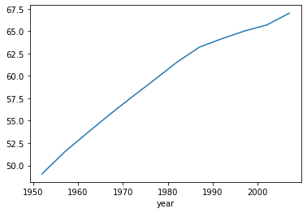

```python
import pandas as pd
df = pd.read_csv('data/gapminder.tsv', sep='\t')
```


```python
df
```


<div>
<style scoped>
    .dataframe tbody tr th:only-of-type {
        vertical-align: middle;
    }

    .dataframe tbody tr th {
        vertical-align: top;
    }

    .dataframe thead th {
        text-align: right;
    }
</style>
<table border="1" class="dataframe">
  <thead>
    <tr style="text-align: right;">
      <th></th>
      <th>country</th>
      <th>continent</th>
      <th>year</th>
      <th>lifeExp</th>
      <th>pop</th>
      <th>gdpPercap</th>
    </tr>
  </thead>
  <tbody>
    <tr>
      <th>0</th>
      <td>Afghanistan</td>
      <td>Asia</td>
      <td>1952</td>
      <td>28.801</td>
      <td>8425333</td>
      <td>779.445314</td>
    </tr>
    <tr>
      <th>1</th>
      <td>Afghanistan</td>
      <td>Asia</td>
      <td>1957</td>
      <td>30.332</td>
      <td>9240934</td>
      <td>820.853030</td>
    </tr>
    <tr>
      <th>2</th>
      <td>Afghanistan</td>
      <td>Asia</td>
      <td>1962</td>
      <td>31.997</td>
      <td>10267083</td>
      <td>853.100710</td>
    </tr>
    <tr>
      <th>3</th>
      <td>Afghanistan</td>
      <td>Asia</td>
      <td>1967</td>
      <td>34.020</td>
      <td>11537966</td>
      <td>836.197138</td>
    </tr>
    <tr>
      <th>4</th>
      <td>Afghanistan</td>
      <td>Asia</td>
      <td>1972</td>
      <td>36.088</td>
      <td>13079460</td>
      <td>739.981106</td>
    </tr>
    <tr>
      <th>...</th>
      <td>...</td>
      <td>...</td>
      <td>...</td>
      <td>...</td>
      <td>...</td>
      <td>...</td>
    </tr>
    <tr>
      <th>1699</th>
      <td>Zimbabwe</td>
      <td>Africa</td>
      <td>1987</td>
      <td>62.351</td>
      <td>9216418</td>
      <td>706.157306</td>
    </tr>
    <tr>
      <th>1700</th>
      <td>Zimbabwe</td>
      <td>Africa</td>
      <td>1992</td>
      <td>60.377</td>
      <td>10704340</td>
      <td>693.420786</td>
    </tr>
    <tr>
      <th>1701</th>
      <td>Zimbabwe</td>
      <td>Africa</td>
      <td>1997</td>
      <td>46.809</td>
      <td>11404948</td>
      <td>792.449960</td>
    </tr>
    <tr>
      <th>1702</th>
      <td>Zimbabwe</td>
      <td>Africa</td>
      <td>2002</td>
      <td>39.989</td>
      <td>11926563</td>
      <td>672.038623</td>
    </tr>
    <tr>
      <th>1703</th>
      <td>Zimbabwe</td>
      <td>Africa</td>
      <td>2007</td>
      <td>43.487</td>
      <td>12311143</td>
      <td>469.709298</td>
    </tr>
  </tbody>
</table>
<p>1704 rows × 6 columns</p>
</div>


```python
#연도별로 기대수명 열 값을 그룹화 -> 각 그룹에 대해 평균
df.groupby('year')['lifeExp'].mean()
df.groupby('continent')['lifeExp'].mean()
```


    continent
    Africa      48.865330
    Americas    64.658737
    Asia        60.064903
    Europe      71.903686
    Oceania     74.326208
    Name: lifeExp, dtype: float64


```python
#연도별, 대륙별로 그룹화 -> lifeExp,... 평균값
df.groupby(['year', 'continent'])['lifeExp'].mean()
df.groupby(['year', 'continent'])[['lifeExp','gdpPercap']].mean()

```


<div>
<style scoped>
    .dataframe tbody tr th:only-of-type {
        vertical-align: middle;
    }

    .dataframe tbody tr th {
        vertical-align: top;
    }

    .dataframe thead th {
        text-align: right;
    }
</style>
<table border="1" class="dataframe">
  <thead>
    <tr style="text-align: right;">
      <th></th>
      <th></th>
      <th>lifeExp</th>
      <th>gdpPercap</th>
    </tr>
    <tr>
      <th>year</th>
      <th>continent</th>
      <th></th>
      <th></th>
    </tr>
  </thead>
  <tbody>
    <tr>
      <th rowspan="5" valign="top">1952</th>
      <th>Africa</th>
      <td>39.135500</td>
      <td>1252.572466</td>
    </tr>
    <tr>
      <th>Americas</th>
      <td>53.279840</td>
      <td>4079.062552</td>
    </tr>
    <tr>
      <th>Asia</th>
      <td>46.314394</td>
      <td>5195.484004</td>
    </tr>
    <tr>
      <th>Europe</th>
      <td>64.408500</td>
      <td>5661.057435</td>
    </tr>
    <tr>
      <th>Oceania</th>
      <td>69.255000</td>
      <td>10298.085650</td>
    </tr>
    <tr>
      <th rowspan="5" valign="top">1957</th>
      <th>Africa</th>
      <td>41.266346</td>
      <td>1385.236062</td>
    </tr>
    <tr>
      <th>Americas</th>
      <td>55.960280</td>
      <td>4616.043733</td>
    </tr>
    <tr>
      <th>Asia</th>
      <td>49.318544</td>
      <td>5787.732940</td>
    </tr>
    <tr>
      <th>Europe</th>
      <td>66.703067</td>
      <td>6963.012816</td>
    </tr>
    <tr>
      <th>Oceania</th>
      <td>70.295000</td>
      <td>11598.522455</td>
    </tr>
    <tr>
      <th rowspan="5" valign="top">1962</th>
      <th>Africa</th>
      <td>43.319442</td>
      <td>1598.078825</td>
    </tr>
    <tr>
      <th>Americas</th>
      <td>58.398760</td>
      <td>4901.541870</td>
    </tr>
    <tr>
      <th>Asia</th>
      <td>51.563223</td>
      <td>5729.369625</td>
    </tr>
    <tr>
      <th>Europe</th>
      <td>68.539233</td>
      <td>8365.486814</td>
    </tr>
    <tr>
      <th>Oceania</th>
      <td>71.085000</td>
      <td>12696.452430</td>
    </tr>
    <tr>
      <th rowspan="5" valign="top">1967</th>
      <th>Africa</th>
      <td>45.334538</td>
      <td>2050.363801</td>
    </tr>
    <tr>
      <th>Americas</th>
      <td>60.410920</td>
      <td>5668.253496</td>
    </tr>
    <tr>
      <th>Asia</th>
      <td>54.663640</td>
      <td>5971.173374</td>
    </tr>
    <tr>
      <th>Europe</th>
      <td>69.737600</td>
      <td>10143.823757</td>
    </tr>
    <tr>
      <th>Oceania</th>
      <td>71.310000</td>
      <td>14495.021790</td>
    </tr>
    <tr>
      <th rowspan="5" valign="top">1972</th>
      <th>Africa</th>
      <td>47.450942</td>
      <td>2339.615674</td>
    </tr>
    <tr>
      <th>Americas</th>
      <td>62.394920</td>
      <td>6491.334139</td>
    </tr>
    <tr>
      <th>Asia</th>
      <td>57.319269</td>
      <td>8187.468699</td>
    </tr>
    <tr>
      <th>Europe</th>
      <td>70.775033</td>
      <td>12479.575246</td>
    </tr>
    <tr>
      <th>Oceania</th>
      <td>71.910000</td>
      <td>16417.333380</td>
    </tr>
    <tr>
      <th rowspan="5" valign="top">1977</th>
      <th>Africa</th>
      <td>49.580423</td>
      <td>2585.938508</td>
    </tr>
    <tr>
      <th>Americas</th>
      <td>64.391560</td>
      <td>7352.007126</td>
    </tr>
    <tr>
      <th>Asia</th>
      <td>59.610556</td>
      <td>7791.314020</td>
    </tr>
    <tr>
      <th>Europe</th>
      <td>71.937767</td>
      <td>14283.979110</td>
    </tr>
    <tr>
      <th>Oceania</th>
      <td>72.855000</td>
      <td>17283.957605</td>
    </tr>
    <tr>
      <th rowspan="5" valign="top">1982</th>
      <th>Africa</th>
      <td>51.592865</td>
      <td>2481.592960</td>
    </tr>
    <tr>
      <th>Americas</th>
      <td>66.228840</td>
      <td>7506.737088</td>
    </tr>
    <tr>
      <th>Asia</th>
      <td>62.617939</td>
      <td>7434.135157</td>
    </tr>
    <tr>
      <th>Europe</th>
      <td>72.806400</td>
      <td>15617.896551</td>
    </tr>
    <tr>
      <th>Oceania</th>
      <td>74.290000</td>
      <td>18554.709840</td>
    </tr>
    <tr>
      <th rowspan="5" valign="top">1987</th>
      <th>Africa</th>
      <td>53.344788</td>
      <td>2282.668991</td>
    </tr>
    <tr>
      <th>Americas</th>
      <td>68.090720</td>
      <td>7793.400261</td>
    </tr>
    <tr>
      <th>Asia</th>
      <td>64.851182</td>
      <td>7608.226508</td>
    </tr>
    <tr>
      <th>Europe</th>
      <td>73.642167</td>
      <td>17214.310727</td>
    </tr>
    <tr>
      <th>Oceania</th>
      <td>75.320000</td>
      <td>20448.040160</td>
    </tr>
    <tr>
      <th rowspan="5" valign="top">1992</th>
      <th>Africa</th>
      <td>53.629577</td>
      <td>2281.810333</td>
    </tr>
    <tr>
      <th>Americas</th>
      <td>69.568360</td>
      <td>8044.934406</td>
    </tr>
    <tr>
      <th>Asia</th>
      <td>66.537212</td>
      <td>8639.690248</td>
    </tr>
    <tr>
      <th>Europe</th>
      <td>74.440100</td>
      <td>17061.568084</td>
    </tr>
    <tr>
      <th>Oceania</th>
      <td>76.945000</td>
      <td>20894.045885</td>
    </tr>
    <tr>
      <th rowspan="5" valign="top">1997</th>
      <th>Africa</th>
      <td>53.598269</td>
      <td>2378.759555</td>
    </tr>
    <tr>
      <th>Americas</th>
      <td>71.150480</td>
      <td>8889.300863</td>
    </tr>
    <tr>
      <th>Asia</th>
      <td>68.020515</td>
      <td>9834.093295</td>
    </tr>
    <tr>
      <th>Europe</th>
      <td>75.505167</td>
      <td>19076.781802</td>
    </tr>
    <tr>
      <th>Oceania</th>
      <td>78.190000</td>
      <td>24024.175170</td>
    </tr>
    <tr>
      <th rowspan="5" valign="top">2002</th>
      <th>Africa</th>
      <td>53.325231</td>
      <td>2599.385159</td>
    </tr>
    <tr>
      <th>Americas</th>
      <td>72.422040</td>
      <td>9287.677107</td>
    </tr>
    <tr>
      <th>Asia</th>
      <td>69.233879</td>
      <td>10174.090397</td>
    </tr>
    <tr>
      <th>Europe</th>
      <td>76.700600</td>
      <td>21711.732422</td>
    </tr>
    <tr>
      <th>Oceania</th>
      <td>79.740000</td>
      <td>26938.778040</td>
    </tr>
    <tr>
      <th rowspan="5" valign="top">2007</th>
      <th>Africa</th>
      <td>54.806038</td>
      <td>3089.032605</td>
    </tr>
    <tr>
      <th>Americas</th>
      <td>73.608120</td>
      <td>11003.031625</td>
    </tr>
    <tr>
      <th>Asia</th>
      <td>70.728485</td>
      <td>12473.026870</td>
    </tr>
    <tr>
      <th>Europe</th>
      <td>77.648600</td>
      <td>25054.481636</td>
    </tr>
    <tr>
      <th>Oceania</th>
      <td>80.719500</td>
      <td>29810.188275</td>
    </tr>
  </tbody>
</table>
</div>


```python
df.groupby('continent')['country'].unique()
df.groupby('continent')['country'].nunique()
```


    continent
    Africa      52
    Americas    25
    Asia        33
    Europe      30
    Oceania      2
    Name: country, dtype: int64


```python
gyl=df.groupby('year')['lifeExp'].mean()
gyl.plot()
```


    <AxesSubplot:xlabel='year'>


    

    


```python
pd.Series(['홍길동', '임꺽정'], index=['p1', 'p2'])
```


    p1    홍길동
    p2    임꺽정
    dtype: object


```python
scientists = pd.DataFrame({ 
    'Name': ['Rosaline Franklin', 'William Gosset'], 
    'Occupation': ['Chemist', 'Statistician'], 
    'Born': ['1920-07-25', '1876-06-13'], 
    'Died': ['1958-04-16', '1937-10-16'], 
    'Age': [37, 61]}) 
```


```python
scientists
```


<div>
<style scoped>
    .dataframe tbody tr th:only-of-type {
        vertical-align: middle;
    }

    .dataframe tbody tr th {
        vertical-align: top;
    }

    .dataframe thead th {
        text-align: right;
    }
</style>
<table border="1" class="dataframe">
  <thead>
    <tr style="text-align: right;">
      <th></th>
      <th>Name</th>
      <th>Occupation</th>
      <th>Born</th>
      <th>Died</th>
      <th>Age</th>
    </tr>
  </thead>
  <tbody>
    <tr>
      <th>0</th>
      <td>Rosaline Franklin</td>
      <td>Chemist</td>
      <td>1920-07-25</td>
      <td>1958-04-16</td>
      <td>37</td>
    </tr>
    <tr>
      <th>1</th>
      <td>William Gosset</td>
      <td>Statistician</td>
      <td>1876-06-13</td>
      <td>1937-10-16</td>
      <td>61</td>
    </tr>
  </tbody>
</table>
</div>


```python
scientists = pd.DataFrame({ 
    'Name': ['Rosaline Franklin', 'William Gosset'], 
    'Occupation': ['Chemist', 'Statistician'], 
    'Born': ['1920-07-25', '1876-06-13'], 
    'Died': ['1958-04-16', '1937-10-16'], 
    'Age': [37, 61]},
index=['p1','p2'], columns=['Born','Died','Age','Name','Occupation']) 
```


```python
scientists
```


<div>
<style scoped>
    .dataframe tbody tr th:only-of-type {
        vertical-align: middle;
    }

    .dataframe tbody tr th {
        vertical-align: top;
    }

    .dataframe thead th {
        text-align: right;
    }
</style>
<table border="1" class="dataframe">
  <thead>
    <tr style="text-align: right;">
      <th></th>
      <th>Born</th>
      <th>Died</th>
      <th>Age</th>
      <th>Name</th>
      <th>Occupation</th>
    </tr>
  </thead>
  <tbody>
    <tr>
      <th>p1</th>
      <td>1920-07-25</td>
      <td>1958-04-16</td>
      <td>37</td>
      <td>Rosaline Franklin</td>
      <td>Chemist</td>
    </tr>
    <tr>
      <th>p2</th>
      <td>1876-06-13</td>
      <td>1937-10-16</td>
      <td>61</td>
      <td>William Gosset</td>
      <td>Statistician</td>
    </tr>
  </tbody>
</table>
</div>


```python
scientists.loc['p2']
scientists.iloc[1]
scientists.iloc[-1]
scientists.Name.iloc[-1]
```


    'William Gosset'


```python
scientists.index
```


    Index(['p1', 'p2'], dtype='object')


```python
scientists.columns
```


    Index(['Born', 'Died', 'Age', 'Name', 'Occupation'], dtype='object')


```python
scientists.values
```


    array([['1920-07-25', '1958-04-16', 37, 'Rosaline Franklin', 'Chemist'],
           ['1876-06-13', '1937-10-16', 61, 'William Gosset', 'Statistician']],
          dtype=object)


```python
scientists.keys()
```


    Index(['Born', 'Died', 'Age', 'Name', 'Occupation'], dtype='object')


```python
scientists.keys()[0]
```


    'Born'


```python
ages=scientists['Age']
```


```python
ages
```


    p1    37
    p2    61
    Name: Age, dtype: int64


```python
ages.mean()
ages.min()
ages.max()
ages.var()
ages.std()
```


    16.97056274847714


```python
scientists=pd.read_csv("data/scientists.csv")
scientists
```


<div>
<style scoped>
    .dataframe tbody tr th:only-of-type {
        vertical-align: middle;
    }

    .dataframe tbody tr th {
        vertical-align: top;
    }

    .dataframe thead th {
        text-align: right;
    }
</style>
<table border="1" class="dataframe">
  <thead>
    <tr style="text-align: right;">
      <th></th>
      <th>Name</th>
      <th>Born</th>
      <th>Died</th>
      <th>Age</th>
      <th>Occupation</th>
    </tr>
  </thead>
  <tbody>
    <tr>
      <th>0</th>
      <td>Rosaline Franklin</td>
      <td>1920-07-25</td>
      <td>1958-04-16</td>
      <td>37</td>
      <td>Chemist</td>
    </tr>
    <tr>
      <th>1</th>
      <td>William Gosset</td>
      <td>1876-06-13</td>
      <td>1937-10-16</td>
      <td>61</td>
      <td>Statistician</td>
    </tr>
    <tr>
      <th>2</th>
      <td>Florence Nightingale</td>
      <td>1820-05-12</td>
      <td>1910-08-13</td>
      <td>90</td>
      <td>Nurse</td>
    </tr>
    <tr>
      <th>3</th>
      <td>Marie Curie</td>
      <td>1867-11-07</td>
      <td>1934-07-04</td>
      <td>66</td>
      <td>Chemist</td>
    </tr>
    <tr>
      <th>4</th>
      <td>Rachel Carson</td>
      <td>1907-05-27</td>
      <td>1964-04-14</td>
      <td>56</td>
      <td>Biologist</td>
    </tr>
    <tr>
      <th>5</th>
      <td>John Snow</td>
      <td>1813-03-15</td>
      <td>1858-06-16</td>
      <td>45</td>
      <td>Physician</td>
    </tr>
    <tr>
      <th>6</th>
      <td>Alan Turing</td>
      <td>1912-06-23</td>
      <td>1954-06-07</td>
      <td>41</td>
      <td>Computer Scientist</td>
    </tr>
    <tr>
      <th>7</th>
      <td>Johann Gauss</td>
      <td>1777-04-30</td>
      <td>1855-02-23</td>
      <td>77</td>
      <td>Mathematician</td>
    </tr>
  </tbody>
</table>
</div>


```python
ages=scientists['Age']
ages
```


    0    37
    1    61
    2    90
    3    66
    4    56
    5    45
    6    41
    7    77
    Name: Age, dtype: int64


```python
ages.mean()
```


    59.125


```python
ages[ages>ages.mean()]
```


    1    61
    2    90
    3    66
    7    77
    Name: Age, dtype: int64


```python
ages*ages #시리즈*시리즈
ages*100 #시리즈*상수
```


    0    3700
    1    6100
    2    9000
    3    6600
    4    5600
    5    4500
    6    4100
    7    7700
    Name: Age, dtype: int64


```python
pd.Series([10])
```


    0    10
    dtype: int64


```python
print(ages)
print(ages+10)
print(ages+pd.Series([10]))
```

    0    37
    1    61
    2    90
    3    66
    4    56
    5    45
    6    41
    7    77
    Name: Age, dtype: int64
    0     47
    1     71
    2    100
    3     76
    4     66
    5     55
    6     51
    7     87
    Name: Age, dtype: int64
    0    47.0
    1     NaN
    2     NaN
    3     NaN
    4     NaN
    5     NaN
    6     NaN
    7     NaN
    dtype: float64
    


```python
ages.sort_index() #디폴트 : 오름차순
ages.sort_index(ascending=False)

ages.sort_values()
ages.sort_values(ascending=False)
```


    2    90
    7    77
    3    66
    1    61
    4    56
    5    45
    6    41
    0    37
    Name: Age, dtype: int64


```python
scientists
```


<div>
<style scoped>
    .dataframe tbody tr th:only-of-type {
        vertical-align: middle;
    }

    .dataframe tbody tr th {
        vertical-align: top;
    }

    .dataframe thead th {
        text-align: right;
    }
</style>
<table border="1" class="dataframe">
  <thead>
    <tr style="text-align: right;">
      <th></th>
      <th>Name</th>
      <th>Born</th>
      <th>Died</th>
      <th>Age</th>
      <th>Occupation</th>
    </tr>
  </thead>
  <tbody>
    <tr>
      <th>0</th>
      <td>Rosaline Franklin</td>
      <td>1920-07-25</td>
      <td>1958-04-16</td>
      <td>37</td>
      <td>Chemist</td>
    </tr>
    <tr>
      <th>1</th>
      <td>William Gosset</td>
      <td>1876-06-13</td>
      <td>1937-10-16</td>
      <td>61</td>
      <td>Statistician</td>
    </tr>
    <tr>
      <th>2</th>
      <td>Florence Nightingale</td>
      <td>1820-05-12</td>
      <td>1910-08-13</td>
      <td>90</td>
      <td>Nurse</td>
    </tr>
    <tr>
      <th>3</th>
      <td>Marie Curie</td>
      <td>1867-11-07</td>
      <td>1934-07-04</td>
      <td>66</td>
      <td>Chemist</td>
    </tr>
    <tr>
      <th>4</th>
      <td>Rachel Carson</td>
      <td>1907-05-27</td>
      <td>1964-04-14</td>
      <td>56</td>
      <td>Biologist</td>
    </tr>
    <tr>
      <th>5</th>
      <td>John Snow</td>
      <td>1813-03-15</td>
      <td>1858-06-16</td>
      <td>45</td>
      <td>Physician</td>
    </tr>
    <tr>
      <th>6</th>
      <td>Alan Turing</td>
      <td>1912-06-23</td>
      <td>1954-06-07</td>
      <td>41</td>
      <td>Computer Scientist</td>
    </tr>
    <tr>
      <th>7</th>
      <td>Johann Gauss</td>
      <td>1777-04-30</td>
      <td>1855-02-23</td>
      <td>77</td>
      <td>Mathematician</td>
    </tr>
  </tbody>
</table>
</div>


```python
scientists[scientists['Age'] > scientists['Age'].mean()]
```


<div>
<style scoped>
    .dataframe tbody tr th:only-of-type {
        vertical-align: middle;
    }

    .dataframe tbody tr th {
        vertical-align: top;
    }

    .dataframe thead th {
        text-align: right;
    }
</style>
<table border="1" class="dataframe">
  <thead>
    <tr style="text-align: right;">
      <th></th>
      <th>Name</th>
      <th>Born</th>
      <th>Died</th>
      <th>Age</th>
      <th>Occupation</th>
    </tr>
  </thead>
  <tbody>
    <tr>
      <th>1</th>
      <td>William Gosset</td>
      <td>1876-06-13</td>
      <td>1937-10-16</td>
      <td>61</td>
      <td>Statistician</td>
    </tr>
    <tr>
      <th>2</th>
      <td>Florence Nightingale</td>
      <td>1820-05-12</td>
      <td>1910-08-13</td>
      <td>90</td>
      <td>Nurse</td>
    </tr>
    <tr>
      <th>3</th>
      <td>Marie Curie</td>
      <td>1867-11-07</td>
      <td>1934-07-04</td>
      <td>66</td>
      <td>Chemist</td>
    </tr>
    <tr>
      <th>7</th>
      <td>Johann Gauss</td>
      <td>1777-04-30</td>
      <td>1855-02-23</td>
      <td>77</td>
      <td>Mathematician</td>
    </tr>
  </tbody>
</table>
</div>


```python
scientists*2
```


<div>
<style scoped>
    .dataframe tbody tr th:only-of-type {
        vertical-align: middle;
    }

    .dataframe tbody tr th {
        vertical-align: top;
    }

    .dataframe thead th {
        text-align: right;
    }
</style>
<table border="1" class="dataframe">
  <thead>
    <tr style="text-align: right;">
      <th></th>
      <th>Name</th>
      <th>Born</th>
      <th>Died</th>
      <th>Age</th>
      <th>Occupation</th>
    </tr>
  </thead>
  <tbody>
    <tr>
      <th>0</th>
      <td>Rosaline FranklinRosaline Franklin</td>
      <td>1920-07-251920-07-25</td>
      <td>1958-04-161958-04-16</td>
      <td>74</td>
      <td>ChemistChemist</td>
    </tr>
    <tr>
      <th>1</th>
      <td>William GossetWilliam Gosset</td>
      <td>1876-06-131876-06-13</td>
      <td>1937-10-161937-10-16</td>
      <td>122</td>
      <td>StatisticianStatistician</td>
    </tr>
    <tr>
      <th>2</th>
      <td>Florence NightingaleFlorence Nightingale</td>
      <td>1820-05-121820-05-12</td>
      <td>1910-08-131910-08-13</td>
      <td>180</td>
      <td>NurseNurse</td>
    </tr>
    <tr>
      <th>3</th>
      <td>Marie CurieMarie Curie</td>
      <td>1867-11-071867-11-07</td>
      <td>1934-07-041934-07-04</td>
      <td>132</td>
      <td>ChemistChemist</td>
    </tr>
    <tr>
      <th>4</th>
      <td>Rachel CarsonRachel Carson</td>
      <td>1907-05-271907-05-27</td>
      <td>1964-04-141964-04-14</td>
      <td>112</td>
      <td>BiologistBiologist</td>
    </tr>
    <tr>
      <th>5</th>
      <td>John SnowJohn Snow</td>
      <td>1813-03-151813-03-15</td>
      <td>1858-06-161858-06-16</td>
      <td>90</td>
      <td>PhysicianPhysician</td>
    </tr>
    <tr>
      <th>6</th>
      <td>Alan TuringAlan Turing</td>
      <td>1912-06-231912-06-23</td>
      <td>1954-06-071954-06-07</td>
      <td>82</td>
      <td>Computer ScientistComputer Scientist</td>
    </tr>
    <tr>
      <th>7</th>
      <td>Johann GaussJohann Gauss</td>
      <td>1777-04-301777-04-30</td>
      <td>1855-02-231855-02-23</td>
      <td>154</td>
      <td>MathematicianMathematician</td>
    </tr>
  </tbody>
</table>
</div>


```python
scientists
```


<div>
<style scoped>
    .dataframe tbody tr th:only-of-type {
        vertical-align: middle;
    }

    .dataframe tbody tr th {
        vertical-align: top;
    }

    .dataframe thead th {
        text-align: right;
    }
</style>
<table border="1" class="dataframe">
  <thead>
    <tr style="text-align: right;">
      <th></th>
      <th>Name</th>
      <th>Born</th>
      <th>Died</th>
      <th>Age</th>
      <th>Occupation</th>
    </tr>
  </thead>
  <tbody>
    <tr>
      <th>0</th>
      <td>Rosaline Franklin</td>
      <td>1920-07-25</td>
      <td>1958-04-16</td>
      <td>37</td>
      <td>Chemist</td>
    </tr>
    <tr>
      <th>1</th>
      <td>William Gosset</td>
      <td>1876-06-13</td>
      <td>1937-10-16</td>
      <td>61</td>
      <td>Statistician</td>
    </tr>
    <tr>
      <th>2</th>
      <td>Florence Nightingale</td>
      <td>1820-05-12</td>
      <td>1910-08-13</td>
      <td>90</td>
      <td>Nurse</td>
    </tr>
    <tr>
      <th>3</th>
      <td>Marie Curie</td>
      <td>1867-11-07</td>
      <td>1934-07-04</td>
      <td>66</td>
      <td>Chemist</td>
    </tr>
    <tr>
      <th>4</th>
      <td>Rachel Carson</td>
      <td>1907-05-27</td>
      <td>1964-04-14</td>
      <td>56</td>
      <td>Biologist</td>
    </tr>
    <tr>
      <th>5</th>
      <td>John Snow</td>
      <td>1813-03-15</td>
      <td>1858-06-16</td>
      <td>45</td>
      <td>Physician</td>
    </tr>
    <tr>
      <th>6</th>
      <td>Alan Turing</td>
      <td>1912-06-23</td>
      <td>1954-06-07</td>
      <td>41</td>
      <td>Computer Scientist</td>
    </tr>
    <tr>
      <th>7</th>
      <td>Johann Gauss</td>
      <td>1777-04-30</td>
      <td>1855-02-23</td>
      <td>77</td>
      <td>Mathematician</td>
    </tr>
  </tbody>
</table>
</div>


```python
scientists.info()
scientists
```

    <class 'pandas.core.frame.DataFrame'>
    RangeIndex: 8 entries, 0 to 7
    Data columns (total 5 columns):
     #   Column      Non-Null Count  Dtype 
    ---  ------      --------------  ----- 
     0   Name        8 non-null      object
     1   Born        8 non-null      object
     2   Died        8 non-null      object
     3   Age         8 non-null      int64 
     4   Occupation  8 non-null      object
    dtypes: int64(1), object(4)
    memory usage: 448.0+ bytes
    


<div>
<style scoped>
    .dataframe tbody tr th:only-of-type {
        vertical-align: middle;
    }

    .dataframe tbody tr th {
        vertical-align: top;
    }

    .dataframe thead th {
        text-align: right;
    }
</style>
<table border="1" class="dataframe">
  <thead>
    <tr style="text-align: right;">
      <th></th>
      <th>Name</th>
      <th>Born</th>
      <th>Died</th>
      <th>Age</th>
      <th>Occupation</th>
    </tr>
  </thead>
  <tbody>
    <tr>
      <th>0</th>
      <td>Rosaline Franklin</td>
      <td>1920-07-25</td>
      <td>1958-04-16</td>
      <td>37</td>
      <td>Chemist</td>
    </tr>
    <tr>
      <th>1</th>
      <td>William Gosset</td>
      <td>1876-06-13</td>
      <td>1937-10-16</td>
      <td>61</td>
      <td>Statistician</td>
    </tr>
    <tr>
      <th>2</th>
      <td>Florence Nightingale</td>
      <td>1820-05-12</td>
      <td>1910-08-13</td>
      <td>90</td>
      <td>Nurse</td>
    </tr>
    <tr>
      <th>3</th>
      <td>Marie Curie</td>
      <td>1867-11-07</td>
      <td>1934-07-04</td>
      <td>66</td>
      <td>Chemist</td>
    </tr>
    <tr>
      <th>4</th>
      <td>Rachel Carson</td>
      <td>1907-05-27</td>
      <td>1964-04-14</td>
      <td>56</td>
      <td>Biologist</td>
    </tr>
    <tr>
      <th>5</th>
      <td>John Snow</td>
      <td>1813-03-15</td>
      <td>1858-06-16</td>
      <td>45</td>
      <td>Physician</td>
    </tr>
    <tr>
      <th>6</th>
      <td>Alan Turing</td>
      <td>1912-06-23</td>
      <td>1954-06-07</td>
      <td>41</td>
      <td>Computer Scientist</td>
    </tr>
    <tr>
      <th>7</th>
      <td>Johann Gauss</td>
      <td>1777-04-30</td>
      <td>1855-02-23</td>
      <td>77</td>
      <td>Mathematician</td>
    </tr>
  </tbody>
</table>
</div>


```python
bd=pd.to_datetime(scientists['Born'])
```


```python
dd=pd.to_datetime(scientists['Died'])
```


```python
scientists['born_dt'],scientists['died_dt']=bd,dd
```


```python
scientists['days_dt']=scientists['died_dt']-scientists['born_dt']
```


```python
#print(scientists['born_dt'])
#print(scientists['born_dt'][0])

#scientists['born_dt'].dt.day +10 
```


```python
scientists.head()
```


<div>
<style scoped>
    .dataframe tbody tr th:only-of-type {
        vertical-align: middle;
    }

    .dataframe tbody tr th {
        vertical-align: top;
    }

    .dataframe thead th {
        text-align: right;
    }
</style>
<table border="1" class="dataframe">
  <thead>
    <tr style="text-align: right;">
      <th></th>
      <th>Name</th>
      <th>Born</th>
      <th>Died</th>
      <th>Age</th>
      <th>Occupation</th>
      <th>born_dt</th>
      <th>died_dt</th>
      <th>days_dt</th>
    </tr>
  </thead>
  <tbody>
    <tr>
      <th>0</th>
      <td>Rosaline Franklin</td>
      <td>1920-07-25</td>
      <td>1958-04-16</td>
      <td>37</td>
      <td>Chemist</td>
      <td>1920-07-25</td>
      <td>1958-04-16</td>
      <td>13779 days</td>
    </tr>
    <tr>
      <th>1</th>
      <td>William Gosset</td>
      <td>1876-06-13</td>
      <td>1937-10-16</td>
      <td>61</td>
      <td>Statistician</td>
      <td>1876-06-13</td>
      <td>1937-10-16</td>
      <td>22404 days</td>
    </tr>
    <tr>
      <th>2</th>
      <td>Florence Nightingale</td>
      <td>1820-05-12</td>
      <td>1910-08-13</td>
      <td>90</td>
      <td>Nurse</td>
      <td>1820-05-12</td>
      <td>1910-08-13</td>
      <td>32964 days</td>
    </tr>
    <tr>
      <th>3</th>
      <td>Marie Curie</td>
      <td>1867-11-07</td>
      <td>1934-07-04</td>
      <td>66</td>
      <td>Chemist</td>
      <td>1867-11-07</td>
      <td>1934-07-04</td>
      <td>24345 days</td>
    </tr>
    <tr>
      <th>4</th>
      <td>Rachel Carson</td>
      <td>1907-05-27</td>
      <td>1964-04-14</td>
      <td>56</td>
      <td>Biologist</td>
      <td>1907-05-27</td>
      <td>1964-04-14</td>
      <td>20777 days</td>
    </tr>
  </tbody>
</table>
</div>


```python
scientists
```


<div>
<style scoped>
    .dataframe tbody tr th:only-of-type {
        vertical-align: middle;
    }

    .dataframe tbody tr th {
        vertical-align: top;
    }

    .dataframe thead th {
        text-align: right;
    }
</style>
<table border="1" class="dataframe">
  <thead>
    <tr style="text-align: right;">
      <th></th>
      <th>Name</th>
      <th>Born</th>
      <th>Died</th>
      <th>Age</th>
      <th>Occupation</th>
      <th>born_dt</th>
      <th>died_dt</th>
      <th>days_dt</th>
    </tr>
  </thead>
  <tbody>
    <tr>
      <th>0</th>
      <td>Rosaline Franklin</td>
      <td>1920-07-25</td>
      <td>1958-04-16</td>
      <td>37</td>
      <td>Chemist</td>
      <td>1920-07-25</td>
      <td>1958-04-16</td>
      <td>13779 days</td>
    </tr>
    <tr>
      <th>1</th>
      <td>William Gosset</td>
      <td>1876-06-13</td>
      <td>1937-10-16</td>
      <td>61</td>
      <td>Statistician</td>
      <td>1876-06-13</td>
      <td>1937-10-16</td>
      <td>22404 days</td>
    </tr>
    <tr>
      <th>2</th>
      <td>Florence Nightingale</td>
      <td>1820-05-12</td>
      <td>1910-08-13</td>
      <td>90</td>
      <td>Nurse</td>
      <td>1820-05-12</td>
      <td>1910-08-13</td>
      <td>32964 days</td>
    </tr>
    <tr>
      <th>3</th>
      <td>Marie Curie</td>
      <td>1867-11-07</td>
      <td>1934-07-04</td>
      <td>66</td>
      <td>Chemist</td>
      <td>1867-11-07</td>
      <td>1934-07-04</td>
      <td>24345 days</td>
    </tr>
    <tr>
      <th>4</th>
      <td>Rachel Carson</td>
      <td>1907-05-27</td>
      <td>1964-04-14</td>
      <td>56</td>
      <td>Biologist</td>
      <td>1907-05-27</td>
      <td>1964-04-14</td>
      <td>20777 days</td>
    </tr>
    <tr>
      <th>5</th>
      <td>John Snow</td>
      <td>1813-03-15</td>
      <td>1858-06-16</td>
      <td>45</td>
      <td>Physician</td>
      <td>1813-03-15</td>
      <td>1858-06-16</td>
      <td>16529 days</td>
    </tr>
    <tr>
      <th>6</th>
      <td>Alan Turing</td>
      <td>1912-06-23</td>
      <td>1954-06-07</td>
      <td>41</td>
      <td>Computer Scientist</td>
      <td>1912-06-23</td>
      <td>1954-06-07</td>
      <td>15324 days</td>
    </tr>
    <tr>
      <th>7</th>
      <td>Johann Gauss</td>
      <td>1777-04-30</td>
      <td>1855-02-23</td>
      <td>77</td>
      <td>Mathematician</td>
      <td>1777-04-30</td>
      <td>1855-02-23</td>
      <td>28422 days</td>
    </tr>
  </tbody>
</table>
</div>


```python
import random
random.seed(805)
```


```python
#random.shuffle(scientists) 에러 발생
```


```python
random.shuffle(scientists['Name'])
```

    C:\Users\campusseven05\anaconda3\lib\random.py:307: SettingWithCopyWarning: 
    A value is trying to be set on a copy of a slice from a DataFrame
    
    See the caveats in the documentation: https://pandas.pydata.org/pandas-docs/stable/user_guide/indexing.html#returning-a-view-versus-a-copy
      x[i], x[j] = x[j], x[i]
    


```python
scientists
```


<div>
<style scoped>
    .dataframe tbody tr th:only-of-type {
        vertical-align: middle;
    }

    .dataframe tbody tr th {
        vertical-align: top;
    }

    .dataframe thead th {
        text-align: right;
    }
</style>
<table border="1" class="dataframe">
  <thead>
    <tr style="text-align: right;">
      <th></th>
      <th>Name</th>
      <th>Born</th>
      <th>Died</th>
      <th>Age</th>
      <th>Occupation</th>
      <th>born_dt</th>
      <th>died_dt</th>
      <th>days_dt</th>
    </tr>
  </thead>
  <tbody>
    <tr>
      <th>0</th>
      <td>Johann Gauss</td>
      <td>1920-07-25</td>
      <td>1958-04-16</td>
      <td>37</td>
      <td>Chemist</td>
      <td>1920-07-25</td>
      <td>1958-04-16</td>
      <td>13779 days</td>
    </tr>
    <tr>
      <th>1</th>
      <td>Rachel Carson</td>
      <td>1876-06-13</td>
      <td>1937-10-16</td>
      <td>61</td>
      <td>Statistician</td>
      <td>1876-06-13</td>
      <td>1937-10-16</td>
      <td>22404 days</td>
    </tr>
    <tr>
      <th>2</th>
      <td>William Gosset</td>
      <td>1820-05-12</td>
      <td>1910-08-13</td>
      <td>90</td>
      <td>Nurse</td>
      <td>1820-05-12</td>
      <td>1910-08-13</td>
      <td>32964 days</td>
    </tr>
    <tr>
      <th>3</th>
      <td>John Snow</td>
      <td>1867-11-07</td>
      <td>1934-07-04</td>
      <td>66</td>
      <td>Chemist</td>
      <td>1867-11-07</td>
      <td>1934-07-04</td>
      <td>24345 days</td>
    </tr>
    <tr>
      <th>4</th>
      <td>Florence Nightingale</td>
      <td>1907-05-27</td>
      <td>1964-04-14</td>
      <td>56</td>
      <td>Biologist</td>
      <td>1907-05-27</td>
      <td>1964-04-14</td>
      <td>20777 days</td>
    </tr>
    <tr>
      <th>5</th>
      <td>Rosaline Franklin</td>
      <td>1813-03-15</td>
      <td>1858-06-16</td>
      <td>45</td>
      <td>Physician</td>
      <td>1813-03-15</td>
      <td>1858-06-16</td>
      <td>16529 days</td>
    </tr>
    <tr>
      <th>6</th>
      <td>Alan Turing</td>
      <td>1912-06-23</td>
      <td>1954-06-07</td>
      <td>41</td>
      <td>Computer Scientist</td>
      <td>1912-06-23</td>
      <td>1954-06-07</td>
      <td>15324 days</td>
    </tr>
    <tr>
      <th>7</th>
      <td>Marie Curie</td>
      <td>1777-04-30</td>
      <td>1855-02-23</td>
      <td>77</td>
      <td>Mathematician</td>
      <td>1777-04-30</td>
      <td>1855-02-23</td>
      <td>28422 days</td>
    </tr>
  </tbody>
</table>
</div>


```python
#데이터프레임에서 행 단위로 데이터를 섞는 방법
# - 데이터프레임의 sample함수
# - random모듈에 있는  permutation함수
# - sklearn의  shuffle함수
```


```python
scientists
```


<div>
<style scoped>
    .dataframe tbody tr th:only-of-type {
        vertical-align: middle;
    }

    .dataframe tbody tr th {
        vertical-align: top;
    }

    .dataframe thead th {
        text-align: right;
    }
</style>
<table border="1" class="dataframe">
  <thead>
    <tr style="text-align: right;">
      <th></th>
      <th>Name</th>
      <th>Born</th>
      <th>Died</th>
      <th>Age</th>
      <th>Occupation</th>
      <th>born_dt</th>
      <th>died_dt</th>
      <th>days_dt</th>
    </tr>
  </thead>
  <tbody>
    <tr>
      <th>0</th>
      <td>Johann Gauss</td>
      <td>1920-07-25</td>
      <td>1958-04-16</td>
      <td>37</td>
      <td>Chemist</td>
      <td>1920-07-25</td>
      <td>1958-04-16</td>
      <td>13779 days</td>
    </tr>
    <tr>
      <th>1</th>
      <td>Rachel Carson</td>
      <td>1876-06-13</td>
      <td>1937-10-16</td>
      <td>61</td>
      <td>Statistician</td>
      <td>1876-06-13</td>
      <td>1937-10-16</td>
      <td>22404 days</td>
    </tr>
    <tr>
      <th>2</th>
      <td>William Gosset</td>
      <td>1820-05-12</td>
      <td>1910-08-13</td>
      <td>90</td>
      <td>Nurse</td>
      <td>1820-05-12</td>
      <td>1910-08-13</td>
      <td>32964 days</td>
    </tr>
    <tr>
      <th>3</th>
      <td>John Snow</td>
      <td>1867-11-07</td>
      <td>1934-07-04</td>
      <td>66</td>
      <td>Chemist</td>
      <td>1867-11-07</td>
      <td>1934-07-04</td>
      <td>24345 days</td>
    </tr>
    <tr>
      <th>4</th>
      <td>Florence Nightingale</td>
      <td>1907-05-27</td>
      <td>1964-04-14</td>
      <td>56</td>
      <td>Biologist</td>
      <td>1907-05-27</td>
      <td>1964-04-14</td>
      <td>20777 days</td>
    </tr>
    <tr>
      <th>5</th>
      <td>Rosaline Franklin</td>
      <td>1813-03-15</td>
      <td>1858-06-16</td>
      <td>45</td>
      <td>Physician</td>
      <td>1813-03-15</td>
      <td>1858-06-16</td>
      <td>16529 days</td>
    </tr>
    <tr>
      <th>6</th>
      <td>Alan Turing</td>
      <td>1912-06-23</td>
      <td>1954-06-07</td>
      <td>41</td>
      <td>Computer Scientist</td>
      <td>1912-06-23</td>
      <td>1954-06-07</td>
      <td>15324 days</td>
    </tr>
    <tr>
      <th>7</th>
      <td>Marie Curie</td>
      <td>1777-04-30</td>
      <td>1855-02-23</td>
      <td>77</td>
      <td>Mathematician</td>
      <td>1777-04-30</td>
      <td>1855-02-23</td>
      <td>28422 days</td>
    </tr>
  </tbody>
</table>
</div>


```python
scientists=pd.read_csv("data/scientists.csv")
scientists
```


<div>
<style scoped>
    .dataframe tbody tr th:only-of-type {
        vertical-align: middle;
    }

    .dataframe tbody tr th {
        vertical-align: top;
    }

    .dataframe thead th {
        text-align: right;
    }
</style>
<table border="1" class="dataframe">
  <thead>
    <tr style="text-align: right;">
      <th></th>
      <th>Name</th>
      <th>Born</th>
      <th>Died</th>
      <th>Age</th>
      <th>Occupation</th>
    </tr>
  </thead>
  <tbody>
    <tr>
      <th>0</th>
      <td>Rosaline Franklin</td>
      <td>1920-07-25</td>
      <td>1958-04-16</td>
      <td>37</td>
      <td>Chemist</td>
    </tr>
    <tr>
      <th>1</th>
      <td>William Gosset</td>
      <td>1876-06-13</td>
      <td>1937-10-16</td>
      <td>61</td>
      <td>Statistician</td>
    </tr>
    <tr>
      <th>2</th>
      <td>Florence Nightingale</td>
      <td>1820-05-12</td>
      <td>1910-08-13</td>
      <td>90</td>
      <td>Nurse</td>
    </tr>
    <tr>
      <th>3</th>
      <td>Marie Curie</td>
      <td>1867-11-07</td>
      <td>1934-07-04</td>
      <td>66</td>
      <td>Chemist</td>
    </tr>
    <tr>
      <th>4</th>
      <td>Rachel Carson</td>
      <td>1907-05-27</td>
      <td>1964-04-14</td>
      <td>56</td>
      <td>Biologist</td>
    </tr>
    <tr>
      <th>5</th>
      <td>John Snow</td>
      <td>1813-03-15</td>
      <td>1858-06-16</td>
      <td>45</td>
      <td>Physician</td>
    </tr>
    <tr>
      <th>6</th>
      <td>Alan Turing</td>
      <td>1912-06-23</td>
      <td>1954-06-07</td>
      <td>41</td>
      <td>Computer Scientist</td>
    </tr>
    <tr>
      <th>7</th>
      <td>Johann Gauss</td>
      <td>1777-04-30</td>
      <td>1855-02-23</td>
      <td>77</td>
      <td>Mathematician</td>
    </tr>
  </tbody>
</table>
</div>


```python
scientists.sample(frac=1)
scientists.sample(frac=1).reset_index(drop=True)
```


<div>
<style scoped>
    .dataframe tbody tr th:only-of-type {
        vertical-align: middle;
    }

    .dataframe tbody tr th {
        vertical-align: top;
    }

    .dataframe thead th {
        text-align: right;
    }
</style>
<table border="1" class="dataframe">
  <thead>
    <tr style="text-align: right;">
      <th></th>
      <th>Name</th>
      <th>Born</th>
      <th>Died</th>
      <th>Age</th>
      <th>Occupation</th>
    </tr>
  </thead>
  <tbody>
    <tr>
      <th>0</th>
      <td>Alan Turing</td>
      <td>1912-06-23</td>
      <td>1954-06-07</td>
      <td>41</td>
      <td>Computer Scientist</td>
    </tr>
    <tr>
      <th>1</th>
      <td>Florence Nightingale</td>
      <td>1820-05-12</td>
      <td>1910-08-13</td>
      <td>90</td>
      <td>Nurse</td>
    </tr>
    <tr>
      <th>2</th>
      <td>William Gosset</td>
      <td>1876-06-13</td>
      <td>1937-10-16</td>
      <td>61</td>
      <td>Statistician</td>
    </tr>
    <tr>
      <th>3</th>
      <td>Rachel Carson</td>
      <td>1907-05-27</td>
      <td>1964-04-14</td>
      <td>56</td>
      <td>Biologist</td>
    </tr>
    <tr>
      <th>4</th>
      <td>John Snow</td>
      <td>1813-03-15</td>
      <td>1858-06-16</td>
      <td>45</td>
      <td>Physician</td>
    </tr>
    <tr>
      <th>5</th>
      <td>Rosaline Franklin</td>
      <td>1920-07-25</td>
      <td>1958-04-16</td>
      <td>37</td>
      <td>Chemist</td>
    </tr>
    <tr>
      <th>6</th>
      <td>Marie Curie</td>
      <td>1867-11-07</td>
      <td>1934-07-04</td>
      <td>66</td>
      <td>Chemist</td>
    </tr>
    <tr>
      <th>7</th>
      <td>Johann Gauss</td>
      <td>1777-04-30</td>
      <td>1855-02-23</td>
      <td>77</td>
      <td>Mathematician</td>
    </tr>
  </tbody>
</table>
</div>


```python
import numpy as np
```


```python
scientists
data=np.arange(10).reshape(5,2)
np.random.permutation(data)
```


    array([[8, 9],
           [6, 7],
           [2, 3],
           [4, 5],
           [0, 1]])


```python
#np.random.permutation(scientists) #결과가 array
scientists.index
```


    RangeIndex(start=0, stop=8, step=1)


```python
num=np.random.permutation(scientists.index)
num
```


    array([0, 6, 2, 4, 7, 1, 3, 5], dtype=int64)


```python
scientists.iloc[num]
```


<div>
<style scoped>
    .dataframe tbody tr th:only-of-type {
        vertical-align: middle;
    }

    .dataframe tbody tr th {
        vertical-align: top;
    }

    .dataframe thead th {
        text-align: right;
    }
</style>
<table border="1" class="dataframe">
  <thead>
    <tr style="text-align: right;">
      <th></th>
      <th>Name</th>
      <th>Born</th>
      <th>Died</th>
      <th>Age</th>
      <th>Occupation</th>
    </tr>
  </thead>
  <tbody>
    <tr>
      <th>0</th>
      <td>Rosaline Franklin</td>
      <td>1920-07-25</td>
      <td>1958-04-16</td>
      <td>37</td>
      <td>Chemist</td>
    </tr>
    <tr>
      <th>6</th>
      <td>Alan Turing</td>
      <td>1912-06-23</td>
      <td>1954-06-07</td>
      <td>41</td>
      <td>Computer Scientist</td>
    </tr>
    <tr>
      <th>2</th>
      <td>Florence Nightingale</td>
      <td>1820-05-12</td>
      <td>1910-08-13</td>
      <td>90</td>
      <td>Nurse</td>
    </tr>
    <tr>
      <th>4</th>
      <td>Rachel Carson</td>
      <td>1907-05-27</td>
      <td>1964-04-14</td>
      <td>56</td>
      <td>Biologist</td>
    </tr>
    <tr>
      <th>7</th>
      <td>Johann Gauss</td>
      <td>1777-04-30</td>
      <td>1855-02-23</td>
      <td>77</td>
      <td>Mathematician</td>
    </tr>
    <tr>
      <th>1</th>
      <td>William Gosset</td>
      <td>1876-06-13</td>
      <td>1937-10-16</td>
      <td>61</td>
      <td>Statistician</td>
    </tr>
    <tr>
      <th>3</th>
      <td>Marie Curie</td>
      <td>1867-11-07</td>
      <td>1934-07-04</td>
      <td>66</td>
      <td>Chemist</td>
    </tr>
    <tr>
      <th>5</th>
      <td>John Snow</td>
      <td>1813-03-15</td>
      <td>1858-06-16</td>
      <td>45</td>
      <td>Physician</td>
    </tr>
  </tbody>
</table>
</div>


```python
import sklearn
```


```python
scientists=pd.read_csv("data/scientists.csv")
scientists
```


<div>
<style scoped>
    .dataframe tbody tr th:only-of-type {
        vertical-align: middle;
    }

    .dataframe tbody tr th {
        vertical-align: top;
    }

    .dataframe thead th {
        text-align: right;
    }
</style>
<table border="1" class="dataframe">
  <thead>
    <tr style="text-align: right;">
      <th></th>
      <th>Name</th>
      <th>Born</th>
      <th>Died</th>
      <th>Age</th>
      <th>Occupation</th>
    </tr>
  </thead>
  <tbody>
    <tr>
      <th>0</th>
      <td>Rosaline Franklin</td>
      <td>1920-07-25</td>
      <td>1958-04-16</td>
      <td>37</td>
      <td>Chemist</td>
    </tr>
    <tr>
      <th>1</th>
      <td>William Gosset</td>
      <td>1876-06-13</td>
      <td>1937-10-16</td>
      <td>61</td>
      <td>Statistician</td>
    </tr>
    <tr>
      <th>2</th>
      <td>Florence Nightingale</td>
      <td>1820-05-12</td>
      <td>1910-08-13</td>
      <td>90</td>
      <td>Nurse</td>
    </tr>
    <tr>
      <th>3</th>
      <td>Marie Curie</td>
      <td>1867-11-07</td>
      <td>1934-07-04</td>
      <td>66</td>
      <td>Chemist</td>
    </tr>
    <tr>
      <th>4</th>
      <td>Rachel Carson</td>
      <td>1907-05-27</td>
      <td>1964-04-14</td>
      <td>56</td>
      <td>Biologist</td>
    </tr>
    <tr>
      <th>5</th>
      <td>John Snow</td>
      <td>1813-03-15</td>
      <td>1858-06-16</td>
      <td>45</td>
      <td>Physician</td>
    </tr>
    <tr>
      <th>6</th>
      <td>Alan Turing</td>
      <td>1912-06-23</td>
      <td>1954-06-07</td>
      <td>41</td>
      <td>Computer Scientist</td>
    </tr>
    <tr>
      <th>7</th>
      <td>Johann Gauss</td>
      <td>1777-04-30</td>
      <td>1855-02-23</td>
      <td>77</td>
      <td>Mathematician</td>
    </tr>
  </tbody>
</table>
</div>


```python
sklearn.utils.shuffle(scientists)
#행 단위로 shuffle
```


<div>
<style scoped>
    .dataframe tbody tr th:only-of-type {
        vertical-align: middle;
    }

    .dataframe tbody tr th {
        vertical-align: top;
    }

    .dataframe thead th {
        text-align: right;
    }
</style>
<table border="1" class="dataframe">
  <thead>
    <tr style="text-align: right;">
      <th></th>
      <th>Name</th>
      <th>Born</th>
      <th>Died</th>
      <th>Age</th>
      <th>Occupation</th>
    </tr>
  </thead>
  <tbody>
    <tr>
      <th>0</th>
      <td>Rosaline Franklin</td>
      <td>1920-07-25</td>
      <td>1958-04-16</td>
      <td>37</td>
      <td>Chemist</td>
    </tr>
    <tr>
      <th>3</th>
      <td>Marie Curie</td>
      <td>1867-11-07</td>
      <td>1934-07-04</td>
      <td>66</td>
      <td>Chemist</td>
    </tr>
    <tr>
      <th>5</th>
      <td>John Snow</td>
      <td>1813-03-15</td>
      <td>1858-06-16</td>
      <td>45</td>
      <td>Physician</td>
    </tr>
    <tr>
      <th>6</th>
      <td>Alan Turing</td>
      <td>1912-06-23</td>
      <td>1954-06-07</td>
      <td>41</td>
      <td>Computer Scientist</td>
    </tr>
    <tr>
      <th>7</th>
      <td>Johann Gauss</td>
      <td>1777-04-30</td>
      <td>1855-02-23</td>
      <td>77</td>
      <td>Mathematician</td>
    </tr>
    <tr>
      <th>2</th>
      <td>Florence Nightingale</td>
      <td>1820-05-12</td>
      <td>1910-08-13</td>
      <td>90</td>
      <td>Nurse</td>
    </tr>
    <tr>
      <th>1</th>
      <td>William Gosset</td>
      <td>1876-06-13</td>
      <td>1937-10-16</td>
      <td>61</td>
      <td>Statistician</td>
    </tr>
    <tr>
      <th>4</th>
      <td>Rachel Carson</td>
      <td>1907-05-27</td>
      <td>1964-04-14</td>
      <td>56</td>
      <td>Biologist</td>
    </tr>
  </tbody>
</table>
</div>


```python
scientists=pd.read_csv("data/scientists.csv")
del scientists['Age']
scientists.drop(['Born'], axis=1)
```


<div>
<style scoped>
    .dataframe tbody tr th:only-of-type {
        vertical-align: middle;
    }

    .dataframe tbody tr th {
        vertical-align: top;
    }

    .dataframe thead th {
        text-align: right;
    }
</style>
<table border="1" class="dataframe">
  <thead>
    <tr style="text-align: right;">
      <th></th>
      <th>Name</th>
      <th>Died</th>
      <th>Occupation</th>
    </tr>
  </thead>
  <tbody>
    <tr>
      <th>0</th>
      <td>Rosaline Franklin</td>
      <td>1958-04-16</td>
      <td>Chemist</td>
    </tr>
    <tr>
      <th>1</th>
      <td>William Gosset</td>
      <td>1937-10-16</td>
      <td>Statistician</td>
    </tr>
    <tr>
      <th>2</th>
      <td>Florence Nightingale</td>
      <td>1910-08-13</td>
      <td>Nurse</td>
    </tr>
    <tr>
      <th>3</th>
      <td>Marie Curie</td>
      <td>1934-07-04</td>
      <td>Chemist</td>
    </tr>
    <tr>
      <th>4</th>
      <td>Rachel Carson</td>
      <td>1964-04-14</td>
      <td>Biologist</td>
    </tr>
    <tr>
      <th>5</th>
      <td>John Snow</td>
      <td>1858-06-16</td>
      <td>Physician</td>
    </tr>
    <tr>
      <th>6</th>
      <td>Alan Turing</td>
      <td>1954-06-07</td>
      <td>Computer Scientist</td>
    </tr>
    <tr>
      <th>7</th>
      <td>Johann Gauss</td>
      <td>1855-02-23</td>
      <td>Mathematician</td>
    </tr>
  </tbody>
</table>
</div>


```python
s=pd.Series(range(10,20))
s[5]=np.nan
s
```


    0    10.0
    1    11.0
    2    12.0
    3    13.0
    4    14.0
    5     NaN
    6    16.0
    7    17.0
    8    18.0
    9    19.0
    dtype: float64


```python
s.count()
```


    9


```python
df = pd.DataFrame(np.random.randint(5, size=(4, 4)), dtype=float)
df.iloc[2, 3] = np.nan

```


```python
df
```


<div>
<style scoped>
    .dataframe tbody tr th:only-of-type {
        vertical-align: middle;
    }

    .dataframe tbody tr th {
        vertical-align: top;
    }

    .dataframe thead th {
        text-align: right;
    }
</style>
<table border="1" class="dataframe">
  <thead>
    <tr style="text-align: right;">
      <th></th>
      <th>0</th>
      <th>1</th>
      <th>2</th>
      <th>3</th>
    </tr>
  </thead>
  <tbody>
    <tr>
      <th>0</th>
      <td>0.0</td>
      <td>3.0</td>
      <td>1.0</td>
      <td>4.0</td>
    </tr>
    <tr>
      <th>1</th>
      <td>4.0</td>
      <td>4.0</td>
      <td>3.0</td>
      <td>0.0</td>
    </tr>
    <tr>
      <th>2</th>
      <td>4.0</td>
      <td>3.0</td>
      <td>2.0</td>
      <td>NaN</td>
    </tr>
    <tr>
      <th>3</th>
      <td>2.0</td>
      <td>3.0</td>
      <td>4.0</td>
      <td>0.0</td>
    </tr>
  </tbody>
</table>
</div>


```python
df.count()
```


    0    4
    1    4
    2    4
    3    3
    dtype: int64


```python
import seaborn as sns
```


```python
import seaborn as sns
titanic=sns.load_dataset('titanic')
titanic
titanic.count()
```


    survived       891
    pclass         891
    sex            891
    age            714
    sibsp          891
    parch          891
    fare           891
    embarked       889
    class          891
    who            891
    adult_male     891
    deck           203
    embark_town    889
    alive          891
    alone          891
    dtype: int64


```python
titanic.pclass
titanic.pclass.value_counts()
```


    3    491
    1    216
    2    184
    Name: pclass, dtype: int64


```python
titanic.pclass.value_counts().sort_index()
```


    1    216
    2    184
    3    491
    Name: pclass, dtype: int64


```python
titanic.pclass.value_counts().sort_values()
```


    2    184
    1    216
    3    491
    Name: pclass, dtype: int64


```python
s.sort_values() #정렬하면 NaN은 가장 마지막으로 이동
s.sort_values(ascending=False)
```


    9    19.0
    8    18.0
    7    17.0
    6    16.0
    4    14.0
    3    13.0
    2    12.0
    1    11.0
    0    10.0
    5     NaN
    dtype: float64


```python
df
```


<div>
<style scoped>
    .dataframe tbody tr th:only-of-type {
        vertical-align: middle;
    }

    .dataframe tbody tr th {
        vertical-align: top;
    }

    .dataframe thead th {
        text-align: right;
    }
</style>
<table border="1" class="dataframe">
  <thead>
    <tr style="text-align: right;">
      <th></th>
      <th>0</th>
      <th>1</th>
      <th>2</th>
      <th>3</th>
    </tr>
  </thead>
  <tbody>
    <tr>
      <th>0</th>
      <td>0.0</td>
      <td>3.0</td>
      <td>1.0</td>
      <td>4.0</td>
    </tr>
    <tr>
      <th>1</th>
      <td>4.0</td>
      <td>4.0</td>
      <td>3.0</td>
      <td>0.0</td>
    </tr>
    <tr>
      <th>2</th>
      <td>4.0</td>
      <td>3.0</td>
      <td>2.0</td>
      <td>NaN</td>
    </tr>
    <tr>
      <th>3</th>
      <td>2.0</td>
      <td>3.0</td>
      <td>4.0</td>
      <td>0.0</td>
    </tr>
  </tbody>
</table>
</div>


```python
df.sort_values(by=2)
df.sort_values(by=[1,0])
```


<div>
<style scoped>
    .dataframe tbody tr th:only-of-type {
        vertical-align: middle;
    }

    .dataframe tbody tr th {
        vertical-align: top;
    }

    .dataframe thead th {
        text-align: right;
    }
</style>
<table border="1" class="dataframe">
  <thead>
    <tr style="text-align: right;">
      <th></th>
      <th>0</th>
      <th>1</th>
      <th>2</th>
      <th>3</th>
    </tr>
  </thead>
  <tbody>
    <tr>
      <th>0</th>
      <td>0.0</td>
      <td>3.0</td>
      <td>1.0</td>
      <td>4.0</td>
    </tr>
    <tr>
      <th>3</th>
      <td>2.0</td>
      <td>3.0</td>
      <td>4.0</td>
      <td>0.0</td>
    </tr>
    <tr>
      <th>2</th>
      <td>4.0</td>
      <td>3.0</td>
      <td>2.0</td>
      <td>NaN</td>
    </tr>
    <tr>
      <th>1</th>
      <td>4.0</td>
      <td>4.0</td>
      <td>3.0</td>
      <td>0.0</td>
    </tr>
  </tbody>
</table>
</div>


```python
np.random.seed(805)
df2=pd.DataFrame(np.random.randint(10, size=(4,6)))
df2
```


<div>
<style scoped>
    .dataframe tbody tr th:only-of-type {
        vertical-align: middle;
    }

    .dataframe tbody tr th {
        vertical-align: top;
    }

    .dataframe thead th {
        text-align: right;
    }
</style>
<table border="1" class="dataframe">
  <thead>
    <tr style="text-align: right;">
      <th></th>
      <th>0</th>
      <th>1</th>
      <th>2</th>
      <th>3</th>
      <th>4</th>
      <th>5</th>
    </tr>
  </thead>
  <tbody>
    <tr>
      <th>0</th>
      <td>8</td>
      <td>4</td>
      <td>3</td>
      <td>0</td>
      <td>5</td>
      <td>9</td>
    </tr>
    <tr>
      <th>1</th>
      <td>2</td>
      <td>9</td>
      <td>1</td>
      <td>3</td>
      <td>8</td>
      <td>9</td>
    </tr>
    <tr>
      <th>2</th>
      <td>6</td>
      <td>6</td>
      <td>0</td>
      <td>4</td>
      <td>5</td>
      <td>3</td>
    </tr>
    <tr>
      <th>3</th>
      <td>7</td>
      <td>4</td>
      <td>9</td>
      <td>7</td>
      <td>4</td>
      <td>7</td>
    </tr>
  </tbody>
</table>
</div>


```python
sum(df2) #전체합
df2.sum() #열 단위로 합, df2.sum(axis=0) , 디폴트가 axis=0
df2['rowsum']=df2.sum(axis=1) #행 단위 합
df2
```


<div>
<style scoped>
    .dataframe tbody tr th:only-of-type {
        vertical-align: middle;
    }

    .dataframe tbody tr th {
        vertical-align: top;
    }

    .dataframe thead th {
        text-align: right;
    }
</style>
<table border="1" class="dataframe">
  <thead>
    <tr style="text-align: right;">
      <th></th>
      <th>0</th>
      <th>1</th>
      <th>2</th>
      <th>3</th>
      <th>4</th>
      <th>5</th>
      <th>rowsum</th>
    </tr>
  </thead>
  <tbody>
    <tr>
      <th>0</th>
      <td>8</td>
      <td>4</td>
      <td>3</td>
      <td>0</td>
      <td>5</td>
      <td>9</td>
      <td>29</td>
    </tr>
    <tr>
      <th>1</th>
      <td>2</td>
      <td>9</td>
      <td>1</td>
      <td>3</td>
      <td>8</td>
      <td>9</td>
      <td>32</td>
    </tr>
    <tr>
      <th>2</th>
      <td>6</td>
      <td>6</td>
      <td>0</td>
      <td>4</td>
      <td>5</td>
      <td>3</td>
      <td>24</td>
    </tr>
    <tr>
      <th>3</th>
      <td>7</td>
      <td>4</td>
      <td>9</td>
      <td>7</td>
      <td>4</td>
      <td>7</td>
      <td>38</td>
    </tr>
  </tbody>
</table>
</div>


```python
df2.sum()
```


    0          23
    1          23
    2          13
    3          14
    4          22
    5          28
    rowsum    123
    dtype: int64


```python
df2.loc['colsum', : ]=df2.sum()
```


```python
df2
```


<div>
<style scoped>
    .dataframe tbody tr th:only-of-type {
        vertical-align: middle;
    }

    .dataframe tbody tr th {
        vertical-align: top;
    }

    .dataframe thead th {
        text-align: right;
    }
</style>
<table border="1" class="dataframe">
  <thead>
    <tr style="text-align: right;">
      <th></th>
      <th>0</th>
      <th>1</th>
      <th>2</th>
      <th>3</th>
      <th>4</th>
      <th>5</th>
      <th>rowsum</th>
    </tr>
  </thead>
  <tbody>
    <tr>
      <th>0</th>
      <td>8.0</td>
      <td>4.0</td>
      <td>3.0</td>
      <td>0.0</td>
      <td>5.0</td>
      <td>9.0</td>
      <td>29.0</td>
    </tr>
    <tr>
      <th>1</th>
      <td>2.0</td>
      <td>9.0</td>
      <td>1.0</td>
      <td>3.0</td>
      <td>8.0</td>
      <td>9.0</td>
      <td>32.0</td>
    </tr>
    <tr>
      <th>2</th>
      <td>6.0</td>
      <td>6.0</td>
      <td>0.0</td>
      <td>4.0</td>
      <td>5.0</td>
      <td>3.0</td>
      <td>24.0</td>
    </tr>
    <tr>
      <th>3</th>
      <td>7.0</td>
      <td>4.0</td>
      <td>9.0</td>
      <td>7.0</td>
      <td>4.0</td>
      <td>7.0</td>
      <td>38.0</td>
    </tr>
    <tr>
      <th>colsum</th>
      <td>23.0</td>
      <td>23.0</td>
      <td>13.0</td>
      <td>14.0</td>
      <td>22.0</td>
      <td>28.0</td>
      <td>123.0</td>
    </tr>
  </tbody>
</table>
</div>


```python
#apply함수 : 행 또는 열 단위로 연산
```


```python
df3 = pd.DataFrame({
    'A': [1, 3, 4, 3, 4],
    'B': [2, 3, 1, 2, 3],
    'C': [1, 5, 2, 4, 4]
})
df3
#df3의 각 열에 대해 최대값을 출력하시오
df3.max() - df3.min()

#df3의 각 행에 대해 최대값을 출력하시오
```


    A    3
    B    2
    C    4
    dtype: int64


```python
df3.apply(lambda data:data.max()-data.min())
```


    A    3
    B    2
    C    4
    dtype: int64


```python
df3
```


<div>
<style scoped>
    .dataframe tbody tr th:only-of-type {
        vertical-align: middle;
    }

    .dataframe tbody tr th {
        vertical-align: top;
    }

    .dataframe thead th {
        text-align: right;
    }
</style>
<table border="1" class="dataframe">
  <thead>
    <tr style="text-align: right;">
      <th></th>
      <th>A</th>
      <th>B</th>
      <th>C</th>
    </tr>
  </thead>
  <tbody>
    <tr>
      <th>0</th>
      <td>1</td>
      <td>2</td>
      <td>1</td>
    </tr>
    <tr>
      <th>1</th>
      <td>3</td>
      <td>3</td>
      <td>5</td>
    </tr>
    <tr>
      <th>2</th>
      <td>4</td>
      <td>1</td>
      <td>2</td>
    </tr>
    <tr>
      <th>3</th>
      <td>3</td>
      <td>2</td>
      <td>4</td>
    </tr>
    <tr>
      <th>4</th>
      <td>4</td>
      <td>3</td>
      <td>4</td>
    </tr>
  </tbody>
</table>
</div>


```python
df3.max()
df3.max(axis=0) #디폴트, 열 기준 최대값
df3.max(axis=1) #행 기준 최대값

df3.T.max()

df3.apply(lambda data:data.max(), axis=1)
```


    0    2
    1    5
    2    4
    3    4
    4    4
    dtype: int64


```python
df3.max(axis=1)-df3.min(axis=1)

df3.apply(lambda data:data.max()-data.min(), axis=1)
```


    0    1
    1    2
    2    3
    3    2
    4    1
    dtype: int64


```python
df3
```


<div>
<style scoped>
    .dataframe tbody tr th:only-of-type {
        vertical-align: middle;
    }

    .dataframe tbody tr th {
        vertical-align: top;
    }

    .dataframe thead th {
        text-align: right;
    }
</style>
<table border="1" class="dataframe">
  <thead>
    <tr style="text-align: right;">
      <th></th>
      <th>A</th>
      <th>B</th>
      <th>C</th>
    </tr>
  </thead>
  <tbody>
    <tr>
      <th>0</th>
      <td>1</td>
      <td>2</td>
      <td>1</td>
    </tr>
    <tr>
      <th>1</th>
      <td>3</td>
      <td>3</td>
      <td>5</td>
    </tr>
    <tr>
      <th>2</th>
      <td>4</td>
      <td>1</td>
      <td>2</td>
    </tr>
    <tr>
      <th>3</th>
      <td>3</td>
      <td>2</td>
      <td>4</td>
    </tr>
    <tr>
      <th>4</th>
      <td>4</td>
      <td>3</td>
      <td>4</td>
    </tr>
  </tbody>
</table>
</div>


```python
# print(df3['A'].value_counts())
# print(df3['B'].value_counts())
# print(df3['C'].value_counts())

df3.value_counts()

#df3.apply(pd.value_counts)
```


    A  B  C
    1  2  1    1
    3  2  4    1
       3  5    1
    4  1  2    1
       3  4    1
    dtype: int64


```python
df3
```


<div>
<style scoped>
    .dataframe tbody tr th:only-of-type {
        vertical-align: middle;
    }

    .dataframe tbody tr th {
        vertical-align: top;
    }

    .dataframe thead th {
        text-align: right;
    }
</style>
<table border="1" class="dataframe">
  <thead>
    <tr style="text-align: right;">
      <th></th>
      <th>A</th>
      <th>B</th>
      <th>C</th>
    </tr>
  </thead>
  <tbody>
    <tr>
      <th>0</th>
      <td>1</td>
      <td>2</td>
      <td>1</td>
    </tr>
    <tr>
      <th>1</th>
      <td>3</td>
      <td>3</td>
      <td>5</td>
    </tr>
    <tr>
      <th>2</th>
      <td>4</td>
      <td>1</td>
      <td>2</td>
    </tr>
    <tr>
      <th>3</th>
      <td>3</td>
      <td>2</td>
      <td>4</td>
    </tr>
    <tr>
      <th>4</th>
      <td>4</td>
      <td>3</td>
      <td>4</td>
    </tr>
  </tbody>
</table>
</div>


```python
df3.value_counts()
```


    A  B  C
    1  2  1    1
    3  2  4    1
       3  5    1
    4  1  2    1
       3  4    1
    dtype: int64


```python
df = pd.DataFrame({'num_legs': [2, 4, 4, 6],
                   'num_wings': [2, 0, 0, 0]},
                  index=['falcon', 'dog', 'cat', 'ant'])
```


```python
df
```


<div>
<style scoped>
    .dataframe tbody tr th:only-of-type {
        vertical-align: middle;
    }

    .dataframe tbody tr th {
        vertical-align: top;
    }

    .dataframe thead th {
        text-align: right;
    }
</style>
<table border="1" class="dataframe">
  <thead>
    <tr style="text-align: right;">
      <th></th>
      <th>num_legs</th>
      <th>num_wings</th>
    </tr>
  </thead>
  <tbody>
    <tr>
      <th>falcon</th>
      <td>2</td>
      <td>2</td>
    </tr>
    <tr>
      <th>dog</th>
      <td>4</td>
      <td>0</td>
    </tr>
    <tr>
      <th>cat</th>
      <td>4</td>
      <td>0</td>
    </tr>
    <tr>
      <th>ant</th>
      <td>6</td>
      <td>0</td>
    </tr>
  </tbody>
</table>
</div>


```python
df.value_counts()
```


    num_legs  num_wings
    4         0            2
    2         2            1
    6         0            1
    dtype: int64


```python
df.value_counts().index
df.value_counts().values
```


    array([2, 1, 1], dtype=int64)


```python

```


```python
titanic
```


<div>
<style scoped>
    .dataframe tbody tr th:only-of-type {
        vertical-align: middle;
    }

    .dataframe tbody tr th {
        vertical-align: top;
    }

    .dataframe thead th {
        text-align: right;
    }
</style>
<table border="1" class="dataframe">
  <thead>
    <tr style="text-align: right;">
      <th></th>
      <th>survived</th>
      <th>pclass</th>
      <th>sex</th>
      <th>age</th>
      <th>sibsp</th>
      <th>parch</th>
      <th>fare</th>
      <th>embarked</th>
      <th>class</th>
      <th>who</th>
      <th>adult_male</th>
      <th>deck</th>
      <th>embark_town</th>
      <th>alive</th>
      <th>alone</th>
    </tr>
  </thead>
  <tbody>
    <tr>
      <th>0</th>
      <td>0</td>
      <td>3</td>
      <td>male</td>
      <td>22.0</td>
      <td>1</td>
      <td>0</td>
      <td>7.2500</td>
      <td>S</td>
      <td>Third</td>
      <td>man</td>
      <td>True</td>
      <td>NaN</td>
      <td>Southampton</td>
      <td>no</td>
      <td>False</td>
    </tr>
    <tr>
      <th>1</th>
      <td>1</td>
      <td>1</td>
      <td>female</td>
      <td>38.0</td>
      <td>1</td>
      <td>0</td>
      <td>71.2833</td>
      <td>C</td>
      <td>First</td>
      <td>woman</td>
      <td>False</td>
      <td>C</td>
      <td>Cherbourg</td>
      <td>yes</td>
      <td>False</td>
    </tr>
    <tr>
      <th>2</th>
      <td>1</td>
      <td>3</td>
      <td>female</td>
      <td>26.0</td>
      <td>0</td>
      <td>0</td>
      <td>7.9250</td>
      <td>S</td>
      <td>Third</td>
      <td>woman</td>
      <td>False</td>
      <td>NaN</td>
      <td>Southampton</td>
      <td>yes</td>
      <td>True</td>
    </tr>
    <tr>
      <th>3</th>
      <td>1</td>
      <td>1</td>
      <td>female</td>
      <td>35.0</td>
      <td>1</td>
      <td>0</td>
      <td>53.1000</td>
      <td>S</td>
      <td>First</td>
      <td>woman</td>
      <td>False</td>
      <td>C</td>
      <td>Southampton</td>
      <td>yes</td>
      <td>False</td>
    </tr>
    <tr>
      <th>4</th>
      <td>0</td>
      <td>3</td>
      <td>male</td>
      <td>35.0</td>
      <td>0</td>
      <td>0</td>
      <td>8.0500</td>
      <td>S</td>
      <td>Third</td>
      <td>man</td>
      <td>True</td>
      <td>NaN</td>
      <td>Southampton</td>
      <td>no</td>
      <td>True</td>
    </tr>
    <tr>
      <th>...</th>
      <td>...</td>
      <td>...</td>
      <td>...</td>
      <td>...</td>
      <td>...</td>
      <td>...</td>
      <td>...</td>
      <td>...</td>
      <td>...</td>
      <td>...</td>
      <td>...</td>
      <td>...</td>
      <td>...</td>
      <td>...</td>
      <td>...</td>
    </tr>
    <tr>
      <th>886</th>
      <td>0</td>
      <td>2</td>
      <td>male</td>
      <td>27.0</td>
      <td>0</td>
      <td>0</td>
      <td>13.0000</td>
      <td>S</td>
      <td>Second</td>
      <td>man</td>
      <td>True</td>
      <td>NaN</td>
      <td>Southampton</td>
      <td>no</td>
      <td>True</td>
    </tr>
    <tr>
      <th>887</th>
      <td>1</td>
      <td>1</td>
      <td>female</td>
      <td>19.0</td>
      <td>0</td>
      <td>0</td>
      <td>30.0000</td>
      <td>S</td>
      <td>First</td>
      <td>woman</td>
      <td>False</td>
      <td>B</td>
      <td>Southampton</td>
      <td>yes</td>
      <td>True</td>
    </tr>
    <tr>
      <th>888</th>
      <td>0</td>
      <td>3</td>
      <td>female</td>
      <td>NaN</td>
      <td>1</td>
      <td>2</td>
      <td>23.4500</td>
      <td>S</td>
      <td>Third</td>
      <td>woman</td>
      <td>False</td>
      <td>NaN</td>
      <td>Southampton</td>
      <td>no</td>
      <td>False</td>
    </tr>
    <tr>
      <th>889</th>
      <td>1</td>
      <td>1</td>
      <td>male</td>
      <td>26.0</td>
      <td>0</td>
      <td>0</td>
      <td>30.0000</td>
      <td>C</td>
      <td>First</td>
      <td>man</td>
      <td>True</td>
      <td>C</td>
      <td>Cherbourg</td>
      <td>yes</td>
      <td>True</td>
    </tr>
    <tr>
      <th>890</th>
      <td>0</td>
      <td>3</td>
      <td>male</td>
      <td>32.0</td>
      <td>0</td>
      <td>0</td>
      <td>7.7500</td>
      <td>Q</td>
      <td>Third</td>
      <td>man</td>
      <td>True</td>
      <td>NaN</td>
      <td>Queenstown</td>
      <td>no</td>
      <td>True</td>
    </tr>
  </tbody>
</table>
<p>891 rows × 15 columns</p>
</div>


```python

```


```python
import seaborn as sns
titanic=sns.load_dataset('titanic')
```


```python
titanic
#adult/child : 
나이가(age)가 20세 이상 -> adult, 아니면 child
```


<div>
<style scoped>
    .dataframe tbody tr th:only-of-type {
        vertical-align: middle;
    }

    .dataframe tbody tr th {
        vertical-align: top;
    }

    .dataframe thead th {
        text-align: right;
    }
</style>
<table border="1" class="dataframe">
  <thead>
    <tr style="text-align: right;">
      <th></th>
      <th>survived</th>
      <th>pclass</th>
      <th>sex</th>
      <th>age</th>
      <th>sibsp</th>
      <th>parch</th>
      <th>fare</th>
      <th>embarked</th>
      <th>class</th>
      <th>who</th>
      <th>adult_male</th>
      <th>deck</th>
      <th>embark_town</th>
      <th>alive</th>
      <th>alone</th>
    </tr>
  </thead>
  <tbody>
    <tr>
      <th>0</th>
      <td>0</td>
      <td>3</td>
      <td>male</td>
      <td>22.0</td>
      <td>1</td>
      <td>0</td>
      <td>7.2500</td>
      <td>S</td>
      <td>Third</td>
      <td>man</td>
      <td>True</td>
      <td>NaN</td>
      <td>Southampton</td>
      <td>no</td>
      <td>False</td>
    </tr>
    <tr>
      <th>1</th>
      <td>1</td>
      <td>1</td>
      <td>female</td>
      <td>38.0</td>
      <td>1</td>
      <td>0</td>
      <td>71.2833</td>
      <td>C</td>
      <td>First</td>
      <td>woman</td>
      <td>False</td>
      <td>C</td>
      <td>Cherbourg</td>
      <td>yes</td>
      <td>False</td>
    </tr>
    <tr>
      <th>2</th>
      <td>1</td>
      <td>3</td>
      <td>female</td>
      <td>26.0</td>
      <td>0</td>
      <td>0</td>
      <td>7.9250</td>
      <td>S</td>
      <td>Third</td>
      <td>woman</td>
      <td>False</td>
      <td>NaN</td>
      <td>Southampton</td>
      <td>yes</td>
      <td>True</td>
    </tr>
    <tr>
      <th>3</th>
      <td>1</td>
      <td>1</td>
      <td>female</td>
      <td>35.0</td>
      <td>1</td>
      <td>0</td>
      <td>53.1000</td>
      <td>S</td>
      <td>First</td>
      <td>woman</td>
      <td>False</td>
      <td>C</td>
      <td>Southampton</td>
      <td>yes</td>
      <td>False</td>
    </tr>
    <tr>
      <th>4</th>
      <td>0</td>
      <td>3</td>
      <td>male</td>
      <td>35.0</td>
      <td>0</td>
      <td>0</td>
      <td>8.0500</td>
      <td>S</td>
      <td>Third</td>
      <td>man</td>
      <td>True</td>
      <td>NaN</td>
      <td>Southampton</td>
      <td>no</td>
      <td>True</td>
    </tr>
    <tr>
      <th>...</th>
      <td>...</td>
      <td>...</td>
      <td>...</td>
      <td>...</td>
      <td>...</td>
      <td>...</td>
      <td>...</td>
      <td>...</td>
      <td>...</td>
      <td>...</td>
      <td>...</td>
      <td>...</td>
      <td>...</td>
      <td>...</td>
      <td>...</td>
    </tr>
    <tr>
      <th>886</th>
      <td>0</td>
      <td>2</td>
      <td>male</td>
      <td>27.0</td>
      <td>0</td>
      <td>0</td>
      <td>13.0000</td>
      <td>S</td>
      <td>Second</td>
      <td>man</td>
      <td>True</td>
      <td>NaN</td>
      <td>Southampton</td>
      <td>no</td>
      <td>True</td>
    </tr>
    <tr>
      <th>887</th>
      <td>1</td>
      <td>1</td>
      <td>female</td>
      <td>19.0</td>
      <td>0</td>
      <td>0</td>
      <td>30.0000</td>
      <td>S</td>
      <td>First</td>
      <td>woman</td>
      <td>False</td>
      <td>B</td>
      <td>Southampton</td>
      <td>yes</td>
      <td>True</td>
    </tr>
    <tr>
      <th>888</th>
      <td>0</td>
      <td>3</td>
      <td>female</td>
      <td>NaN</td>
      <td>1</td>
      <td>2</td>
      <td>23.4500</td>
      <td>S</td>
      <td>Third</td>
      <td>woman</td>
      <td>False</td>
      <td>NaN</td>
      <td>Southampton</td>
      <td>no</td>
      <td>False</td>
    </tr>
    <tr>
      <th>889</th>
      <td>1</td>
      <td>1</td>
      <td>male</td>
      <td>26.0</td>
      <td>0</td>
      <td>0</td>
      <td>30.0000</td>
      <td>C</td>
      <td>First</td>
      <td>man</td>
      <td>True</td>
      <td>C</td>
      <td>Cherbourg</td>
      <td>yes</td>
      <td>True</td>
    </tr>
    <tr>
      <th>890</th>
      <td>0</td>
      <td>3</td>
      <td>male</td>
      <td>32.0</td>
      <td>0</td>
      <td>0</td>
      <td>7.7500</td>
      <td>Q</td>
      <td>Third</td>
      <td>man</td>
      <td>True</td>
      <td>NaN</td>
      <td>Queenstown</td>
      <td>no</td>
      <td>True</td>
    </tr>
  </tbody>
</table>
<p>891 rows × 15 columns</p>
</div>


```python
titanic
```


<div>
<style scoped>
    .dataframe tbody tr th:only-of-type {
        vertical-align: middle;
    }

    .dataframe tbody tr th {
        vertical-align: top;
    }

    .dataframe thead th {
        text-align: right;
    }
</style>
<table border="1" class="dataframe">
  <thead>
    <tr style="text-align: right;">
      <th></th>
      <th>survived</th>
      <th>pclass</th>
      <th>sex</th>
      <th>age</th>
      <th>sibsp</th>
      <th>parch</th>
      <th>fare</th>
      <th>embarked</th>
      <th>class</th>
      <th>who</th>
      <th>adult_male</th>
      <th>deck</th>
      <th>embark_town</th>
      <th>alive</th>
      <th>alone</th>
      <th>adult</th>
      <th>child</th>
      <th>adult/child</th>
    </tr>
  </thead>
  <tbody>
    <tr>
      <th>0</th>
      <td>0</td>
      <td>3</td>
      <td>male</td>
      <td>22.0</td>
      <td>1</td>
      <td>0</td>
      <td>7.2500</td>
      <td>S</td>
      <td>Third</td>
      <td>man</td>
      <td>True</td>
      <td>NaN</td>
      <td>Southampton</td>
      <td>no</td>
      <td>False</td>
      <td>True</td>
      <td>False</td>
      <td>adult</td>
    </tr>
    <tr>
      <th>1</th>
      <td>1</td>
      <td>1</td>
      <td>female</td>
      <td>38.0</td>
      <td>1</td>
      <td>0</td>
      <td>71.2833</td>
      <td>C</td>
      <td>First</td>
      <td>woman</td>
      <td>False</td>
      <td>C</td>
      <td>Cherbourg</td>
      <td>yes</td>
      <td>False</td>
      <td>True</td>
      <td>False</td>
      <td>adult</td>
    </tr>
    <tr>
      <th>2</th>
      <td>1</td>
      <td>3</td>
      <td>female</td>
      <td>26.0</td>
      <td>0</td>
      <td>0</td>
      <td>7.9250</td>
      <td>S</td>
      <td>Third</td>
      <td>woman</td>
      <td>False</td>
      <td>NaN</td>
      <td>Southampton</td>
      <td>yes</td>
      <td>True</td>
      <td>True</td>
      <td>False</td>
      <td>adult</td>
    </tr>
    <tr>
      <th>3</th>
      <td>1</td>
      <td>1</td>
      <td>female</td>
      <td>35.0</td>
      <td>1</td>
      <td>0</td>
      <td>53.1000</td>
      <td>S</td>
      <td>First</td>
      <td>woman</td>
      <td>False</td>
      <td>C</td>
      <td>Southampton</td>
      <td>yes</td>
      <td>False</td>
      <td>True</td>
      <td>False</td>
      <td>adult</td>
    </tr>
    <tr>
      <th>4</th>
      <td>0</td>
      <td>3</td>
      <td>male</td>
      <td>35.0</td>
      <td>0</td>
      <td>0</td>
      <td>8.0500</td>
      <td>S</td>
      <td>Third</td>
      <td>man</td>
      <td>True</td>
      <td>NaN</td>
      <td>Southampton</td>
      <td>no</td>
      <td>True</td>
      <td>True</td>
      <td>False</td>
      <td>adult</td>
    </tr>
    <tr>
      <th>...</th>
      <td>...</td>
      <td>...</td>
      <td>...</td>
      <td>...</td>
      <td>...</td>
      <td>...</td>
      <td>...</td>
      <td>...</td>
      <td>...</td>
      <td>...</td>
      <td>...</td>
      <td>...</td>
      <td>...</td>
      <td>...</td>
      <td>...</td>
      <td>...</td>
      <td>...</td>
      <td>...</td>
    </tr>
    <tr>
      <th>886</th>
      <td>0</td>
      <td>2</td>
      <td>male</td>
      <td>27.0</td>
      <td>0</td>
      <td>0</td>
      <td>13.0000</td>
      <td>S</td>
      <td>Second</td>
      <td>man</td>
      <td>True</td>
      <td>NaN</td>
      <td>Southampton</td>
      <td>no</td>
      <td>True</td>
      <td>True</td>
      <td>False</td>
      <td>adult</td>
    </tr>
    <tr>
      <th>887</th>
      <td>1</td>
      <td>1</td>
      <td>female</td>
      <td>19.0</td>
      <td>0</td>
      <td>0</td>
      <td>30.0000</td>
      <td>S</td>
      <td>First</td>
      <td>woman</td>
      <td>False</td>
      <td>B</td>
      <td>Southampton</td>
      <td>yes</td>
      <td>True</td>
      <td>False</td>
      <td>True</td>
      <td>child</td>
    </tr>
    <tr>
      <th>888</th>
      <td>0</td>
      <td>3</td>
      <td>female</td>
      <td>NaN</td>
      <td>1</td>
      <td>2</td>
      <td>23.4500</td>
      <td>S</td>
      <td>Third</td>
      <td>woman</td>
      <td>False</td>
      <td>NaN</td>
      <td>Southampton</td>
      <td>no</td>
      <td>False</td>
      <td>False</td>
      <td>False</td>
      <td>child</td>
    </tr>
    <tr>
      <th>889</th>
      <td>1</td>
      <td>1</td>
      <td>male</td>
      <td>26.0</td>
      <td>0</td>
      <td>0</td>
      <td>30.0000</td>
      <td>C</td>
      <td>First</td>
      <td>man</td>
      <td>True</td>
      <td>C</td>
      <td>Cherbourg</td>
      <td>yes</td>
      <td>True</td>
      <td>True</td>
      <td>False</td>
      <td>adult</td>
    </tr>
    <tr>
      <th>890</th>
      <td>0</td>
      <td>3</td>
      <td>male</td>
      <td>32.0</td>
      <td>0</td>
      <td>0</td>
      <td>7.7500</td>
      <td>Q</td>
      <td>Third</td>
      <td>man</td>
      <td>True</td>
      <td>NaN</td>
      <td>Queenstown</td>
      <td>no</td>
      <td>True</td>
      <td>True</td>
      <td>False</td>
      <td>adult</td>
    </tr>
  </tbody>
</table>
<p>891 rows × 18 columns</p>
</div>


```python
titanic['age'].apply(lambda x: 'adult' if x>19 else 'child')
```


    0      adult
    1      adult
    2      adult
    3      adult
    4      adult
           ...  
    886    adult
    887    child
    888    child
    889    adult
    890    adult
    Name: age, Length: 891, dtype: object


```python
titanic["adult"]=titanic.age>=20
titanic["child"]=titanic.age<20

```


```python
titanic
```


<div>
<style scoped>
    .dataframe tbody tr th:only-of-type {
        vertical-align: middle;
    }

    .dataframe tbody tr th {
        vertical-align: top;
    }

    .dataframe thead th {
        text-align: right;
    }
</style>
<table border="1" class="dataframe">
  <thead>
    <tr style="text-align: right;">
      <th></th>
      <th>survived</th>
      <th>pclass</th>
      <th>sex</th>
      <th>age</th>
      <th>sibsp</th>
      <th>parch</th>
      <th>fare</th>
      <th>embarked</th>
      <th>class</th>
      <th>who</th>
      <th>adult_male</th>
      <th>deck</th>
      <th>embark_town</th>
      <th>alive</th>
      <th>alone</th>
      <th>adult</th>
      <th>child</th>
    </tr>
  </thead>
  <tbody>
    <tr>
      <th>0</th>
      <td>0</td>
      <td>3</td>
      <td>male</td>
      <td>22.0</td>
      <td>1</td>
      <td>0</td>
      <td>7.2500</td>
      <td>S</td>
      <td>Third</td>
      <td>man</td>
      <td>True</td>
      <td>NaN</td>
      <td>Southampton</td>
      <td>no</td>
      <td>False</td>
      <td>True</td>
      <td>False</td>
    </tr>
    <tr>
      <th>1</th>
      <td>1</td>
      <td>1</td>
      <td>female</td>
      <td>38.0</td>
      <td>1</td>
      <td>0</td>
      <td>71.2833</td>
      <td>C</td>
      <td>First</td>
      <td>woman</td>
      <td>False</td>
      <td>C</td>
      <td>Cherbourg</td>
      <td>yes</td>
      <td>False</td>
      <td>True</td>
      <td>False</td>
    </tr>
    <tr>
      <th>2</th>
      <td>1</td>
      <td>3</td>
      <td>female</td>
      <td>26.0</td>
      <td>0</td>
      <td>0</td>
      <td>7.9250</td>
      <td>S</td>
      <td>Third</td>
      <td>woman</td>
      <td>False</td>
      <td>NaN</td>
      <td>Southampton</td>
      <td>yes</td>
      <td>True</td>
      <td>True</td>
      <td>False</td>
    </tr>
    <tr>
      <th>3</th>
      <td>1</td>
      <td>1</td>
      <td>female</td>
      <td>35.0</td>
      <td>1</td>
      <td>0</td>
      <td>53.1000</td>
      <td>S</td>
      <td>First</td>
      <td>woman</td>
      <td>False</td>
      <td>C</td>
      <td>Southampton</td>
      <td>yes</td>
      <td>False</td>
      <td>True</td>
      <td>False</td>
    </tr>
    <tr>
      <th>4</th>
      <td>0</td>
      <td>3</td>
      <td>male</td>
      <td>35.0</td>
      <td>0</td>
      <td>0</td>
      <td>8.0500</td>
      <td>S</td>
      <td>Third</td>
      <td>man</td>
      <td>True</td>
      <td>NaN</td>
      <td>Southampton</td>
      <td>no</td>
      <td>True</td>
      <td>True</td>
      <td>False</td>
    </tr>
    <tr>
      <th>...</th>
      <td>...</td>
      <td>...</td>
      <td>...</td>
      <td>...</td>
      <td>...</td>
      <td>...</td>
      <td>...</td>
      <td>...</td>
      <td>...</td>
      <td>...</td>
      <td>...</td>
      <td>...</td>
      <td>...</td>
      <td>...</td>
      <td>...</td>
      <td>...</td>
      <td>...</td>
    </tr>
    <tr>
      <th>886</th>
      <td>0</td>
      <td>2</td>
      <td>male</td>
      <td>27.0</td>
      <td>0</td>
      <td>0</td>
      <td>13.0000</td>
      <td>S</td>
      <td>Second</td>
      <td>man</td>
      <td>True</td>
      <td>NaN</td>
      <td>Southampton</td>
      <td>no</td>
      <td>True</td>
      <td>True</td>
      <td>False</td>
    </tr>
    <tr>
      <th>887</th>
      <td>1</td>
      <td>1</td>
      <td>female</td>
      <td>19.0</td>
      <td>0</td>
      <td>0</td>
      <td>30.0000</td>
      <td>S</td>
      <td>First</td>
      <td>woman</td>
      <td>False</td>
      <td>B</td>
      <td>Southampton</td>
      <td>yes</td>
      <td>True</td>
      <td>False</td>
      <td>True</td>
    </tr>
    <tr>
      <th>888</th>
      <td>0</td>
      <td>3</td>
      <td>female</td>
      <td>NaN</td>
      <td>1</td>
      <td>2</td>
      <td>23.4500</td>
      <td>S</td>
      <td>Third</td>
      <td>woman</td>
      <td>False</td>
      <td>NaN</td>
      <td>Southampton</td>
      <td>no</td>
      <td>False</td>
      <td>False</td>
      <td>False</td>
    </tr>
    <tr>
      <th>889</th>
      <td>1</td>
      <td>1</td>
      <td>male</td>
      <td>26.0</td>
      <td>0</td>
      <td>0</td>
      <td>30.0000</td>
      <td>C</td>
      <td>First</td>
      <td>man</td>
      <td>True</td>
      <td>C</td>
      <td>Cherbourg</td>
      <td>yes</td>
      <td>True</td>
      <td>True</td>
      <td>False</td>
    </tr>
    <tr>
      <th>890</th>
      <td>0</td>
      <td>3</td>
      <td>male</td>
      <td>32.0</td>
      <td>0</td>
      <td>0</td>
      <td>7.7500</td>
      <td>Q</td>
      <td>Third</td>
      <td>man</td>
      <td>True</td>
      <td>NaN</td>
      <td>Queenstown</td>
      <td>no</td>
      <td>True</td>
      <td>True</td>
      <td>False</td>
    </tr>
  </tbody>
</table>
<p>891 rows × 17 columns</p>
</div>


```python
titanic['adult/child'] = ['adult'if s>20 else 'child' for s in titanic['age']]

```


```python
titanic.loc[5]
```


    survived                0
    pclass                  3
    sex                  male
    age                   NaN
    sibsp                   0
    parch                   0
    fare               8.4583
    embarked                Q
    class               Third
    who                   man
    adult_male           True
    deck                  NaN
    embark_town    Queenstown
    alive                  no
    alone                True
    adult               False
    child               False
    adult/child         child
    Name: 5, dtype: object


```python
import seaborn as sns
titanic=sns.load_dataset('titanic')
```


```python
titanic.info()
#age열값이 NA인 데이터만 출력
```

    <class 'pandas.core.frame.DataFrame'>
    RangeIndex: 891 entries, 0 to 890
    Data columns (total 15 columns):
     #   Column       Non-Null Count  Dtype   
    ---  ------       --------------  -----   
     0   survived     891 non-null    int64   
     1   pclass       891 non-null    int64   
     2   sex          891 non-null    object  
     3   age          714 non-null    float64 
     4   sibsp        891 non-null    int64   
     5   parch        891 non-null    int64   
     6   fare         891 non-null    float64 
     7   embarked     889 non-null    object  
     8   class        891 non-null    category
     9   who          891 non-null    object  
     10  adult_male   891 non-null    bool    
     11  deck         203 non-null    category
     12  embark_town  889 non-null    object  
     13  alive        891 non-null    object  
     14  alone        891 non-null    bool    
    dtypes: bool(2), category(2), float64(2), int64(4), object(5)
    memory usage: 80.7+ KB
    


```python
titanic[titanic['age'].isna()]
titanic[titanic["age"].isnull()]

```


<div>
<style scoped>
    .dataframe tbody tr th:only-of-type {
        vertical-align: middle;
    }

    .dataframe tbody tr th {
        vertical-align: top;
    }

    .dataframe thead th {
        text-align: right;
    }
</style>
<table border="1" class="dataframe">
  <thead>
    <tr style="text-align: right;">
      <th></th>
      <th>survived</th>
      <th>pclass</th>
      <th>sex</th>
      <th>age</th>
      <th>sibsp</th>
      <th>parch</th>
      <th>fare</th>
      <th>embarked</th>
      <th>class</th>
      <th>who</th>
      <th>adult_male</th>
      <th>deck</th>
      <th>embark_town</th>
      <th>alive</th>
      <th>alone</th>
    </tr>
  </thead>
  <tbody>
    <tr>
      <th>5</th>
      <td>0</td>
      <td>3</td>
      <td>male</td>
      <td>NaN</td>
      <td>0</td>
      <td>0</td>
      <td>8.4583</td>
      <td>Q</td>
      <td>Third</td>
      <td>man</td>
      <td>True</td>
      <td>NaN</td>
      <td>Queenstown</td>
      <td>no</td>
      <td>True</td>
    </tr>
    <tr>
      <th>17</th>
      <td>1</td>
      <td>2</td>
      <td>male</td>
      <td>NaN</td>
      <td>0</td>
      <td>0</td>
      <td>13.0000</td>
      <td>S</td>
      <td>Second</td>
      <td>man</td>
      <td>True</td>
      <td>NaN</td>
      <td>Southampton</td>
      <td>yes</td>
      <td>True</td>
    </tr>
    <tr>
      <th>19</th>
      <td>1</td>
      <td>3</td>
      <td>female</td>
      <td>NaN</td>
      <td>0</td>
      <td>0</td>
      <td>7.2250</td>
      <td>C</td>
      <td>Third</td>
      <td>woman</td>
      <td>False</td>
      <td>NaN</td>
      <td>Cherbourg</td>
      <td>yes</td>
      <td>True</td>
    </tr>
    <tr>
      <th>26</th>
      <td>0</td>
      <td>3</td>
      <td>male</td>
      <td>NaN</td>
      <td>0</td>
      <td>0</td>
      <td>7.2250</td>
      <td>C</td>
      <td>Third</td>
      <td>man</td>
      <td>True</td>
      <td>NaN</td>
      <td>Cherbourg</td>
      <td>no</td>
      <td>True</td>
    </tr>
    <tr>
      <th>28</th>
      <td>1</td>
      <td>3</td>
      <td>female</td>
      <td>NaN</td>
      <td>0</td>
      <td>0</td>
      <td>7.8792</td>
      <td>Q</td>
      <td>Third</td>
      <td>woman</td>
      <td>False</td>
      <td>NaN</td>
      <td>Queenstown</td>
      <td>yes</td>
      <td>True</td>
    </tr>
    <tr>
      <th>...</th>
      <td>...</td>
      <td>...</td>
      <td>...</td>
      <td>...</td>
      <td>...</td>
      <td>...</td>
      <td>...</td>
      <td>...</td>
      <td>...</td>
      <td>...</td>
      <td>...</td>
      <td>...</td>
      <td>...</td>
      <td>...</td>
      <td>...</td>
    </tr>
    <tr>
      <th>859</th>
      <td>0</td>
      <td>3</td>
      <td>male</td>
      <td>NaN</td>
      <td>0</td>
      <td>0</td>
      <td>7.2292</td>
      <td>C</td>
      <td>Third</td>
      <td>man</td>
      <td>True</td>
      <td>NaN</td>
      <td>Cherbourg</td>
      <td>no</td>
      <td>True</td>
    </tr>
    <tr>
      <th>863</th>
      <td>0</td>
      <td>3</td>
      <td>female</td>
      <td>NaN</td>
      <td>8</td>
      <td>2</td>
      <td>69.5500</td>
      <td>S</td>
      <td>Third</td>
      <td>woman</td>
      <td>False</td>
      <td>NaN</td>
      <td>Southampton</td>
      <td>no</td>
      <td>False</td>
    </tr>
    <tr>
      <th>868</th>
      <td>0</td>
      <td>3</td>
      <td>male</td>
      <td>NaN</td>
      <td>0</td>
      <td>0</td>
      <td>9.5000</td>
      <td>S</td>
      <td>Third</td>
      <td>man</td>
      <td>True</td>
      <td>NaN</td>
      <td>Southampton</td>
      <td>no</td>
      <td>True</td>
    </tr>
    <tr>
      <th>878</th>
      <td>0</td>
      <td>3</td>
      <td>male</td>
      <td>NaN</td>
      <td>0</td>
      <td>0</td>
      <td>7.8958</td>
      <td>S</td>
      <td>Third</td>
      <td>man</td>
      <td>True</td>
      <td>NaN</td>
      <td>Southampton</td>
      <td>no</td>
      <td>True</td>
    </tr>
    <tr>
      <th>888</th>
      <td>0</td>
      <td>3</td>
      <td>female</td>
      <td>NaN</td>
      <td>1</td>
      <td>2</td>
      <td>23.4500</td>
      <td>S</td>
      <td>Third</td>
      <td>woman</td>
      <td>False</td>
      <td>NaN</td>
      <td>Southampton</td>
      <td>no</td>
      <td>False</td>
    </tr>
  </tbody>
</table>
<p>177 rows × 15 columns</p>
</div>


```python
titanic['adult/child'] = ['adult'if s>20 else 'child' for s in titanic['age']]

```


```python
titanic.head()
```


<div>
<style scoped>
    .dataframe tbody tr th:only-of-type {
        vertical-align: middle;
    }

    .dataframe tbody tr th {
        vertical-align: top;
    }

    .dataframe thead th {
        text-align: right;
    }
</style>
<table border="1" class="dataframe">
  <thead>
    <tr style="text-align: right;">
      <th></th>
      <th>survived</th>
      <th>pclass</th>
      <th>sex</th>
      <th>age</th>
      <th>sibsp</th>
      <th>parch</th>
      <th>fare</th>
      <th>embarked</th>
      <th>class</th>
      <th>who</th>
      <th>adult_male</th>
      <th>deck</th>
      <th>embark_town</th>
      <th>alive</th>
      <th>alone</th>
      <th>adult/child</th>
    </tr>
  </thead>
  <tbody>
    <tr>
      <th>0</th>
      <td>0</td>
      <td>3</td>
      <td>male</td>
      <td>22.0</td>
      <td>1</td>
      <td>0</td>
      <td>7.2500</td>
      <td>S</td>
      <td>Third</td>
      <td>man</td>
      <td>True</td>
      <td>NaN</td>
      <td>Southampton</td>
      <td>no</td>
      <td>False</td>
      <td>adult</td>
    </tr>
    <tr>
      <th>1</th>
      <td>1</td>
      <td>1</td>
      <td>female</td>
      <td>38.0</td>
      <td>1</td>
      <td>0</td>
      <td>71.2833</td>
      <td>C</td>
      <td>First</td>
      <td>woman</td>
      <td>False</td>
      <td>C</td>
      <td>Cherbourg</td>
      <td>yes</td>
      <td>False</td>
      <td>adult</td>
    </tr>
    <tr>
      <th>2</th>
      <td>1</td>
      <td>3</td>
      <td>female</td>
      <td>26.0</td>
      <td>0</td>
      <td>0</td>
      <td>7.9250</td>
      <td>S</td>
      <td>Third</td>
      <td>woman</td>
      <td>False</td>
      <td>NaN</td>
      <td>Southampton</td>
      <td>yes</td>
      <td>True</td>
      <td>adult</td>
    </tr>
    <tr>
      <th>3</th>
      <td>1</td>
      <td>1</td>
      <td>female</td>
      <td>35.0</td>
      <td>1</td>
      <td>0</td>
      <td>53.1000</td>
      <td>S</td>
      <td>First</td>
      <td>woman</td>
      <td>False</td>
      <td>C</td>
      <td>Southampton</td>
      <td>yes</td>
      <td>False</td>
      <td>adult</td>
    </tr>
    <tr>
      <th>4</th>
      <td>0</td>
      <td>3</td>
      <td>male</td>
      <td>35.0</td>
      <td>0</td>
      <td>0</td>
      <td>8.0500</td>
      <td>S</td>
      <td>Third</td>
      <td>man</td>
      <td>True</td>
      <td>NaN</td>
      <td>Southampton</td>
      <td>no</td>
      <td>True</td>
      <td>adult</td>
    </tr>
  </tbody>
</table>
</div>


```python
titanic[titanic['age'].isna()]
```


<div>
<style scoped>
    .dataframe tbody tr th:only-of-type {
        vertical-align: middle;
    }

    .dataframe tbody tr th {
        vertical-align: top;
    }

    .dataframe thead th {
        text-align: right;
    }
</style>
<table border="1" class="dataframe">
  <thead>
    <tr style="text-align: right;">
      <th></th>
      <th>survived</th>
      <th>pclass</th>
      <th>sex</th>
      <th>age</th>
      <th>sibsp</th>
      <th>parch</th>
      <th>fare</th>
      <th>embarked</th>
      <th>class</th>
      <th>who</th>
      <th>adult_male</th>
      <th>deck</th>
      <th>embark_town</th>
      <th>alive</th>
      <th>alone</th>
      <th>adult/child</th>
    </tr>
  </thead>
  <tbody>
    <tr>
      <th>5</th>
      <td>0</td>
      <td>3</td>
      <td>male</td>
      <td>NaN</td>
      <td>0</td>
      <td>0</td>
      <td>8.4583</td>
      <td>Q</td>
      <td>Third</td>
      <td>man</td>
      <td>True</td>
      <td>NaN</td>
      <td>Queenstown</td>
      <td>no</td>
      <td>True</td>
      <td>child</td>
    </tr>
    <tr>
      <th>17</th>
      <td>1</td>
      <td>2</td>
      <td>male</td>
      <td>NaN</td>
      <td>0</td>
      <td>0</td>
      <td>13.0000</td>
      <td>S</td>
      <td>Second</td>
      <td>man</td>
      <td>True</td>
      <td>NaN</td>
      <td>Southampton</td>
      <td>yes</td>
      <td>True</td>
      <td>child</td>
    </tr>
    <tr>
      <th>19</th>
      <td>1</td>
      <td>3</td>
      <td>female</td>
      <td>NaN</td>
      <td>0</td>
      <td>0</td>
      <td>7.2250</td>
      <td>C</td>
      <td>Third</td>
      <td>woman</td>
      <td>False</td>
      <td>NaN</td>
      <td>Cherbourg</td>
      <td>yes</td>
      <td>True</td>
      <td>child</td>
    </tr>
    <tr>
      <th>26</th>
      <td>0</td>
      <td>3</td>
      <td>male</td>
      <td>NaN</td>
      <td>0</td>
      <td>0</td>
      <td>7.2250</td>
      <td>C</td>
      <td>Third</td>
      <td>man</td>
      <td>True</td>
      <td>NaN</td>
      <td>Cherbourg</td>
      <td>no</td>
      <td>True</td>
      <td>child</td>
    </tr>
    <tr>
      <th>28</th>
      <td>1</td>
      <td>3</td>
      <td>female</td>
      <td>NaN</td>
      <td>0</td>
      <td>0</td>
      <td>7.8792</td>
      <td>Q</td>
      <td>Third</td>
      <td>woman</td>
      <td>False</td>
      <td>NaN</td>
      <td>Queenstown</td>
      <td>yes</td>
      <td>True</td>
      <td>child</td>
    </tr>
    <tr>
      <th>...</th>
      <td>...</td>
      <td>...</td>
      <td>...</td>
      <td>...</td>
      <td>...</td>
      <td>...</td>
      <td>...</td>
      <td>...</td>
      <td>...</td>
      <td>...</td>
      <td>...</td>
      <td>...</td>
      <td>...</td>
      <td>...</td>
      <td>...</td>
      <td>...</td>
    </tr>
    <tr>
      <th>859</th>
      <td>0</td>
      <td>3</td>
      <td>male</td>
      <td>NaN</td>
      <td>0</td>
      <td>0</td>
      <td>7.2292</td>
      <td>C</td>
      <td>Third</td>
      <td>man</td>
      <td>True</td>
      <td>NaN</td>
      <td>Cherbourg</td>
      <td>no</td>
      <td>True</td>
      <td>child</td>
    </tr>
    <tr>
      <th>863</th>
      <td>0</td>
      <td>3</td>
      <td>female</td>
      <td>NaN</td>
      <td>8</td>
      <td>2</td>
      <td>69.5500</td>
      <td>S</td>
      <td>Third</td>
      <td>woman</td>
      <td>False</td>
      <td>NaN</td>
      <td>Southampton</td>
      <td>no</td>
      <td>False</td>
      <td>child</td>
    </tr>
    <tr>
      <th>868</th>
      <td>0</td>
      <td>3</td>
      <td>male</td>
      <td>NaN</td>
      <td>0</td>
      <td>0</td>
      <td>9.5000</td>
      <td>S</td>
      <td>Third</td>
      <td>man</td>
      <td>True</td>
      <td>NaN</td>
      <td>Southampton</td>
      <td>no</td>
      <td>True</td>
      <td>child</td>
    </tr>
    <tr>
      <th>878</th>
      <td>0</td>
      <td>3</td>
      <td>male</td>
      <td>NaN</td>
      <td>0</td>
      <td>0</td>
      <td>7.8958</td>
      <td>S</td>
      <td>Third</td>
      <td>man</td>
      <td>True</td>
      <td>NaN</td>
      <td>Southampton</td>
      <td>no</td>
      <td>True</td>
      <td>child</td>
    </tr>
    <tr>
      <th>888</th>
      <td>0</td>
      <td>3</td>
      <td>female</td>
      <td>NaN</td>
      <td>1</td>
      <td>2</td>
      <td>23.4500</td>
      <td>S</td>
      <td>Third</td>
      <td>woman</td>
      <td>False</td>
      <td>NaN</td>
      <td>Southampton</td>
      <td>no</td>
      <td>False</td>
      <td>child</td>
    </tr>
  </tbody>
</table>
<p>177 rows × 16 columns</p>
</div>


```python
import seaborn as sns
titanic=sns.load_dataset('titanic')
titanic['adch'] = titanic.age.apply(lambda data: 'adult'if data >= 20 else('child' if data < 20 else 'unknown'))

```


```python
titanic[titanic['age'].isna()]

```


<div>
<style scoped>
    .dataframe tbody tr th:only-of-type {
        vertical-align: middle;
    }

    .dataframe tbody tr th {
        vertical-align: top;
    }

    .dataframe thead th {
        text-align: right;
    }
</style>
<table border="1" class="dataframe">
  <thead>
    <tr style="text-align: right;">
      <th></th>
      <th>survived</th>
      <th>pclass</th>
      <th>sex</th>
      <th>age</th>
      <th>sibsp</th>
      <th>parch</th>
      <th>fare</th>
      <th>embarked</th>
      <th>class</th>
      <th>who</th>
      <th>adult_male</th>
      <th>deck</th>
      <th>embark_town</th>
      <th>alive</th>
      <th>alone</th>
      <th>adch</th>
    </tr>
  </thead>
  <tbody>
    <tr>
      <th>5</th>
      <td>0</td>
      <td>3</td>
      <td>male</td>
      <td>NaN</td>
      <td>0</td>
      <td>0</td>
      <td>8.4583</td>
      <td>Q</td>
      <td>Third</td>
      <td>man</td>
      <td>True</td>
      <td>NaN</td>
      <td>Queenstown</td>
      <td>no</td>
      <td>True</td>
      <td>unknown</td>
    </tr>
    <tr>
      <th>17</th>
      <td>1</td>
      <td>2</td>
      <td>male</td>
      <td>NaN</td>
      <td>0</td>
      <td>0</td>
      <td>13.0000</td>
      <td>S</td>
      <td>Second</td>
      <td>man</td>
      <td>True</td>
      <td>NaN</td>
      <td>Southampton</td>
      <td>yes</td>
      <td>True</td>
      <td>unknown</td>
    </tr>
    <tr>
      <th>19</th>
      <td>1</td>
      <td>3</td>
      <td>female</td>
      <td>NaN</td>
      <td>0</td>
      <td>0</td>
      <td>7.2250</td>
      <td>C</td>
      <td>Third</td>
      <td>woman</td>
      <td>False</td>
      <td>NaN</td>
      <td>Cherbourg</td>
      <td>yes</td>
      <td>True</td>
      <td>unknown</td>
    </tr>
    <tr>
      <th>26</th>
      <td>0</td>
      <td>3</td>
      <td>male</td>
      <td>NaN</td>
      <td>0</td>
      <td>0</td>
      <td>7.2250</td>
      <td>C</td>
      <td>Third</td>
      <td>man</td>
      <td>True</td>
      <td>NaN</td>
      <td>Cherbourg</td>
      <td>no</td>
      <td>True</td>
      <td>unknown</td>
    </tr>
    <tr>
      <th>28</th>
      <td>1</td>
      <td>3</td>
      <td>female</td>
      <td>NaN</td>
      <td>0</td>
      <td>0</td>
      <td>7.8792</td>
      <td>Q</td>
      <td>Third</td>
      <td>woman</td>
      <td>False</td>
      <td>NaN</td>
      <td>Queenstown</td>
      <td>yes</td>
      <td>True</td>
      <td>unknown</td>
    </tr>
    <tr>
      <th>...</th>
      <td>...</td>
      <td>...</td>
      <td>...</td>
      <td>...</td>
      <td>...</td>
      <td>...</td>
      <td>...</td>
      <td>...</td>
      <td>...</td>
      <td>...</td>
      <td>...</td>
      <td>...</td>
      <td>...</td>
      <td>...</td>
      <td>...</td>
      <td>...</td>
    </tr>
    <tr>
      <th>859</th>
      <td>0</td>
      <td>3</td>
      <td>male</td>
      <td>NaN</td>
      <td>0</td>
      <td>0</td>
      <td>7.2292</td>
      <td>C</td>
      <td>Third</td>
      <td>man</td>
      <td>True</td>
      <td>NaN</td>
      <td>Cherbourg</td>
      <td>no</td>
      <td>True</td>
      <td>unknown</td>
    </tr>
    <tr>
      <th>863</th>
      <td>0</td>
      <td>3</td>
      <td>female</td>
      <td>NaN</td>
      <td>8</td>
      <td>2</td>
      <td>69.5500</td>
      <td>S</td>
      <td>Third</td>
      <td>woman</td>
      <td>False</td>
      <td>NaN</td>
      <td>Southampton</td>
      <td>no</td>
      <td>False</td>
      <td>unknown</td>
    </tr>
    <tr>
      <th>868</th>
      <td>0</td>
      <td>3</td>
      <td>male</td>
      <td>NaN</td>
      <td>0</td>
      <td>0</td>
      <td>9.5000</td>
      <td>S</td>
      <td>Third</td>
      <td>man</td>
      <td>True</td>
      <td>NaN</td>
      <td>Southampton</td>
      <td>no</td>
      <td>True</td>
      <td>unknown</td>
    </tr>
    <tr>
      <th>878</th>
      <td>0</td>
      <td>3</td>
      <td>male</td>
      <td>NaN</td>
      <td>0</td>
      <td>0</td>
      <td>7.8958</td>
      <td>S</td>
      <td>Third</td>
      <td>man</td>
      <td>True</td>
      <td>NaN</td>
      <td>Southampton</td>
      <td>no</td>
      <td>True</td>
      <td>unknown</td>
    </tr>
    <tr>
      <th>888</th>
      <td>0</td>
      <td>3</td>
      <td>female</td>
      <td>NaN</td>
      <td>1</td>
      <td>2</td>
      <td>23.4500</td>
      <td>S</td>
      <td>Third</td>
      <td>woman</td>
      <td>False</td>
      <td>NaN</td>
      <td>Southampton</td>
      <td>no</td>
      <td>False</td>
      <td>unknown</td>
    </tr>
  </tbody>
</table>
<p>177 rows × 16 columns</p>
</div>


```python
titanic.sex.value_counts()
```


    male      577
    female    314
    Name: sex, dtype: int64


```python
titanic.age.value_counts()
```


    24.00    30
    22.00    27
    18.00    26
    28.00    25
    19.00    25
             ..
    55.50     1
    74.00     1
    0.92      1
    70.50     1
    12.00     1
    Name: age, Length: 88, dtype: int64


```python
df3=df3.apply(pd.value_counts)
df3
```


<div>
<style scoped>
    .dataframe tbody tr th:only-of-type {
        vertical-align: middle;
    }

    .dataframe tbody tr th {
        vertical-align: top;
    }

    .dataframe thead th {
        text-align: right;
    }
</style>
<table border="1" class="dataframe">
  <thead>
    <tr style="text-align: right;">
      <th></th>
      <th>A</th>
      <th>B</th>
      <th>C</th>
    </tr>
  </thead>
  <tbody>
    <tr>
      <th>1</th>
      <td>1.0</td>
      <td>1.0</td>
      <td>1.0</td>
    </tr>
    <tr>
      <th>2</th>
      <td>NaN</td>
      <td>2.0</td>
      <td>1.0</td>
    </tr>
    <tr>
      <th>3</th>
      <td>2.0</td>
      <td>2.0</td>
      <td>NaN</td>
    </tr>
    <tr>
      <th>4</th>
      <td>2.0</td>
      <td>NaN</td>
      <td>2.0</td>
    </tr>
    <tr>
      <th>5</th>
      <td>NaN</td>
      <td>NaN</td>
      <td>1.0</td>
    </tr>
  </tbody>
</table>
</div>


```python
df3.fillna(0)
```


<div>
<style scoped>
    .dataframe tbody tr th:only-of-type {
        vertical-align: middle;
    }

    .dataframe tbody tr th {
        vertical-align: top;
    }

    .dataframe thead th {
        text-align: right;
    }
</style>
<table border="1" class="dataframe">
  <thead>
    <tr style="text-align: right;">
      <th></th>
      <th>A</th>
      <th>B</th>
      <th>C</th>
    </tr>
  </thead>
  <tbody>
    <tr>
      <th>1</th>
      <td>1.0</td>
      <td>1.0</td>
      <td>1.0</td>
    </tr>
    <tr>
      <th>2</th>
      <td>0.0</td>
      <td>2.0</td>
      <td>1.0</td>
    </tr>
    <tr>
      <th>3</th>
      <td>2.0</td>
      <td>2.0</td>
      <td>0.0</td>
    </tr>
    <tr>
      <th>4</th>
      <td>2.0</td>
      <td>0.0</td>
      <td>2.0</td>
    </tr>
    <tr>
      <th>5</th>
      <td>0.0</td>
      <td>0.0</td>
      <td>1.0</td>
    </tr>
  </tbody>
</table>
</div>


```python
#astype함수
```


```python
df3=df3.fillna(0)
df3.dtypes

df3.astype(int)
```


<div>
<style scoped>
    .dataframe tbody tr th:only-of-type {
        vertical-align: middle;
    }

    .dataframe tbody tr th {
        vertical-align: top;
    }

    .dataframe thead th {
        text-align: right;
    }
</style>
<table border="1" class="dataframe">
  <thead>
    <tr style="text-align: right;">
      <th></th>
      <th>A</th>
      <th>B</th>
      <th>C</th>
    </tr>
  </thead>
  <tbody>
    <tr>
      <th>1</th>
      <td>1</td>
      <td>1</td>
      <td>1</td>
    </tr>
    <tr>
      <th>2</th>
      <td>0</td>
      <td>2</td>
      <td>1</td>
    </tr>
    <tr>
      <th>3</th>
      <td>2</td>
      <td>2</td>
      <td>0</td>
    </tr>
    <tr>
      <th>4</th>
      <td>2</td>
      <td>0</td>
      <td>2</td>
    </tr>
    <tr>
      <th>5</th>
      <td>0</td>
      <td>0</td>
      <td>1</td>
    </tr>
  </tbody>
</table>
</div>


```python
#cut함수, qcut함수
#수치데이터(점수) -> 범주형데이터()
```


```python
#cut:구간의 경계값 지정
#qcut:개수가 동일한 여러 구간으로 나누고자 할때 사용
```


```python
ages = [0, 2, 10, 21, 23, 37, 31, 61, 20, 41, 32, 101]
```


```python
bins=[0,20,30,50,70,100]
labels=['미성년자', '청년', '중년','장년','노년']
mycut=pd.cut(ages, 
       bins, #[0,20,30,50,70,100], 
       labels=labels)
#개구간(소괄호,포함x)/폐구간(대괄호,포함o)
#(0.0, 20.0] = 0초과 20이하
```


```python
# [0, 2, 10, 21, 23, 37, 31, 61, 20, 41, 32, 101]
# 카테고리: (0, 20] < (20, 30] < (30, 50] < (50, 70] < (70, 100]
                                               
# [NaN,(0, 20],(0, 20],...,NaN]                                                
```


```python
type(mycut)
```


    pandas.core.arrays.categorical.Categorical


```python
mycut.categories
```


    Index(['미성년자', '청년', '중년', '장년', '노년'], dtype='object')


```python
mycut.codes
#NaN -1
```


    array([-1,  0,  0,  1,  1,  2,  2,  3,  0,  2,  2, -1], dtype=int8)


```python
ages
```


    [0, 2, 10, 21, 23, 37, 31, 61, 20, 41, 32, 101]


```python
agedf=pd.DataFrame(ages, columns=['ages'])
agedf
#age_cut 컬럼 추가
#bins=[0,20,30,50,70,100]
#labels=['미성년자', '청년', '중년','장년','노년']
```


<div>
<style scoped>
    .dataframe tbody tr th:only-of-type {
        vertical-align: middle;
    }

    .dataframe tbody tr th {
        vertical-align: top;
    }

    .dataframe thead th {
        text-align: right;
    }
</style>
<table border="1" class="dataframe">
  <thead>
    <tr style="text-align: right;">
      <th></th>
      <th>ages</th>
    </tr>
  </thead>
  <tbody>
    <tr>
      <th>0</th>
      <td>0</td>
    </tr>
    <tr>
      <th>1</th>
      <td>2</td>
    </tr>
    <tr>
      <th>2</th>
      <td>10</td>
    </tr>
    <tr>
      <th>3</th>
      <td>21</td>
    </tr>
    <tr>
      <th>4</th>
      <td>23</td>
    </tr>
    <tr>
      <th>5</th>
      <td>37</td>
    </tr>
    <tr>
      <th>6</th>
      <td>31</td>
    </tr>
    <tr>
      <th>7</th>
      <td>61</td>
    </tr>
    <tr>
      <th>8</th>
      <td>20</td>
    </tr>
    <tr>
      <th>9</th>
      <td>41</td>
    </tr>
    <tr>
      <th>10</th>
      <td>32</td>
    </tr>
    <tr>
      <th>11</th>
      <td>101</td>
    </tr>
  </tbody>
</table>
</div>


```python
mycut
```


    [NaN, '미성년자', '미성년자', '청년', '청년', ..., '장년', '미성년자', '중년', '중년', NaN]
    Length: 12
    Categories (5, object): ['미성년자' < '청년' < '중년' < '장년' < '노년']


```python
mycut=pd.cut(agedf['ages'], bins, labels=labels)
agedf['age_cut']=mycut
#agedf['age_cut']=mycut.to_list()
#type(agedf)
agedf.info()
```

    <class 'pandas.core.frame.DataFrame'>
    RangeIndex: 12 entries, 0 to 11
    Data columns (total 2 columns):
     #   Column   Non-Null Count  Dtype   
    ---  ------   --------------  -----   
     0   ages     12 non-null     int64   
     1   age_cut  10 non-null     category
    dtypes: category(1), int64(1)
    memory usage: 448.0 bytes
    


```python
agedf
```


<div>
<style scoped>
    .dataframe tbody tr th:only-of-type {
        vertical-align: middle;
    }

    .dataframe tbody tr th {
        vertical-align: top;
    }

    .dataframe thead th {
        text-align: right;
    }
</style>
<table border="1" class="dataframe">
  <thead>
    <tr style="text-align: right;">
      <th></th>
      <th>ages</th>
      <th>age_cut</th>
    </tr>
  </thead>
  <tbody>
    <tr>
      <th>0</th>
      <td>0</td>
      <td>NaN</td>
    </tr>
    <tr>
      <th>1</th>
      <td>2</td>
      <td>미성년자</td>
    </tr>
    <tr>
      <th>2</th>
      <td>10</td>
      <td>미성년자</td>
    </tr>
    <tr>
      <th>3</th>
      <td>21</td>
      <td>청년</td>
    </tr>
    <tr>
      <th>4</th>
      <td>23</td>
      <td>청년</td>
    </tr>
    <tr>
      <th>5</th>
      <td>37</td>
      <td>중년</td>
    </tr>
    <tr>
      <th>6</th>
      <td>31</td>
      <td>중년</td>
    </tr>
    <tr>
      <th>7</th>
      <td>61</td>
      <td>장년</td>
    </tr>
    <tr>
      <th>8</th>
      <td>20</td>
      <td>미성년자</td>
    </tr>
    <tr>
      <th>9</th>
      <td>41</td>
      <td>중년</td>
    </tr>
    <tr>
      <th>10</th>
      <td>32</td>
      <td>중년</td>
    </tr>
    <tr>
      <th>11</th>
      <td>101</td>
      <td>NaN</td>
    </tr>
  </tbody>
</table>
</div>


```python
agedf.info()
```

    <class 'pandas.core.frame.DataFrame'>
    RangeIndex: 12 entries, 0 to 11
    Data columns (total 2 columns):
     #   Column   Non-Null Count  Dtype   
    ---  ------   --------------  -----   
     0   ages     12 non-null     int64   
     1   age_cut  10 non-null     category
    dtypes: category(1), int64(1)
    memory usage: 448.0 bytes
    


```python
#age_cut  은 문자열이 아닌 카테고리 타입

agedf

#comb열 추가 : NaN0, 미성년자2, 미성년자10,..

agedf['comb']=agedf.age_cut.astype(str) + agedf.ages.astype(str)
```


```python
agedf
```


<div>
<style scoped>
    .dataframe tbody tr th:only-of-type {
        vertical-align: middle;
    }

    .dataframe tbody tr th {
        vertical-align: top;
    }

    .dataframe thead th {
        text-align: right;
    }
</style>
<table border="1" class="dataframe">
  <thead>
    <tr style="text-align: right;">
      <th></th>
      <th>ages</th>
      <th>age_cut</th>
      <th>comb</th>
    </tr>
  </thead>
  <tbody>
    <tr>
      <th>0</th>
      <td>0</td>
      <td>NaN</td>
      <td>NaN</td>
    </tr>
    <tr>
      <th>1</th>
      <td>2</td>
      <td>미성년자</td>
      <td>미성년자2</td>
    </tr>
    <tr>
      <th>2</th>
      <td>10</td>
      <td>미성년자</td>
      <td>미성년자10</td>
    </tr>
    <tr>
      <th>3</th>
      <td>21</td>
      <td>청년</td>
      <td>청년21</td>
    </tr>
    <tr>
      <th>4</th>
      <td>23</td>
      <td>청년</td>
      <td>청년23</td>
    </tr>
    <tr>
      <th>5</th>
      <td>37</td>
      <td>중년</td>
      <td>중년37</td>
    </tr>
    <tr>
      <th>6</th>
      <td>31</td>
      <td>중년</td>
      <td>중년31</td>
    </tr>
    <tr>
      <th>7</th>
      <td>61</td>
      <td>장년</td>
      <td>장년61</td>
    </tr>
    <tr>
      <th>8</th>
      <td>20</td>
      <td>미성년자</td>
      <td>미성년자20</td>
    </tr>
    <tr>
      <th>9</th>
      <td>41</td>
      <td>중년</td>
      <td>중년41</td>
    </tr>
    <tr>
      <th>10</th>
      <td>32</td>
      <td>중년</td>
      <td>중년32</td>
    </tr>
    <tr>
      <th>11</th>
      <td>101</td>
      <td>NaN</td>
      <td>NaN</td>
    </tr>
  </tbody>
</table>
</div>


```python
data=np.random.randn(1000)
np.mean(data)
```


    -0.022948957002595322


```python
np.std(data)
```


    1.0067221587864512


```python
res=pd.qcut(data, 5, labels=['q1','q2','q3','q4','q5'])
```


```python
pd.value_counts(res)
```


    q1    200
    q2    200
    q3    200
    q4    200
    q5    200
    dtype: int64


```python

```
