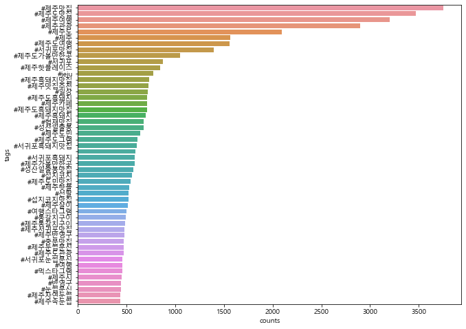

```python
from selenium import webdriver
driver = webdriver.Chrome("chromedriver.exe")  
```


```python
import time
```


```python
driver.get('https://www.instargram.com')
time.sleep(2)
```


```python
email = '인스타계정입력해주세요'  
input_id = driver.find_elements_by_css_selector('input._2hvTZ.pexuQ.zyHYP')[0]
input_id.clear()
input_id.send_keys(email)

password = '인스타비번입력해주세요'
input_pw = driver.find_elements_by_css_selector('input._2hvTZ.pexuQ.zyHYP')[1]
input_pw.clear()
input_pw.send_keys(password)
input_pw.submit()
time.sleep(3)
```


```python
def insta_searching(word):    
    url = 'https://www.instagram.com/explore/tags/' + word
    return url 
```


```python
word = "제주도맛집"
url = insta_searching(word)
driver.get(url)
```


```python
def select_first(driver):
    first = driver.find_element_by_css_selector("div._9AhH0")
    first.click()
    time.sleep(3)
    
select_first(driver)
```


```python
import re
from bs4 import BeautifulSoup
```


```python
#모든 게시물에 대해 공통적으로 작업
#html페이지 가져오기
#본문 가져오기
#해시태그 가져오기
#작성일자 가져오기

def getContent(driver):
    html=driver.page_source
    soup=BeautifulSoup(html, 'html.parser')
    content=soup.select("div.C4VMK")[0].text
    tags = re.findall("#\w+", content)
    #tags=re.findall("[#][ㄱ-힣A-Za-z]+",content)
    #tags=re.findall("#[\w]+[ ]*", content)
    #print(tags)
    
    #print(soup.select("time.FH9sR.Nzb55")[0])
    #print(soup.select("time._1o9PC.Nzb55")[0].attrs['datetime'][:10])
    date=soup.select("time._1o9PC.Nzb55")[0]['datetime'][:10]#type:str
    
    #print(soup.select("div.C4VMK")[0].text)
    #print(soup)    
    data=[content, tags, date]
    return data #본문,해시태그,작성일자
```


```python
getContent()
```


    ['jyp_story3(광고)제주도민들도 극찬한 #운정이네중문에 위치한 아주아주 귀한맛집!제주 향토음식점 운정이네 에서맛있는 식사도하고제주를 온몸으로 느껴보는건 어떨까요?🌴🌴🌴🌴✔Am8:00시 빠른오픈으로 아침식사가능!제주하면 빠질수없는 제주갈치!운정이네 에서 재대로 즐겨보세요♥.비주얼,양,맛까지 모두 사로잡은운정이네 👍🏼(식사후엔 디저트로 커피,아이스크림까지🖤).운정이네제주 서귀포시 중간서로 726(지번) 1239-5🕰8:00~22:00문의: 064-738-3883.#제주맛집추천#제주서귀포맛집#서귀포갈치조림#제주도서귀포맛집#서귀포시맛집#중문관광단지맛집#제주도중문맛집#서귀포중문맛집#오설록맛집#제주중문맛집#제주갈치조림#제주도갈치조림#제주도갈치구이#제주갈치조림맛집#제주갈치구이맛집#제주도갈치구이맛집#제주도갈치조림맛집#중문맛집#제주도맛집#서귀포맛집21시간',
     ['#운정이네중문에',
      '#제주맛집추천',
      '#제주서귀포맛집',
      '#서귀포갈치조림',
      '#제주도서귀포맛집',
      '#서귀포시맛집',
      '#중문관광단지맛집',
      '#제주도중문맛집',
      '#서귀포중문맛집',
      '#오설록맛집',
      '#제주중문맛집',
      '#제주갈치조림',
      '#제주도갈치조림',
      '#제주도갈치구이',
      '#제주갈치조림맛집',
      '#제주갈치구이맛집',
      '#제주도갈치구이맛집',
      '#제주도갈치조림맛집',
      '#중문맛집',
      '#제주도맛집',
      '#서귀포맛집21시간'],
     '2021-07-22']


```python
#  샵(#)기호로 시작하는 해시태그를 추출하여 리스트에 저장

```


```python
def move_next(driver):
    right = driver.find_element_by_css_selector ('a.coreSpriteRightPaginationArrow')
    right.click()
    time.sleep(3)
```


```python
move_next(driver)
```


```python

```


```python
#지금까지의 코드를 종합하여 50개의 게시글 수집하는 크롤러 생성
```


```python
word = "제주도맛집"   
url = insta_searching(word)
driver.get(url)
time.sleep(3)
select_first(driver)

results = [ ]
target = 50 

for i in range(target):
    try:
        data = getContent(driver) #웹페이지 -> 소스코드 읽어오게 됨
        results.append(data)
        move_next(driver)
    except:
        time.sleep(1) #일단 좀 쉬다가...
        print("예외발생!")
        move_next(driver) #그냥 다음 페이지로 이동해
#다른 외부 요인(ex. 네트워크 문제 등)에 의해 게시글 읽어들이는 과정에서 에러가 발생할 수도 있음
#이런 경우를 예외상황 이라고 함.
#예외 처리 : 예외 상황을 미리 예상하여 대처하도록 하는 것
#try:
#      예외상황이 발생할 여지가 있는 코드  
#except:
#     예외 상황 처리 코드
print(results[:3])
```

    [['dhflwlsjf8522협찬제주왔음 제주흑돼지는 무조건이지🐷규모가 매우커서 거리두기 철저해 코로나 걱정도 끝👊애월해안도로에 위치해있어 애월바다를 바라보며 로맨틱한 식사❤💯제주흑돼지맛집 "코시롱" 으로 당장 GoGo!!♦️ 제주 제주시 애월읍 애월해안로 656#코시롱#제주맛집 #제주도맛집#애월맛집#제주흑돼지맛집#애월해안도로맛집#애월읍맛집#애월맛집추천#애월흑돼지맛집#제주애월맛집#제주도흑돼지12시간', ['#코시롱', '#제주맛집', '#제주도맛집', '#애월맛집', '#제주흑돼지맛집', '#애월해안도로맛집', '#애월읍맛집', '#애월맛집추천', '#애월흑돼지맛집', '#제주애월맛집', '#제주도흑돼지12시간'], '2021-07-22'], ['jeju_murung_farm[찰라의 아침]오늘의 아침 일출이 너무 아름답니다이렇게 우리주변에는 아름다운 순간들이 많지만, 우리가 보지 못하고 느끼지 못해서 없다고 말하는 것은 아닐까요?오늘 우리 주변에 수많은 아름다운 순간들을 놓치지 말기를 기대해봅니다#무릉외갓집 #제주도 #마을기업 #제주올레 #제주올레11코스 #제주올레12코스 #제주도맛집 #제주맛집 #꾸러미 #곶자왈 #휴식5시간', ['#무릉외갓집', '#제주도', '#마을기업', '#제주올레', '#제주올레11코스', '#제주올레12코스', '#제주도맛집', '#제주맛집', '#꾸러미', '#곶자왈', '#휴식5시간'], '2021-07-22'], ['jyp_story3(광고)제주도민들도 극찬한 #운정이네중문에 위치한 아주아주 귀한맛집!제주 향토음식점 운정이네 에서맛있는 식사도하고제주를 온몸으로 느껴보는건 어떨까요?🌴🌴🌴🌴✔Am8:00시 빠른오픈으로 아침식사가능!제주하면 빠질수없는 제주갈치!운정이네 에서 재대로 즐겨보세요♥.비주얼,양,맛까지 모두 사로잡은운정이네 👍🏼(식사후엔 디저트로 커피,아이스크림까지🖤).운정이네제주 서귀포시 중간서로 726(지번) 1239-5🕰8:00~22:00문의: 064-738-3883.#제주맛집추천#제주서귀포맛집#서귀포갈치조림#제주도서귀포맛집#서귀포시맛집#중문관광단지맛집#제주도중문맛집#서귀포중문맛집#오설록맛집#제주중문맛집#제주갈치조림#제주도갈치조림#제주도갈치구이#제주갈치조림맛집#제주갈치구이맛집#제주도갈치구이맛집#제주도갈치조림맛집#중문맛집#제주도맛집#서귀포맛집21시간', ['#운정이네중문에', '#제주맛집추천', '#제주서귀포맛집', '#서귀포갈치조림', '#제주도서귀포맛집', '#서귀포시맛집', '#중문관광단지맛집', '#제주도중문맛집', '#서귀포중문맛집', '#오설록맛집', '#제주중문맛집', '#제주갈치조림', '#제주도갈치조림', '#제주도갈치구이', '#제주갈치조림맛집', '#제주갈치구이맛집', '#제주도갈치구이맛집', '#제주도갈치조림맛집', '#중문맛집', '#제주도맛집', '#서귀포맛집21시간'], '2021-07-22']]
    


```python
results
```


    []


```python
results
```


    [['dhflwlsjf8522협찬제주왔음 제주흑돼지는 무조건이지🐷규모가 매우커서 거리두기 철저해 코로나 걱정도 끝👊애월해안도로에 위치해있어 애월바다를 바라보며 로맨틱한 식사❤💯제주흑돼지맛집 "코시롱" 으로 당장 GoGo!!♦️ 제주 제주시 애월읍 애월해안로 656#코시롱#제주맛집 #제주도맛집#애월맛집#제주흑돼지맛집#애월해안도로맛집#애월읍맛집#애월맛집추천#애월흑돼지맛집#제주애월맛집#제주도흑돼지12시간',
      ['#코시롱',
       '#제주맛집',
       '#제주도맛집',
       '#애월맛집',
       '#제주흑돼지맛집',
       '#애월해안도로맛집',
       '#애월읍맛집',
       '#애월맛집추천',
       '#애월흑돼지맛집',
       '#제주애월맛집',
       '#제주도흑돼지12시간'],
      '2021-07-22'],
     ['jeju_murung_farm[찰라의 아침]오늘의 아침 일출이 너무 아름답니다이렇게 우리주변에는 아름다운 순간들이 많지만, 우리가 보지 못하고 느끼지 못해서 없다고 말하는 것은 아닐까요?오늘 우리 주변에 수많은 아름다운 순간들을 놓치지 말기를 기대해봅니다#무릉외갓집 #제주도 #마을기업 #제주올레 #제주올레11코스 #제주올레12코스 #제주도맛집 #제주맛집 #꾸러미 #곶자왈 #휴식5시간',
      ['#무릉외갓집',
       '#제주도',
       '#마을기업',
       '#제주올레',
       '#제주올레11코스',
       '#제주올레12코스',
       '#제주도맛집',
       '#제주맛집',
       '#꾸러미',
       '#곶자왈',
       '#휴식5시간'],
      '2021-07-22'],
     ['jyp_story3(광고)제주도민들도 극찬한 #운정이네중문에 위치한 아주아주 귀한맛집!제주 향토음식점 운정이네 에서맛있는 식사도하고제주를 온몸으로 느껴보는건 어떨까요?🌴🌴🌴🌴✔Am8:00시 빠른오픈으로 아침식사가능!제주하면 빠질수없는 제주갈치!운정이네 에서 재대로 즐겨보세요♥.비주얼,양,맛까지 모두 사로잡은운정이네 👍🏼(식사후엔 디저트로 커피,아이스크림까지🖤).운정이네제주 서귀포시 중간서로 726(지번) 1239-5🕰8:00~22:00문의: 064-738-3883.#제주맛집추천#제주서귀포맛집#서귀포갈치조림#제주도서귀포맛집#서귀포시맛집#중문관광단지맛집#제주도중문맛집#서귀포중문맛집#오설록맛집#제주중문맛집#제주갈치조림#제주도갈치조림#제주도갈치구이#제주갈치조림맛집#제주갈치구이맛집#제주도갈치구이맛집#제주도갈치조림맛집#중문맛집#제주도맛집#서귀포맛집21시간',
      ['#운정이네중문에',
       '#제주맛집추천',
       '#제주서귀포맛집',
       '#서귀포갈치조림',
       '#제주도서귀포맛집',
       '#서귀포시맛집',
       '#중문관광단지맛집',
       '#제주도중문맛집',
       '#서귀포중문맛집',
       '#오설록맛집',
       '#제주중문맛집',
       '#제주갈치조림',
       '#제주도갈치조림',
       '#제주도갈치구이',
       '#제주갈치조림맛집',
       '#제주갈치구이맛집',
       '#제주도갈치구이맛집',
       '#제주도갈치조림맛집',
       '#중문맛집',
       '#제주도맛집',
       '#서귀포맛집21시간'],
      '2021-07-22'],
     ['jejulife1#우도온오프감동스런 오션뷰가 있는 우도의 찐맛집👀여기는 리얼 돈까스 맛집으로 인정받았지><❤️파랑파랑 바다앞에서 먹는 돈까스+맥주🍻바닷바람 맞으며 느끼는 이국적인 힐링이랄까😆\u2028더운 여름날씨에 지친 여행길을바삭 촉촉 돈까스로 다시 에너지 업❗️잊지 못할 여행은 물론 다시 찾고싶은 돈까스 맛..💙@우도 코스에 요기 꼭 넣어가쟈🙋\u200d♀️😘.🔹주소 : 제주 제주시 우도면 우도해안길 876🔹매일 11:00 ~ 16:00#제주맛집 #제주도맛집 #제주오션뷰 #제주오션뷰맛집 #우도맛집 #우도맛집추천 #우도카페 #제주여행 #제주도여행 #제주여행코스 #우도여행 #제주데이트코스 #흑돼지돈까스 #치즈돈까스 #돈까스맛집20시간',
      ['#우도온오프감동스런',
       '#제주맛집',
       '#제주도맛집',
       '#제주오션뷰',
       '#제주오션뷰맛집',
       '#우도맛집',
       '#우도맛집추천',
       '#우도카페',
       '#제주여행',
       '#제주도여행',
       '#제주여행코스',
       '#우도여행',
       '#제주데이트코스',
       '#흑돼지돈까스',
       '#치즈돈까스',
       '#돈까스맛집20시간'],
      '2021-07-22'],
     ['jejuplanets.안가보면 아쉬울것 같은🥺유우명한 #서귀포명소 골라서 모아봄서귀포일대 여행계획중이면 꼭 참고❣@@칭구야 다음여행땐 여기어때👀\u3000\u3000#제주맛집 #제주맛집추천 #제주데이트 #제주데이트코스 #제주여행 #제주핫플 #제주핫플레이스 #제주가볼만한곳 #제주명소 #제주도명소 #제주도여행 #제주도맛집 #제주도가볼만한곳 #제주도맛집추천 #제주도핫플 #서귀포맛집 #서귀포여행 #제주공항근처맛집22시간',
      ['#서귀포명소',
       '#제주맛집',
       '#제주맛집추천',
       '#제주데이트',
       '#제주데이트코스',
       '#제주여행',
       '#제주핫플',
       '#제주핫플레이스',
       '#제주가볼만한곳',
       '#제주명소',
       '#제주도명소',
       '#제주도여행',
       '#제주도맛집',
       '#제주도가볼만한곳',
       '#제주도맛집추천',
       '#제주도핫플',
       '#서귀포맛집',
       '#서귀포여행',
       '#제주공항근처맛집22시간'],
      '2021-07-22'],
     ['mukjamukja7540<광고>#우도 들어가기전에 꼭 #산도롱맨도롱#갈비국수 꼭 드셔보세요.✔손소독제 항시 배치 (입장시 입구부터 손소독제 마스크 착용후 입장 가능합니다) ▪️오픈시간: 07:30 - 17:00▪️전화: 064-782-5105▪️제주시 구좌읍 해맞이해안로 2284▪️매주 화요일 휴무#제주맛집 #제주도맛집 #성산맛집#성산일출봉맛집 #우도맛집 #우도#종달리맛집 #스누피가든 #광치기해변#광치기해변맛집 #제주흑돼지맛집#제주도흑돼지맛집 #제주고기국수맛집#제주고기국수 #제주아침식사 #월정리맛집1일',
      ['#우도',
       '#산도롱맨도롱',
       '#갈비국수',
       '#제주맛집',
       '#제주도맛집',
       '#성산맛집',
       '#성산일출봉맛집',
       '#우도맛집',
       '#우도',
       '#종달리맛집',
       '#스누피가든',
       '#광치기해변',
       '#광치기해변맛집',
       '#제주흑돼지맛집',
       '#제주도흑돼지맛집',
       '#제주고기국수맛집',
       '#제주고기국수',
       '#제주아침식사',
       '#월정리맛집1일'],
      '2021-07-21'],
     ['fafalove779광고제주애월맛집 "랍스터빈"주소 : 제주시 애월읍 애월해안로 752전화 : 064-743-1979영업 : 오전11시~밤10시 연중무휴포장ㆍ배달 환영💘 랍스터빈#애월맛집 #애월카페 #애월읍맛집 #제주애월맛집 #제주도맛집 #제주맛집 #제주도카페 #제주카페 #외도맛집 #하귀맛집 #한림맛집 #한림카페#애월해안도로맛집 #애월가볼만한곳 #제주공항맛집 #제주공항근처맛집 #한라산16시간',
      ['#애월맛집',
       '#애월카페',
       '#애월읍맛집',
       '#제주애월맛집',
       '#제주도맛집',
       '#제주맛집',
       '#제주도카페',
       '#제주카페',
       '#외도맛집',
       '#하귀맛집',
       '#한림맛집',
       '#한림카페',
       '#애월해안도로맛집',
       '#애월가볼만한곳',
       '#제주공항맛집',
       '#제주공항근처맛집',
       '#한라산16시간'],
      '2021-07-22'],
     ['abablove77(협찬)애월바다위 카페 같은오션뷰 카레전문점 🌊OPEN 10:00CLOSE 20:00(재료소진시 조기마감될 수 있어요)🙆임시휴무 인스타공지(연중무휴)@saicurry_aewol위치 - 제주시 애월읍 애월해안로 752 2층  (구엄리 509)#사이카레 #구엄리맛집 #애월맛집 #제주맛집 #제주도맛집#애월밥집 #제주공항근처맛집 #애월카페#애월가볼만한곳 #협재맛집 #한림맛집#제주도민맛집 #제주오션뷰 #제주시맛집#애월해안도로맛집 #한담맛집 #한담카페#협재카페 #한림카페 #제주카페#제주애월맛집 #애월핫플레이스 #제주핫플1일',
      ['#사이카레',
       '#구엄리맛집',
       '#애월맛집',
       '#제주맛집',
       '#제주도맛집',
       '#애월밥집',
       '#제주공항근처맛집',
       '#애월카페',
       '#애월가볼만한곳',
       '#협재맛집',
       '#한림맛집',
       '#제주도민맛집',
       '#제주오션뷰',
       '#제주시맛집',
       '#애월해안도로맛집',
       '#한담맛집',
       '#한담카페',
       '#협재카페',
       '#한림카페',
       '#제주카페',
       '#제주애월맛집',
       '#애월핫플레이스',
       '#제주핫플1일'],
      '2021-07-21'],
     ['suncheunmihyang💕하늘가에 피어난 뭉개구름 하나 잡아그리운 이 이름 그려 본다💕진짜 밥집순천미향제주산방산본점제주시 안덕면 사계리163-1(주차장)#서귀포맛집#제주도맛집#제주맛집#중문맛집 #제주산방산맛집#산방산맛집 #용머리해안맛집 #오설록맛집 #신화월드맛집 #안덕면맛집 #제주#한라산#카멜리아힐 #오설록#산방산#용머리해안 #제주여행#제주도여행#송악산맛집#제주문어요리#순천미향1시간',
      ['#서귀포맛집',
       '#제주도맛집',
       '#제주맛집',
       '#중문맛집',
       '#제주산방산맛집',
       '#산방산맛집',
       '#용머리해안맛집',
       '#오설록맛집',
       '#신화월드맛집',
       '#안덕면맛집',
       '#제주',
       '#한라산',
       '#카멜리아힐',
       '#오설록',
       '#산방산',
       '#용머리해안',
       '#제주여행',
       '#제주도여행',
       '#송악산맛집',
       '#제주문어요리',
       '#순천미향1시간'],
      '2021-07-23'],
     ['lucin_nam오늘 제주도 마지막날ㅠㅠ마지막 식사는 공항근처 #제주분식 에서 #제주현지인맛집#제주맛집#제주도맛집#제주공항맛집#연동맛집#연동제주분식#제주도공항근처맛집#제주도여행#제주가볼만한곳#노형동맛집48초',
      ['#제주분식',
       '#제주현지인맛집',
       '#제주맛집',
       '#제주도맛집',
       '#제주공항맛집',
       '#연동맛집',
       '#연동제주분식',
       '#제주도공항근처맛집',
       '#제주도여행',
       '#제주가볼만한곳',
       '#노형동맛집48초'],
      '2021-07-23'],
     ['popyt235애월 로드129성게크림파스타흑돼지 멘치카츠흑돼지 치즈돈까스흑돼지 고구마치즈돈까스흑돼지 수제돈까스해물야끼소바재료소진시 조기마감전메뉴 포장가능#애월맛집#제주맛집#애월읍맛집#애월항맛집#제주애월점심#애월맛집추천#제주애월맛집#애월점심추천#애월밥집#제주현지인맛집#제주도민추천맛집#제주도현지인맛집#도민맛집#제주혼밥#제주시맛집#제주도맛집#금능맛집#한림맛집#협재맛집#협재해수욕장맛집#곽지해수욕장맛집#더럭분교맛집#애월해안도로#제주서쪽맛집#애월데이트코스#새별오름#애월카페#제주데이트코스1분',
      ['#애월맛집',
       '#제주맛집',
       '#애월읍맛집',
       '#애월항맛집',
       '#제주애월점심',
       '#애월맛집추천',
       '#제주애월맛집',
       '#애월점심추천',
       '#애월밥집',
       '#제주현지인맛집',
       '#제주도민추천맛집',
       '#제주도현지인맛집',
       '#도민맛집',
       '#제주혼밥',
       '#제주시맛집',
       '#제주도맛집',
       '#금능맛집',
       '#한림맛집',
       '#협재맛집',
       '#협재해수욕장맛집',
       '#곽지해수욕장맛집',
       '#더럭분교맛집',
       '#애월해안도로',
       '#제주서쪽맛집',
       '#애월데이트코스',
       '#새별오름',
       '#애월카페',
       '#제주데이트코스1분'],
      '2021-07-23'],
     ['choedalseob애월 로드129성게크림파스타흑돼지 멘치카츠흑돼지 치즈돈까스흑돼지 고구마치즈돈까스흑돼지 수제돈까스해물야끼소바재료소진시 조기마감전메뉴 포장가능#애월맛집#제주맛집#애월읍맛집#애월항맛집#제주애월점심#애월맛집추천#제주애월맛집#애월점심추천#애월밥집#제주현지인맛집#제주도민추천맛집#제주도현지인맛집#도민맛집#제주혼밥#제주시맛집#제주도맛집#금능맛집#한림맛집#협재맛집#협재해수욕장맛집#곽지해수욕장맛집#더럭분교맛집#애월해안도로#제주서쪽맛집#애월데이트코스#새별오름#애월카페#제주데이트코스2분',
      ['#애월맛집',
       '#제주맛집',
       '#애월읍맛집',
       '#애월항맛집',
       '#제주애월점심',
       '#애월맛집추천',
       '#제주애월맛집',
       '#애월점심추천',
       '#애월밥집',
       '#제주현지인맛집',
       '#제주도민추천맛집',
       '#제주도현지인맛집',
       '#도민맛집',
       '#제주혼밥',
       '#제주시맛집',
       '#제주도맛집',
       '#금능맛집',
       '#한림맛집',
       '#협재맛집',
       '#협재해수욕장맛집',
       '#곽지해수욕장맛집',
       '#더럭분교맛집',
       '#애월해안도로',
       '#제주서쪽맛집',
       '#애월데이트코스',
       '#새별오름',
       '#애월카페',
       '#제주데이트코스2분'],
      '2021-07-23'],
     ['aweol.road129애월 로드129성게크림파스타흑돼지 멘치카츠흑돼지 치즈돈까스흑돼지 고구마치즈돈까스흑돼지 수제돈까스해물야끼소바재료소진시 조기마감전메뉴 포장가능#애월맛집#제주맛집#애월읍맛집#애월항맛집#제주애월점심#애월맛집추천#제주애월맛집#애월점심추천#애월밥집#제주현지인맛집#제주도민추천맛집#제주도현지인맛집#도민맛집#제주혼밥#제주시맛집#제주도맛집#금능맛집#한림맛집#협재맛집#협재해수욕장맛집#곽지해수욕장맛집#더럭분교맛집#애월해안도로#제주서쪽맛집#애월데이트코스#새별오름#애월카페#제주데이트코스2분',
      ['#애월맛집',
       '#제주맛집',
       '#애월읍맛집',
       '#애월항맛집',
       '#제주애월점심',
       '#애월맛집추천',
       '#제주애월맛집',
       '#애월점심추천',
       '#애월밥집',
       '#제주현지인맛집',
       '#제주도민추천맛집',
       '#제주도현지인맛집',
       '#도민맛집',
       '#제주혼밥',
       '#제주시맛집',
       '#제주도맛집',
       '#금능맛집',
       '#한림맛집',
       '#협재맛집',
       '#협재해수욕장맛집',
       '#곽지해수욕장맛집',
       '#더럭분교맛집',
       '#애월해안도로',
       '#제주서쪽맛집',
       '#애월데이트코스',
       '#새별오름',
       '#애월카페',
       '#제주데이트코스2분'],
      '2021-07-23'],
     ['mustache_jeju_island.🍓 우유 속에 퐁당 리얼 딸기 우유🥛 완벽한 비율 로얄 밀크티🌈 알록달록 무지개빛 수제 뚱카롱🌱 100% 유기농 제주 말차 우유⠀⠀⠀⠀⠀⠀⠀⠀⠀⠀본관에는 반려동물과 아이들이 뛰어놀기 좋은 넓은 잔디마당 🐕🌿별관 옥상엔 빈백 정원! 🌤🌊별관 1,2층은 월정 바다가 한눈에 보이는 실내 좌석과 야외 테라스⠀⠀⠀⠀⠀⠀⠀⠀⠀⠀제주시 구좌읍 해맞이해안로 406 카페콧수염070-4131-8880⠀⠀⠀⠀⠀⠀⠀⠀⠀⠀⠀⠀⠀⠀⠀#월정리카페 #제주카페 #제주도맛집 #함덕해수욕장 #제주시카페 #제주도카페 #공항근처맛집 #제주월정리카페 #세화카페 #서귀포카페 #제주도여행 #제주동쪽카페 #제주도마카롱 #제주애견동반카페 #월정리콧수염 #성산일출봉맛집 #구좌읍카페 #성산카페 #월정리맛집 #제주마카롱맛집 #제주도 #제주월정리 #월정리카페콧수염 #제주 #월정리 #제주맛집 #성산맛집 #제주애견동반 #제주해안도로 #함덕카페2분',
      ['#월정리카페',
       '#제주카페',
       '#제주도맛집',
       '#함덕해수욕장',
       '#제주시카페',
       '#제주도카페',
       '#공항근처맛집',
       '#제주월정리카페',
       '#세화카페',
       '#서귀포카페',
       '#제주도여행',
       '#제주동쪽카페',
       '#제주도마카롱',
       '#제주애견동반카페',
       '#월정리콧수염',
       '#성산일출봉맛집',
       '#구좌읍카페',
       '#성산카페',
       '#월정리맛집',
       '#제주마카롱맛집',
       '#제주도',
       '#제주월정리',
       '#월정리카페콧수염',
       '#제주',
       '#월정리',
       '#제주맛집',
       '#성산맛집',
       '#제주애견동반',
       '#제주해안도로',
       '#함덕카페2분'],
      '2021-07-23'],
     ['sulheezz뇨끼뇨끼최고🤤3분', [], '2021-07-23'],
     ['batanam0926월정리 유메이우동곱창우동 카레우동 소고기우동찐맛집!#제주맛집#제주도민맛집#제주도맛집#제주월정리맛집#월정리맛집#구좌맛집#제주성산맛집#제주살이#제주한달살기#제주구좌맛집#유메이우동#제주유메이우동#곱창우동#소고기우동#카레우동#데일리#금요일#제주여행#제주여행코스#애월맛집#함덕맛집#제주함덕맛집#제주애월맛집#한림맛집4분',
      ['#제주맛집',
       '#제주도민맛집',
       '#제주도맛집',
       '#제주월정리맛집',
       '#월정리맛집',
       '#구좌맛집',
       '#제주성산맛집',
       '#제주살이',
       '#제주한달살기',
       '#제주구좌맛집',
       '#유메이우동',
       '#제주유메이우동',
       '#곱창우동',
       '#소고기우동',
       '#카레우동',
       '#데일리',
       '#금요일',
       '#제주여행',
       '#제주여행코스',
       '#애월맛집',
       '#함덕맛집',
       '#제주함덕맛집',
       '#제주애월맛집',
       '#한림맛집4분'],
      '2021-07-23'],
     ["jeju_hotmama4인만 출입가능한 코로나 3단계입니다\U0001f972영유아 포함 4인 이에요! 불편하시겠지만 꼭 지켜서 와 주세요♡🙆\u200d♀️테이크아웃 환영10시 반 오픈 합니다😉HOTMAMA #핫마마 : 식료품점 & 수제도그ㆍ주요 서비스 ①  핫 마 마 식 료 품 점: - 흑돼지 '샤퀴테리' 상시판매 - 제주 로컬 식료품 상시판매②  수 제 D O G : - sausage  핫마마에서 직접 제조한 수제 소세지 입니다. 100% 제주산 흑돼지로 만들었습니다. 참나무로 장시간 훈연한 진한 풍미와 육즙을 느껴보세요. - bun  천연 발효종 빵입니다. 이스트를 사용하지 않은 건강한 빵으로 쫄깃하며 담백합니다. 제주 애월의 '#프래그란스 베이커리 ' 에서 별도 제작합니다.  - homemade sauce   오랜시간 정성으로 끓인 소고기 토마토 칠리소스, 표고버섯과 야채, 고르곤졸라치즈로 만든 소스, 우유, 체다블럭치즈로 꾸덕하게 끓인 맥앤치즈소스 모두 핫마마 홈메이드 소스입니다. 주차 : 200평 규모주소: 서귀포시 안덕면 녹차분재로 193휴무: 화요일 휴무 (비정기 휴무 인스타)오픈: 10:30~19:00 브레이크: PM 3:00-4:00라스트 오더: 18:30#오설록티뮤지엄 #오설록 #오설록맛집#제주핫도그#수제도그 #제주신화월드 #신화월드맛집 #제주신화월드맛집 #항공우주박물관맛집 #항공우주박물관 #핫마마 #제주핫마마 #영어교육도시#로컬푸드 #영어교육도시맛집#노리매맛집#카멜리아힐맛집#제주맛집#뽀로로테마파크맛집 #제주시맛집 #제주도맛집 #서귀포맛집 #중문맛집 #애월맛집 #제주도민 #제주살이4분",
      ['#핫마마',
       '#프래그란스',
       '#오설록티뮤지엄',
       '#오설록',
       '#오설록맛집',
       '#제주핫도그',
       '#수제도그',
       '#제주신화월드',
       '#신화월드맛집',
       '#제주신화월드맛집',
       '#항공우주박물관맛집',
       '#항공우주박물관',
       '#핫마마',
       '#제주핫마마',
       '#영어교육도시',
       '#로컬푸드',
       '#영어교육도시맛집',
       '#노리매맛집',
       '#카멜리아힐맛집',
       '#제주맛집',
       '#뽀로로테마파크맛집',
       '#제주시맛집',
       '#제주도맛집',
       '#서귀포맛집',
       '#중문맛집',
       '#애월맛집',
       '#제주도민',
       '#제주살이4분'],
      '2021-07-23'],
     ['jejunamo#제주나모 #퓨어제주당근제주의 바람과 기름진 토양에서 자란신선한 당근으로 만든 고소한 파이!제주나모에서 지금 바로 만나보세요🍊❤️\u200d🔥매장 방문 구매 혜택❤️\u200d🔥~50% 추가 할인 & 신혼부부 할인 적용!온라인 구매는 \'프로필 링크 클릭\'ㅡㅡㅡㅡㅡㅡㅡㅡㅡㅡㅡㅡㅡㅡㅡㅡㅡㅡ365일 특별한 혜택이 기다리는 곳제주도 기념품 할인 "제주나모로 오세요👋📍매장주소: 제주 서귀포시 동홍로 108 1층 제주나모(올레시장과 차로 5분 거리, 동홍동 주민센터 바로 옆)📍영업시간: 연중 무휴 10:00~18:00(예약필수)📍방문예약: 010-9831-0125*제주나모의 매장 방문은 1팀씩 순차적으로 받고 있으므로안심하시고 마음 편하게 쇼핑하세요:)#제주도여행 #제주여행 #올레시장 #제주기념품#제주도 #제주먹거리 #제주도맛집 #제주도카페#제주도기념품 #맞팔 #소통 #제주댁 #제주살이#제주도간식 #먹스타그램 #먹팔맞팔 #서귀포맛집 #서귀포가볼만한곳 #쇠소깍 #천지연폭포 #새연교 #서귀포 #서귀포여행 #당근파이5분',
      ['#제주나모',
       '#퓨어제주당근제주의',
       '#제주도여행',
       '#제주여행',
       '#올레시장',
       '#제주기념품',
       '#제주도',
       '#제주먹거리',
       '#제주도맛집',
       '#제주도카페',
       '#제주도기념품',
       '#맞팔',
       '#소통',
       '#제주댁',
       '#제주살이',
       '#제주도간식',
       '#먹스타그램',
       '#먹팔맞팔',
       '#서귀포맛집',
       '#서귀포가볼만한곳',
       '#쇠소깍',
       '#천지연폭포',
       '#새연교',
       '#서귀포',
       '#서귀포여행',
       '#당근파이5분'],
      '2021-07-23'],
     ['toiemoistudio.사장님 친절하시구 무엇보다 재료가 신선하다는게 느껴진 식당. 문어숙회 질기지 않고 부드럽고 좋네요.#먹돌#제주도맛집 #제주맛집 #제주공항근처맛집 #제주도여행 #제주도고기국수 #제주도고기국수클라스#제주도민맛집 #제주도도민맛집 #제주여행코스 #서귀포가볼만한곳 #서귀포여행 #서귀포맛집 #제주시맛집5분',
      ['#먹돌',
       '#제주도맛집',
       '#제주맛집',
       '#제주공항근처맛집',
       '#제주도여행',
       '#제주도고기국수',
       '#제주도고기국수클라스',
       '#제주도민맛집',
       '#제주도도민맛집',
       '#제주여행코스',
       '#서귀포가볼만한곳',
       '#서귀포여행',
       '#서귀포맛집',
       '#제주시맛집5분'],
      '2021-07-23'],
     ['6htnhu#제주맛집#색달식당중문본점진짜 테이블 꽉 찬 갈치조림 비주얼이 실화인지?밥도둑이 따로 없네요!색달식당 인생갈치맛집으로 선정했어요#제주도갈치구이#제주통갈치조림#제주중문맛집#중문맛집색달식당#서귀포맛집#제주도맛집#제주갈치조림#제주도통갈치조림#제주도갈치조림맛집6분',
      ['#제주맛집',
       '#색달식당중문본점진짜',
       '#제주도갈치구이',
       '#제주통갈치조림',
       '#제주중문맛집',
       '#중문맛집색달식당',
       '#서귀포맛집',
       '#제주도맛집',
       '#제주갈치조림',
       '#제주도통갈치조림',
       '#제주도갈치조림맛집6분'],
      '2021-07-23'],
     ['psyche__closet#제주도맛집 #피자맛집 #화덕피자 #맛있으면살안쪄 #혼자한판 #제주도펜션#제주도핫플레이스 #제주라이프 #제주도민7분',
      ['#제주도맛집',
       '#피자맛집',
       '#화덕피자',
       '#맛있으면살안쪄',
       '#혼자한판',
       '#제주도펜션',
       '#제주도핫플레이스',
       '#제주라이프',
       '#제주도민7분'],
      '2021-07-23'],
     ['seongsanrooftop✔✔✔ 11시오픈합니다✔✔✔.꼼꼼히 소독하고 환기해둘께요 모두의 배려가 필요할때입니다 방문시 방문자명단작성,손소독및 식사전후 마스크착용 부탁드립니다🙏...둘이서 재료준비를하기에 많은양을 준비하기가힘이듭니다\xa0 재료소진시 조기마감 될수있어용~🤗. ..✔서귀포시 성산읍 일출로270-8 (민트색건물2층)✔운영시간 11:00-16:00✔마지막주문 15:00✔노브레끼탐🤙✔반려동물은 안되용😭✔노키즈존(14세미만).#성산맛집#성산일출봉맛집 #제주성산돈까스#스누피가든#성산카페#성산일출봉카페#제주도맛집#제주맛집#서귀포맛집#애월맛집#표선맛집#우도맛집#세화맛집#종달리맛집#송당맛집#함덕맛집#제주도돈까스#섭지코지맛집#월정리맛집#하도맛집#평대맛집#제주도해물라면7분',
      ['#성산맛집',
       '#성산일출봉맛집',
       '#제주성산돈까스',
       '#스누피가든',
       '#성산카페',
       '#성산일출봉카페',
       '#제주도맛집',
       '#제주맛집',
       '#서귀포맛집',
       '#애월맛집',
       '#표선맛집',
       '#우도맛집',
       '#세화맛집',
       '#종달리맛집',
       '#송당맛집',
       '#함덕맛집',
       '#제주도돈까스',
       '#섭지코지맛집',
       '#월정리맛집',
       '#하도맛집',
       '#평대맛집',
       '#제주도해물라면7분'],
      '2021-07-23'],
     ['soyamii2애월 로드129성게크림파스타흑돼지 멘치카츠흑돼지 치즈돈까스흑돼지 고구마치즈돈까스흑돼지 수제돈까스해물야끼소바재료소진시 조기마감전메뉴 포장가능#애월맛집#제주맛집#애월읍맛집#애월항맛집#제주애월점심#애월맛집추천#제주애월맛집#애월점심추천#애월밥집#제주현지인맛집#제주도민추천맛집#제주도현지인맛집#도민맛집#제주혼밥#제주시맛집#제주도맛집#금능맛집#한림맛집#협재맛집#협재해수욕장맛집#곽지해수욕장맛집#더럭분교맛집#애월해안도로#제주서쪽맛집#애월데이트코스#새별오름#애월카페8분',
      ['#애월맛집',
       '#제주맛집',
       '#애월읍맛집',
       '#애월항맛집',
       '#제주애월점심',
       '#애월맛집추천',
       '#제주애월맛집',
       '#애월점심추천',
       '#애월밥집',
       '#제주현지인맛집',
       '#제주도민추천맛집',
       '#제주도현지인맛집',
       '#도민맛집',
       '#제주혼밥',
       '#제주시맛집',
       '#제주도맛집',
       '#금능맛집',
       '#한림맛집',
       '#협재맛집',
       '#협재해수욕장맛집',
       '#곽지해수욕장맛집',
       '#더럭분교맛집',
       '#애월해안도로',
       '#제주서쪽맛집',
       '#애월데이트코스',
       '#새별오름',
       '#애월카페8분'],
      '2021-07-23'],
     ['studio__joel그리운 제주도 바다9분', [], '2021-07-23'],
     ['phad_thai_maan오늘도 최선을 다하겠습니다.정상영업합니다.포장도 가능합니다.재료소진 시 조기마감합니다~.#팟타이만 #phadthaimaan #팟타이 #phadthai #ผัดไทย #padthai #팟씨유 #ผัดซีอิ๊ว #쌀국수 #볶음쌀국수 #땡모반 #แตงโมปั่น #월정리팟타이만 #월정리팟타이 #구좌읍맛집 #태국 #태국음식 #thaifood #thailand #팟타이맛집 #제주맛집 #제주도맛집 #월정리맛집 #월정맛집 #월정리 #월정리해변 #제주스타그램 #제주여행 #제주도 #먹스타그램9분',
      ['#팟타이만',
       '#phadthaimaan',
       '#팟타이',
       '#phadthai',
       '#ผ',
       '#padthai',
       '#팟씨유',
       '#ผ',
       '#쌀국수',
       '#볶음쌀국수',
       '#땡모반',
       '#แตงโมป',
       '#월정리팟타이만',
       '#월정리팟타이',
       '#구좌읍맛집',
       '#태국',
       '#태국음식',
       '#thaifood',
       '#thailand',
       '#팟타이맛집',
       '#제주맛집',
       '#제주도맛집',
       '#월정리맛집',
       '#월정맛집',
       '#월정리',
       '#월정리해변',
       '#제주스타그램',
       '#제주여행',
       '#제주도',
       '#먹스타그램9분'],
      '2021-07-23'],
     ['lumaca_jejuLumaca pasta 7월 23일. 11시에 오픈했습니다🐌 오늘도 생면 가득 뽑고 시작합니다👨\u200d🍳포장은 전화 및 네이버스마트 주문으로 가능합니다🤍오늘도 활짝 열어두었어요🤗....생면파스타 전문점 루마카 제주 서귀포 칠십리로 306 Lunch 11:00-15:00Breack time 15:00-17:00Dinner 17:00-21:00(L.O 20:30) 📋예약문의 : 0507-1314-8857 or 네이버예약9분',
      [],
      '2021-07-23'],
     ['jeju.soso⠀술과 요리 "소소" (小巢)서서라 퓨전요리 주점 "소소"입니다.⠀눈깜짝하니, 어느덧 금요일이 훌!!!!!쩍!!!!!! 돌아왓네용!⠀일주일의 업무를 마지막하는 금요일, 오늘 하루 화이팅💪💪일주일의 스트레스를 해소하러 저녁에는 소소에서 만나요💖💖⠀⠀"소소" (小巢)◾제주시 서광로19길 34 1층◾T.064-726-7179⠀◾영업시간\'배달의민족\' 월-금 12:00-23:00 /토요일 17:00-23:00\'매장 홀 영업\' PM 15:30-10:00 [라스트오더 21시]⠀◾매주 "일요일"은 휴무입니다⠀🛵 "배달의민족"에 "소소"를 검색해주세요🤍⠀⠀#제주도맛집 #제주도술집 #제주배달맛집 #제주도시락 #제주도도시락 #제주도시락맛집 #제주현지인맛집 #삼도일동맛집 #삼도동맛집 #삼도동술집 #삼도동배달 #삼도동배달맛집 #전농로술집 #전농로맛집#제주여행코스 #제주맛집투어 #제주술집추천 #좋반10분',
      ['#제주도맛집',
       '#제주도술집',
       '#제주배달맛집',
       '#제주도시락',
       '#제주도도시락',
       '#제주도시락맛집',
       '#제주현지인맛집',
       '#삼도일동맛집',
       '#삼도동맛집',
       '#삼도동술집',
       '#삼도동배달',
       '#삼도동배달맛집',
       '#전농로술집',
       '#전농로맛집',
       '#제주여행코스',
       '#제주맛집투어',
       '#제주술집추천',
       '#좋반10분'],
      '2021-07-23'],
     ['yosultable_jeju요술식탁, 금요일 11시 30분 오픈합니다 :)-점심주문마감 2시 30분, 저녁주문마감 7시 30분입니다.-그럼 오늘도 맛있게 준비해서 얼어둘게요, 식사하러 오세요 🙌🏻10분',
      [],
      '2021-07-23'],
     ['foodiemap_bella제주도 덴드리제주 서귀포시 성산읍 삼달로 28-1 매일: 11:00-19:00 (수요일 휴무)덴드리 귤 에이드 7,000원 제주 성산 감귤밭이 보이는 감성 카페! 직접 생산한 귤로 만든 상큼한 귤 에이드에 맛있는 디저트까지 곁들이면 여기가 바로 지상낙원✨🧡10분',
      [],
      '2021-07-23'],
     ['heather_jeju‘해더’ 오픈했습니다〰️✨🙋🏼\u200d♀️‘한라산도’제주 등심에 수제 소스를 곁들인 카츠산도!!함께 드리는 당근라페와 오렌지 마멀레이드곁들여 드시면 진짜 맛있어요〰️✨👍🏼⠀포장은 미리 연락 주시면 시간 맞춰준비해 놓을게요🌼⠀네이버에 ‘제주해더’ ‘해더’ 검색하시면더 많은 정보 확인 가능하셔요💛⠀🏡 제주시 구좌읍 한동로6길 8, 해더☎️ 네이버에 ‘제주해더’ 검색해주세요!⏱ 화-토 11:00-4:30, 일-월 휴무⠀⠀⠀#제주도 #제주도맛집 #세화맛집 #구좌읍맛집 #구좌읍#떡볶이 #카츠산도 #당근주스 #평대맛집#하도맛집 #김녕맛집 #제주 #제주여행 #제주살이#제주한달살이 #한동리 #카페해더 #제주신상카페#제주도카페 #제주카페 #해더#제주핫플#제주해더 #heather #한라산도 #구좌떡볶이10분',
      ['#제주도',
       '#제주도맛집',
       '#세화맛집',
       '#구좌읍맛집',
       '#구좌읍',
       '#떡볶이',
       '#카츠산도',
       '#당근주스',
       '#평대맛집',
       '#하도맛집',
       '#김녕맛집',
       '#제주',
       '#제주여행',
       '#제주살이',
       '#제주한달살이',
       '#한동리',
       '#카페해더',
       '#제주신상카페',
       '#제주도카페',
       '#제주카페',
       '#해더',
       '#제주핫플',
       '#제주해더',
       '#heather',
       '#한라산도',
       '#구좌떡볶이10분'],
      '2021-07-23'],
     ['bujuiewe치즈돈까스 맛있당 파스타 접시까지 싹싹😉#제주도 #로드129 #애월맛집#제주맛집 #제주도맛집 #제주공항근처맛집 #데일리11분',
      ['#제주도', '#로드129', '#애월맛집', '#제주맛집', '#제주도맛집', '#제주공항근처맛집', '#데일리11분'],
      '2021-07-23'],
     ['jeondonggyun43샌드위치&브런치&커피 제주여행만족😍💖오션뷰 카페☕#제주날씨#제주여행#감성카페#제주브런치맛집#한림핫플#애월핫플#카츠산도 #애월카페#곽지해수욕장카페#시그니처메뉴#뷰맛집 #제주도맛집#제주신상카페#애월맛집#제주브런치맛집#한림맛집#제주디저트맛집#한림카페#애월브런치#제주뷰맛집#협재브런치카페#제주핫플#곽지브런치맛집#한림브런치맛집#협재카페추천#귀더크#제주귀더크#애월브런치카페#샌드위치맛집#제주혼커피11분',
      ['#제주날씨',
       '#제주여행',
       '#감성카페',
       '#제주브런치맛집',
       '#한림핫플',
       '#애월핫플',
       '#카츠산도',
       '#애월카페',
       '#곽지해수욕장카페',
       '#시그니처메뉴',
       '#뷰맛집',
       '#제주도맛집',
       '#제주신상카페',
       '#애월맛집',
       '#제주브런치맛집',
       '#한림맛집',
       '#제주디저트맛집',
       '#한림카페',
       '#애월브런치',
       '#제주뷰맛집',
       '#협재브런치카페',
       '#제주핫플',
       '#곽지브런치맛집',
       '#한림브런치맛집',
       '#협재카페추천',
       '#귀더크',
       '#제주귀더크',
       '#애월브런치카페',
       '#샌드위치맛집',
       '#제주혼커피11분'],
      '2021-07-23'],
     ['bakethingsbetter🍪ʙᴀᴋᴇ ᴛʜɪɴɢꜱ ʙᴇᴛᴛᴇʀ🍪오늘도 11시 정상오픈합니다💙인절미 쑥 스콘은 전자렌지 20초 돌려드시면 사진처럼 떡이 쭉 늘어나요😋😋꼭 20초 돌려드시길 추천드립니다 ‼️‼️내일은 주말이니 오늘만 더 화이팅하시고 다들 좋은하루 보내세요 😊😊오늘도 8시까지 열려있습니다💙* 방문시 마스크 착용 및 QR 체크인 필수입니다!* 코로나19 및 각종 전염병 예방을 위해 모든 케이크와 디저트를 진열대에 보관 중이므로 골라주시면 직접 포장해드립니다.#bakethingsbetter#btb #베띵베12분',
      ['#bakethingsbetter', '#btb', '#베띵베12분'],
      '2021-07-23'],
     ['jeju_rreeme제주 서귀포 맛집제주도의 다양한 향토 음식을 맛볼 수 있는  집.‼‼‼‼탐해진미 제주 은갈치 & 자연산 해산물서귀포 중문 맛집 👍🏻다양한 제주 요리를 맛볼 수 있는 집🛫#중문맛집 #제주향토음식점 #제주예지원 #서귀포맛집 #제주도맛집 #맞팔 #선팔환영 #좋아요반사 ⠀🏡 위치 :  서귀포시 천제연로 129☎ 연락처 : 064-738-9577⠀✅ 매일 08:00~22:0012분',
      ['#중문맛집',
       '#제주향토음식점',
       '#제주예지원',
       '#서귀포맛집',
       '#제주도맛집',
       '#맞팔',
       '#선팔환영',
       '#좋아요반사'],
      '2021-07-23'],
     ['oh.meal.store다음주 발송 온라인 주문 오픈하였습니다😉 제주 고사리 장아찌, 무유자절임, 당근무절임, 톳조림 주문가능하세요~ 이곳 저곳 어울리는 맛있는 병절임 식품들입니다😋 ✨ 오밀스토어 매장도 활짝 열어두었습니다! #제주 #세화 #오밀스토어18분',
      ['#제주', '#세화', '#오밀스토어18분'],
      '2021-07-23'],
     ['woo_click너네 그러는거아니야35분', [], '2021-07-23'],
     ['tot_tot_jeju_정말 오랜만에 여유로이 재료준비를 끝내고 오픈대기중입니다💛 10시에 만나요🍋..문의• 064-782-3521휴무• 매주 수요일#제주쌀국수#제주반미#제주월남쌈#제주성산맛집#성산맛집#온평리맛집#올레코스맛집#올레2코스#올레3코스#똣똣1시간',
      ['#제주쌀국수',
       '#제주반미',
       '#제주월남쌈',
       '#제주성산맛집',
       '#성산맛집',
       '#온평리맛집',
       '#올레코스맛집',
       '#올레2코스',
       '#올레3코스',
       '#똣똣1시간'],
      '2021-07-23'],
     ['cafe_the_light_jeju✨따사로운 햇살이 바다를 비춰요돌 틈사이로 스며드는 파도가 일렁일렁 🌊🌊🌿#카페더라이트10시간',
      ['#카페더라이트10시간'],
      '2021-07-22'],
     ['ppeachpowrr도배미안; 사진이 너무많네 2박일정이엿다가 가기싫어서 3박으로 바껏더니 😅1일', [], '2021-07-22'],
     ['heejinxxz로드129 흑돼지치즈돈까스성게크림파스타흑돼지함박스테이크해물야끼소바흑돼지돈까스애월해변 도보10분🌴..#제주도여행#제주도#제주여행#성산일출봉#협재맛집#제주공항근처맛집#제주공항맛집#제주도맛집#애월맛집#소통 #오설록맛집 #followme#선팔하면맞팔#일상기록#먹방#좋반환영#댓글환영 #일상사진#집밥13분',
      ['#제주도여행',
       '#제주도',
       '#제주여행',
       '#성산일출봉',
       '#협재맛집',
       '#제주공항근처맛집',
       '#제주공항맛집',
       '#제주도맛집',
       '#애월맛집',
       '#소통',
       '#오설록맛집',
       '#followme',
       '#선팔하면맞팔',
       '#일상기록',
       '#먹방',
       '#좋반환영',
       '#댓글환영',
       '#일상사진',
       '#집밥13분'],
      '2021-07-23'],
     ['freenchy1애월 로드129성게크림파스타흑돼지 멘치카츠흑돼지 치즈돈까스흑돼지 고구마치즈돈까스흑돼지 수제돈까스해물야끼소바재료소진시 조기마감전메뉴 포장가능#애월맛집#제주맛집#애월읍맛집#애월항맛집#제주애월점심#애월맛집추천#제주애월맛집#애월점심추천#애월밥집#제주현지인맛집#제주도민추천맛집#제주도현지인맛집#도민맛집#제주혼밥#제주시맛집#제주도맛집#제주도민맛집#금능맛집#한림맛집#협재맛집#협재해수욕장맛집#곽지해수욕장맛집#더럭분교맛집#애월해안도로#제주서쪽맛집#애월데이트코스#새별오름#애월카페#제주데이트코스13분',
      ['#애월맛집',
       '#제주맛집',
       '#애월읍맛집',
       '#애월항맛집',
       '#제주애월점심',
       '#애월맛집추천',
       '#제주애월맛집',
       '#애월점심추천',
       '#애월밥집',
       '#제주현지인맛집',
       '#제주도민추천맛집',
       '#제주도현지인맛집',
       '#도민맛집',
       '#제주혼밥',
       '#제주시맛집',
       '#제주도맛집',
       '#제주도민맛집',
       '#금능맛집',
       '#한림맛집',
       '#협재맛집',
       '#협재해수욕장맛집',
       '#곽지해수욕장맛집',
       '#더럭분교맛집',
       '#애월해안도로',
       '#제주서쪽맛집',
       '#애월데이트코스',
       '#새별오름',
       '#애월카페',
       '#제주데이트코스13분'],
      '2021-07-23'],
     ["jeju_pori#포리식당 ● 포리식당은 판모밀+메밀전 set 단일메뉴 입니다😋 • 포리식당 판모밀은 시중에 판매하는 쯔유를 사용하지 않고 전통식으로 직접 만들어서 제공하고 있습니다🍜 • 포리식당 메밀전은 100% 제주산 메밀과 직접 공수하는 제주산 야채(표고버섯,당근)만을 사용합니다🥕 ☆ side menu '메밀 왕만두' 개시 🥟 😄오늘 영업준비 완료! 놀러오세요~🤗 🚩 제주시 한림읍 한림해안로 21⏰ open 11시 , close 19시🗓 매주 수요일 휴무☎️ 문의 010.6361.5486네이버 예약 불가https://m.place.naver.com/restaurant/1116950083/home #우무 걸어서 3분 🚶\u200d♀️#명랑스낵 걸어서 8분 🚶\u200d♂️#협재해수욕장 차로 5분 🚗#한림공원 차로 5분 🚗#판모밀 #메밀전 #제주 #제주도 #제주여행 #제주핫플 #제주도가볼만한곳 #제주도맛집 #제주맛집 #한림읍맛집 #옹포리맛집 #로컬푸드 #웰빙 #혼밥 #제주바다 #협재해변 #옹포해변 #보호카페 #나른팬션 #월하독작 #주섬주섬 #사탕수수 #cafeboho #jeju #jejuisland13분",
      ['#포리식당',
       '#우무',
       '#명랑스낵',
       '#협재해수욕장',
       '#한림공원',
       '#판모밀',
       '#메밀전',
       '#제주',
       '#제주도',
       '#제주여행',
       '#제주핫플',
       '#제주도가볼만한곳',
       '#제주도맛집',
       '#제주맛집',
       '#한림읍맛집',
       '#옹포리맛집',
       '#로컬푸드',
       '#웰빙',
       '#혼밥',
       '#제주바다',
       '#협재해변',
       '#옹포해변',
       '#보호카페',
       '#나른팬션',
       '#월하독작',
       '#주섬주섬',
       '#사탕수수',
       '#cafeboho',
       '#jeju',
       '#jejuisland13분'],
      '2021-07-23'],
     ['nansan_kitchen#난산리식당 #예약마감..안녕하세요 난산리식당 입니다.여러분들의 관심과 사랑으로 오픈한지 딱 일주일만에 첫 예약 마감이 되었습니다. 감사합니다. .직접 공사부터 시작해서 테이블제작,선반제작,그릇제작 등등 제 손길이 닿지 않은 부분이 하나도 없는 소중한 식당입니다. 제가 정말 아끼는 이 공간을 다른 여러 손님들도 좋아해 주시고 만족해 하시는 모습을 보니 매일 하루하루가 행복합니다. 감사합니다.고민하고 또 고민하겠습니다!!.언젠가 이곳에서 함께 만날 그날을 기다리겠습니다.14분',
      ['#난산리식당', '#예약마감'],
      '2021-07-23'],
     ['hayanghan_jeju후기가 이렇게 올라왔었다니감동이에요 😭오늘도 푸딩푸딩한 하루되세요! 🍮🍮🍮하양한도 활짝열려있어요!14분',
      [],
      '2021-07-23'],
     ['hjiinii#제주도바이브 🌞16분', ['#제주도바이브'], '2021-07-23'],
     ['mustache_jeju_island.🍓 우유 속에 퐁당 리얼 딸기 우유🥛 완벽한 비율 로얄 밀크티🌱 100% 유기농 제주 말차 우유🌈 알록달록 무지개빛 수제 뚱카롱⠀⠀⠀⠀⠀⠀⠀⠀⠀⠀별관 1,2층은 월정 바다가 한눈에 보이는 실내 좌석과 야외 테라스본관에는 반려동물과 아이들이 뛰어놀기 좋은 넓은 잔디마당 🐕🌿별관 옥상엔 빈백 정원! 🌤🌊⠀⠀⠀⠀⠀⠀⠀⠀⠀⠀제주시 구좌읍 해맞이해안로 406 카페콧수염070-4131-8880⠀⠀⠀⠀⠀⠀⠀⠀⠀⠀⠀⠀⠀⠀⠀#제주카페투어 #서귀포맛집 #제주맛집 #월정리 #월정리카페 #제주도 #제주피크닉 #제주시카페 #제주월정리 #세화카페 #제주 #월정리맛집 #제주도여행 #제주동쪽카페 #함덕카페 #제주카페 #제주도선물 #제주도마카롱 #월정리카페콧수염 #제주도민맛집 #제주월정리카페 #제주도카페 #월정리콧수염 #성산맛집 #제주해안도로 #월정리카페거리 #월정 #서귀포카페 #제주도맛집 #제주카페추천17분',
      ['#제주카페투어',
       '#서귀포맛집',
       '#제주맛집',
       '#월정리',
       '#월정리카페',
       '#제주도',
       '#제주피크닉',
       '#제주시카페',
       '#제주월정리',
       '#세화카페',
       '#제주',
       '#월정리맛집',
       '#제주도여행',
       '#제주동쪽카페',
       '#함덕카페',
       '#제주카페',
       '#제주도선물',
       '#제주도마카롱',
       '#월정리카페콧수염',
       '#제주도민맛집',
       '#제주월정리카페',
       '#제주도카페',
       '#월정리콧수염',
       '#성산맛집',
       '#제주해안도로',
       '#월정리카페거리',
       '#월정',
       '#서귀포카페',
       '#제주도맛집',
       '#제주카페추천17분'],
      '2021-07-23'],
     ['sinhwayi에그타르트와 아이스아메리카노는 아주 꿀 조합 !! 여기 진짜 커피도 맛있네요 사장님 대체 뭐하시는분인가요?너무 맛있어요.. ㅠㅠ #제주도카페#제주도맛집 #제주핫플 #제주공항근처카페 #jeju#jejudo #제주타르트 #제주맛집 #제주카페#타르트맛집 #제주도여행#제주섬타르왔어요 #제주공항카페 #섬타르#제주선물 #제주카페투어 #제주도카페추천 #제주도타르트#제주도카페맛집#제주시카페#제주공항근처맛집#제주도여행#맛팔가요#좋아요테러반사#좋아요반사테러#좋아요꾸욱#소통그램#맞팔가요18분',
      ['#제주도카페',
       '#제주도맛집',
       '#제주핫플',
       '#제주공항근처카페',
       '#jeju',
       '#jejudo',
       '#제주타르트',
       '#제주맛집',
       '#제주카페',
       '#타르트맛집',
       '#제주도여행',
       '#제주섬타르왔어요',
       '#제주공항카페',
       '#섬타르',
       '#제주선물',
       '#제주카페투어',
       '#제주도카페추천',
       '#제주도타르트',
       '#제주도카페맛집',
       '#제주시카페',
       '#제주공항근처맛집',
       '#제주도여행',
       '#맛팔가요',
       '#좋아요테러반사',
       '#좋아요반사테러',
       '#좋아요꾸욱',
       '#소통그램',
       '#맞팔가요18분'],
      '2021-07-23'],
     ['heejinxxz로드129 시그니처메뉴성게크림파스타❣❣로드129에서만 드실수 있습니다흑돼지돈까스---#애월맛집 #제주도맛집 #곽지맛집 #여행사진#제주도#서귀포맛집#중문맛집#오설록맛집#동문시장#좋아요#카멜리아힐맛집#소길리맛집#제주도가볼만한곳#제주공항맛집#아이와제주여행 #산방산맛집#애월가볼만한곳#협재맛집 #한담맛집 #협재해수욕장#먹방스타그램18분',
      ['#애월맛집',
       '#제주도맛집',
       '#곽지맛집',
       '#여행사진',
       '#제주도',
       '#서귀포맛집',
       '#중문맛집',
       '#오설록맛집',
       '#동문시장',
       '#좋아요',
       '#카멜리아힐맛집',
       '#소길리맛집',
       '#제주도가볼만한곳',
       '#제주공항맛집',
       '#아이와제주여행',
       '#산방산맛집',
       '#애월가볼만한곳',
       '#협재맛집',
       '#한담맛집',
       '#협재해수욕장',
       '#먹방스타그램18분'],
      '2021-07-23'],
     ['young_island.story지난 봄 날씨 좋은날 쇠소깍 <아일랜드 라디오>⠀원래는 유명한 테라로사에 가려고 했는데 사람 너무 바글바글🤦🏻 바로 앞 아일랜드 라디오 라는 카페가 너무 예쁘고  차분하게 자리하고 있어서 방향을 바꿨다 마침 이 이날 우리가 맞춰입은 베이지랑도 찰떡이어서 신났었지💛🤍개인적으로 블랙올리브치아바타를 상당히 좋아하는데 앉은 자리에서 혼자 다 먹었다⠀제주 서귀포시 칠십리로658번길 27-13매일 10:00-20:00 연중무휴18분',
      [],
      '2021-07-23'],
     ['road129.aweol애월 로드129성게크림파스타흑돼지 멘치카츠흑돼지 치즈돈까스흑돼지 고구마치즈돈까스흑돼지 수제돈까스해물야끼소바재료소진시 조기마감전메뉴 포장가능#애월맛집#제주맛집#애월읍맛집#애월항맛집#제주애월점심#애월맛집추천#제주애월맛집#애월점심추천#애월밥집#제주현지인맛집#제주도민추천맛집#제주도현지인맛집#도민맛집#제주혼밥#제주시맛집#제주도맛집#제주도민맛집#금능맛집#한림맛집#협재맛집#협재해수욕장맛집#곽지해수욕장맛집#더럭분교맛집#애월해안도로#제주서쪽맛집#애월데이트코스#새별오름#애월카페#제주데이트코스19분',
      ['#애월맛집',
       '#제주맛집',
       '#애월읍맛집',
       '#애월항맛집',
       '#제주애월점심',
       '#애월맛집추천',
       '#제주애월맛집',
       '#애월점심추천',
       '#애월밥집',
       '#제주현지인맛집',
       '#제주도민추천맛집',
       '#제주도현지인맛집',
       '#도민맛집',
       '#제주혼밥',
       '#제주시맛집',
       '#제주도맛집',
       '#제주도민맛집',
       '#금능맛집',
       '#한림맛집',
       '#협재맛집',
       '#협재해수욕장맛집',
       '#곽지해수욕장맛집',
       '#더럭분교맛집',
       '#애월해안도로',
       '#제주서쪽맛집',
       '#애월데이트코스',
       '#새별오름',
       '#애월카페',
       '#제주데이트코스19분'],
      '2021-07-23']]


```python
import pandas as pd
```


```python
df=pd.DataFrame(results)
df
df.columns=['content', 'tags', 'date']
```


```python
df
df.to_excel("result.xlsx", index=False)
```


```python

```


```python
raw_total=pd.read_excel("1_crawling_raw.xlsx")
raw_total['tags']
raw_total['tags'][0]
```


    "['#제주핫플레이스', '#제주여행', '#제주여행', '#제주도여행', '#제주가볼만한곳', '#제주도핫플', '#제주여행코스', '#제주공항', '#제주도맛집', '#제주맛집', '#제주스냅', '#제주풍경', '#제주사진', '#제주카페', '#제주도카페', '#산굼부리', '#제주도바다', '#귤체험', '#우도', '#제주관광', '#제주도여향지', '#제주여행중', '#삼육오빠', '#제주앓이']"


```python
# total=[]
# tagsList=raw_total['tags'][1][2:-2].split("', '")
# for tag in tagsList:
#     total.append(tag)
    

#for tags in raw_total['tags']:
    
```


```python

```


```python
# total=[]
# test=['#제주핫플레이스', '#제주여행', '#제주여행', '#제주도여행']
# for t in test:
#     total.append(t[1:])
```


```python
print(total)
```

    ['제주핫플레이스', '제주여행', '제주여행', '제주도여행']
    


```python
tags_total=[]
# raw_total['tags'][0]
# raw_total['tags'][8800]
for tags in raw_total['tags']:
    tagsList=tags[2:-2].split("', '")
    for tag in tagsList:
        tags_total.append(tag)
        
    #"['#제주핫플레이스', '#제주여행', '#제주여행', '#제주도여행', '#제주가볼만한곳', '#제주도핫플', '#제주여행코스', '#제주공항', '#제주도맛집', '#제주맛집', '#제주스냅', '#제주풍경', '#제주사진', '#제주카페', '#제주도카페', '#산굼부리', '#제주도바다', '#귤체험', '#우도', '#제주관광', '#제주도여향지', '#제주여행중', '#삼육오빠', '#제주앓이']"
#     print(len(tags))
    #가장 많이 등장한 해시태그?
    #빈도수 조사

```


```python
print(len(tags_total)) #149495 개 해시태그
```

    149495
    


```python
Counter(tags_total)
Counter(tags_total).most_common(50)
jejuDf=pd.DataFrame(Counter(tags_total).most_common(50))
jejuDf.columns=['tags', 'counts']
jejuDf
```


<div>
<style scoped>
    .dataframe tbody tr th:only-of-type {
        vertical-align: middle;
    }

    .dataframe tbody tr th {
        vertical-align: top;
    }

    .dataframe thead th {
        text-align: right;
    }
</style>
<table border="1" class="dataframe">
  <thead>
    <tr style="text-align: right;">
      <th></th>
      <th>tags</th>
      <th>counts</th>
    </tr>
  </thead>
  <tbody>
    <tr>
      <th>0</th>
      <td>#제주맛집</td>
      <td>3750</td>
    </tr>
    <tr>
      <th>1</th>
      <td>#제주도맛집</td>
      <td>3467</td>
    </tr>
    <tr>
      <th>2</th>
      <td>#제주여행</td>
      <td>3204</td>
    </tr>
    <tr>
      <th>3</th>
      <td>#제주관광</td>
      <td>2898</td>
    </tr>
    <tr>
      <th>4</th>
      <td>#제주도</td>
      <td>2096</td>
    </tr>
    <tr>
      <th>5</th>
      <td>#제주</td>
      <td>1567</td>
    </tr>
    <tr>
      <th>6</th>
      <td>#제주도여행</td>
      <td>1555</td>
    </tr>
    <tr>
      <th>7</th>
      <td>#서귀포맛집</td>
      <td>1392</td>
    </tr>
    <tr>
      <th>8</th>
      <td>#제주도가볼만한곳</td>
      <td>1047</td>
    </tr>
    <tr>
      <th>9</th>
      <td>#서귀포</td>
      <td>872</td>
    </tr>
    <tr>
      <th>10</th>
      <td>#제주핫플레이스</td>
      <td>848</td>
    </tr>
    <tr>
      <th>11</th>
      <td>#jeju</td>
      <td>776</td>
    </tr>
    <tr>
      <th>12</th>
      <td>#제주흑돼지맛집</td>
      <td>730</td>
    </tr>
    <tr>
      <th>13</th>
      <td>#제주맛집추천</td>
      <td>728</td>
    </tr>
    <tr>
      <th>14</th>
      <td>#일상</td>
      <td>717</td>
    </tr>
    <tr>
      <th>15</th>
      <td>#제주도흑돼지</td>
      <td>713</td>
    </tr>
    <tr>
      <th>16</th>
      <td>#제주카페</td>
      <td>711</td>
    </tr>
    <tr>
      <th>17</th>
      <td>#제주도흑돼지맛집</td>
      <td>709</td>
    </tr>
    <tr>
      <th>18</th>
      <td>#제주흑돼지</td>
      <td>693</td>
    </tr>
    <tr>
      <th>19</th>
      <td>#협재맛집</td>
      <td>677</td>
    </tr>
    <tr>
      <th>20</th>
      <td>#성산일출봉</td>
      <td>674</td>
    </tr>
    <tr>
      <th>21</th>
      <td>#제주도민</td>
      <td>637</td>
    </tr>
    <tr>
      <th>22</th>
      <td>#제주도그램</td>
      <td>609</td>
    </tr>
    <tr>
      <th>23</th>
      <td>#서귀포흑돼지맛집</td>
      <td>605</td>
    </tr>
    <tr>
      <th>24</th>
      <td></td>
      <td>588</td>
    </tr>
    <tr>
      <th>25</th>
      <td>#서귀포흑돼지</td>
      <td>582</td>
    </tr>
    <tr>
      <th>26</th>
      <td>#제주가볼만한곳</td>
      <td>580</td>
    </tr>
    <tr>
      <th>27</th>
      <td>#성산일출봉맛집</td>
      <td>567</td>
    </tr>
    <tr>
      <th>28</th>
      <td>#섭지코지</td>
      <td>558</td>
    </tr>
    <tr>
      <th>29</th>
      <td>#제주도민맛집</td>
      <td>542</td>
    </tr>
    <tr>
      <th>30</th>
      <td>#제주핫플</td>
      <td>530</td>
    </tr>
    <tr>
      <th>31</th>
      <td>#선팔</td>
      <td>522</td>
    </tr>
    <tr>
      <th>32</th>
      <td>#섭지코지맛집</td>
      <td>519</td>
    </tr>
    <tr>
      <th>33</th>
      <td>#제주살이</td>
      <td>516</td>
    </tr>
    <tr>
      <th>34</th>
      <td>#여행스타그램</td>
      <td>498</td>
    </tr>
    <tr>
      <th>35</th>
      <td>#통갈치구이</td>
      <td>495</td>
    </tr>
    <tr>
      <th>36</th>
      <td>#제주통갈치구이</td>
      <td>485</td>
    </tr>
    <tr>
      <th>37</th>
      <td>#제주서귀포맛집</td>
      <td>479</td>
    </tr>
    <tr>
      <th>38</th>
      <td>#제주반영구</td>
      <td>478</td>
    </tr>
    <tr>
      <th>39</th>
      <td>#중문맛집</td>
      <td>472</td>
    </tr>
    <tr>
      <th>40</th>
      <td>#제주눈썹문신</td>
      <td>472</td>
    </tr>
    <tr>
      <th>41</th>
      <td>#제주도관광</td>
      <td>471</td>
    </tr>
    <tr>
      <th>42</th>
      <td>#서귀포눈썹문신</td>
      <td>458</td>
    </tr>
    <tr>
      <th>43</th>
      <td>#여행</td>
      <td>455</td>
    </tr>
    <tr>
      <th>44</th>
      <td>#먹스타그램</td>
      <td>453</td>
    </tr>
    <tr>
      <th>45</th>
      <td>#제주시</td>
      <td>451</td>
    </tr>
    <tr>
      <th>46</th>
      <td>#반영구</td>
      <td>443</td>
    </tr>
    <tr>
      <th>47</th>
      <td>#눈썹문신</td>
      <td>443</td>
    </tr>
    <tr>
      <th>48</th>
      <td>#제주자연눈썹</td>
      <td>435</td>
    </tr>
    <tr>
      <th>49</th>
      <td>#제주속눈썹</td>
      <td>435</td>
    </tr>
  </tbody>
</table>
</div>


```python
import matplotlib.pyplot as plt
import seaborn as sns
import matplotlib
from matplotlib import font_manager, rc
import platform
if platform.system()=="Windows":
    font_name=font_manager.FontProperties(fname="c:/Windows/Fonts/malgun.ttf").get_name()
    rc('font', family=font_name)
matplotlib.rcParams['axes.unicode_minus']=False

import warnings
warnings.filterwarnings("ignore")
```


```python
plt.figure(figsize=(10,8))
sns.barplot(x='counts', y='tags',data=jejuDf)
```


    <AxesSubplot:xlabel='counts', ylabel='tags'>


    

    


```python

```


```python

```


```python

```


```python

```


```python

```


```python

```


```python

```


```python

```


```python
test=['a','a','b','b','b','c']
```


```python
from collections import Counter
```


```python
#Counter(test)['b']
Counter(test).most_common(2)
```


    [('b', 3), ('a', 2)]


```python

```
