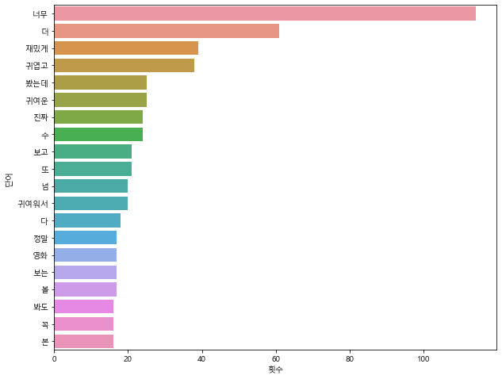

```python
# 미니 프로젝트
# 영화 페이지의 모든 댓글 중 가장 많이 출현하는 단어 상위 20개를 보여줍니다
```


```python
from selenium import webdriver
from bs4 import BeautifulSoup
import time
import re
```


```python
driver = webdriver.Chrome("chromedriver.exe")
driver.get("https://movie.naver.com/movie/point/af/list.naver?st=mcode&sword=191597&target=after")
```


```python
def get_content(driver):
    each_page_comments = []
    html = driver.page_source
    soup = BeautifulSoup(html, 'html.parser')
    brs = soup.select("td.title > br")
    
    for br in brs:
        each_page_comments.append(br.find_next_sibling(text=True).strip())
        
    return each_page_comments
```


```python
def move_next(driver):
    next_page = driver.find_element_by_css_selector ("#old_content > div.paging > div > a.pg_next")
    next_page.click()
    time.sleep(0.5)
```


```python

contents = []
while True:
    try:
        contents += get_content(driver)
        move_next(driver)
    except:
        # 넘어갈 다음 댓글 페이지가 없으면 예외 발생
        break

```


```python
coment_total_str = "".join(contents)
words = coment_total_str.split(" ")

```


```python
import pandas as pd
from collections import Counter

```


```python
df = pd.DataFrame(Counter(words).most_common(20))
df.columns = ["단어", "횟수"]

```


```python
# 밑의 그래프에서 x, y축에 한글 적용하기 위한 코드
import matplotlib
from matplotlib import font_manager, rc
import platform
if platform.system()=="Windows":
    font_name=font_manager.FontProperties(fname="c:/Windows/Fonts/malgun.ttf").get_name()
    rc('font', family=font_name)
matplotlib.rcParams['axes.unicode_minus']=False

import warnings
warnings.filterwarnings("ignore")
```


```python
import matplotlib.pyplot as plt
import seaborn as sns

plt.figure(figsize = (10, 8))
sns.barplot(y = "단어", x = "횟수", data = df)
```


    <AxesSubplot:xlabel='횟수', ylabel='단어'>


​    

​    

