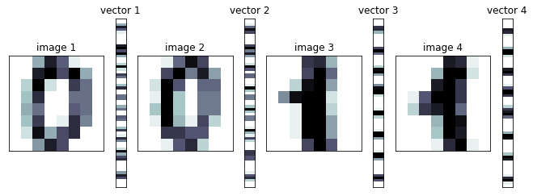

```python
#array 연결
import numpy as np
```


```python
# #stack 계열 함수 : 행 또는 열의 수가 동일한 두 개 이상의 배열을 연결
# hstack : 행의 개수가 동일한 배열을 옆으로 연결
# vstack: 열의 개수가 동일한 배열을 밑으로 연결
```


```python
x1=np.ones((2,3)) # 행 2, 열 3
print(x1)
x2=np.zeros((2,2))# 행 2, 열 3
print(x2)
```

    [[1. 1. 1.]
     [1. 1. 1.]]
    [[0. 0.]
     [0. 0.]]
    


```python
np.hstack([x1,x2])
```


    array([[1., 1., 1., 0., 0.],
           [1., 1., 1., 0., 0.]])


```python
x3=np.ones((2,3)) # 행 2, 열 3
print(x3)
x4=np.zeros((3,3))# 행 3, 열 3
print(x4)
```

    [[1. 1. 1.]
     [1. 1. 1.]]
    [[0. 0. 0.]
     [0. 0. 0.]
     [0. 0. 0.]]
    


```python
np.vstack([x3,x4])
```


    array([[1., 1., 1.],
           [1., 1., 1.],
           [0., 0., 0.],
           [0., 0., 0.],
           [0., 0., 0.]])


```python

```


```python
x=np.arange(1,10000001)
y=np.arange(10000001,20000001)
```


```python
%%time
z=np.zeros_like(x)
for i in range(10000000):
    z[i]=x[i]+y[i]
    #6ms : ms(10-3승 초, 1/1000 초), us(10-6초),  ns, ps, fs, as, ...
```

    Wall time: 4.49 s
    


```python
print(z)
```

    [10000002 10000004 10000006 ... 29999996 29999998 30000000]
    


```python
%%time
z=x+y
```

    Wall time: 27 ms
    


```python
z
```


    array([10002, 10004, 10006, ..., 29996, 29998, 30000])


```python
x1=np.array([1,2,3])
x2=np.array([1,3,3])
x1==x2
np.all(x1==x2) #x2과 x1가 모두 같습니까
```


    True


```python
np.exp(x1) #자연상수(e)=2.718xxx
```


    array([ 2.71828183,  7.3890561 , 20.08553692])


```python
10 ** x1
```


    array([  10,  100, 1000], dtype=int32)


```python
#선형대수
데이터 개수 또는 형태에 따라 스칼라, 벡터, 행렬, 텐서로 구분됨
스칼라? 숫자 하나로 구성된 데이터(0차원 텐서)
벡터? (사전에 정의된 어떤 순서에 따라)여러개의 숫자들로 구성된 데이터(1차원 텐서)
행렬? 벡터들의 집합(2차원 텐서)
텐서? 같은 크기의 행렬이 여러개 있는 것(다차원 텐서)
```


```python
from sklearn.datasets import load_iris
#sklearn = scikit learn
iris=load_iris()
iris
irisData=iris.data#iris['data']
irisData.shape
```


    (150, 4)


```python
irisData[149][0] #스칼라
```


    5.9


```python
과일가게
1/1 사과=10, 바나나=5, 딸기=2
1/2 메론=5, 사과=3, 딸기=1
...
1월달 총 매출액?
사과
=>
      사과 바나나 딸기 메론 
1/1    10    5      2   0   => 행벡터
1/2    3     0     1   5
...
1/31   5    0     0    2
---------------------------
    열벡터
    

```


```python
#넘파이에서 벡터를 표현하는 형식 : 열의 개수가 1개인 2차원 배열로 표현, 
#1차원 배열도 벡터로 인정해줌

#주의:배열의 차원은 벡터의 차원(원소의 개수)과 다른 의미!!!

#10    5      2   0   => 1차원 배열, 4차원 벡터


x=np.array([[10], [5], [2], [0]])
x

x2=np.array([10, 5, 2, 0])
x2

```


    array([10,  5,  2,  0])


```python
irisData #=> 2차원 배열, 4차원 벡터
```


    array([[5.1, 3.5, 1.4, 0.2],
           [4.9, 3. , 1.4, 0.2],
           [4.7, 3.2, 1.3, 0.2],
           [4.6, 3.1, 1.5, 0.2],
           [5. , 3.6, 1.4, 0.2],
           [5.4, 3.9, 1.7, 0.4],
           [4.6, 3.4, 1.4, 0.3],
           [5. , 3.4, 1.5, 0.2],
           [4.4, 2.9, 1.4, 0.2],
           [4.9, 3.1, 1.5, 0.1],
           [5.4, 3.7, 1.5, 0.2],
           [4.8, 3.4, 1.6, 0.2],
           [4.8, 3. , 1.4, 0.1],
           [4.3, 3. , 1.1, 0.1],
           [5.8, 4. , 1.2, 0.2],
           [5.7, 4.4, 1.5, 0.4],
           [5.4, 3.9, 1.3, 0.4],
           [5.1, 3.5, 1.4, 0.3],
           [5.7, 3.8, 1.7, 0.3],
           [5.1, 3.8, 1.5, 0.3],
           [5.4, 3.4, 1.7, 0.2],
           [5.1, 3.7, 1.5, 0.4],
           [4.6, 3.6, 1. , 0.2],
           [5.1, 3.3, 1.7, 0.5],
           [4.8, 3.4, 1.9, 0.2],
           [5. , 3. , 1.6, 0.2],
           [5. , 3.4, 1.6, 0.4],
           [5.2, 3.5, 1.5, 0.2],
           [5.2, 3.4, 1.4, 0.2],
           [4.7, 3.2, 1.6, 0.2],
           [4.8, 3.1, 1.6, 0.2],
           [5.4, 3.4, 1.5, 0.4],
           [5.2, 4.1, 1.5, 0.1],
           [5.5, 4.2, 1.4, 0.2],
           [4.9, 3.1, 1.5, 0.2],
           [5. , 3.2, 1.2, 0.2],
           [5.5, 3.5, 1.3, 0.2],
           [4.9, 3.6, 1.4, 0.1],
           [4.4, 3. , 1.3, 0.2],
           [5.1, 3.4, 1.5, 0.2],
           [5. , 3.5, 1.3, 0.3],
           [4.5, 2.3, 1.3, 0.3],
           [4.4, 3.2, 1.3, 0.2],
           [5. , 3.5, 1.6, 0.6],
           [5.1, 3.8, 1.9, 0.4],
           [4.8, 3. , 1.4, 0.3],
           [5.1, 3.8, 1.6, 0.2],
           [4.6, 3.2, 1.4, 0.2],
           [5.3, 3.7, 1.5, 0.2],
           [5. , 3.3, 1.4, 0.2],
           [7. , 3.2, 4.7, 1.4],
           [6.4, 3.2, 4.5, 1.5],
           [6.9, 3.1, 4.9, 1.5],
           [5.5, 2.3, 4. , 1.3],
           [6.5, 2.8, 4.6, 1.5],
           [5.7, 2.8, 4.5, 1.3],
           [6.3, 3.3, 4.7, 1.6],
           [4.9, 2.4, 3.3, 1. ],
           [6.6, 2.9, 4.6, 1.3],
           [5.2, 2.7, 3.9, 1.4],
           [5. , 2. , 3.5, 1. ],
           [5.9, 3. , 4.2, 1.5],
           [6. , 2.2, 4. , 1. ],
           [6.1, 2.9, 4.7, 1.4],
           [5.6, 2.9, 3.6, 1.3],
           [6.7, 3.1, 4.4, 1.4],
           [5.6, 3. , 4.5, 1.5],
           [5.8, 2.7, 4.1, 1. ],
           [6.2, 2.2, 4.5, 1.5],
           [5.6, 2.5, 3.9, 1.1],
           [5.9, 3.2, 4.8, 1.8],
           [6.1, 2.8, 4. , 1.3],
           [6.3, 2.5, 4.9, 1.5],
           [6.1, 2.8, 4.7, 1.2],
           [6.4, 2.9, 4.3, 1.3],
           [6.6, 3. , 4.4, 1.4],
           [6.8, 2.8, 4.8, 1.4],
           [6.7, 3. , 5. , 1.7],
           [6. , 2.9, 4.5, 1.5],
           [5.7, 2.6, 3.5, 1. ],
           [5.5, 2.4, 3.8, 1.1],
           [5.5, 2.4, 3.7, 1. ],
           [5.8, 2.7, 3.9, 1.2],
           [6. , 2.7, 5.1, 1.6],
           [5.4, 3. , 4.5, 1.5],
           [6. , 3.4, 4.5, 1.6],
           [6.7, 3.1, 4.7, 1.5],
           [6.3, 2.3, 4.4, 1.3],
           [5.6, 3. , 4.1, 1.3],
           [5.5, 2.5, 4. , 1.3],
           [5.5, 2.6, 4.4, 1.2],
           [6.1, 3. , 4.6, 1.4],
           [5.8, 2.6, 4. , 1.2],
           [5. , 2.3, 3.3, 1. ],
           [5.6, 2.7, 4.2, 1.3],
           [5.7, 3. , 4.2, 1.2],
           [5.7, 2.9, 4.2, 1.3],
           [6.2, 2.9, 4.3, 1.3],
           [5.1, 2.5, 3. , 1.1],
           [5.7, 2.8, 4.1, 1.3],
           [6.3, 3.3, 6. , 2.5],
           [5.8, 2.7, 5.1, 1.9],
           [7.1, 3. , 5.9, 2.1],
           [6.3, 2.9, 5.6, 1.8],
           [6.5, 3. , 5.8, 2.2],
           [7.6, 3. , 6.6, 2.1],
           [4.9, 2.5, 4.5, 1.7],
           [7.3, 2.9, 6.3, 1.8],
           [6.7, 2.5, 5.8, 1.8],
           [7.2, 3.6, 6.1, 2.5],
           [6.5, 3.2, 5.1, 2. ],
           [6.4, 2.7, 5.3, 1.9],
           [6.8, 3. , 5.5, 2.1],
           [5.7, 2.5, 5. , 2. ],
           [5.8, 2.8, 5.1, 2.4],
           [6.4, 3.2, 5.3, 2.3],
           [6.5, 3. , 5.5, 1.8],
           [7.7, 3.8, 6.7, 2.2],
           [7.7, 2.6, 6.9, 2.3],
           [6. , 2.2, 5. , 1.5],
           [6.9, 3.2, 5.7, 2.3],
           [5.6, 2.8, 4.9, 2. ],
           [7.7, 2.8, 6.7, 2. ],
           [6.3, 2.7, 4.9, 1.8],
           [6.7, 3.3, 5.7, 2.1],
           [7.2, 3.2, 6. , 1.8],
           [6.2, 2.8, 4.8, 1.8],
           [6.1, 3. , 4.9, 1.8],
           [6.4, 2.8, 5.6, 2.1],
           [7.2, 3. , 5.8, 1.6],
           [7.4, 2.8, 6.1, 1.9],
           [7.9, 3.8, 6.4, 2. ],
           [6.4, 2.8, 5.6, 2.2],
           [6.3, 2.8, 5.1, 1.5],
           [6.1, 2.6, 5.6, 1.4],
           [7.7, 3. , 6.1, 2.3],
           [6.3, 3.4, 5.6, 2.4],
           [6.4, 3.1, 5.5, 1.8],
           [6. , 3. , 4.8, 1.8],
           [6.9, 3.1, 5.4, 2.1],
           [6.7, 3.1, 5.6, 2.4],
           [6.9, 3.1, 5.1, 2.3],
           [5.8, 2.7, 5.1, 1.9],
           [6.8, 3.2, 5.9, 2.3],
           [6.7, 3.3, 5.7, 2.5],
           [6.7, 3. , 5.2, 2.3],
           [6.3, 2.5, 5. , 1.9],
           [6.5, 3. , 5.2, 2. ],
           [6.2, 3.4, 5.4, 2.3],
           [5.9, 3. , 5.1, 1.8]])


```python

```


```python
#벡터 또는 행렬 연산 수행을 위해 두 벡터/행렬의 크기가 같아야 함
#브로드캐스팅 : 서로 다른 크기의 벡터/행렬이 연산할 수 있도록 해주는 기능
#크기가 작은 쪽 배열을 크기가 큰 쪽 배열의 크기와 동일하게 맞추는 작업
```


```python
x=np.arange(5)
x + 10 #x는 크기가 5, 10은 크기가 1 -> 크기가 다름
#[0, 1, 2, 3, 4]  + [10,10,10,10,10]
```


    [0, 1, 2, 3, 4]


```python
#리스트 컴프리헨션 + vstack함수

# array([[0, 1, 2],
#        [1, 2, 3],
#        [2, 3, 4],
#        [3, 4, 5],
#        [4, 5, 6]])

np.vstack([range(7)[i:i+3] for i in range(5)])

```


    array([[0, 1, 2],
           [1, 2, 3],
           [2, 3, 4],
           [3, 4, 5],
           [4, 5, 6]])


```python
# x=np.array([0,1,2])
# y=[x+i for i in range(5)]
# print(y)

# np.array([[j for j in range(i,i+3)] for i in range(5)])

# [n + np.arange(3) for n in np.arange(5)]

x=np.array([[n, n+1, n+2] for n in range(5)])
```


```python
x #5행 3열
```


    array([[0, 1, 2],
           [1, 2, 3],
           [2, 3, 4],
           [3, 4, 5],
           [4, 5, 6]])


```python
y=np.arange(10,15)[:,np.newaxis]
y
#y.shape #(5,1)

x+y
# x.shape #(5,3)
# y.shape #(5,)
# x+y
```


    array([[10, 11, 12],
           [12, 13, 14],
           [14, 15, 16],
           [16, 17, 18],
           [18, 19, 20]])


```python
# np.arange(5)+np.arange(5)
```


    array([0, 2, 4, 6, 8])


```python
y=np.arange(10,15)
y.shape
y=y.reshape(5,1)
y+x
```


    array([[10, 11, 12],
           [12, 13, 14],
           [14, 15, 16],
           [16, 17, 18],
           [18, 19, 20]])


```python
x=np.array([1,2,3,4])
```


```python
x
np.sum(x)
x.sum()
np.min(x)
x.min()
np.max(x)
x.max()

x.argmax()
x.argmin()

np.median(x)

```


    2.5


```python
#sum(x)
```


```python
# x=[[10,11,12],
# [20,21,22],
# [30,31,32],
# [40,41,42]]
```


```python

```


```python
#np.array([[n, n+1, n+2] for n in range(10, 41, 10)])

[[j+(10*i) for j in range(3)] for i in range(1,5)]

```


    [[10, 11, 12], [20, 21, 22], [30, 31, 32], [40, 41, 42]]


```python
x=np.array([[n, n+1, n+2] for n in range(10, 41, 10)])
x
```


    array([[10, 11, 12],
           [20, 21, 22],
           [30, 31, 32],
           [40, 41, 42]])


```python
x.sum() #전체 합
x.sum(axis=0) # 열 단위 합계
x.sum(axis=1) #행 단위 합계
```


    array([ 33,  63,  93, 123])


```python
from sklearn.datasets import load_digits
```


```python
digits=load_digits()
```


```python
digits
#딕셔너리의 키 목록 출력
digits.keys()
digits.images # 3차원 배열

digits.images.shape #(1797, 8, 8) #이미지(8행 8열)이 1797개

digits.images[1796]
```


    array([[ 0.,  0., 10., 14.,  8.,  1.,  0.,  0.],
           [ 0.,  2., 16., 14.,  6.,  1.,  0.,  0.],
           [ 0.,  0., 15., 15.,  8., 15.,  0.,  0.],
           [ 0.,  0.,  5., 16., 16., 10.,  0.,  0.],
           [ 0.,  0., 12., 15., 15., 12.,  0.,  0.],
           [ 0.,  4., 16.,  6.,  4., 16.,  6.,  0.],
           [ 0.,  8., 16., 10.,  8., 16.,  8.,  0.],
           [ 0.,  1.,  8., 12., 14., 12.,  1.,  0.]])


```python
digits.keys()
digits.target[1796]
```


    8


```python
import matplotlib.pyplot as plt
import matplotlib.gridspec as gridspec


d1 = digits.images[0]
d2 = digits.images[10]
d3 = digits.images[1]
d4 = digits.images[11]
v1 = d1.reshape(64, 1)
v2 = d2.reshape(64, 1)
v3 = d3.reshape(64, 1)
v4 = d4.reshape(64, 1)
```


```python
v1
v2
v3
v4
```


    array([[ 0.],
           [ 0.],
           [ 0.],
           [ 0.],
           [14.],
           [13.],
           [ 1.],
           [ 0.],
           [ 0.],
           [ 0.],
           [ 0.],
           [ 5.],
           [16.],
           [16.],
           [ 2.],
           [ 0.],
           [ 0.],
           [ 0.],
           [ 0.],
           [14.],
           [16.],
           [12.],
           [ 0.],
           [ 0.],
           [ 0.],
           [ 1.],
           [10.],
           [16.],
           [16.],
           [12.],
           [ 0.],
           [ 0.],
           [ 0.],
           [ 3.],
           [12.],
           [14.],
           [16.],
           [ 9.],
           [ 0.],
           [ 0.],
           [ 0.],
           [ 0.],
           [ 0.],
           [ 5.],
           [16.],
           [15.],
           [ 0.],
           [ 0.],
           [ 0.],
           [ 0.],
           [ 0.],
           [ 4.],
           [16.],
           [14.],
           [ 0.],
           [ 0.],
           [ 0.],
           [ 0.],
           [ 0.],
           [ 1.],
           [13.],
           [16.],
           [ 1.],
           [ 0.]])


```python

```


```python

```


```python

```


```python

```


```python

```


```python

```


```python
plt.figure(figsize=(9, 9))
gs = gridspec.GridSpec(1, 8, height_ratios=[1],
                       width_ratios=[9, 1, 9, 1, 9, 1, 9, 1])
for i in range(4):
    plt.subplot(gs[2 * i])
    plt.imshow(eval("d" + str(i + 1)), aspect=1,
               interpolation='nearest', cmap=plt.cm.bone_r)
    plt.grid(False)
    plt.xticks([])
    plt.yticks([])
    plt.title("image {}".format(i + 1))
    plt.subplot(gs[2 * i + 1])
    plt.imshow(eval("v" + str(i + 1)), aspect=0.25,
               interpolation='nearest', cmap=plt.cm.bone_r)
    plt.grid(False)
    plt.xticks([])
    plt.yticks([])
    plt.title("vector {}".format(i + 1))
plt.tight_layout()
plt.show()
```


    

    


```python
v1과v2 내적=연산결과
v1과v3 내적=연산결과
v1과v4 내적=연산결과
v1과 내적했을때 값이 가장 큰 벡터가 무엇인지 출력?  예상 답: v2
v3와 내적했을때 값이 가장 큰 벡터가 무엇인지 출력?  예상 답: v4

# 이미지가 비슷한 것끼리 내적한 결과는
# 이미지가 서로 다른 것끼리 내적한 결과와 비교했을때
# 값이 크다
```


    array([[ 0.],
           [ 0.],
           [ 1.],
           [ 9.],
           [15.],
           [11.],
           [ 0.],
           [ 0.],
           [ 0.],
           [ 0.],
           [11.],
           [16.],
           [ 8.],
           [14.],
           [ 6.],
           [ 0.],
           [ 0.],
           [ 2.],
           [16.],
           [10.],
           [ 0.],
           [ 9.],
           [ 9.],
           [ 0.],
           [ 0.],
           [ 1.],
           [16.],
           [ 4.],
           [ 0.],
           [ 8.],
           [ 8.],
           [ 0.],
           [ 0.],
           [ 4.],
           [16.],
           [ 4.],
           [ 0.],
           [ 8.],
           [ 8.],
           [ 0.],
           [ 0.],
           [ 1.],
           [16.],
           [ 5.],
           [ 1.],
           [11.],
           [ 3.],
           [ 0.],
           [ 0.],
           [ 0.],
           [12.],
           [12.],
           [10.],
           [10.],
           [ 0.],
           [ 0.],
           [ 0.],
           [ 0.],
           [ 1.],
           [10.],
           [13.],
           [ 3.],
           [ 0.],
           [ 0.]])


```python
v13=sum([v1[i]*v3[i] for i in range(64)])
v32=sum([v3[i]*v2[i] for i in range(64)])
v34=sum([v3[i]*v4[i] for i in range(64)])
if v13>v32:
    res="v1"
elif v34>v13:
    res="v4"
else :
    res="v2"
print("답: ",res)

```

    답:  v4
    


```python
print(sum(v3 * v1))
print(sum(v3 * v2))
print(sum(v3 * v4))

print(sum(v2 * v1))
print(sum(v3 * v1))
print(sum(v4 * v1))
```

    [1866.]
    [2421.]
    [3661.]
    [3064.]
    [1866.]
    [1883.]
    


```python
v13=sum([v1[i]*v3[i] for i in range(64)])
v13
```


    array([1866.])


```python

```
