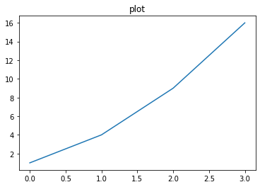
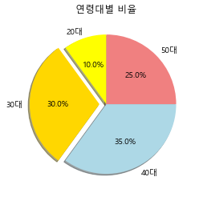

```python
import seaborn as sns
```


```python
#플랫폼 기반 업체
anscombe=sns.load_dataset("anscombe")
```


```python
anscombe
#dataset 종류 4가지:각 그룹에 대한 x,y의 평균,분산,표준편차
```


<div>
<style scoped>
    .dataframe tbody tr th:only-of-type {
        vertical-align: middle;
    }

    .dataframe tbody tr th {
        vertical-align: top;
    }

    .dataframe thead th {
        text-align: right;
    }
</style>
<table border="1" class="dataframe">
  <thead>
    <tr style="text-align: right;">
      <th></th>
      <th>dataset</th>
      <th>x</th>
      <th>y</th>
    </tr>
  </thead>
  <tbody>
    <tr>
      <th>0</th>
      <td>I</td>
      <td>10.0</td>
      <td>8.04</td>
    </tr>
    <tr>
      <th>1</th>
      <td>I</td>
      <td>8.0</td>
      <td>6.95</td>
    </tr>
    <tr>
      <th>2</th>
      <td>I</td>
      <td>13.0</td>
      <td>7.58</td>
    </tr>
    <tr>
      <th>3</th>
      <td>I</td>
      <td>9.0</td>
      <td>8.81</td>
    </tr>
    <tr>
      <th>4</th>
      <td>I</td>
      <td>11.0</td>
      <td>8.33</td>
    </tr>
    <tr>
      <th>5</th>
      <td>I</td>
      <td>14.0</td>
      <td>9.96</td>
    </tr>
    <tr>
      <th>6</th>
      <td>I</td>
      <td>6.0</td>
      <td>7.24</td>
    </tr>
    <tr>
      <th>7</th>
      <td>I</td>
      <td>4.0</td>
      <td>4.26</td>
    </tr>
    <tr>
      <th>8</th>
      <td>I</td>
      <td>12.0</td>
      <td>10.84</td>
    </tr>
    <tr>
      <th>9</th>
      <td>I</td>
      <td>7.0</td>
      <td>4.82</td>
    </tr>
    <tr>
      <th>10</th>
      <td>I</td>
      <td>5.0</td>
      <td>5.68</td>
    </tr>
    <tr>
      <th>11</th>
      <td>II</td>
      <td>10.0</td>
      <td>9.14</td>
    </tr>
    <tr>
      <th>12</th>
      <td>II</td>
      <td>8.0</td>
      <td>8.14</td>
    </tr>
    <tr>
      <th>13</th>
      <td>II</td>
      <td>13.0</td>
      <td>8.74</td>
    </tr>
    <tr>
      <th>14</th>
      <td>II</td>
      <td>9.0</td>
      <td>8.77</td>
    </tr>
    <tr>
      <th>15</th>
      <td>II</td>
      <td>11.0</td>
      <td>9.26</td>
    </tr>
    <tr>
      <th>16</th>
      <td>II</td>
      <td>14.0</td>
      <td>8.10</td>
    </tr>
    <tr>
      <th>17</th>
      <td>II</td>
      <td>6.0</td>
      <td>6.13</td>
    </tr>
    <tr>
      <th>18</th>
      <td>II</td>
      <td>4.0</td>
      <td>3.10</td>
    </tr>
    <tr>
      <th>19</th>
      <td>II</td>
      <td>12.0</td>
      <td>9.13</td>
    </tr>
    <tr>
      <th>20</th>
      <td>II</td>
      <td>7.0</td>
      <td>7.26</td>
    </tr>
    <tr>
      <th>21</th>
      <td>II</td>
      <td>5.0</td>
      <td>4.74</td>
    </tr>
    <tr>
      <th>22</th>
      <td>III</td>
      <td>10.0</td>
      <td>7.46</td>
    </tr>
    <tr>
      <th>23</th>
      <td>III</td>
      <td>8.0</td>
      <td>6.77</td>
    </tr>
    <tr>
      <th>24</th>
      <td>III</td>
      <td>13.0</td>
      <td>12.74</td>
    </tr>
    <tr>
      <th>25</th>
      <td>III</td>
      <td>9.0</td>
      <td>7.11</td>
    </tr>
    <tr>
      <th>26</th>
      <td>III</td>
      <td>11.0</td>
      <td>7.81</td>
    </tr>
    <tr>
      <th>27</th>
      <td>III</td>
      <td>14.0</td>
      <td>8.84</td>
    </tr>
    <tr>
      <th>28</th>
      <td>III</td>
      <td>6.0</td>
      <td>6.08</td>
    </tr>
    <tr>
      <th>29</th>
      <td>III</td>
      <td>4.0</td>
      <td>5.39</td>
    </tr>
    <tr>
      <th>30</th>
      <td>III</td>
      <td>12.0</td>
      <td>8.15</td>
    </tr>
    <tr>
      <th>31</th>
      <td>III</td>
      <td>7.0</td>
      <td>6.42</td>
    </tr>
    <tr>
      <th>32</th>
      <td>III</td>
      <td>5.0</td>
      <td>5.73</td>
    </tr>
    <tr>
      <th>33</th>
      <td>IV</td>
      <td>8.0</td>
      <td>6.58</td>
    </tr>
    <tr>
      <th>34</th>
      <td>IV</td>
      <td>8.0</td>
      <td>5.76</td>
    </tr>
    <tr>
      <th>35</th>
      <td>IV</td>
      <td>8.0</td>
      <td>7.71</td>
    </tr>
    <tr>
      <th>36</th>
      <td>IV</td>
      <td>8.0</td>
      <td>8.84</td>
    </tr>
    <tr>
      <th>37</th>
      <td>IV</td>
      <td>8.0</td>
      <td>8.47</td>
    </tr>
    <tr>
      <th>38</th>
      <td>IV</td>
      <td>8.0</td>
      <td>7.04</td>
    </tr>
    <tr>
      <th>39</th>
      <td>IV</td>
      <td>8.0</td>
      <td>5.25</td>
    </tr>
    <tr>
      <th>40</th>
      <td>IV</td>
      <td>19.0</td>
      <td>12.50</td>
    </tr>
    <tr>
      <th>41</th>
      <td>IV</td>
      <td>8.0</td>
      <td>5.56</td>
    </tr>
    <tr>
      <th>42</th>
      <td>IV</td>
      <td>8.0</td>
      <td>7.91</td>
    </tr>
    <tr>
      <th>43</th>
      <td>IV</td>
      <td>8.0</td>
      <td>6.89</td>
    </tr>
  </tbody>
</table>
</div>


```python
anscombe.groupby("dataset").var()
anscombe.groupby("dataset").std()
anscombe.groupby("dataset").mean()
anscombe.describe() #기술통계
anscombe.groupby('dataset').agg({'mean','var','std'})

```


<div>
<style scoped>
    .dataframe tbody tr th:only-of-type {
        vertical-align: middle;
    }

    .dataframe tbody tr th {
        vertical-align: top;
    }

    .dataframe thead tr th {
        text-align: left;
    }

    .dataframe thead tr:last-of-type th {
        text-align: right;
    }
</style>
<table border="1" class="dataframe">
  <thead>
    <tr>
      <th></th>
      <th colspan="3" halign="left">x</th>
      <th colspan="3" halign="left">y</th>
    </tr>
    <tr>
      <th></th>
      <th>var</th>
      <th>std</th>
      <th>mean</th>
      <th>var</th>
      <th>std</th>
      <th>mean</th>
    </tr>
    <tr>
      <th>dataset</th>
      <th></th>
      <th></th>
      <th></th>
      <th></th>
      <th></th>
      <th></th>
    </tr>
  </thead>
  <tbody>
    <tr>
      <th>I</th>
      <td>11.0</td>
      <td>3.316625</td>
      <td>9.0</td>
      <td>4.127269</td>
      <td>2.031568</td>
      <td>7.500909</td>
    </tr>
    <tr>
      <th>II</th>
      <td>11.0</td>
      <td>3.316625</td>
      <td>9.0</td>
      <td>4.127629</td>
      <td>2.031657</td>
      <td>7.500909</td>
    </tr>
    <tr>
      <th>III</th>
      <td>11.0</td>
      <td>3.316625</td>
      <td>9.0</td>
      <td>4.122620</td>
      <td>2.030424</td>
      <td>7.500000</td>
    </tr>
    <tr>
      <th>IV</th>
      <td>11.0</td>
      <td>3.316625</td>
      <td>9.0</td>
      <td>4.123249</td>
      <td>2.030579</td>
      <td>7.500909</td>
    </tr>
  </tbody>
</table>
</div>


```python
import matplotlib.pyplot as plt
import matplotlib as mpl
```


```python
dataset1=anscombe[anscombe['dataset']=='I']
dataset1
```


<div>
<style scoped>
    .dataframe tbody tr th:only-of-type {
        vertical-align: middle;
    }

    .dataframe tbody tr th {
        vertical-align: top;
    }

    .dataframe thead th {
        text-align: right;
    }
</style>
<table border="1" class="dataframe">
  <thead>
    <tr style="text-align: right;">
      <th></th>
      <th>dataset</th>
      <th>x</th>
      <th>y</th>
    </tr>
  </thead>
  <tbody>
    <tr>
      <th>0</th>
      <td>I</td>
      <td>10.0</td>
      <td>8.04</td>
    </tr>
    <tr>
      <th>1</th>
      <td>I</td>
      <td>8.0</td>
      <td>6.95</td>
    </tr>
    <tr>
      <th>2</th>
      <td>I</td>
      <td>13.0</td>
      <td>7.58</td>
    </tr>
    <tr>
      <th>3</th>
      <td>I</td>
      <td>9.0</td>
      <td>8.81</td>
    </tr>
    <tr>
      <th>4</th>
      <td>I</td>
      <td>11.0</td>
      <td>8.33</td>
    </tr>
    <tr>
      <th>5</th>
      <td>I</td>
      <td>14.0</td>
      <td>9.96</td>
    </tr>
    <tr>
      <th>6</th>
      <td>I</td>
      <td>6.0</td>
      <td>7.24</td>
    </tr>
    <tr>
      <th>7</th>
      <td>I</td>
      <td>4.0</td>
      <td>4.26</td>
    </tr>
    <tr>
      <th>8</th>
      <td>I</td>
      <td>12.0</td>
      <td>10.84</td>
    </tr>
    <tr>
      <th>9</th>
      <td>I</td>
      <td>7.0</td>
      <td>4.82</td>
    </tr>
    <tr>
      <th>10</th>
      <td>I</td>
      <td>5.0</td>
      <td>5.68</td>
    </tr>
  </tbody>
</table>
</div>


```python
plt.plot(dataset1['x'],dataset1['y'])
```


    [<matplotlib.lines.Line2D at 0x1efa0f61e80>]


    

    


```python
plt.plot(dataset1['x'],dataset1['y'],'o')
```


    [<matplotlib.lines.Line2D at 0x1efa1284f40>]


    

    


```python
dataset2=anscombe[anscombe['dataset']=='II']
dataset3=anscombe[anscombe['dataset']=='III']
dataset4=anscombe[anscombe['dataset']=='IV']
```


```python
fig=plt.figure()
```


    <Figure size 432x288 with 0 Axes>


```python
axes1=fig.add_subplot(2,2,1) #좌측상단
axes2=fig.add_subplot(2,2,2)
axes3=fig.add_subplot(2,2,3)
axes4=fig.add_subplot(2,2,4)
```

    <ipython-input-30-e97249faa3d3>:1: MatplotlibDeprecationWarning: Adding an axes using the same arguments as a previous axes currently reuses the earlier instance.  In a future version, a new instance will always be created and returned.  Meanwhile, this warning can be suppressed, and the future behavior ensured, by passing a unique label to each axes instance.
      axes1=fig.add_subplot(2,2,1)
    


```python
axes1.plot(dataset1['x'],dataset1['y'],'o')
axes2.plot(dataset2['x'],dataset2['y'],'o')
axes3.plot(dataset3['x'],dataset3['y'],'o')
axes4.plot(dataset4['x'],dataset4['y'],'o')
```


    [<matplotlib.lines.Line2D at 0x1efa151b8b0>]


```python
fig
```


    

    


```python
axes1.set_title("d1")
axes2.set_title("d2")
axes3.set_title("d3")
axes4.set_title("d4")

```


    Text(0.5, 1.0, 'd4')


```python
fig.tight_layout()
fig.suptitle("title")
fig
```


    

    


```python
#matplotlib.org
```


```python
#선그래프:시간, 순서에 따른 변화를 시각적으로
```


```python
plt.title("plot")
plt.plot([1,4,9,16]) #(0,1), (1,4),(2,9),(3,16)
```


    [<matplotlib.lines.Line2D at 0x1efa1769220>]


    

    


```python
import matplotlib
from matplotlib import font_manager, rc
import platform
if platform.system()=="Windows":
    font_name=font_manager.FontProperties(fname="c:/Windows/Fonts/malgun.ttf").get_name()
    rc('font', family=font_name)
matplotlib.rcParams['axes.unicode_minus']=False

import warnings
warnings.filterwarnings("ignore")
plt.title("한글제목", fontdict={'color':'red', 'size':20, 'weight':'bold'}) #카페 검색:한글(깨짐)


#plt.plot([5,10,15,20],[1,4,9,16],'sb--')
plt.plot([5,10,15,20],[1,4,9,16],linestyle='--', color='red', marker='s')
#linestyle='--', color='red', marker='s'

plt.xlabel("x축", fontdict={'color':'red', 'size':20, 'weight':'bold'})  #  'family':'NanumMyeongjo'
plt.ylabel("y축")
```


    Text(0, 0.5, 'y축')


    

    


```python
plt.plot([1,2,3,4],[1,4,9,16], c='r', lw=3, marker='^',ls='--')
plt.xlim(0,10)
plt.ylim(0,20)
plt.xticks([0,5,10])
```


    ([<matplotlib.axis.XTick at 0x1efa4a8a370>,
      <matplotlib.axis.XTick at 0x1efa4a8a340>,
      <matplotlib.axis.XTick at 0x1efa4a86910>],
     [Text(0, 0, ''), Text(0, 0, ''), Text(0, 0, '')])


    

    


```python
import numpy as np
```


```python

x=np.linspace(-np.pi, np.pi, 256)
y=np.cos(x)
```


```python
plt.plot(x,y)
plt.xticks([-np.pi, -np.pi/2, 0, np.pi/2, np.pi])
plt.yticks([-1,0,1])
```


    ([<matplotlib.axis.YTick at 0x1efa4aafb50>,
      <matplotlib.axis.YTick at 0x1efa4b5f100>,
      <matplotlib.axis.YTick at 0x1efa4b7d6a0>],
     [Text(0, 0, ''), Text(0, 0, ''), Text(0, 0, '')])


    

    


```python
data=np.arange(0,5,0.2)
plt.plot(data, data, 'r--', data, data**2, 'bs:', data, data**3, 'g^-') #(0,0)~(4.8,4.8)
```


    [<matplotlib.lines.Line2D at 0x1efa4cf7ca0>,
     <matplotlib.lines.Line2D at 0x1efa4cf7b50>,
     <matplotlib.lines.Line2D at 0x1efa4cf7cd0>]


    

    


```python
plt.plot(data, data, 'r--', label="f1")
plt.plot(data, data**2, 'bs:', label="f2")
plt.plot(data, data**3, 'g^-', label="f3") #(0,0)~(4.8,4.8)
plt.legend() #0~10, 디폴트:0(베스트)
```


    <matplotlib.legend.Legend at 0x1efa4f1ec70>


    

    


```python
# sin, cos함수 그래프 함께 시각화
# 범위 : -pi ~ pi
#np.sin(-np.pi/2)
```


    -1.0


```python
a=np.linspace(-np.pi, np.pi, 256) 
b=np.cos(a)
bb=np.sin(a)

plt.plot(a,b)
plt.plot(a,bb)

```


    [<matplotlib.lines.Line2D at 0x1efa4fc3a90>]


    

    


```python
# sin,cos 함수 그래프 함께 시각화
x_cos = np.linspace(-np.pi,np.pi,256)
y_cos = np.cos(x)

x_sin = np.linspace(-np.pi,np.pi,256)
y_sin = np.sin(x)

plt.xticks([-np.pi,-np.pi/2,0,np.pi/2,np.pi])
plt.yticks([-1,0,1])

plt.plot(x_cos,y_cos,'r--',label = 'cos')
plt.plot(x_sin,y_sin,'k--',label = 'sin')
plt.legend(loc=0)

```


    <matplotlib.legend.Legend at 0x1efa50026a0>


    

    


```python
# figure, axes, axis 객체
# figure:도화지
# axes:도화지 1장을 영역으로 나눈 것
# axis:axes를 구성하는 각각의 축
```


```python
plt.figure(figsize=(10,2)) #1 = 72 pixel
plt.plot(np.random.randn(100))
```


    [<matplotlib.lines.Line2D at 0x1efa50fe970>]


    

    


```python
#subplot함수:figure 내부에 axes생성
```


```python
x1=np.linspace(0,5)
x2=np.linspace(0,2)
y1=np.cos(2*np.pi*x1)
y2=np.cos(2*np.pi*x1)*np.exp(-x1)

axes1=plt.subplot(2,1,1) #(줄,칸, 위치)
plt.plot(x1,y1,'yo-')

axes2=plt.subplot(2,1,2)
plt.plot(x2,y2,'r.-')
```


    [<matplotlib.lines.Line2D at 0x1efa6330730>]


    

    


```python

```


```python
#twinx :x축을 공유하는 axes를 생성
```


```python
fig,ax=plt.subplots() #(6,4)
print(fig)
print(ax) #ax를 이용하여 특정 축을 공유
#ex) x축은 공유, y축은 비공유
twinax=ax.twinx()
ax.plot([10,5,2,8,7], 'r-', label='y0')
ax.set_ylabel("y0")

twinax.plot([100,500,200,800,700], 'g:', label='y1')
twinax.set_ylabel("y1")
plt.show()
```

    Figure(432x288)
    AxesSubplot(0.125,0.125;0.775x0.755)
    


    Text(0, 0.5, 'y1')


    

    


```python

```


```python
#bar(세로), barh(가로)
# 선그래프 : 시계열
# 바그래프 : 종류별 도수(빈도)...
```


```python
y = [2, 3, 1]
x = np.arange(len(y))
```


```python
x
```


    array([0, 1, 2])


```python
xlabel = ['가', '나', '다']
plt.title("Bar Chart")
plt.bar(x,y)
plt.xticks(x, xlabel)
plt.xlabel("이름")
plt.ylabel("빈도수")
```


    Text(0, 0.5, '빈도수')


    

    


```python
# 강화학습:단골집(4일)+새로운집(1일) -> 시행착오
#     ->맛집 발견해내가는 과정
# * 랜덤하게 아무 식당 -> 아무거나 먹고 후회 잔뜩함 -> 
# 다음에 안가야지 -> 패널티(penalty)
```


```python

```


```python
v=['a','b','c']
ypos=np.arange(3)
```


```python
data=10*np.random.rand(3)
data
```


    array([8.57693823, 1.77006377, 6.07756837])


```python
plt.barh(ypos, data, alpha=0.5)
```


    <BarContainer object of 3 artists>


    

    


```python
x=np.linspace(0.1, 2*np.pi, 10)
x
```


    array([0.1       , 0.78702059, 1.47404118, 2.16106177, 2.84808236,
           3.53510295, 4.22212354, 4.90914413, 5.59616472, 6.28318531])


```python
plt.stem(x, np.cos(x),'-.')
```


    <StemContainer object of 3 artists>


    

    


```python
#원형차트(pie) : 종류별 차지 비율 비교
```


```python
plt.pie([10,30,35,25], startangle=90, 
        colors=['yellow', 'gold', 'lightblue', 'lightcoral'],
       explode=[0,0.1,0,0], 
       shadow=True,
       labels=['20대','30대','40대','50대'],
       autopct="%.1f%%")
plt.title("연령대별 비율")
```


    Text(0.5, 1.0, '연령대별 비율')


    

    


```python
#히스토그램:구간별 빈도수
```


```python
np.random.seed(824)
```


```python
x=np.random.randn(1000)
```


```python
x.std()
```


    1.0503152238397848


```python
plt.hist(x, bins=10)
x1,x2,x3=plt.hist(x, bins=10)
# 결과의 1번째 인수(구간별 데이터 건수) : array([  8.,  40.,  96., 207., 237., 202., 128.,  59.,  21.,   2.])
# 결과의 2번째 인수(구간) :array([-3.04037408, -2.39138714, -1.7424002 , -1.09341326, -0.44442632,
#          0.20456062,  0.85354756,  1.50253451,  2.15152145,  2.80050839,
#          3.44949533])
```


    

    


```python
x1
```


    array([  8.,  40.,  96., 207., 237., 202., 128.,  59.,  21.,   2.])


```python
np.sum(x1)
```


    1000.0


```python
#스캐터 플랏(산점도) : 데이터간의 상관관계
x=np.random.normal(5,10,100)#평균:5, 표준편차:10,개수:100
x
y=np.random.normal(5,10,100)
print(x.mean())
print(x.std())
#randn : 표준정규분포로부터 난수 생성 -> (0,1)
#normal:정규분포로부터 난수 생성
```

    4.8486038870837165
    9.777441742253222
    


```python
plt.scatter(x,y)
```


    <matplotlib.collections.PathCollection at 0x1efa76cc910>


    

    


```python
#버블차트:3차원 이상의 데이터를 산점도 형식으로 시각화
```


```python
x=np.random.rand(20)
y1=np.random.rand(20)
y2=np.random.rand(20)
y3=(20*np.random.rand(20))**2
```


```python
plt.scatter(x,y1,c=y2, s=y3)

plt.scatter(x,y1, s=y3)
```


    <matplotlib.collections.PathCollection at 0x1efa67bb220>


    

    


```python
#imshow : 이미지 출력
```


```python
from sklearn.datasets import load_digits
```


```python
d=load_digits()
d
```


    {'data': array([[ 0.,  0.,  5., ...,  0.,  0.,  0.],
            [ 0.,  0.,  0., ..., 10.,  0.,  0.],
            [ 0.,  0.,  0., ..., 16.,  9.,  0.],
            ...,
            [ 0.,  0.,  1., ...,  6.,  0.,  0.],
            [ 0.,  0.,  2., ..., 12.,  0.,  0.],
            [ 0.,  0., 10., ..., 12.,  1.,  0.]]),
     'target': array([0, 1, 2, ..., 8, 9, 8]),
     'frame': None,
     'feature_names': ['pixel_0_0',
      'pixel_0_1',
      'pixel_0_2',
      'pixel_0_3',
      'pixel_0_4',
      'pixel_0_5',
      'pixel_0_6',
      'pixel_0_7',
      'pixel_1_0',
      'pixel_1_1',
      'pixel_1_2',
      'pixel_1_3',
      'pixel_1_4',
      'pixel_1_5',
      'pixel_1_6',
      'pixel_1_7',
      'pixel_2_0',
      'pixel_2_1',
      'pixel_2_2',
      'pixel_2_3',
      'pixel_2_4',
      'pixel_2_5',
      'pixel_2_6',
      'pixel_2_7',
      'pixel_3_0',
      'pixel_3_1',
      'pixel_3_2',
      'pixel_3_3',
      'pixel_3_4',
      'pixel_3_5',
      'pixel_3_6',
      'pixel_3_7',
      'pixel_4_0',
      'pixel_4_1',
      'pixel_4_2',
      'pixel_4_3',
      'pixel_4_4',
      'pixel_4_5',
      'pixel_4_6',
      'pixel_4_7',
      'pixel_5_0',
      'pixel_5_1',
      'pixel_5_2',
      'pixel_5_3',
      'pixel_5_4',
      'pixel_5_5',
      'pixel_5_6',
      'pixel_5_7',
      'pixel_6_0',
      'pixel_6_1',
      'pixel_6_2',
      'pixel_6_3',
      'pixel_6_4',
      'pixel_6_5',
      'pixel_6_6',
      'pixel_6_7',
      'pixel_7_0',
      'pixel_7_1',
      'pixel_7_2',
      'pixel_7_3',
      'pixel_7_4',
      'pixel_7_5',
      'pixel_7_6',
      'pixel_7_7'],
     'target_names': array([0, 1, 2, 3, 4, 5, 6, 7, 8, 9]),
     'images': array([[[ 0.,  0.,  5., ...,  1.,  0.,  0.],
             [ 0.,  0., 13., ..., 15.,  5.,  0.],
             [ 0.,  3., 15., ..., 11.,  8.,  0.],
             ...,
             [ 0.,  4., 11., ..., 12.,  7.,  0.],
             [ 0.,  2., 14., ..., 12.,  0.,  0.],
             [ 0.,  0.,  6., ...,  0.,  0.,  0.]],
     
            [[ 0.,  0.,  0., ...,  5.,  0.,  0.],
             [ 0.,  0.,  0., ...,  9.,  0.,  0.],
             [ 0.,  0.,  3., ...,  6.,  0.,  0.],
             ...,
             [ 0.,  0.,  1., ...,  6.,  0.,  0.],
             [ 0.,  0.,  1., ...,  6.,  0.,  0.],
             [ 0.,  0.,  0., ..., 10.,  0.,  0.]],
     
            [[ 0.,  0.,  0., ..., 12.,  0.,  0.],
             [ 0.,  0.,  3., ..., 14.,  0.,  0.],
             [ 0.,  0.,  8., ..., 16.,  0.,  0.],
             ...,
             [ 0.,  9., 16., ...,  0.,  0.,  0.],
             [ 0.,  3., 13., ..., 11.,  5.,  0.],
             [ 0.,  0.,  0., ..., 16.,  9.,  0.]],
     
            ...,
     
            [[ 0.,  0.,  1., ...,  1.,  0.,  0.],
             [ 0.,  0., 13., ...,  2.,  1.,  0.],
             [ 0.,  0., 16., ..., 16.,  5.,  0.],
             ...,
             [ 0.,  0., 16., ..., 15.,  0.,  0.],
             [ 0.,  0., 15., ..., 16.,  0.,  0.],
             [ 0.,  0.,  2., ...,  6.,  0.,  0.]],
     
            [[ 0.,  0.,  2., ...,  0.,  0.,  0.],
             [ 0.,  0., 14., ..., 15.,  1.,  0.],
             [ 0.,  4., 16., ..., 16.,  7.,  0.],
             ...,
             [ 0.,  0.,  0., ..., 16.,  2.,  0.],
             [ 0.,  0.,  4., ..., 16.,  2.,  0.],
             [ 0.,  0.,  5., ..., 12.,  0.,  0.]],
     
            [[ 0.,  0., 10., ...,  1.,  0.,  0.],
             [ 0.,  2., 16., ...,  1.,  0.,  0.],
             [ 0.,  0., 15., ..., 15.,  0.,  0.],
             ...,
             [ 0.,  4., 16., ..., 16.,  6.,  0.],
             [ 0.,  8., 16., ..., 16.,  8.,  0.],
             [ 0.,  1.,  8., ..., 12.,  1.,  0.]]]),
     'DESCR': ".. _digits_dataset:\n\nOptical recognition of handwritten digits dataset\n--------------------------------------------------\n\n**Data Set Characteristics:**\n\n    :Number of Instances: 1797\n    :Number of Attributes: 64\n    :Attribute Information: 8x8 image of integer pixels in the range 0..16.\n    :Missing Attribute Values: None\n    :Creator: E. Alpaydin (alpaydin '@' boun.edu.tr)\n    :Date: July; 1998\n\nThis is a copy of the test set of the UCI ML hand-written digits datasets\nhttps://archive.ics.uci.edu/ml/datasets/Optical+Recognition+of+Handwritten+Digits\n\nThe data set contains images of hand-written digits: 10 classes where\neach class refers to a digit.\n\nPreprocessing programs made available by NIST were used to extract\nnormalized bitmaps of handwritten digits from a preprinted form. From a\ntotal of 43 people, 30 contributed to the training set and different 13\nto the test set. 32x32 bitmaps are divided into nonoverlapping blocks of\n4x4 and the number of on pixels are counted in each block. This generates\nan input matrix of 8x8 where each element is an integer in the range\n0..16. This reduces dimensionality and gives invariance to small\ndistortions.\n\nFor info on NIST preprocessing routines, see M. D. Garris, J. L. Blue, G.\nT. Candela, D. L. Dimmick, J. Geist, P. J. Grother, S. A. Janet, and C.\nL. Wilson, NIST Form-Based Handprint Recognition System, NISTIR 5469,\n1994.\n\n.. topic:: References\n\n  - C. Kaynak (1995) Methods of Combining Multiple Classifiers and Their\n    Applications to Handwritten Digit Recognition, MSc Thesis, Institute of\n    Graduate Studies in Science and Engineering, Bogazici University.\n  - E. Alpaydin, C. Kaynak (1998) Cascading Classifiers, Kybernetika.\n  - Ken Tang and Ponnuthurai N. Suganthan and Xi Yao and A. Kai Qin.\n    Linear dimensionalityreduction using relevance weighted LDA. School of\n    Electrical and Electronic Engineering Nanyang Technological University.\n    2005.\n  - Claudio Gentile. A New Approximate Maximal Margin Classification\n    Algorithm. NIPS. 2000.\n"}


```python
data=d.images[0]
```


```python
plt.imshow(data, cmap=plt.cm.bone_r)
```


    <matplotlib.image.AxesImage at 0x1efa936f9a0>


    

    


```python

```


```python
# 유클리드 호제법(최대공약수/최소공배수)
# 1)뺄셈 2)나눗셈
# 1) 8, 6
#    2, 6
#    2, 4  
#    2, 2  => 같은 값 2

# 2) 8, 6
#    몫:1, 나머지:2
# 나머지가 0이 아니면 -> 젯수를 피젯수에게, 나머지를 젯수에게
#    6, 2
#    몫:3, 나머지:0
# 나머지가 0일때 -> 젯수가 최대공약수가 됨

7, 3
몫: 2, 나머지:1
3,1
몫:3, 나머지:0


# ex) 8과 6의 최대공약수?
# 8:1,2,4,8
# 6:1,2,3,6
# 8,6 공약수 : 1,2    
#     최대공약수 : 2

# 8:8,16,24,...
# 6:6,12,18,24,...
# 8,6 공배수 : 24,48,...
#     최소공배수 : 24
        
# 24(최소공배수)=8*6 / 2(최대공약수)


```


```python

```


```python

```


```python

```


```python

```
