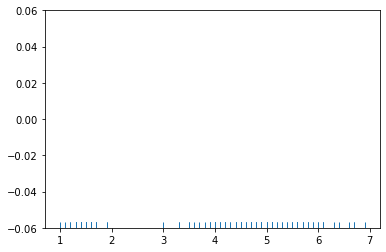
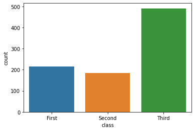
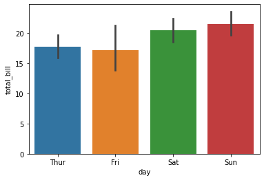

```python
'A'<'B'
'A'<'Z'
'a'>'z'
'a'>'Z'
```


    True


```python
ord('A')
```


    65


```python
chr(ord('A'))
```


    'A'


```python
def cw(n, w):
    lis=[]
    s="ABCDEFGHIJKLMNOPQRSTUVWXYZ"
    for i in range(len(w)): #0, 1, 2
        lis.append(s.index(w[i]))
        
    res=""
    for i in lis:
        #if
        try:
            res+=s[i+n]
        #else
        except:
            res+=s[i+n-len(s)] # s[23+5-26] => S[2] 
    
    return res

print(cw(5,"CAT"))
```

    HFY
    


```python
from collections import Counter

mix = ''
for i in range(1,1001):
    mix += str(i)
#print(mix)
Counter(mix)
```


    Counter({'1': 301,
             '2': 300,
             '3': 300,
             '4': 300,
             '5': 300,
             '6': 300,
             '7': 300,
             '8': 300,
             '9': 300,
             '0': 192})


```python
key_input = input("암호 숫자 키 입력 : ")
str_input = input("암호화할 문자 입력 :")

result = ""
for n in str_input : 
    temp = ord(n) + (int)(key_input)
    result = result + chr(temp)

print(result)
```

    암호 숫자 키 입력 : 5
    암호화할 문자 입력 :CAX
    HF]
    


```python
#seaborn
#seaborn.pydata.org
import seaborn as sns
```


```python
iris=sns.load_dataset('iris')
titanic=sns.load_dataset('titanic')
tips=sns.load_dataset('tips')
flights=sns.load_dataset('flights')
flights

#year열 종류?
flights.year.unique()
flights['year'].unique()
set(flights['year'])
flights.year.value_counts()

flights.month.unique()

flights

#year별 승객수
flights.groupby("year")["passengers"].sum()

```


    year
    1949    1520
    1950    1676
    1951    2042
    1952    2364
    1953    2700
    1954    2867
    1955    3408
    1956    3939
    1957    4421
    1958    4572
    1959    5140
    1960    5714
    Name: passengers, dtype: int64


```python
x=iris.petal_length.values
```


```python
x
```


    array([1.4, 1.4, 1.3, 1.5, 1.4, 1.7, 1.4, 1.5, 1.4, 1.5, 1.5, 1.6, 1.4,
           1.1, 1.2, 1.5, 1.3, 1.4, 1.7, 1.5, 1.7, 1.5, 1. , 1.7, 1.9, 1.6,
           1.6, 1.5, 1.4, 1.6, 1.6, 1.5, 1.5, 1.4, 1.5, 1.2, 1.3, 1.4, 1.3,
           1.5, 1.3, 1.3, 1.3, 1.6, 1.9, 1.4, 1.6, 1.4, 1.5, 1.4, 4.7, 4.5,
           4.9, 4. , 4.6, 4.5, 4.7, 3.3, 4.6, 3.9, 3.5, 4.2, 4. , 4.7, 3.6,
           4.4, 4.5, 4.1, 4.5, 3.9, 4.8, 4. , 4.9, 4.7, 4.3, 4.4, 4.8, 5. ,
           4.5, 3.5, 3.8, 3.7, 3.9, 5.1, 4.5, 4.5, 4.7, 4.4, 4.1, 4. , 4.4,
           4.6, 4. , 3.3, 4.2, 4.2, 4.2, 4.3, 3. , 4.1, 6. , 5.1, 5.9, 5.6,
           5.8, 6.6, 4.5, 6.3, 5.8, 6.1, 5.1, 5.3, 5.5, 5. , 5.1, 5.3, 5.5,
           6.7, 6.9, 5. , 5.7, 4.9, 6.7, 4.9, 5.7, 6. , 4.8, 4.9, 5.6, 5.8,
           6.1, 6.4, 5.6, 5.1, 5.6, 6.1, 5.6, 5.5, 4.8, 5.4, 5.6, 5.1, 5.1,
           5.9, 5.7, 5.2, 5. , 5.2, 5.4, 5.1])


```python
sns.rugplot(x)
```


    <AxesSubplot:>


    

    


```python
sns.kdeplot(x)
```


    <AxesSubplot:ylabel='Density'>


    

    


```python
sns.distplot(x)
```

    C:\Users\campusseven05\anaconda3\lib\site-packages\seaborn\distributions.py:2557: FutureWarning: `distplot` is a deprecated function and will be removed in a future version. Please adapt your code to use either `displot` (a figure-level function with similar flexibility) or `histplot` (an axes-level function for histograms).
      warnings.warn(msg, FutureWarning)
    


    <AxesSubplot:ylabel='Density'>


    

    


```python
sns.distplot(x, rug=True)
```

    C:\Users\campusseven05\anaconda3\lib\site-packages\seaborn\distributions.py:2557: FutureWarning: `distplot` is a deprecated function and will be removed in a future version. Please adapt your code to use either `displot` (a figure-level function with similar flexibility) or `histplot` (an axes-level function for histograms).
      warnings.warn(msg, FutureWarning)
    C:\Users\campusseven05\anaconda3\lib\site-packages\seaborn\distributions.py:2056: FutureWarning: The `axis` variable is no longer used and will be removed. Instead, assign variables directly to `x` or `y`.
      warnings.warn(msg, FutureWarning)
    


    <AxesSubplot:ylabel='Density'>


    

    


```python
#countplot : 종류별로 데이터가 얼마나 있는지 출력
```


```python
sns.countplot(x='class', data=titanic)
```


    <AxesSubplot:xlabel='class', ylabel='count'>


    

    


```python
#titanic.info()
```

    <class 'pandas.core.frame.DataFrame'>
    RangeIndex: 891 entries, 0 to 890
    Data columns (total 15 columns):
     #   Column       Non-Null Count  Dtype   
    ---  ------       --------------  -----   
     0   survived     891 non-null    int64   
     1   pclass       891 non-null    int64   
     2   sex          891 non-null    object  
     3   age          714 non-null    float64 
     4   sibsp        891 non-null    int64   
     5   parch        891 non-null    int64   
     6   fare         891 non-null    float64 
     7   embarked     889 non-null    object  
     8   class        891 non-null    category
     9   who          891 non-null    object  
     10  adult_male   891 non-null    bool    
     11  deck         203 non-null    category
     12  embark_town  889 non-null    object  
     13  alive        891 non-null    object  
     14  alone        891 non-null    bool    
    dtypes: bool(2), category(2), float64(2), int64(4), object(5)
    memory usage: 80.7+ KB
    


```python
titanic.head()
```


<div>
<style scoped>
    .dataframe tbody tr th:only-of-type {
        vertical-align: middle;
    }

    .dataframe tbody tr th {
        vertical-align: top;
    }

    .dataframe thead th {
        text-align: right;
    }
</style>
<table border="1" class="dataframe">
  <thead>
    <tr style="text-align: right;">
      <th></th>
      <th>survived</th>
      <th>pclass</th>
      <th>sex</th>
      <th>age</th>
      <th>sibsp</th>
      <th>parch</th>
      <th>fare</th>
      <th>embarked</th>
      <th>class</th>
      <th>who</th>
      <th>adult_male</th>
      <th>deck</th>
      <th>embark_town</th>
      <th>alive</th>
      <th>alone</th>
    </tr>
  </thead>
  <tbody>
    <tr>
      <th>0</th>
      <td>0</td>
      <td>3</td>
      <td>male</td>
      <td>22.0</td>
      <td>1</td>
      <td>0</td>
      <td>7.2500</td>
      <td>S</td>
      <td>Third</td>
      <td>man</td>
      <td>True</td>
      <td>NaN</td>
      <td>Southampton</td>
      <td>no</td>
      <td>False</td>
    </tr>
    <tr>
      <th>1</th>
      <td>1</td>
      <td>1</td>
      <td>female</td>
      <td>38.0</td>
      <td>1</td>
      <td>0</td>
      <td>71.2833</td>
      <td>C</td>
      <td>First</td>
      <td>woman</td>
      <td>False</td>
      <td>C</td>
      <td>Cherbourg</td>
      <td>yes</td>
      <td>False</td>
    </tr>
    <tr>
      <th>2</th>
      <td>1</td>
      <td>3</td>
      <td>female</td>
      <td>26.0</td>
      <td>0</td>
      <td>0</td>
      <td>7.9250</td>
      <td>S</td>
      <td>Third</td>
      <td>woman</td>
      <td>False</td>
      <td>NaN</td>
      <td>Southampton</td>
      <td>yes</td>
      <td>True</td>
    </tr>
    <tr>
      <th>3</th>
      <td>1</td>
      <td>1</td>
      <td>female</td>
      <td>35.0</td>
      <td>1</td>
      <td>0</td>
      <td>53.1000</td>
      <td>S</td>
      <td>First</td>
      <td>woman</td>
      <td>False</td>
      <td>C</td>
      <td>Southampton</td>
      <td>yes</td>
      <td>False</td>
    </tr>
    <tr>
      <th>4</th>
      <td>0</td>
      <td>3</td>
      <td>male</td>
      <td>35.0</td>
      <td>0</td>
      <td>0</td>
      <td>8.0500</td>
      <td>S</td>
      <td>Third</td>
      <td>man</td>
      <td>True</td>
      <td>NaN</td>
      <td>Southampton</td>
      <td>no</td>
      <td>True</td>
    </tr>
  </tbody>
</table>
</div>


```python

```


```python
tips
#요일별로 팁을 준 횟수
```


<div>
<style scoped>
    .dataframe tbody tr th:only-of-type {
        vertical-align: middle;
    }

    .dataframe tbody tr th {
        vertical-align: top;
    }

    .dataframe thead th {
        text-align: right;
    }
</style>
<table border="1" class="dataframe">
  <thead>
    <tr style="text-align: right;">
      <th></th>
      <th>total_bill</th>
      <th>tip</th>
      <th>sex</th>
      <th>smoker</th>
      <th>day</th>
      <th>time</th>
      <th>size</th>
    </tr>
  </thead>
  <tbody>
    <tr>
      <th>0</th>
      <td>16.99</td>
      <td>1.01</td>
      <td>Female</td>
      <td>No</td>
      <td>Sun</td>
      <td>Dinner</td>
      <td>2</td>
    </tr>
    <tr>
      <th>1</th>
      <td>10.34</td>
      <td>1.66</td>
      <td>Male</td>
      <td>No</td>
      <td>Sun</td>
      <td>Dinner</td>
      <td>3</td>
    </tr>
    <tr>
      <th>2</th>
      <td>21.01</td>
      <td>3.50</td>
      <td>Male</td>
      <td>No</td>
      <td>Sun</td>
      <td>Dinner</td>
      <td>3</td>
    </tr>
    <tr>
      <th>3</th>
      <td>23.68</td>
      <td>3.31</td>
      <td>Male</td>
      <td>No</td>
      <td>Sun</td>
      <td>Dinner</td>
      <td>2</td>
    </tr>
    <tr>
      <th>4</th>
      <td>24.59</td>
      <td>3.61</td>
      <td>Female</td>
      <td>No</td>
      <td>Sun</td>
      <td>Dinner</td>
      <td>4</td>
    </tr>
    <tr>
      <th>...</th>
      <td>...</td>
      <td>...</td>
      <td>...</td>
      <td>...</td>
      <td>...</td>
      <td>...</td>
      <td>...</td>
    </tr>
    <tr>
      <th>239</th>
      <td>29.03</td>
      <td>5.92</td>
      <td>Male</td>
      <td>No</td>
      <td>Sat</td>
      <td>Dinner</td>
      <td>3</td>
    </tr>
    <tr>
      <th>240</th>
      <td>27.18</td>
      <td>2.00</td>
      <td>Female</td>
      <td>Yes</td>
      <td>Sat</td>
      <td>Dinner</td>
      <td>2</td>
    </tr>
    <tr>
      <th>241</th>
      <td>22.67</td>
      <td>2.00</td>
      <td>Male</td>
      <td>Yes</td>
      <td>Sat</td>
      <td>Dinner</td>
      <td>2</td>
    </tr>
    <tr>
      <th>242</th>
      <td>17.82</td>
      <td>1.75</td>
      <td>Male</td>
      <td>No</td>
      <td>Sat</td>
      <td>Dinner</td>
      <td>2</td>
    </tr>
    <tr>
      <th>243</th>
      <td>18.78</td>
      <td>3.00</td>
      <td>Female</td>
      <td>No</td>
      <td>Thur</td>
      <td>Dinner</td>
      <td>2</td>
    </tr>
  </tbody>
</table>
<p>244 rows × 7 columns</p>
</div>


```python

```


```python
sns.countplot(x = 'day', data = tips)
```


    <AxesSubplot:xlabel='day', ylabel='count'>


    

    


```python
tips.groupby('day')['tip'].value_counts()
tips.groupby('day').day.count()

```


    day
    Thur    62
    Fri     19
    Sat     87
    Sun     76
    Name: day, dtype: int64


```python

```


```python
#다차원 데이터 시각화
#스캐터플랏(jointplot) : 2차원, 실수형
```


```python
sns.jointplot(x='sepal_length' ,y='sepal_width', data=iris)
```


    <seaborn.axisgrid.JointGrid at 0x26cd5f4d9a0>


    

    


```python
sns.jointplot(x='sepal_length' ,y='sepal_width', data=iris, kind='kde')
```


    <seaborn.axisgrid.JointGrid at 0x26cd5f44640>


    

    


```python
#pairplot : 다차원 데이터 시각화
sns.pairplot(iris)
```


    <seaborn.axisgrid.PairGrid at 0x26cd683a910>


    

    


```python
sns.pairplot(iris, hue='species')
```


    <seaborn.axisgrid.PairGrid at 0x26cd6ffcf10>


    

    


```python
iris.corr()
```


<div>
<style scoped>
    .dataframe tbody tr th:only-of-type {
        vertical-align: middle;
    }

    .dataframe tbody tr th {
        vertical-align: top;
    }

    .dataframe thead th {
        text-align: right;
    }
</style>
<table border="1" class="dataframe">
  <thead>
    <tr style="text-align: right;">
      <th></th>
      <th>sepal_length</th>
      <th>sepal_width</th>
      <th>petal_length</th>
      <th>petal_width</th>
    </tr>
  </thead>
  <tbody>
    <tr>
      <th>sepal_length</th>
      <td>1.000000</td>
      <td>-0.117570</td>
      <td>0.871754</td>
      <td>0.817941</td>
    </tr>
    <tr>
      <th>sepal_width</th>
      <td>-0.117570</td>
      <td>1.000000</td>
      <td>-0.428440</td>
      <td>-0.366126</td>
    </tr>
    <tr>
      <th>petal_length</th>
      <td>0.871754</td>
      <td>-0.428440</td>
      <td>1.000000</td>
      <td>0.962865</td>
    </tr>
    <tr>
      <th>petal_width</th>
      <td>0.817941</td>
      <td>-0.366126</td>
      <td>0.962865</td>
      <td>1.000000</td>
    </tr>
  </tbody>
</table>
</div>


```python
#히트맵(열지도) : 2차원 데이터, 카테고리 형태
```


```python
# data=titanic[['survived', 'pclass']]
# data

#히트맵을 그리기 위해 데이터프레임 재구성
data=titanic.pivot_table(index='survived', columns='pclass', aggfunc='size')
sns.heatmap(data)
```


    <AxesSubplot:xlabel='pclass', ylabel='survived'>


    

    


```python
#sns.heatmap(data)
```


```python
sns.heatmap(data, cmap=sns.light_palette('gray'), annot=True, fmt='d')

```


    <AxesSubplot:xlabel='pclass', ylabel='survived'>


    

    


```python
#실수, 종류가 섞여있는 데이터
#barplot, boxplot, pointplot, violinplot, stripplot, swarmplot
```


```python
tips
# 요일별로 total_bill의 평균
tips.groupby("day")["total_bill"].mean()

# 요일별로 tip의 합계
```


    day
    Thur    17.682742
    Fri     17.151579
    Sat     20.441379
    Sun     21.410000
    Name: total_bill, dtype: float64


```python
sns.barplot(x='day', y='total_bill', data=tips)
```


    <AxesSubplot:xlabel='day', ylabel='total_bill'>


    

    


```python
sns.boxplot(x='day' ,y='total_bill' , data=tips)
```


    <AxesSubplot:xlabel='day', ylabel='total_bill'>


    

    


```python
sns.violinplot(x='day' ,y='total_bill' , data=tips)
```


    <AxesSubplot:xlabel='day', ylabel='total_bill'>


    

    


```python
sns.stripplot(x='day' ,y='total_bill' , data=tips)
```


    <AxesSubplot:xlabel='day', ylabel='total_bill'>


    

    


```python
sns.stripplot(x='day' ,y='total_bill' , data=tips, jitter=True)
```


    <AxesSubplot:xlabel='day', ylabel='total_bill'>


    

    


```python
sns.swarmplot(x='day' ,y='total_bill' , data=tips)
```


    <AxesSubplot:xlabel='day', ylabel='total_bill'>


    

    


```python
sns.barplot(x="day", y="total_bill", hue="sex", data=tips)
#tips 데이터셋에서 요일별로 성별에 따른 total_bill의 평균을 시각화
```


    <AxesSubplot:xlabel='day', ylabel='total_bill'>


    

    


```python
sns.boxplot(x="day", y="total_bill", hue="sex", data=tips)

```


    <AxesSubplot:xlabel='day', ylabel='total_bill'>


    

    


```python
sns.violinplot(x="day", y="total_bill", hue="sex", data=tips)

```


    <AxesSubplot:xlabel='day', ylabel='total_bill'>


    

    


```python
#연도별 월별 승객수에 대한 히트맵 작성
flights
```


<div>
<style scoped>
    .dataframe tbody tr th:only-of-type {
        vertical-align: middle;
    }

    .dataframe tbody tr th {
        vertical-align: top;
    }

    .dataframe thead th {
        text-align: right;
    }
</style>
<table border="1" class="dataframe">
  <thead>
    <tr style="text-align: right;">
      <th></th>
      <th>year</th>
      <th>month</th>
      <th>passengers</th>
    </tr>
  </thead>
  <tbody>
    <tr>
      <th>0</th>
      <td>1949</td>
      <td>Jan</td>
      <td>112</td>
    </tr>
    <tr>
      <th>1</th>
      <td>1949</td>
      <td>Feb</td>
      <td>118</td>
    </tr>
    <tr>
      <th>2</th>
      <td>1949</td>
      <td>Mar</td>
      <td>132</td>
    </tr>
    <tr>
      <th>3</th>
      <td>1949</td>
      <td>Apr</td>
      <td>129</td>
    </tr>
    <tr>
      <th>4</th>
      <td>1949</td>
      <td>May</td>
      <td>121</td>
    </tr>
    <tr>
      <th>...</th>
      <td>...</td>
      <td>...</td>
      <td>...</td>
    </tr>
    <tr>
      <th>139</th>
      <td>1960</td>
      <td>Aug</td>
      <td>606</td>
    </tr>
    <tr>
      <th>140</th>
      <td>1960</td>
      <td>Sep</td>
      <td>508</td>
    </tr>
    <tr>
      <th>141</th>
      <td>1960</td>
      <td>Oct</td>
      <td>461</td>
    </tr>
    <tr>
      <th>142</th>
      <td>1960</td>
      <td>Nov</td>
      <td>390</td>
    </tr>
    <tr>
      <th>143</th>
      <td>1960</td>
      <td>Dec</td>
      <td>432</td>
    </tr>
  </tbody>
</table>
<p>144 rows × 3 columns</p>
</div>


```python
work_df = flights.pivot_table(index='year', columns='month')
```


```python
work_df
```


<div>
<style scoped>
    .dataframe tbody tr th:only-of-type {
        vertical-align: middle;
    }

    .dataframe tbody tr th {
        vertical-align: top;
    }

    .dataframe thead tr th {
        text-align: left;
    }

    .dataframe thead tr:last-of-type th {
        text-align: right;
    }
</style>
<table border="1" class="dataframe">
  <thead>
    <tr>
      <th></th>
      <th colspan="12" halign="left">passengers</th>
    </tr>
    <tr>
      <th>month</th>
      <th>Jan</th>
      <th>Feb</th>
      <th>Mar</th>
      <th>Apr</th>
      <th>May</th>
      <th>Jun</th>
      <th>Jul</th>
      <th>Aug</th>
      <th>Sep</th>
      <th>Oct</th>
      <th>Nov</th>
      <th>Dec</th>
    </tr>
    <tr>
      <th>year</th>
      <th></th>
      <th></th>
      <th></th>
      <th></th>
      <th></th>
      <th></th>
      <th></th>
      <th></th>
      <th></th>
      <th></th>
      <th></th>
      <th></th>
    </tr>
  </thead>
  <tbody>
    <tr>
      <th>1949</th>
      <td>112</td>
      <td>118</td>
      <td>132</td>
      <td>129</td>
      <td>121</td>
      <td>135</td>
      <td>148</td>
      <td>148</td>
      <td>136</td>
      <td>119</td>
      <td>104</td>
      <td>118</td>
    </tr>
    <tr>
      <th>1950</th>
      <td>115</td>
      <td>126</td>
      <td>141</td>
      <td>135</td>
      <td>125</td>
      <td>149</td>
      <td>170</td>
      <td>170</td>
      <td>158</td>
      <td>133</td>
      <td>114</td>
      <td>140</td>
    </tr>
    <tr>
      <th>1951</th>
      <td>145</td>
      <td>150</td>
      <td>178</td>
      <td>163</td>
      <td>172</td>
      <td>178</td>
      <td>199</td>
      <td>199</td>
      <td>184</td>
      <td>162</td>
      <td>146</td>
      <td>166</td>
    </tr>
    <tr>
      <th>1952</th>
      <td>171</td>
      <td>180</td>
      <td>193</td>
      <td>181</td>
      <td>183</td>
      <td>218</td>
      <td>230</td>
      <td>242</td>
      <td>209</td>
      <td>191</td>
      <td>172</td>
      <td>194</td>
    </tr>
    <tr>
      <th>1953</th>
      <td>196</td>
      <td>196</td>
      <td>236</td>
      <td>235</td>
      <td>229</td>
      <td>243</td>
      <td>264</td>
      <td>272</td>
      <td>237</td>
      <td>211</td>
      <td>180</td>
      <td>201</td>
    </tr>
    <tr>
      <th>1954</th>
      <td>204</td>
      <td>188</td>
      <td>235</td>
      <td>227</td>
      <td>234</td>
      <td>264</td>
      <td>302</td>
      <td>293</td>
      <td>259</td>
      <td>229</td>
      <td>203</td>
      <td>229</td>
    </tr>
    <tr>
      <th>1955</th>
      <td>242</td>
      <td>233</td>
      <td>267</td>
      <td>269</td>
      <td>270</td>
      <td>315</td>
      <td>364</td>
      <td>347</td>
      <td>312</td>
      <td>274</td>
      <td>237</td>
      <td>278</td>
    </tr>
    <tr>
      <th>1956</th>
      <td>284</td>
      <td>277</td>
      <td>317</td>
      <td>313</td>
      <td>318</td>
      <td>374</td>
      <td>413</td>
      <td>405</td>
      <td>355</td>
      <td>306</td>
      <td>271</td>
      <td>306</td>
    </tr>
    <tr>
      <th>1957</th>
      <td>315</td>
      <td>301</td>
      <td>356</td>
      <td>348</td>
      <td>355</td>
      <td>422</td>
      <td>465</td>
      <td>467</td>
      <td>404</td>
      <td>347</td>
      <td>305</td>
      <td>336</td>
    </tr>
    <tr>
      <th>1958</th>
      <td>340</td>
      <td>318</td>
      <td>362</td>
      <td>348</td>
      <td>363</td>
      <td>435</td>
      <td>491</td>
      <td>505</td>
      <td>404</td>
      <td>359</td>
      <td>310</td>
      <td>337</td>
    </tr>
    <tr>
      <th>1959</th>
      <td>360</td>
      <td>342</td>
      <td>406</td>
      <td>396</td>
      <td>420</td>
      <td>472</td>
      <td>548</td>
      <td>559</td>
      <td>463</td>
      <td>407</td>
      <td>362</td>
      <td>405</td>
    </tr>
    <tr>
      <th>1960</th>
      <td>417</td>
      <td>391</td>
      <td>419</td>
      <td>461</td>
      <td>472</td>
      <td>535</td>
      <td>622</td>
      <td>606</td>
      <td>508</td>
      <td>461</td>
      <td>390</td>
      <td>432</td>
    </tr>
  </tbody>
</table>
</div>


```python
sns.heatmap(work_df, xticklabels='month', yticklabels='year', annot=True)

```


    <AxesSubplot:xlabel='None-month', ylabel='year'>


    

    


```python
data = flights.pivot_table(index='year', columns='month', aggfunc='size')

```


```python
data
```


<div>
<style scoped>
    .dataframe tbody tr th:only-of-type {
        vertical-align: middle;
    }

    .dataframe tbody tr th {
        vertical-align: top;
    }

    .dataframe thead th {
        text-align: right;
    }
</style>
<table border="1" class="dataframe">
  <thead>
    <tr style="text-align: right;">
      <th>month</th>
      <th>Jan</th>
      <th>Feb</th>
      <th>Mar</th>
      <th>Apr</th>
      <th>May</th>
      <th>Jun</th>
      <th>Jul</th>
      <th>Aug</th>
      <th>Sep</th>
      <th>Oct</th>
      <th>Nov</th>
      <th>Dec</th>
    </tr>
    <tr>
      <th>year</th>
      <th></th>
      <th></th>
      <th></th>
      <th></th>
      <th></th>
      <th></th>
      <th></th>
      <th></th>
      <th></th>
      <th></th>
      <th></th>
      <th></th>
    </tr>
  </thead>
  <tbody>
    <tr>
      <th>1949</th>
      <td>1</td>
      <td>1</td>
      <td>1</td>
      <td>1</td>
      <td>1</td>
      <td>1</td>
      <td>1</td>
      <td>1</td>
      <td>1</td>
      <td>1</td>
      <td>1</td>
      <td>1</td>
    </tr>
    <tr>
      <th>1950</th>
      <td>1</td>
      <td>1</td>
      <td>1</td>
      <td>1</td>
      <td>1</td>
      <td>1</td>
      <td>1</td>
      <td>1</td>
      <td>1</td>
      <td>1</td>
      <td>1</td>
      <td>1</td>
    </tr>
    <tr>
      <th>1951</th>
      <td>1</td>
      <td>1</td>
      <td>1</td>
      <td>1</td>
      <td>1</td>
      <td>1</td>
      <td>1</td>
      <td>1</td>
      <td>1</td>
      <td>1</td>
      <td>1</td>
      <td>1</td>
    </tr>
    <tr>
      <th>1952</th>
      <td>1</td>
      <td>1</td>
      <td>1</td>
      <td>1</td>
      <td>1</td>
      <td>1</td>
      <td>1</td>
      <td>1</td>
      <td>1</td>
      <td>1</td>
      <td>1</td>
      <td>1</td>
    </tr>
    <tr>
      <th>1953</th>
      <td>1</td>
      <td>1</td>
      <td>1</td>
      <td>1</td>
      <td>1</td>
      <td>1</td>
      <td>1</td>
      <td>1</td>
      <td>1</td>
      <td>1</td>
      <td>1</td>
      <td>1</td>
    </tr>
    <tr>
      <th>1954</th>
      <td>1</td>
      <td>1</td>
      <td>1</td>
      <td>1</td>
      <td>1</td>
      <td>1</td>
      <td>1</td>
      <td>1</td>
      <td>1</td>
      <td>1</td>
      <td>1</td>
      <td>1</td>
    </tr>
    <tr>
      <th>1955</th>
      <td>1</td>
      <td>1</td>
      <td>1</td>
      <td>1</td>
      <td>1</td>
      <td>1</td>
      <td>1</td>
      <td>1</td>
      <td>1</td>
      <td>1</td>
      <td>1</td>
      <td>1</td>
    </tr>
    <tr>
      <th>1956</th>
      <td>1</td>
      <td>1</td>
      <td>1</td>
      <td>1</td>
      <td>1</td>
      <td>1</td>
      <td>1</td>
      <td>1</td>
      <td>1</td>
      <td>1</td>
      <td>1</td>
      <td>1</td>
    </tr>
    <tr>
      <th>1957</th>
      <td>1</td>
      <td>1</td>
      <td>1</td>
      <td>1</td>
      <td>1</td>
      <td>1</td>
      <td>1</td>
      <td>1</td>
      <td>1</td>
      <td>1</td>
      <td>1</td>
      <td>1</td>
    </tr>
    <tr>
      <th>1958</th>
      <td>1</td>
      <td>1</td>
      <td>1</td>
      <td>1</td>
      <td>1</td>
      <td>1</td>
      <td>1</td>
      <td>1</td>
      <td>1</td>
      <td>1</td>
      <td>1</td>
      <td>1</td>
    </tr>
    <tr>
      <th>1959</th>
      <td>1</td>
      <td>1</td>
      <td>1</td>
      <td>1</td>
      <td>1</td>
      <td>1</td>
      <td>1</td>
      <td>1</td>
      <td>1</td>
      <td>1</td>
      <td>1</td>
      <td>1</td>
    </tr>
    <tr>
      <th>1960</th>
      <td>1</td>
      <td>1</td>
      <td>1</td>
      <td>1</td>
      <td>1</td>
      <td>1</td>
      <td>1</td>
      <td>1</td>
      <td>1</td>
      <td>1</td>
      <td>1</td>
      <td>1</td>
    </tr>
  </tbody>
</table>
</div>


```python
sns.heatmap(data, cmap=sns.light_palette('gray'), annot=True, fmt = 'd')

```


    <AxesSubplot:xlabel='month', ylabel='year'>


    

    


```python
data = flights.pivot_table(index = 'month', columns = 'year', aggfunc = 'sum')

```


```python
data
```


<div>
<style scoped>
    .dataframe tbody tr th:only-of-type {
        vertical-align: middle;
    }

    .dataframe tbody tr th {
        vertical-align: top;
    }

    .dataframe thead tr th {
        text-align: left;
    }

    .dataframe thead tr:last-of-type th {
        text-align: right;
    }
</style>
<table border="1" class="dataframe">
  <thead>
    <tr>
      <th></th>
      <th colspan="12" halign="left">passengers</th>
    </tr>
    <tr>
      <th>year</th>
      <th>1949</th>
      <th>1950</th>
      <th>1951</th>
      <th>1952</th>
      <th>1953</th>
      <th>1954</th>
      <th>1955</th>
      <th>1956</th>
      <th>1957</th>
      <th>1958</th>
      <th>1959</th>
      <th>1960</th>
    </tr>
    <tr>
      <th>month</th>
      <th></th>
      <th></th>
      <th></th>
      <th></th>
      <th></th>
      <th></th>
      <th></th>
      <th></th>
      <th></th>
      <th></th>
      <th></th>
      <th></th>
    </tr>
  </thead>
  <tbody>
    <tr>
      <th>Jan</th>
      <td>112</td>
      <td>115</td>
      <td>145</td>
      <td>171</td>
      <td>196</td>
      <td>204</td>
      <td>242</td>
      <td>284</td>
      <td>315</td>
      <td>340</td>
      <td>360</td>
      <td>417</td>
    </tr>
    <tr>
      <th>Feb</th>
      <td>118</td>
      <td>126</td>
      <td>150</td>
      <td>180</td>
      <td>196</td>
      <td>188</td>
      <td>233</td>
      <td>277</td>
      <td>301</td>
      <td>318</td>
      <td>342</td>
      <td>391</td>
    </tr>
    <tr>
      <th>Mar</th>
      <td>132</td>
      <td>141</td>
      <td>178</td>
      <td>193</td>
      <td>236</td>
      <td>235</td>
      <td>267</td>
      <td>317</td>
      <td>356</td>
      <td>362</td>
      <td>406</td>
      <td>419</td>
    </tr>
    <tr>
      <th>Apr</th>
      <td>129</td>
      <td>135</td>
      <td>163</td>
      <td>181</td>
      <td>235</td>
      <td>227</td>
      <td>269</td>
      <td>313</td>
      <td>348</td>
      <td>348</td>
      <td>396</td>
      <td>461</td>
    </tr>
    <tr>
      <th>May</th>
      <td>121</td>
      <td>125</td>
      <td>172</td>
      <td>183</td>
      <td>229</td>
      <td>234</td>
      <td>270</td>
      <td>318</td>
      <td>355</td>
      <td>363</td>
      <td>420</td>
      <td>472</td>
    </tr>
    <tr>
      <th>Jun</th>
      <td>135</td>
      <td>149</td>
      <td>178</td>
      <td>218</td>
      <td>243</td>
      <td>264</td>
      <td>315</td>
      <td>374</td>
      <td>422</td>
      <td>435</td>
      <td>472</td>
      <td>535</td>
    </tr>
    <tr>
      <th>Jul</th>
      <td>148</td>
      <td>170</td>
      <td>199</td>
      <td>230</td>
      <td>264</td>
      <td>302</td>
      <td>364</td>
      <td>413</td>
      <td>465</td>
      <td>491</td>
      <td>548</td>
      <td>622</td>
    </tr>
    <tr>
      <th>Aug</th>
      <td>148</td>
      <td>170</td>
      <td>199</td>
      <td>242</td>
      <td>272</td>
      <td>293</td>
      <td>347</td>
      <td>405</td>
      <td>467</td>
      <td>505</td>
      <td>559</td>
      <td>606</td>
    </tr>
    <tr>
      <th>Sep</th>
      <td>136</td>
      <td>158</td>
      <td>184</td>
      <td>209</td>
      <td>237</td>
      <td>259</td>
      <td>312</td>
      <td>355</td>
      <td>404</td>
      <td>404</td>
      <td>463</td>
      <td>508</td>
    </tr>
    <tr>
      <th>Oct</th>
      <td>119</td>
      <td>133</td>
      <td>162</td>
      <td>191</td>
      <td>211</td>
      <td>229</td>
      <td>274</td>
      <td>306</td>
      <td>347</td>
      <td>359</td>
      <td>407</td>
      <td>461</td>
    </tr>
    <tr>
      <th>Nov</th>
      <td>104</td>
      <td>114</td>
      <td>146</td>
      <td>172</td>
      <td>180</td>
      <td>203</td>
      <td>237</td>
      <td>271</td>
      <td>305</td>
      <td>310</td>
      <td>362</td>
      <td>390</td>
    </tr>
    <tr>
      <th>Dec</th>
      <td>118</td>
      <td>140</td>
      <td>166</td>
      <td>194</td>
      <td>201</td>
      <td>229</td>
      <td>278</td>
      <td>306</td>
      <td>336</td>
      <td>337</td>
      <td>405</td>
      <td>432</td>
    </tr>
  </tbody>
</table>
</div>


```python
sns.heatmap(data, cmap = sns.light_palette('gray'), annot = True, fmt = 'd')

```


    <AxesSubplot:xlabel='None-year', ylabel='month'>


    

    


```python
df=flights.pivot("month", "year","passengers")
df
```


```python
import matplotlib.pyplot as plt
```


```python
plt.figure(figsize=(16,14))
sns.heatmap(df, annot=True, fmt="d", annot_kws={'size':10}, linewidths=1)
```


    <AxesSubplot:xlabel='year', ylabel='month'>


    

    


```python
import pandas as pd
import numpy as np
```


```python
#시계열 그래프
df=pd.DataFrame(np.random.randn(100,3),
            index=pd.date_range('1/1/2021', periods=100),
            columns=['A','B','C'])
```


```python
#pd.date_range('8/25/2021', periods=100)
df
```


<div>
<style scoped>
    .dataframe tbody tr th:only-of-type {
        vertical-align: middle;
    }

    .dataframe tbody tr th {
        vertical-align: top;
    }

    .dataframe thead th {
        text-align: right;
    }
</style>
<table border="1" class="dataframe">
  <thead>
    <tr style="text-align: right;">
      <th></th>
      <th>A</th>
      <th>B</th>
      <th>C</th>
    </tr>
  </thead>
  <tbody>
    <tr>
      <th>2021-01-01</th>
      <td>-0.825056</td>
      <td>0.725440</td>
      <td>0.401512</td>
    </tr>
    <tr>
      <th>2021-01-02</th>
      <td>-0.254863</td>
      <td>-0.158868</td>
      <td>0.363191</td>
    </tr>
    <tr>
      <th>2021-01-03</th>
      <td>2.021190</td>
      <td>-0.031376</td>
      <td>-0.212355</td>
    </tr>
    <tr>
      <th>2021-01-04</th>
      <td>1.200866</td>
      <td>0.401346</td>
      <td>-1.859385</td>
    </tr>
    <tr>
      <th>2021-01-05</th>
      <td>1.301659</td>
      <td>-1.525520</td>
      <td>-0.970260</td>
    </tr>
    <tr>
      <th>...</th>
      <td>...</td>
      <td>...</td>
      <td>...</td>
    </tr>
    <tr>
      <th>2021-04-06</th>
      <td>2.131761</td>
      <td>-0.991647</td>
      <td>0.688595</td>
    </tr>
    <tr>
      <th>2021-04-07</th>
      <td>0.112776</td>
      <td>-2.102066</td>
      <td>-0.646983</td>
    </tr>
    <tr>
      <th>2021-04-08</th>
      <td>2.326470</td>
      <td>-1.296758</td>
      <td>-1.340258</td>
    </tr>
    <tr>
      <th>2021-04-09</th>
      <td>-1.544205</td>
      <td>1.531905</td>
      <td>-1.567620</td>
    </tr>
    <tr>
      <th>2021-04-10</th>
      <td>-1.241688</td>
      <td>-0.347349</td>
      <td>-0.699976</td>
    </tr>
  </tbody>
</table>
<p>100 rows × 3 columns</p>
</div>


```python
df1=df.cumsum()
```


```python
df1.plot()
```


    <AxesSubplot:>


    

    


```python
iris.sepal_length[:20].plot(kind='bar', rot=0)
plt.title("flower")
plt.xlabel("data")
plt.ylabel("length")
```


    Text(0, 0.5, 'length')


    

    


```python
iris.sepal_length[:20]
```


    0     5.1
    1     4.9
    2     4.7
    3     4.6
    4     5.0
    5     5.4
    6     4.6
    7     5.0
    8     4.4
    9     4.9
    10    5.4
    11    4.8
    12    4.8
    13    4.3
    14    5.8
    15    5.7
    16    5.4
    17    5.1
    18    5.7
    19    5.1
    Name: sepal_length, dtype: float64


```python
iris[:5].plot(kind='bar', rot=0)

iris[:5].plot.bar(rot=0)
```


    <AxesSubplot:>


    

    


    

    


```python
#iris에서 각 종별(species) 4개의 feature 각각에대한 평균 -> 막대그래프

# x축 : 3가지 종
# bar그래프(각 종별 4개 feature 평균)

iris.groupby("species").mean().plot(kind="bar", rot=0)

```


    <AxesSubplot:xlabel='species'>


    

    


```python
df2=iris.groupby("species").mean()
df2
```


<div>
<style scoped>
    .dataframe tbody tr th:only-of-type {
        vertical-align: middle;
    }

    .dataframe tbody tr th {
        vertical-align: top;
    }

    .dataframe thead th {
        text-align: right;
    }
</style>
<table border="1" class="dataframe">
  <thead>
    <tr style="text-align: right;">
      <th></th>
      <th>sepal_length</th>
      <th>sepal_width</th>
      <th>petal_length</th>
      <th>petal_width</th>
    </tr>
    <tr>
      <th>species</th>
      <th></th>
      <th></th>
      <th></th>
      <th></th>
    </tr>
  </thead>
  <tbody>
    <tr>
      <th>setosa</th>
      <td>5.006</td>
      <td>3.428</td>
      <td>1.462</td>
      <td>0.246</td>
    </tr>
    <tr>
      <th>versicolor</th>
      <td>5.936</td>
      <td>2.770</td>
      <td>4.260</td>
      <td>1.326</td>
    </tr>
    <tr>
      <th>virginica</th>
      <td>6.588</td>
      <td>2.974</td>
      <td>5.552</td>
      <td>2.026</td>
    </tr>
  </tbody>
</table>
</div>


```python
df2.T.plot.bar()
```


    <AxesSubplot:>


    

    


```python

```


```python
df3=titanic.pclass.value_counts()
df3
```


    3    491
    1    216
    2    184
    Name: pclass, dtype: int64


```python
df3.plot.pie(autopct="%.1f%%", labels=['3','1','2'], startangle=90, colors=['#0000FF', 'silver',' '])
#색상표 키워드 검색
```


    <AxesSubplot:ylabel='pclass'>


    

    


```python
iris.plot.hist()
```


    <AxesSubplot:ylabel='Frequency'>


    

    


```python
iris.plot.kde()
```


    <AxesSubplot:ylabel='Density'>


    

    


```python
iris.plot.box()
```


    <AxesSubplot:>


    

    


```python

```
