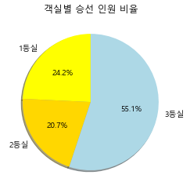
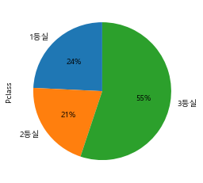

```python
# 1.
def gcd(m, n):
    while n != 0:
        t = m % n
        (m, n) = (n, t)
    return abs(m)


n1, n2 = map(int, input().split())
print("최대공약수 : {0}".format(gcd(n1, n2)))
print("최소공배수 : {0}".format((n1 * n2) // gcd(n1, n2)))
```

    8 6
    최대공약수 : 2
    최소공배수 : 24
    


```python
# 2.
number_count_dict = {}
for number in range(1, 10001):
    cur_number = list(str(number))
    for n in cur_number:
        if n not in number_count_dict:
            number_count_dict[n] = 1
        else:
            number_count_dict[n] += 1

number_count= (sorted(number_count_dict.items(), key=lambda x: x[0]))
for v in number_count:
    print("{0} : {1}개".format(v[0], v[1]))
```

    0 : 2893개
    1 : 4001개
    2 : 4000개
    3 : 4000개
    4 : 4000개
    5 : 4000개
    6 : 4000개
    7 : 4000개
    8 : 4000개
    9 : 4000개
    


```python
# 3.
def caesar_password(word, n):
    ret = ""
    char_list = list(word)
    for c in char_list:
        if ord(c) < ord('a') and ord(c) > ord('Z') - n: 
            ret += chr(ord('A') + ord(c) + n-1 - ord('Z'))
        elif ord(c) > ord('Z') and ord(c) > ord('z') - n:
            ret += chr(ord('a') + ord(c) + n-1 - ord('z'))
        else:
            ret += chr(ord(c) + n)
    return ret


word, n = input().split()
n = int(n)
print(caesar_password(word, n))
```

    CAT 5
    HFY
    


```python
# 4.
import pandas as pd
from collections import Counter
```


```python
titanic = pd.read_csv("../Data/train.csv")
```


```python
number_of_passengers_per_room = Counter(titanic['Pclass'])
```


```python
number_of_passengers_per_room
```


    Counter({3: 491, 1: 216, 2: 184})


```python
import matplotlib
from matplotlib import font_manager, rc
import platform
if platform.system()=="Windows":
    font_name=font_manager.FontProperties(fname="c:/Windows/Fonts/malgun.ttf").get_name()
    rc('font', family=font_name)
matplotlib.rcParams['axes.unicode_minus']=False

import warnings
warnings.filterwarnings("ignore")
```


```python
import matplotlib.pyplot as plt
```


```python
plt.pie([number_of_passengers_per_room[1],
         number_of_passengers_per_room[2],
         number_of_passengers_per_room[3]],
        startangle=90, 
        colors=['yellow', 'gold', 'lightblue'],
      
       shadow=True,
       labels=['1등실','2등실','3등실'],
       autopct="%.1f%%")
plt.title("객실별 승선 인원 비율")
```


    Text(0.5, 1.0, '객실별 승선 인원 비율')


    

    


```python
# 4. Pandas의 Count, Plot
# 데이터 프레임에서 바로 count가 가능하다
number_of_passengers_per_room = titanic.Pclass.value_counts()
number_of_passengers_per_room = number_of_passengers_per_room.sort_index()
number_of_passengers_per_room
```


    1    216
    2    184
    3    491
    Name: Pclass, dtype: int64


```python
# 그리고 이것으로부터 바로 파이를 그릴 수 있다
number_of_passengers_per_room.plot.pie(autopct="%1.f%%", labels=['1등실','2등실','3등실'], startangle=90)
```


    <AxesSubplot:ylabel='Pclass'>


    

    

