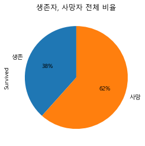
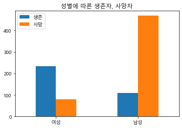
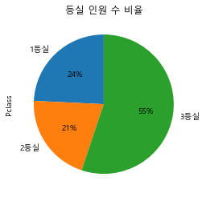
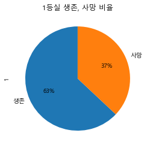
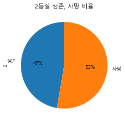
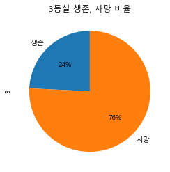
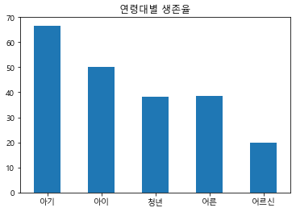
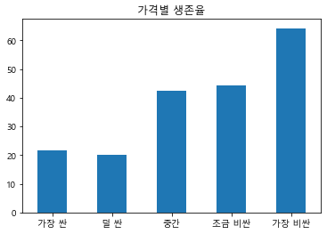
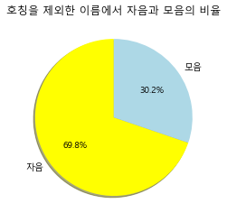
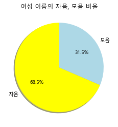

```python
import pandas as pd
import matplotlib.pyplot as plt

```


```python
# 1. Survived 열
# 1.1 
# 생존자 / 사망자 전체 비율
titanic = pd.read_csv('../Data/train.csv')
```


```python
import matplotlib
from matplotlib import font_manager, rc
import platform
if platform.system()=="Windows":
    font_name=font_manager.FontProperties(fname="c:/Windows/Fonts/malgun.ttf").get_name()
    rc('font', family=font_name)
matplotlib.rcParams['axes.unicode_minus']=False

import warnings
warnings.filterwarnings("ignore")
```


```python
survived = titanic.Survived.value_counts()
survived = survived.sort_index(ascending=False)
```


```python
# 1.1 
# 생존자 / 사망자 전체 비율
survived.plot.pie(autopct="%1.f%%", labels=['생존', '사망'], startangle=90)
plt.title("생존자, 사망자 전체 비율")
```


    Text(0.5, 1.0, '생존자, 사망자 전체 비율')


    

    


```python
# 1.2
# 성별에 따른 생존자, 사망자
df = titanic.pivot_table(index='Sex', columns='Survived', aggfunc='size')
df = df[[1, 0]]
df.columns = ['생존', '사망']
df.index = ['여성', '남성']
```


```python
# 1.2
# 성별에 따른 생존자, 사망자
df.plot(kind='bar', rot=0)
plt.title("성별에 따른 생존자, 사망자")
```


    Text(0.5, 1.0, '성별에 따른 생존자, 사망자')


    

    


```python
# 2. Pclass 열
# 2.1
# 등실 비율
number_of_passengers_per_room = titanic.Pclass.value_counts()
number_of_passengers_per_room = number_of_passengers_per_room.sort_index()
number_of_passengers_per_room.plot.pie(autopct="%1.f%%", labels=['1등실','2등실','3등실'], startangle=90)
plt.title("등실 인원 수 비율")
```


    Text(0.5, 1.0, '등실 인원 수 비율')


    

    


```python
# 2.2
# 등실에 따른 생존자, 사망자 비율
df = titanic.pivot_table(index='Pclass', columns='Survived', aggfunc='size')
df = df[[1,0]]
df.columns = ['생존', '사망']
```


```python
for i in df.index:
    fig=plt.figure()
    title_name = str(i) + "등실 생존, 사망 비율"
    plt.title(title_name)
    df.loc[i].plot.pie(autopct="%1.f%%", labels=['생존','사망'], startangle=90)
```


    

    


    

    


    

    


```python
# 3. Age 열
# 3.1 
# 나이대를 구분한 후 각 나이대별 생존율

age_group = [0, 3, 16, 35, 70 ,100]
label = ['아기', '아이', '청년', '어른', '어르신']
titanic['연령 구분'] = pd.cut(titanic['Age'], bins=age_group, labels=label)
total = titanic['연령 구분'].value_counts()
total
```


    청년     397
    어른     212
    아이      70
    아기      30
    어르신      5
    Name: 연령 구분, dtype: int64


```python
survivors_by_age = titanic.groupby('연령 구분').Survived.sum()
survivors_by_age
```


    연령 구분
    아기      20
    아이      35
    청년     152
    어른      82
    어르신      1
    Name: Survived, dtype: int64


```python
survival_rate = (survivors_by_age / total) * 100
```


```python
survival_rate
```


    아기     66.666667
    아이     50.000000
    청년     38.287154
    어른     38.679245
    어르신    20.000000
    dtype: float64


```python
age_specific_survival_rate_df = pd.DataFrame(data=survival_rate, index=label, columns=['생존율'])
```


```python
age_specific_survival_rate_df
```


<div>
<style scoped>
    .dataframe tbody tr th:only-of-type {
        vertical-align: middle;
    }

    .dataframe tbody tr th {
        vertical-align: top;
    }

    .dataframe thead th {
        text-align: right;
    }
</style>
<table border="1" class="dataframe">
  <thead>
    <tr style="text-align: right;">
      <th></th>
      <th>생존율</th>
    </tr>
  </thead>
  <tbody>
    <tr>
      <th>아기</th>
      <td>66.666667</td>
    </tr>
    <tr>
      <th>아이</th>
      <td>50.000000</td>
    </tr>
    <tr>
      <th>청년</th>
      <td>38.287154</td>
    </tr>
    <tr>
      <th>어른</th>
      <td>38.679245</td>
    </tr>
    <tr>
      <th>어르신</th>
      <td>20.000000</td>
    </tr>
  </tbody>
</table>
</div>


```python
# 3.1 
# 연령대별 생존율
survival_rate.plot(kind='bar', rot=0)
plt.title("연령대별 생존율")
```


    Text(0.5, 1.0, '연령대별 생존율')


    

    


```python
# 3.2 
# 결측값을 제외한 나머지 데이터에 대해 이상치 검출
age_df = titanic.Age
age_df = age_df[age_df.isna() != True]
age_df = pd.DataFrame(age_df)
age_df.describe()
```


<div>
<style scoped>
    .dataframe tbody tr th:only-of-type {
        vertical-align: middle;
    }

    .dataframe tbody tr th {
        vertical-align: top;
    }

    .dataframe thead th {
        text-align: right;
    }
</style>
<table border="1" class="dataframe">
  <thead>
    <tr style="text-align: right;">
      <th></th>
      <th>Age</th>
    </tr>
  </thead>
  <tbody>
    <tr>
      <th>count</th>
      <td>714.000000</td>
    </tr>
    <tr>
      <th>mean</th>
      <td>29.699118</td>
    </tr>
    <tr>
      <th>std</th>
      <td>14.526497</td>
    </tr>
    <tr>
      <th>min</th>
      <td>0.420000</td>
    </tr>
    <tr>
      <th>25%</th>
      <td>20.125000</td>
    </tr>
    <tr>
      <th>50%</th>
      <td>28.000000</td>
    </tr>
    <tr>
      <th>75%</th>
      <td>38.000000</td>
    </tr>
    <tr>
      <th>max</th>
      <td>80.000000</td>
    </tr>
  </tbody>
</table>
</div>


```python
# 3.2 
Q1 = float(age_df.describe().loc['25%'])
Q3 = float(age_df.describe().loc['75%'])
IQR = float(Q3 - Q1)
Minimum = float(Q1-1.5 * IQR)
Maximum = float(Q3 + 1.5 * IQR)
```


```python
# 3.2 
print("Q1 : {0}".format(Q1))
print("Q3 : {0}".format(Q3))
print("IQR : {0}".format(IQR))
print("Minimun : {0}".format(Minimum))
print("Maximum : {0}".format(Maximum))
```

    Q1 : 20.125
    Q3 : 38.0
    IQR : 17.875
    Minimun : -6.6875
    Maximum : 64.8125
    


```python
# 3.2 
# 결측값을 제외한 나머지 데이터에 대해 이상치 검출
# 이상치 범위 :  Minimum보다 작거나 Maximun 보다 크거나
outliers = age_df[(age_df['Age'] < Minimum) | (age_df['Age'] > Maximum)]
outliers.columns = ['Age열 이상치'] 
outliers
```


<div>
<style scoped>
    .dataframe tbody tr th:only-of-type {
        vertical-align: middle;
    }

    .dataframe tbody tr th {
        vertical-align: top;
    }

    .dataframe thead th {
        text-align: right;
    }
</style>
<table border="1" class="dataframe">
  <thead>
    <tr style="text-align: right;">
      <th></th>
      <th>Age열 이상치</th>
    </tr>
  </thead>
  <tbody>
    <tr>
      <th>33</th>
      <td>66.0</td>
    </tr>
    <tr>
      <th>54</th>
      <td>65.0</td>
    </tr>
    <tr>
      <th>96</th>
      <td>71.0</td>
    </tr>
    <tr>
      <th>116</th>
      <td>70.5</td>
    </tr>
    <tr>
      <th>280</th>
      <td>65.0</td>
    </tr>
    <tr>
      <th>456</th>
      <td>65.0</td>
    </tr>
    <tr>
      <th>493</th>
      <td>71.0</td>
    </tr>
    <tr>
      <th>630</th>
      <td>80.0</td>
    </tr>
    <tr>
      <th>672</th>
      <td>70.0</td>
    </tr>
    <tr>
      <th>745</th>
      <td>70.0</td>
    </tr>
    <tr>
      <th>851</th>
      <td>74.0</td>
    </tr>
  </tbody>
</table>
</div>


```python
# 4. Fare 열
# 운임을 전체 5개 구간으로 분리한 후 각 구간별 생존율
titanic['요금 구분'] = pd.qcut(titanic['Fare'], 5, labels=['가장 싼', '덜 싼', '중간', '조금 비싼', '가장 비싼'])
titanic['요금 구분']
total = titanic['요금 구분'].value_counts()
total
```


    덜 싼      184
    조금 비싼    180
    가장 싼     179
    가장 비싼    176
    중간       172
    Name: 요금 구분, dtype: int64


```python
survivors_by_fare = titanic.groupby('요금 구분').Survived.sum()
survivors_by_fare
```


    요금 구분
    가장 싼      39
    덜 싼       37
    중간        73
    조금 비싼     80
    가장 비싼    113
    Name: Survived, dtype: int64


```python
survival_rate_by_price = (survivors_by_fare / total) * 100
survival_rate_by_price
```


    가장 싼     21.787709
    덜 싼      20.108696
    중간       42.441860
    조금 비싼    44.444444
    가장 비싼    64.204545
    dtype: float64


```python
# 4. Fare 열
# 운임 요금 별 생존율
survival_rate_by_price.plot(kind='bar', rot=0)
plt.title("가격별 생존율")
```


    Text(0.5, 1.0, '가격별 생존율')


    

    


```python
# 5. Name
# 5.1 
# 호칭을 제외한 이름에서 자음과 모음의 비율
```


```python
all_title = titanic.Name.str.extract(r'([A-Za-z]+[.])')
all_title.columns = ['Title']
all_title_list = list(all_title['Title'].unique())
all_title_list
```


    ['Mr.',
     'Mrs.',
     'Miss.',
     'Master.',
     'Don.',
     'Rev.',
     'Dr.',
     'Mme.',
     'Ms.',
     'Major.',
     'Lady.',
     'Sir.',
     'Mlle.',
     'Col.',
     'Capt.',
     'Countess.',
     'Jonkheer.']


```python
def delete_title(each_row):
    separated_names = each_row.split()
    temp = ""
    for sn in separated_names:  
        if sn in all_title_list:
            continue
        else:
            temp += sn + " "
    return temp
```


```python
def get_number_of_cons_vowels(sum_of_names):
    char_number_dict = Counter(sum_of_names)
    number_of_consonants = 0
    number_of_vowels = 0
    vowels = ['a','A', 'e', 'E', 'i', 'I', 'o', 'O', 'u', 'U']
    for k,v in char_number_dict.items():
        if k in vowels:
            number_of_vowels += v
        else:
            number_of_consonants += v
    return number_of_consonants, number_of_vowels
```


```python
name_df = titanic['Name']
name_df = name_df.apply(delete_title)
```


```python
sum_of_all_name = name_df.cumsum()[890]
```


```python
from collections import Counter
```


```python
number_of_consonants, number_of_vowels = get_number_of_cons_vowels(sum_of_all_name)
```


```python
# 5.1 
# 호칭을 제외한 이름에서 자음과 모음의 비율
plt.pie([number_of_consonants,number_of_vowels],
        startangle=90, 
        colors=['yellow', 'lightblue'],
       shadow=True,
       labels=['자음','모음'],
       autopct="%.1f%%")
plt.title("호칭을 제외한 이름에서 자음과 모음의 비율")

```


    Text(0.5, 1.0, '호칭을 제외한 이름에서 자음과 모음의 비율')


    

    


```python
# 5.2
# 성별에 따른 자음과 모음의 비율

```


```python
name_sex_df = pd.DataFrame()
name_sex_df['이름'] = titanic['Name']
name_sex_df['성'] = titanic['Sex']
```


```python
name_sex_df['이름'] = name_sex_df['이름'].apply(delete_title)
```


```python
name_sex_df
name_male_df = name_sex_df[name_sex_df['성'] == 'male']
name_female_df = name_sex_df[name_sex_df['성'] == 'female']
```


```python
sum_of_mens_names = name_male_df.cumsum().iloc[-1]['이름']
sum_of_womens_names = name_female_df.cumsum().iloc[-1]['이름']
```


```python
number_of_mens_names_cons, number_of_mens_names_vowels = get_number_of_cons_vowels(sum_of_mens_names)
number_of_womens_names_cons, number_of_womens_names_vowels = get_number_of_cons_vowels(sum_of_womens_names)
```


```python
# 5.2
# 성별에 따른 자음과 모음의 비율
# 남성
plt.pie([number_of_mens_names_cons, number_of_mens_names_vowels],
        startangle=90, 
        colors=['yellow', 'lightblue'],
       shadow=True,
       labels=['자음','모음'],
       autopct="%.1f%%")
plt.title("남성 이름의 자음, 모음 비율")
```


    Text(0.5, 1.0, '남성 이름의 자음, 모음 비율')


    

    


```python
# 5.2
# 성별에 따른 자음과 모음의 비율
# 여성
plt.pie([number_of_womens_names_cons, number_of_womens_names_vowels],
        startangle=90, 
        colors=['yellow', 'lightblue'],
       shadow=True,
       labels=['자음','모음'],
       autopct="%.1f%%")
plt.title("여성 이름의 자음, 모음 비율")
```


    Text(0.5, 1.0, '여성 이름의 자음, 모음 비율')


    

    

