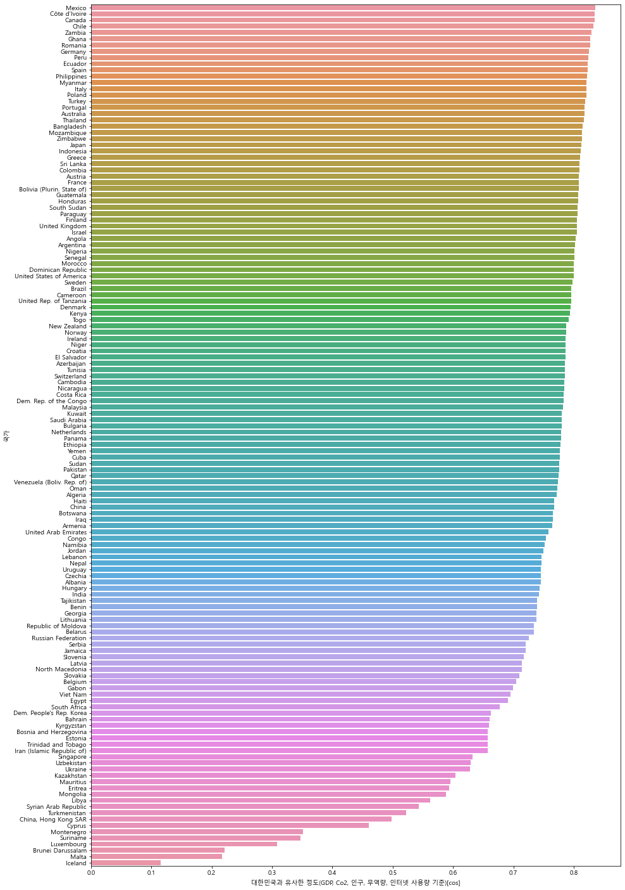
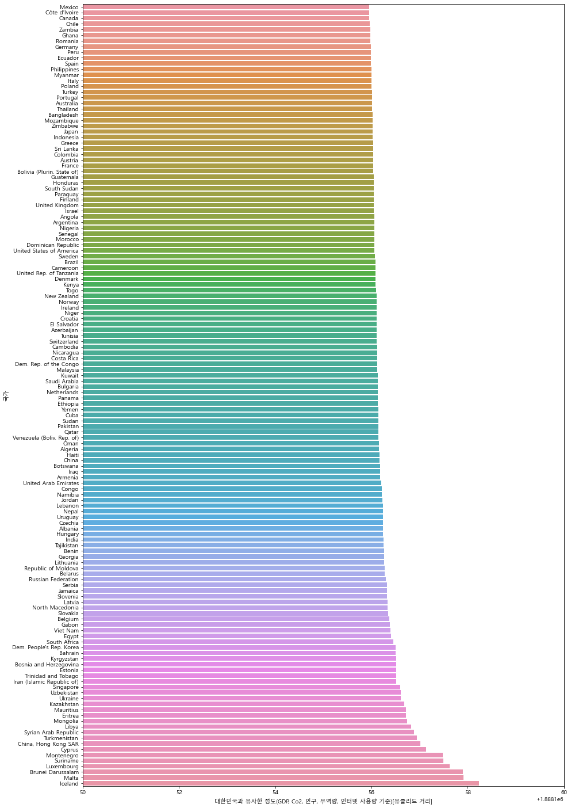

```python
import pandas as pd
import numpy as np
from numpy import dot
from numpy.linalg import norm
```


```python
co2_df = pd.read_csv("./Data/Co2.csv")
gdp_df = pd.read_csv("./Data/GDP.csv")
pop_df = pd.read_csv("./Data/인구.csv")
internet_df = pd.read_csv("./Data/인터넷 사용량.csv")
trade_df = pd.read_csv("./Data/무역.csv")
```


```python
# 각 데이터들에서 공통되는 국가 추출
co2_nation_set = set(co2_df['Nation'].unique())
gdp_nation_set = set(gdp_df['Nation'].unique())
pop_nation_set = set(pop_df['Nation'].unique())
internet_nation_set = set(internet_df['Nation'].unique())
trade_nation_set = set(trade_df['Nation'].unique())
```


```python
common_country = list(co2_nation_set & gdp_nation_set & pop_nation_set & internet_nation_set & trade_nation_set)
common_country.sort()
common_country
```


    ['Albania',
     'Algeria',
     'Angola',
     'Argentina',
     'Armenia',
     'Australia',
     'Austria',
     'Azerbaijan',
     'Bahrain',
     'Bangladesh',
     'Belarus',
     'Belgium',
     'Benin',
     'Bolivia (Plurin. State of)',
     'Bosnia and Herzegovina',
     'Botswana',
     'Brazil',
     'Brunei Darussalam',
     'Bulgaria',
     'Cambodia',
     'Cameroon',
     'Canada',
     'Chile',
     'China',
     'China, Hong Kong SAR',
     'Colombia',
     'Congo',
     'Costa Rica',
     'Croatia',
     'Cuba',
     'Cyprus',
     'Czechia',
     'Côte d’Ivoire',
     "Dem. People's Rep. Korea",
     'Dem. Rep. of the Congo',
     'Denmark',
     'Dominican Republic',
     'Ecuador',
     'Egypt',
     'El Salvador',
     'Eritrea',
     'Estonia',
     'Ethiopia',
     'Finland',
     'France',
     'Gabon',
     'Georgia',
     'Germany',
     'Ghana',
     'Greece',
     'Guatemala',
     'Haiti',
     'Honduras',
     'Hungary',
     'Iceland',
     'India',
     'Indonesia',
     'Iran (Islamic Republic of)',
     'Iraq',
     'Ireland',
     'Israel',
     'Italy',
     'Jamaica',
     'Japan',
     'Jordan',
     'Kazakhstan',
     'Kenya',
     'Kuwait',
     'Kyrgyzstan',
     'Latvia',
     'Lebanon',
     'Libya',
     'Lithuania',
     'Luxembourg',
     'Malaysia',
     'Malta',
     'Mauritius',
     'Mexico',
     'Mongolia',
     'Montenegro',
     'Morocco',
     'Mozambique',
     'Myanmar',
     'Namibia',
     'Nepal',
     'Netherlands',
     'New Zealand',
     'Nicaragua',
     'Niger',
     'Nigeria',
     'North Macedonia',
     'Norway',
     'Oman',
     'Pakistan',
     'Panama',
     'Paraguay',
     'Peru',
     'Philippines',
     'Poland',
     'Portugal',
     'Qatar',
     'Republic of Korea',
     'Republic of Moldova',
     'Romania',
     'Russian Federation',
     'Saudi Arabia',
     'Senegal',
     'Serbia',
     'Singapore',
     'Slovakia',
     'Slovenia',
     'South Africa',
     'South Sudan',
     'Spain',
     'Sri Lanka',
     'Sudan',
     'Suriname',
     'Sweden',
     'Switzerland',
     'Syrian Arab Republic',
     'Tajikistan',
     'Thailand',
     'Togo',
     'Trinidad and Tobago',
     'Tunisia',
     'Turkey',
     'Turkmenistan',
     'Ukraine',
     'United Arab Emirates',
     'United Kingdom',
     'United Rep. of Tanzania',
     'United States of America',
     'Uruguay',
     'Uzbekistan',
     'Venezuela (Boliv. Rep. of)',
     'Viet Nam',
     'Yemen',
     'Zambia',
     'Zimbabwe']


```python
# 모든 데이터에서 공통적이지 않은 국가 제거
co2_drop_list = list(set(co2_df['Nation']) - set(common_country))
gdp_drop_list = list(set(gdp_df['Nation']) - set(common_country))
pop_drop_list = list(set(pop_df['Nation']) - set(common_country))
internet_drop_list = list(set(internet_df['Nation']) - set(common_country))
trade_drop_list = list(set(trade_df['Nation']) - set(common_country))
```


```python
co2_df = co2_df.set_index('Nation')
gdp_df = gdp_df.set_index('Nation')
pop_df = pop_df.set_index('Nation')
internet_df = internet_df.set_index('Nation')
trade_df = trade_df.set_index('Nation')

```


```python
co2_df = co2_df.drop(co2_drop_list)
gdp_df = gdp_df.drop(gdp_drop_list)
pop_df = pop_df.drop(pop_drop_list)
internet_df = internet_df.drop(internet_drop_list)
trade_df = trade_df.drop(trade_drop_list)
```


```python
co2_df = co2_df.reset_index()
gdp_df = gdp_df.reset_index()
pop_df = pop_df.reset_index()
internet_df = internet_df.reset_index()
trade_df = trade_df.reset_index()
```


```python
# 국가를 공통으로 맞춰 놓은 데이터에서 2017 데이터 추출
co2_df = co2_df[co2_df['Year'] == 2017]
gdp_df = gdp_df[gdp_df['Year'] == 2017]
pop_df = pop_df[pop_df['Year'] == 2017]
internet_df = internet_df[internet_df['Year'] == 2017]
trade_df = trade_df[trade_df['Year'] == 2017]

```


```python
# 비교 항목으로 삼을 항목들 선택, 항목 전체를 사용하는 데이터들은 여기서 따로 선택 안해줘도 된다
co2_df = co2_df[co2_df['Series'] == 'Emissions (thousand metric tons of carbon dioxide)']
gdp_df = gdp_df[(gdp_df['Series'] == 'GDP in current prices (millions of US dollars)') |
                (gdp_df['Series'] == 'GDP per capita (US dollars)')]
pop_df = pop_df[(pop_df['Series'] == 'Population mid-year estimates (millions)') | 
                (pop_df['Series'] == 'Population aged 0 to 14 years old (percentage)') | 
                (pop_df['Series'] == 'Population aged 60+ years old (percentage)') |
                (pop_df['Series'] == 'Sex ratio (males per 100 females)')]

```


```python
co2_df = co2_df[['Nation', 'Series', 'Value']]
gdp_df = gdp_df[['Nation', 'Series', 'Value']]
pop_df = pop_df[['Nation', 'Series', 'Value']]
internet_df = internet_df[['Nation', 'Series', 'Value']]
trade_df = trade_df[['Nation', 'Series', 'Value']]

```


```python
#1.
total_df = pd.concat([co2_df, gdp_df, pop_df, internet_df, trade_df], ignore_index=True)
```


```python
#1.
total_df = total_df.sort_values(by=(['Nation', 'Series']))
```


```python
#1.
total_df
```


<div>
<style scoped>
    .dataframe tbody tr th:only-of-type {
        vertical-align: middle;
    }

    .dataframe tbody tr th {
        vertical-align: top;
    }

    .dataframe thead th {
        text-align: right;
    }
</style>
<table border="1" class="dataframe">
  <thead>
    <tr style="text-align: right;">
      <th></th>
      <th>Nation</th>
      <th>Series</th>
      <th>Value</th>
    </tr>
  </thead>
  <tbody>
    <tr>
      <th>0</th>
      <td>Albania</td>
      <td>Balance imports/exports (millions of US dollars)</td>
      <td>-2992.5610</td>
    </tr>
    <tr>
      <th>1</th>
      <td>Albania</td>
      <td>Emissions (thousand metric tons of carbon diox...</td>
      <td>4342.0110</td>
    </tr>
    <tr>
      <th>2</th>
      <td>Albania</td>
      <td>Exports FOB (millions of US dollars)</td>
      <td>2301.3410</td>
    </tr>
    <tr>
      <th>3</th>
      <td>Albania</td>
      <td>GDP in current prices (millions of US dollars)</td>
      <td>13025.0686</td>
    </tr>
    <tr>
      <th>4</th>
      <td>Albania</td>
      <td>GDP per capita (US dollars)</td>
      <td>4516.0560</td>
    </tr>
    <tr>
      <th>...</th>
      <td>...</td>
      <td>...</td>
      <td>...</td>
    </tr>
    <tr>
      <th>1515</th>
      <td>Zimbabwe</td>
      <td>Percentage of individuals using the internet</td>
      <td>27.0555</td>
    </tr>
    <tr>
      <th>1516</th>
      <td>Zimbabwe</td>
      <td>Population aged 0 to 14 years old (percentage)</td>
      <td>42.5979</td>
    </tr>
    <tr>
      <th>1517</th>
      <td>Zimbabwe</td>
      <td>Population aged 60+ years old (percentage)</td>
      <td>4.4723</td>
    </tr>
    <tr>
      <th>1518</th>
      <td>Zimbabwe</td>
      <td>Population mid-year estimates (millions)</td>
      <td>14.2366</td>
    </tr>
    <tr>
      <th>1519</th>
      <td>Zimbabwe</td>
      <td>Sex ratio (males per 100 females)</td>
      <td>90.8508</td>
    </tr>
  </tbody>
</table>
<p>1520 rows × 3 columns</p>
</div>


```python
df_by_pivot_table = total_df.pivot_table(index='Series', columns='Nation')
```


```python
df_by_pivot_table
```


<div>
<style scoped>
    .dataframe tbody tr th:only-of-type {
        vertical-align: middle;
    }

    .dataframe tbody tr th {
        vertical-align: top;
    }

    .dataframe thead tr th {
        text-align: left;
    }

    .dataframe thead tr:last-of-type th {
        text-align: right;
    }
</style>
<table border="1" class="dataframe">
  <thead>
    <tr>
      <th></th>
      <th colspan="21" halign="left">Value</th>
    </tr>
    <tr>
      <th>Nation</th>
      <th>Albania</th>
      <th>Algeria</th>
      <th>Angola</th>
      <th>Argentina</th>
      <th>Armenia</th>
      <th>Australia</th>
      <th>Austria</th>
      <th>Azerbaijan</th>
      <th>Bahrain</th>
      <th>Bangladesh</th>
      <th>...</th>
      <th>United Kingdom</th>
      <th>United Rep. of Tanzania</th>
      <th>United States of America</th>
      <th>Uruguay</th>
      <th>Uzbekistan</th>
      <th>Venezuela (Boliv. Rep. of)</th>
      <th>Viet Nam</th>
      <th>Yemen</th>
      <th>Zambia</th>
      <th>Zimbabwe</th>
    </tr>
    <tr>
      <th>Series</th>
      <th></th>
      <th></th>
      <th></th>
      <th></th>
      <th></th>
      <th></th>
      <th></th>
      <th></th>
      <th></th>
      <th></th>
      <th></th>
      <th></th>
      <th></th>
      <th></th>
      <th></th>
      <th></th>
      <th></th>
      <th></th>
      <th></th>
      <th></th>
      <th></th>
    </tr>
  </thead>
  <tbody>
    <tr>
      <th>Balance imports/exports (millions of US dollars)</th>
      <td>-2992.5610</td>
      <td>-10861.8986</td>
      <td>19442.5676</td>
      <td>-8515.1046</td>
      <td>-1748.4919</td>
      <td>1.389533e+03</td>
      <td>-6504.5502</td>
      <td>6538.2192</td>
      <td>-4905.5288</td>
      <td>-16375.7911</td>
      <td>...</td>
      <td>-1.990604e+05</td>
      <td>-3587.3022</td>
      <td>-8.594670e+05</td>
      <td>-568.4893</td>
      <td>-1955.4771</td>
      <td>4792.0165</td>
      <td>1903.3079</td>
      <td>-2935.5618</td>
      <td>24.8128</td>
      <td>-1481.7208</td>
    </tr>
    <tr>
      <th>Emissions (thousand metric tons of carbon dioxide)</th>
      <td>4342.0110</td>
      <td>130493.6530</td>
      <td>18021.3940</td>
      <td>183375.2030</td>
      <td>5165.5930</td>
      <td>3.845839e+05</td>
      <td>64872.3940</td>
      <td>30805.8510</td>
      <td>29813.8340</td>
      <td>78270.1700</td>
      <td>...</td>
      <td>3.587313e+05</td>
      <td>10131.7900</td>
      <td>4.761302e+06</td>
      <td>5872.9570</td>
      <td>81156.3970</td>
      <td>113717.5430</td>
      <td>191243.6010</td>
      <td>8919.9980</td>
      <td>6007.8720</td>
      <td>9714.9380</td>
    </tr>
    <tr>
      <th>Exports FOB (millions of US dollars)</th>
      <td>2301.3410</td>
      <td>35191.1174</td>
      <td>34904.8811</td>
      <td>58384.1950</td>
      <td>2144.9630</td>
      <td>2.301750e+05</td>
      <td>159971.0000</td>
      <td>15306.0183</td>
      <td>12485.3592</td>
      <td>31366.7383</td>
      <td>...</td>
      <td>4.418470e+05</td>
      <td>4178.1091</td>
      <td>1.545810e+06</td>
      <td>7889.3874</td>
      <td>10079.4710</td>
      <td>11562.8167</td>
      <td>215119.0000</td>
      <td>9.6964</td>
      <td>8006.7895</td>
      <td>3480.3819</td>
    </tr>
    <tr>
      <th>GDP in current prices (millions of US dollars)</th>
      <td>13025.0686</td>
      <td>167389.8904</td>
      <td>122123.8586</td>
      <td>642695.5960</td>
      <td>11527.4587</td>
      <td>1.416105e+06</td>
      <td>418316.1611</td>
      <td>40866.6321</td>
      <td>35432.6664</td>
      <td>245633.4889</td>
      <td>...</td>
      <td>2.666229e+06</td>
      <td>53275.9459</td>
      <td>1.951942e+07</td>
      <td>59530.1014</td>
      <td>59159.9487</td>
      <td>248029.4366</td>
      <td>223779.8661</td>
      <td>24152.0388</td>
      <td>25868.1382</td>
      <td>22040.9023</td>
    </tr>
    <tr>
      <th>GDP per capita (US dollars)</th>
      <td>4516.0560</td>
      <td>4044.2902</td>
      <td>4095.8117</td>
      <td>14627.6156</td>
      <td>3914.5252</td>
      <td>5.760127e+04</td>
      <td>47428.6685</td>
      <td>4150.8688</td>
      <td>23715.4378</td>
      <td>1538.2336</td>
      <td>...</td>
      <td>3.995700e+04</td>
      <td>1002.8216</td>
      <td>6.004411e+04</td>
      <td>17322.1763</td>
      <td>1851.0747</td>
      <td>8435.6627</td>
      <td>2365.5215</td>
      <td>867.6916</td>
      <td>1534.8732</td>
      <td>1548.1864</td>
    </tr>
    <tr>
      <th>Imports CIF (millions of US dollars)</th>
      <td>5293.9019</td>
      <td>46053.0160</td>
      <td>15462.3135</td>
      <td>66899.2996</td>
      <td>3893.4549</td>
      <td>2.287850e+05</td>
      <td>166475.0000</td>
      <td>8767.7991</td>
      <td>17390.8880</td>
      <td>47742.5293</td>
      <td>...</td>
      <td>6.409080e+05</td>
      <td>7765.4112</td>
      <td>2.405280e+06</td>
      <td>8457.8767</td>
      <td>12034.9481</td>
      <td>6770.8002</td>
      <td>213215.0000</td>
      <td>2945.2582</td>
      <td>7981.9768</td>
      <td>4962.1027</td>
    </tr>
    <tr>
      <th>Percentage of individuals using the internet</th>
      <td>71.8470</td>
      <td>47.6911</td>
      <td>14.3391</td>
      <td>74.2949</td>
      <td>64.7449</td>
      <td>8.654500e+01</td>
      <td>87.9356</td>
      <td>79.0000</td>
      <td>95.8781</td>
      <td>15.0000</td>
      <td>...</td>
      <td>9.462000e+01</td>
      <td>25.0000</td>
      <td>8.726610e+01</td>
      <td>68.2797</td>
      <td>52.3051</td>
      <td>72.0000</td>
      <td>58.1400</td>
      <td>26.7184</td>
      <td>27.8526</td>
      <td>27.0555</td>
    </tr>
    <tr>
      <th>Population aged 0 to 14 years old (percentage)</th>
      <td>18.0283</td>
      <td>29.6396</td>
      <td>46.9530</td>
      <td>24.9268</td>
      <td>20.4544</td>
      <td>1.906500e+01</td>
      <td>14.2309</td>
      <td>23.2877</td>
      <td>19.8415</td>
      <td>28.2246</td>
      <td>...</td>
      <td>1.763500e+01</td>
      <td>44.3164</td>
      <td>1.885850e+01</td>
      <td>20.7770</td>
      <td>28.5183</td>
      <td>27.9706</td>
      <td>23.0976</td>
      <td>40.0014</td>
      <td>45.4114</td>
      <td>42.5979</td>
    </tr>
    <tr>
      <th>Population aged 60+ years old (percentage)</th>
      <td>19.0889</td>
      <td>9.3050</td>
      <td>3.5797</td>
      <td>15.1301</td>
      <td>16.7716</td>
      <td>2.081160e+01</td>
      <td>24.7457</td>
      <td>10.0693</td>
      <td>4.6051</td>
      <td>7.4013</td>
      <td>...</td>
      <td>2.369540e+01</td>
      <td>4.1031</td>
      <td>2.149020e+01</td>
      <td>19.5796</td>
      <td>7.3942</td>
      <td>10.5364</td>
      <td>10.9879</td>
      <td>4.4870</td>
      <td>3.3133</td>
      <td>4.4723</td>
    </tr>
    <tr>
      <th>Population mid-year estimates (millions)</th>
      <td>2.8842</td>
      <td>41.3892</td>
      <td>29.8168</td>
      <td>43.9371</td>
      <td>2.9448</td>
      <td>2.458460e+01</td>
      <td>8.8199</td>
      <td>9.8453</td>
      <td>1.4941</td>
      <td>159.6854</td>
      <td>...</td>
      <td>6.672750e+01</td>
      <td>54.6603</td>
      <td>3.250848e+02</td>
      <td>3.4366</td>
      <td>31.9598</td>
      <td>29.4025</td>
      <td>94.6006</td>
      <td>27.8348</td>
      <td>16.8536</td>
      <td>14.2366</td>
    </tr>
    <tr>
      <th>Sex ratio (males per 100 females)</th>
      <td>103.8886</td>
      <td>102.0717</td>
      <td>97.8886</td>
      <td>95.1258</td>
      <td>88.8379</td>
      <td>9.921130e+01</td>
      <td>96.4470</td>
      <td>99.3816</td>
      <td>169.5785</td>
      <td>102.6044</td>
      <td>...</td>
      <td>9.739880e+01</td>
      <td>99.7424</td>
      <td>9.792820e+01</td>
      <td>93.2801</td>
      <td>99.3886</td>
      <td>98.0039</td>
      <td>99.5473</td>
      <td>101.5918</td>
      <td>98.0250</td>
      <td>90.8508</td>
    </tr>
  </tbody>
</table>
<p>11 rows × 139 columns</p>
</div>


```python
df_by_pivot_table['Value']['Japan']
```


    Series
    Balance imports/exports (millions of US dollars)      2.662288e+04
    Emissions (thousand metric tons of carbon dioxide)    1.132435e+06
    Exports FOB (millions of US dollars)                  6.980970e+05
    GDP in current prices (millions of US dollars)        4.859951e+06
    GDP per capita (US dollars)                           3.811644e+04
    Imports CIF (millions of US dollars)                  6.714740e+05
    Percentage of individuals using the internet          8.458810e+01
    Population aged 0 to 14 years old (percentage)                 NaN
    Population aged 60+ years old (percentage)                     NaN
    Population mid-year estimates (millions)                       NaN
    Sex ratio (males per 100 females)                              NaN
    Name: Japan, dtype: float64


```python
df_by_pivot_table['Value']['Sudan']
```


    Series
    Balance imports/exports (millions of US dollars)       -6036.2223
    Emissions (thousand metric tons of carbon dioxide)     18777.8950
    Exports FOB (millions of US dollars)                    4240.6427
    GDP in current prices (millions of US dollars)        124021.5999
    GDP per capita (US dollars)                             3038.7473
    Imports CIF (millions of US dollars)                   10276.8650
    Percentage of individuals using the internet              30.8703
    Population aged 0 to 14 years old (percentage)                NaN
    Population aged 60+ years old (percentage)                    NaN
    Population mid-year estimates (millions)                      NaN
    Sex ratio (males per 100 females)                             NaN
    Name: Sudan, dtype: float64


```python
total_df.groupby('Nation')
```


    <pandas.core.groupby.generic.DataFrameGroupBy object at 0x077EF2E0>


```python
total_df = total_df.reset_index(drop=True)
total_dict = {}

```


```python
# 2.
for i in total_df.index:
    if total_df.iloc[i]['Nation'] in total_dict:
        total_dict[total_df.iloc[i]['Nation']].append((total_df.iloc[i]['Series'], total_df.iloc[i]['Value']))
    else:
        total_dict[total_df.iloc[i]['Nation']] = [(total_df.iloc[i]['Series'], total_df.iloc[i]['Value'])]
```


```python
#total_dict
```


```python
# 북한, 일본, 수단 국가에서 조사 2017 조사 항목중 몇개 없는 것이 있다
check = {}
for k,v in total_dict.items():
    if len(v) != 11:
        check[k] = v
```


```python
# 북한, 일본, 수단 국가에서 조사 2017 조사 항목중 몇개 없는 것이 있다
check
```


    {"Dem. People's Rep. Korea": [('Balance imports/exports (millions of US dollars)',
       -1887.3248),
      ('Emissions (thousand metric tons of carbon dioxide)', 19579.698),
      ('Exports FOB (millions of US dollars)', 1032.5116),
      ('GDP in current prices (millions of US dollars)', 17364.7249),
      ('GDP per capita (US dollars)', 686.3403),
      ('Imports CIF (millions of US dollars)', 2919.8363),
      ('Population aged 0 to 14 years old (percentage)', 20.4528),
      ('Population aged 60+ years old (percentage)', 13.5105),
      ('Population mid-year estimates (millions)', 25.4298),
      ('Sex ratio (males per 100 females)', 95.7111)],
     'Japan': [('Balance imports/exports (millions of US dollars)', 26622.8828),
      ('Emissions (thousand metric tons of carbon dioxide)', 1132435.4),
      ('Exports FOB (millions of US dollars)', 698097.0),
      ('GDP in current prices (millions of US dollars)', 4859950.558999999),
      ('GDP per capita (US dollars)', 38116.4446),
      ('Imports CIF (millions of US dollars)', 671474.0),
      ('Percentage of individuals using the internet', 84.5881)],
     'Sudan': [('Balance imports/exports (millions of US dollars)', -6036.2223),
      ('Emissions (thousand metric tons of carbon dioxide)', 18777.895),
      ('Exports FOB (millions of US dollars)', 4240.6427),
      ('GDP in current prices (millions of US dollars)', 124021.5999),
      ('GDP per capita (US dollars)', 3038.7473),
      ('Imports CIF (millions of US dollars)', 10276.865),
      ('Percentage of individuals using the internet', 30.8703)]}


```python
rows = total_df.Series.unique()
```


```python
df = pd.DataFrame(index=rows)
```


```python
# total_dict으로부터 목표 데이터 프레임 생성
for key, value in total_dict.items():
    temp_dict = {}
    for v in value:
        temp_dict[v[0]] = v[1]
    temp_df = pd.DataFrame(data=temp_dict.values(), index = temp_dict.keys(), columns=[key])
    df = df.join(temp_df)
    

```


```python
# 유사도 비교 기준이 될 한국 추출
KOREA = df['Republic of Korea']
```


```python
df = df.drop(['Republic of Korea'], axis=1)
```


```python
# 3.
df = df.fillna(0)
```


```python
df
```


<div>
<style scoped>
    .dataframe tbody tr th:only-of-type {
        vertical-align: middle;
    }

    .dataframe tbody tr th {
        vertical-align: top;
    }

    .dataframe thead th {
        text-align: right;
    }
</style>
<table border="1" class="dataframe">
  <thead>
    <tr style="text-align: right;">
      <th></th>
      <th>Albania</th>
      <th>Algeria</th>
      <th>Angola</th>
      <th>Argentina</th>
      <th>Armenia</th>
      <th>Australia</th>
      <th>Austria</th>
      <th>Azerbaijan</th>
      <th>Bahrain</th>
      <th>Bangladesh</th>
      <th>...</th>
      <th>United Kingdom</th>
      <th>United Rep. of Tanzania</th>
      <th>United States of America</th>
      <th>Uruguay</th>
      <th>Uzbekistan</th>
      <th>Venezuela (Boliv. Rep. of)</th>
      <th>Viet Nam</th>
      <th>Yemen</th>
      <th>Zambia</th>
      <th>Zimbabwe</th>
    </tr>
  </thead>
  <tbody>
    <tr>
      <th>Balance imports/exports (millions of US dollars)</th>
      <td>-2992.5610</td>
      <td>-10861.8986</td>
      <td>19442.5676</td>
      <td>-8515.1046</td>
      <td>-1748.4919</td>
      <td>1.389533e+03</td>
      <td>-6504.5502</td>
      <td>6538.2192</td>
      <td>-4905.5288</td>
      <td>-16375.7911</td>
      <td>...</td>
      <td>-1.990604e+05</td>
      <td>-3587.3022</td>
      <td>-8.594670e+05</td>
      <td>-568.4893</td>
      <td>-1955.4771</td>
      <td>4792.0165</td>
      <td>1903.3079</td>
      <td>-2935.5618</td>
      <td>24.8128</td>
      <td>-1481.7208</td>
    </tr>
    <tr>
      <th>Emissions (thousand metric tons of carbon dioxide)</th>
      <td>4342.0110</td>
      <td>130493.6530</td>
      <td>18021.3940</td>
      <td>183375.2030</td>
      <td>5165.5930</td>
      <td>3.845839e+05</td>
      <td>64872.3940</td>
      <td>30805.8510</td>
      <td>29813.8340</td>
      <td>78270.1700</td>
      <td>...</td>
      <td>3.587313e+05</td>
      <td>10131.7900</td>
      <td>4.761302e+06</td>
      <td>5872.9570</td>
      <td>81156.3970</td>
      <td>113717.5430</td>
      <td>191243.6010</td>
      <td>8919.9980</td>
      <td>6007.8720</td>
      <td>9714.9380</td>
    </tr>
    <tr>
      <th>Exports FOB (millions of US dollars)</th>
      <td>2301.3410</td>
      <td>35191.1174</td>
      <td>34904.8811</td>
      <td>58384.1950</td>
      <td>2144.9630</td>
      <td>2.301750e+05</td>
      <td>159971.0000</td>
      <td>15306.0183</td>
      <td>12485.3592</td>
      <td>31366.7383</td>
      <td>...</td>
      <td>4.418470e+05</td>
      <td>4178.1091</td>
      <td>1.545810e+06</td>
      <td>7889.3874</td>
      <td>10079.4710</td>
      <td>11562.8167</td>
      <td>215119.0000</td>
      <td>9.6964</td>
      <td>8006.7895</td>
      <td>3480.3819</td>
    </tr>
    <tr>
      <th>GDP in current prices (millions of US dollars)</th>
      <td>13025.0686</td>
      <td>167389.8904</td>
      <td>122123.8586</td>
      <td>642695.5960</td>
      <td>11527.4587</td>
      <td>1.416105e+06</td>
      <td>418316.1611</td>
      <td>40866.6321</td>
      <td>35432.6664</td>
      <td>245633.4889</td>
      <td>...</td>
      <td>2.666229e+06</td>
      <td>53275.9459</td>
      <td>1.951942e+07</td>
      <td>59530.1014</td>
      <td>59159.9487</td>
      <td>248029.4366</td>
      <td>223779.8661</td>
      <td>24152.0388</td>
      <td>25868.1382</td>
      <td>22040.9023</td>
    </tr>
    <tr>
      <th>GDP per capita (US dollars)</th>
      <td>4516.0560</td>
      <td>4044.2902</td>
      <td>4095.8117</td>
      <td>14627.6156</td>
      <td>3914.5252</td>
      <td>5.760127e+04</td>
      <td>47428.6685</td>
      <td>4150.8688</td>
      <td>23715.4378</td>
      <td>1538.2336</td>
      <td>...</td>
      <td>3.995700e+04</td>
      <td>1002.8216</td>
      <td>6.004411e+04</td>
      <td>17322.1763</td>
      <td>1851.0747</td>
      <td>8435.6627</td>
      <td>2365.5215</td>
      <td>867.6916</td>
      <td>1534.8732</td>
      <td>1548.1864</td>
    </tr>
    <tr>
      <th>Imports CIF (millions of US dollars)</th>
      <td>5293.9019</td>
      <td>46053.0160</td>
      <td>15462.3135</td>
      <td>66899.2996</td>
      <td>3893.4549</td>
      <td>2.287850e+05</td>
      <td>166475.0000</td>
      <td>8767.7991</td>
      <td>17390.8880</td>
      <td>47742.5293</td>
      <td>...</td>
      <td>6.409080e+05</td>
      <td>7765.4112</td>
      <td>2.405280e+06</td>
      <td>8457.8767</td>
      <td>12034.9481</td>
      <td>6770.8002</td>
      <td>213215.0000</td>
      <td>2945.2582</td>
      <td>7981.9768</td>
      <td>4962.1027</td>
    </tr>
    <tr>
      <th>Percentage of individuals using the internet</th>
      <td>71.8470</td>
      <td>47.6911</td>
      <td>14.3391</td>
      <td>74.2949</td>
      <td>64.7449</td>
      <td>8.654500e+01</td>
      <td>87.9356</td>
      <td>79.0000</td>
      <td>95.8781</td>
      <td>15.0000</td>
      <td>...</td>
      <td>9.462000e+01</td>
      <td>25.0000</td>
      <td>8.726610e+01</td>
      <td>68.2797</td>
      <td>52.3051</td>
      <td>72.0000</td>
      <td>58.1400</td>
      <td>26.7184</td>
      <td>27.8526</td>
      <td>27.0555</td>
    </tr>
    <tr>
      <th>Population aged 0 to 14 years old (percentage)</th>
      <td>18.0283</td>
      <td>29.6396</td>
      <td>46.9530</td>
      <td>24.9268</td>
      <td>20.4544</td>
      <td>1.906500e+01</td>
      <td>14.2309</td>
      <td>23.2877</td>
      <td>19.8415</td>
      <td>28.2246</td>
      <td>...</td>
      <td>1.763500e+01</td>
      <td>44.3164</td>
      <td>1.885850e+01</td>
      <td>20.7770</td>
      <td>28.5183</td>
      <td>27.9706</td>
      <td>23.0976</td>
      <td>40.0014</td>
      <td>45.4114</td>
      <td>42.5979</td>
    </tr>
    <tr>
      <th>Population aged 60+ years old (percentage)</th>
      <td>19.0889</td>
      <td>9.3050</td>
      <td>3.5797</td>
      <td>15.1301</td>
      <td>16.7716</td>
      <td>2.081160e+01</td>
      <td>24.7457</td>
      <td>10.0693</td>
      <td>4.6051</td>
      <td>7.4013</td>
      <td>...</td>
      <td>2.369540e+01</td>
      <td>4.1031</td>
      <td>2.149020e+01</td>
      <td>19.5796</td>
      <td>7.3942</td>
      <td>10.5364</td>
      <td>10.9879</td>
      <td>4.4870</td>
      <td>3.3133</td>
      <td>4.4723</td>
    </tr>
    <tr>
      <th>Population mid-year estimates (millions)</th>
      <td>2.8842</td>
      <td>41.3892</td>
      <td>29.8168</td>
      <td>43.9371</td>
      <td>2.9448</td>
      <td>2.458460e+01</td>
      <td>8.8199</td>
      <td>9.8453</td>
      <td>1.4941</td>
      <td>159.6854</td>
      <td>...</td>
      <td>6.672750e+01</td>
      <td>54.6603</td>
      <td>3.250848e+02</td>
      <td>3.4366</td>
      <td>31.9598</td>
      <td>29.4025</td>
      <td>94.6006</td>
      <td>27.8348</td>
      <td>16.8536</td>
      <td>14.2366</td>
    </tr>
    <tr>
      <th>Sex ratio (males per 100 females)</th>
      <td>103.8886</td>
      <td>102.0717</td>
      <td>97.8886</td>
      <td>95.1258</td>
      <td>88.8379</td>
      <td>9.921130e+01</td>
      <td>96.4470</td>
      <td>99.3816</td>
      <td>169.5785</td>
      <td>102.6044</td>
      <td>...</td>
      <td>9.739880e+01</td>
      <td>99.7424</td>
      <td>9.792820e+01</td>
      <td>93.2801</td>
      <td>99.3886</td>
      <td>98.0039</td>
      <td>99.5473</td>
      <td>101.5918</td>
      <td>98.0250</td>
      <td>90.8508</td>
    </tr>
  </tbody>
</table>
<p>11 rows × 138 columns</p>
</div>


```python
def standardization(each_nation):
    each_nation = (each_nation - each_nation.mean()) / each_nation.std()
    return each_nation
```


```python
# 코사인 유사도
def cos_sim(series_A, series_B):
       return dot(series_A, series_B)/(norm(series_A)*norm(series_B))

# 유클리드 거리
def euclidean_distance(series_A, series_B):
    sum_of_squares_of_difference = sum((series_A - series_B) ** 2)
    return sum_of_squares_of_difference ** 0.5
```


```python
cos_similarity_with_KOREA = []
def get_cos_similarity_with_KOREA(each_col):
    cos_similarity = cos_sim(KOREA, each_col)
    cos_similarity_with_KOREA.append(cos_similarity)
    return each_col

distance_from_KOREA= []
def get_distance_from_KOREA(each_col):
    distance = euclidean_distance(KOREA, each_col)
    distance_from_KOREA.append(distance)
    return each_col
```


```python
standardized_df = df.apply(standardization)
```


```python
standardized_df
```


<div>
<style scoped>
    .dataframe tbody tr th:only-of-type {
        vertical-align: middle;
    }

    .dataframe tbody tr th {
        vertical-align: top;
    }

    .dataframe thead th {
        text-align: right;
    }
</style>
<table border="1" class="dataframe">
  <thead>
    <tr style="text-align: right;">
      <th></th>
      <th>Albania</th>
      <th>Algeria</th>
      <th>Angola</th>
      <th>Argentina</th>
      <th>Armenia</th>
      <th>Australia</th>
      <th>Austria</th>
      <th>Azerbaijan</th>
      <th>Bahrain</th>
      <th>Bangladesh</th>
      <th>...</th>
      <th>United Kingdom</th>
      <th>United Rep. of Tanzania</th>
      <th>United States of America</th>
      <th>Uruguay</th>
      <th>Uzbekistan</th>
      <th>Venezuela (Boliv. Rep. of)</th>
      <th>Viet Nam</th>
      <th>Yemen</th>
      <th>Zambia</th>
      <th>Zimbabwe</th>
    </tr>
  </thead>
  <tbody>
    <tr>
      <th>Balance imports/exports (millions of US dollars)</th>
      <td>-1.255451</td>
      <td>-0.746267</td>
      <td>-0.000949</td>
      <td>-0.495915</td>
      <td>-1.075072</td>
      <td>-0.497340</td>
      <td>-0.645014</td>
      <td>-0.225789</td>
      <td>-1.080300</td>
      <td>-0.689082</td>
      <td>...</td>
      <td>-0.693940</td>
      <td>-0.640420</td>
      <td>-0.571596</td>
      <td>-0.539632</td>
      <td>-0.593883</td>
      <td>-0.397884</td>
      <td>-0.707112</td>
      <td>-0.796756</td>
      <td>-0.573563</td>
      <td>-0.750191</td>
    </tr>
    <tr>
      <th>Emissions (thousand metric tons of carbon dioxide)</th>
      <td>0.443486</td>
      <td>1.612127</td>
      <td>-0.040489</td>
      <td>0.499698</td>
      <td>0.769601</td>
      <td>0.412693</td>
      <td>-0.095943</td>
      <td>1.509354</td>
      <td>1.372837</td>
      <td>0.572577</td>
      <td>...</td>
      <td>-0.000324</td>
      <td>0.218998</td>
      <td>0.386487</td>
      <td>-0.175349</td>
      <td>2.356012</td>
      <td>1.000851</td>
      <td>1.073752</td>
      <td>0.766892</td>
      <td>0.191455</td>
      <td>0.878134</td>
    </tr>
    <tr>
      <th>Exports FOB (millions of US dollars)</th>
      <td>-0.029203</td>
      <td>0.022087</td>
      <td>0.429249</td>
      <td>-0.148811</td>
      <td>-0.036301</td>
      <td>0.045993</td>
      <td>0.635608</td>
      <td>0.401112</td>
      <td>0.148474</td>
      <td>-0.052660</td>
      <td>...</td>
      <td>0.103030</td>
      <td>-0.153964</td>
      <td>-0.161606</td>
      <td>-0.061314</td>
      <td>-0.166726</td>
      <td>-0.310938</td>
      <td>1.298316</td>
      <td>-0.408301</td>
      <td>0.447045</td>
      <td>-0.028554</td>
    </tr>
    <tr>
      <th>GDP in current prices (millions of US dollars)</th>
      <td>2.454778</td>
      <td>2.227708</td>
      <td>2.855887</td>
      <td>2.882861</td>
      <td>2.466942</td>
      <td>2.862413</td>
      <td>2.622942</td>
      <td>2.228703</td>
      <td>1.769842</td>
      <td>2.803582</td>
      <td>...</td>
      <td>2.869056</td>
      <td>2.921720</td>
      <td>2.902068</td>
      <td>2.859121</td>
      <td>1.575290</td>
      <td>2.725578</td>
      <td>1.379776</td>
      <td>2.775870</td>
      <td>2.730869</td>
      <td>2.670694</td>
    </tr>
    <tr>
      <th>GDP per capita (US dollars)</th>
      <td>0.483801</td>
      <td>-0.497571</td>
      <td>-0.427932</td>
      <td>-0.375840</td>
      <td>0.435817</td>
      <td>-0.363845</td>
      <td>-0.230130</td>
      <td>-0.396485</td>
      <td>0.941948</td>
      <td>-0.450283</td>
      <td>...</td>
      <td>-0.396721</td>
      <td>-0.352877</td>
      <td>-0.414861</td>
      <td>0.472138</td>
      <td>-0.458777</td>
      <td>-0.351095</td>
      <td>-0.702765</td>
      <td>-0.295139</td>
      <td>-0.380480</td>
      <td>-0.309553</td>
    </tr>
    <tr>
      <th>Imports CIF (millions of US dollars)</th>
      <td>0.663976</td>
      <td>0.203308</td>
      <td>-0.111689</td>
      <td>-0.104631</td>
      <td>0.430195</td>
      <td>0.042692</td>
      <td>0.685640</td>
      <td>-0.066373</td>
      <td>0.495080</td>
      <td>0.165635</td>
      <td>...</td>
      <td>0.350563</td>
      <td>0.070759</td>
      <td>-0.015106</td>
      <td>-0.029164</td>
      <td>-0.097320</td>
      <td>-0.372474</td>
      <td>1.280407</td>
      <td>-0.021126</td>
      <td>0.443872</td>
      <td>0.186932</td>
    </tr>
    <tr>
      <th>Percentage of individuals using the internet</th>
      <td>-0.545630</td>
      <td>-0.564250</td>
      <td>-0.541488</td>
      <td>-0.451350</td>
      <td>-0.591301</td>
      <td>-0.500435</td>
      <td>-0.594301</td>
      <td>-0.687625</td>
      <td>-0.726920</td>
      <td>-0.470588</td>
      <td>...</td>
      <td>-0.446290</td>
      <td>-0.414131</td>
      <td>-0.425081</td>
      <td>-0.503621</td>
      <td>-0.522621</td>
      <td>-0.458494</td>
      <td>-0.724467</td>
      <td>-0.406056</td>
      <td>-0.573174</td>
      <td>-0.530770</td>
    </tr>
    <tr>
      <th>Population aged 0 to 14 years old (percentage)</th>
      <td>-0.558096</td>
      <td>-0.564552</td>
      <td>-0.540581</td>
      <td>-0.451606</td>
      <td>-0.603118</td>
      <td>-0.500595</td>
      <td>-0.594868</td>
      <td>-0.691608</td>
      <td>-0.732292</td>
      <td>-0.470412</td>
      <td>...</td>
      <td>-0.446386</td>
      <td>-0.412921</td>
      <td>-0.425093</td>
      <td>-0.506307</td>
      <td>-0.523465</td>
      <td>-0.459060</td>
      <td>-0.724797</td>
      <td>-0.404305</td>
      <td>-0.570929</td>
      <td>-0.528510</td>
    </tr>
    <tr>
      <th>Population aged 60+ years old (percentage)</th>
      <td>-0.557850</td>
      <td>-0.564891</td>
      <td>-0.541788</td>
      <td>-0.451657</td>
      <td>-0.604101</td>
      <td>-0.500591</td>
      <td>-0.594787</td>
      <td>-0.692553</td>
      <td>-0.733369</td>
      <td>-0.470689</td>
      <td>...</td>
      <td>-0.446378</td>
      <td>-0.415441</td>
      <td>-0.425092</td>
      <td>-0.506375</td>
      <td>-0.524215</td>
      <td>-0.459284</td>
      <td>-0.724910</td>
      <td>-0.408989</td>
      <td>-0.576312</td>
      <td>-0.534054</td>
    </tr>
    <tr>
      <th>Population mid-year estimates (millions)</th>
      <td>-0.561604</td>
      <td>-0.564356</td>
      <td>-0.541058</td>
      <td>-0.451507</td>
      <td>-0.607790</td>
      <td>-0.500582</td>
      <td>-0.594910</td>
      <td>-0.692569</td>
      <td>-0.733588</td>
      <td>-0.468659</td>
      <td>...</td>
      <td>-0.446325</td>
      <td>-0.412273</td>
      <td>-0.425040</td>
      <td>-0.507288</td>
      <td>-0.523343</td>
      <td>-0.459041</td>
      <td>-0.724124</td>
      <td>-0.405909</td>
      <td>-0.574581</td>
      <td>-0.532634</td>
    </tr>
    <tr>
      <th>Sex ratio (males per 100 females)</th>
      <td>-0.538208</td>
      <td>-0.563343</td>
      <td>-0.539164</td>
      <td>-0.451242</td>
      <td>-0.584873</td>
      <td>-0.500405</td>
      <td>-0.594236</td>
      <td>-0.686167</td>
      <td>-0.721712</td>
      <td>-0.469420</td>
      <td>...</td>
      <td>-0.446287</td>
      <td>-0.409449</td>
      <td>-0.425079</td>
      <td>-0.502207</td>
      <td>-0.520950</td>
      <td>-0.458160</td>
      <td>-0.724077</td>
      <td>-0.396181</td>
      <td>-0.564202</td>
      <td>-0.521492</td>
    </tr>
  </tbody>
</table>
<p>11 rows × 138 columns</p>
</div>


```python
standardized_df.apply(get_cos_similarity_with_KOREA)
standardized_df.apply(get_distance_from_KOREA)
```


<div>
<style scoped>
    .dataframe tbody tr th:only-of-type {
        vertical-align: middle;
    }

    .dataframe tbody tr th {
        vertical-align: top;
    }

    .dataframe thead th {
        text-align: right;
    }
</style>
<table border="1" class="dataframe">
  <thead>
    <tr style="text-align: right;">
      <th></th>
      <th>Albania</th>
      <th>Algeria</th>
      <th>Angola</th>
      <th>Argentina</th>
      <th>Armenia</th>
      <th>Australia</th>
      <th>Austria</th>
      <th>Azerbaijan</th>
      <th>Bahrain</th>
      <th>Bangladesh</th>
      <th>...</th>
      <th>United Kingdom</th>
      <th>United Rep. of Tanzania</th>
      <th>United States of America</th>
      <th>Uruguay</th>
      <th>Uzbekistan</th>
      <th>Venezuela (Boliv. Rep. of)</th>
      <th>Viet Nam</th>
      <th>Yemen</th>
      <th>Zambia</th>
      <th>Zimbabwe</th>
    </tr>
  </thead>
  <tbody>
    <tr>
      <th>Balance imports/exports (millions of US dollars)</th>
      <td>-1.255451</td>
      <td>-0.746267</td>
      <td>-0.000949</td>
      <td>-0.495915</td>
      <td>-1.075072</td>
      <td>-0.497340</td>
      <td>-0.645014</td>
      <td>-0.225789</td>
      <td>-1.080300</td>
      <td>-0.689082</td>
      <td>...</td>
      <td>-0.693940</td>
      <td>-0.640420</td>
      <td>-0.571596</td>
      <td>-0.539632</td>
      <td>-0.593883</td>
      <td>-0.397884</td>
      <td>-0.707112</td>
      <td>-0.796756</td>
      <td>-0.573563</td>
      <td>-0.750191</td>
    </tr>
    <tr>
      <th>Emissions (thousand metric tons of carbon dioxide)</th>
      <td>0.443486</td>
      <td>1.612127</td>
      <td>-0.040489</td>
      <td>0.499698</td>
      <td>0.769601</td>
      <td>0.412693</td>
      <td>-0.095943</td>
      <td>1.509354</td>
      <td>1.372837</td>
      <td>0.572577</td>
      <td>...</td>
      <td>-0.000324</td>
      <td>0.218998</td>
      <td>0.386487</td>
      <td>-0.175349</td>
      <td>2.356012</td>
      <td>1.000851</td>
      <td>1.073752</td>
      <td>0.766892</td>
      <td>0.191455</td>
      <td>0.878134</td>
    </tr>
    <tr>
      <th>Exports FOB (millions of US dollars)</th>
      <td>-0.029203</td>
      <td>0.022087</td>
      <td>0.429249</td>
      <td>-0.148811</td>
      <td>-0.036301</td>
      <td>0.045993</td>
      <td>0.635608</td>
      <td>0.401112</td>
      <td>0.148474</td>
      <td>-0.052660</td>
      <td>...</td>
      <td>0.103030</td>
      <td>-0.153964</td>
      <td>-0.161606</td>
      <td>-0.061314</td>
      <td>-0.166726</td>
      <td>-0.310938</td>
      <td>1.298316</td>
      <td>-0.408301</td>
      <td>0.447045</td>
      <td>-0.028554</td>
    </tr>
    <tr>
      <th>GDP in current prices (millions of US dollars)</th>
      <td>2.454778</td>
      <td>2.227708</td>
      <td>2.855887</td>
      <td>2.882861</td>
      <td>2.466942</td>
      <td>2.862413</td>
      <td>2.622942</td>
      <td>2.228703</td>
      <td>1.769842</td>
      <td>2.803582</td>
      <td>...</td>
      <td>2.869056</td>
      <td>2.921720</td>
      <td>2.902068</td>
      <td>2.859121</td>
      <td>1.575290</td>
      <td>2.725578</td>
      <td>1.379776</td>
      <td>2.775870</td>
      <td>2.730869</td>
      <td>2.670694</td>
    </tr>
    <tr>
      <th>GDP per capita (US dollars)</th>
      <td>0.483801</td>
      <td>-0.497571</td>
      <td>-0.427932</td>
      <td>-0.375840</td>
      <td>0.435817</td>
      <td>-0.363845</td>
      <td>-0.230130</td>
      <td>-0.396485</td>
      <td>0.941948</td>
      <td>-0.450283</td>
      <td>...</td>
      <td>-0.396721</td>
      <td>-0.352877</td>
      <td>-0.414861</td>
      <td>0.472138</td>
      <td>-0.458777</td>
      <td>-0.351095</td>
      <td>-0.702765</td>
      <td>-0.295139</td>
      <td>-0.380480</td>
      <td>-0.309553</td>
    </tr>
    <tr>
      <th>Imports CIF (millions of US dollars)</th>
      <td>0.663976</td>
      <td>0.203308</td>
      <td>-0.111689</td>
      <td>-0.104631</td>
      <td>0.430195</td>
      <td>0.042692</td>
      <td>0.685640</td>
      <td>-0.066373</td>
      <td>0.495080</td>
      <td>0.165635</td>
      <td>...</td>
      <td>0.350563</td>
      <td>0.070759</td>
      <td>-0.015106</td>
      <td>-0.029164</td>
      <td>-0.097320</td>
      <td>-0.372474</td>
      <td>1.280407</td>
      <td>-0.021126</td>
      <td>0.443872</td>
      <td>0.186932</td>
    </tr>
    <tr>
      <th>Percentage of individuals using the internet</th>
      <td>-0.545630</td>
      <td>-0.564250</td>
      <td>-0.541488</td>
      <td>-0.451350</td>
      <td>-0.591301</td>
      <td>-0.500435</td>
      <td>-0.594301</td>
      <td>-0.687625</td>
      <td>-0.726920</td>
      <td>-0.470588</td>
      <td>...</td>
      <td>-0.446290</td>
      <td>-0.414131</td>
      <td>-0.425081</td>
      <td>-0.503621</td>
      <td>-0.522621</td>
      <td>-0.458494</td>
      <td>-0.724467</td>
      <td>-0.406056</td>
      <td>-0.573174</td>
      <td>-0.530770</td>
    </tr>
    <tr>
      <th>Population aged 0 to 14 years old (percentage)</th>
      <td>-0.558096</td>
      <td>-0.564552</td>
      <td>-0.540581</td>
      <td>-0.451606</td>
      <td>-0.603118</td>
      <td>-0.500595</td>
      <td>-0.594868</td>
      <td>-0.691608</td>
      <td>-0.732292</td>
      <td>-0.470412</td>
      <td>...</td>
      <td>-0.446386</td>
      <td>-0.412921</td>
      <td>-0.425093</td>
      <td>-0.506307</td>
      <td>-0.523465</td>
      <td>-0.459060</td>
      <td>-0.724797</td>
      <td>-0.404305</td>
      <td>-0.570929</td>
      <td>-0.528510</td>
    </tr>
    <tr>
      <th>Population aged 60+ years old (percentage)</th>
      <td>-0.557850</td>
      <td>-0.564891</td>
      <td>-0.541788</td>
      <td>-0.451657</td>
      <td>-0.604101</td>
      <td>-0.500591</td>
      <td>-0.594787</td>
      <td>-0.692553</td>
      <td>-0.733369</td>
      <td>-0.470689</td>
      <td>...</td>
      <td>-0.446378</td>
      <td>-0.415441</td>
      <td>-0.425092</td>
      <td>-0.506375</td>
      <td>-0.524215</td>
      <td>-0.459284</td>
      <td>-0.724910</td>
      <td>-0.408989</td>
      <td>-0.576312</td>
      <td>-0.534054</td>
    </tr>
    <tr>
      <th>Population mid-year estimates (millions)</th>
      <td>-0.561604</td>
      <td>-0.564356</td>
      <td>-0.541058</td>
      <td>-0.451507</td>
      <td>-0.607790</td>
      <td>-0.500582</td>
      <td>-0.594910</td>
      <td>-0.692569</td>
      <td>-0.733588</td>
      <td>-0.468659</td>
      <td>...</td>
      <td>-0.446325</td>
      <td>-0.412273</td>
      <td>-0.425040</td>
      <td>-0.507288</td>
      <td>-0.523343</td>
      <td>-0.459041</td>
      <td>-0.724124</td>
      <td>-0.405909</td>
      <td>-0.574581</td>
      <td>-0.532634</td>
    </tr>
    <tr>
      <th>Sex ratio (males per 100 females)</th>
      <td>-0.538208</td>
      <td>-0.563343</td>
      <td>-0.539164</td>
      <td>-0.451242</td>
      <td>-0.584873</td>
      <td>-0.500405</td>
      <td>-0.594236</td>
      <td>-0.686167</td>
      <td>-0.721712</td>
      <td>-0.469420</td>
      <td>...</td>
      <td>-0.446287</td>
      <td>-0.409449</td>
      <td>-0.425079</td>
      <td>-0.502207</td>
      <td>-0.520950</td>
      <td>-0.458160</td>
      <td>-0.724077</td>
      <td>-0.396181</td>
      <td>-0.564202</td>
      <td>-0.521492</td>
    </tr>
  </tbody>
</table>
<p>11 rows × 138 columns</p>
</div>


```python
cos_sim_with_korea_df = pd.DataFrame(data = cos_similarity_with_KOREA, columns=['cos 유사도'], index = df.columns)
cos_sim_with_korea_df = cos_sim_with_korea_df.sort_values(by=('cos 유사도'), ascending=False)
```


```python
cos_sim_with_korea_df
```


<div>
<style scoped>
    .dataframe tbody tr th:only-of-type {
        vertical-align: middle;
    }

    .dataframe tbody tr th {
        vertical-align: top;
    }

    .dataframe thead th {
        text-align: right;
    }
</style>
<table border="1" class="dataframe">
  <thead>
    <tr style="text-align: right;">
      <th></th>
      <th>cos 유사도</th>
    </tr>
  </thead>
  <tbody>
    <tr>
      <th>Mexico</th>
      <td>0.835578</td>
    </tr>
    <tr>
      <th>Côte d’Ivoire</th>
      <td>0.834369</td>
    </tr>
    <tr>
      <th>Canada</th>
      <td>0.834175</td>
    </tr>
    <tr>
      <th>Chile</th>
      <td>0.832310</td>
    </tr>
    <tr>
      <th>Zambia</th>
      <td>0.829279</td>
    </tr>
    <tr>
      <th>...</th>
      <td>...</td>
    </tr>
    <tr>
      <th>Suriname</th>
      <td>0.346596</td>
    </tr>
    <tr>
      <th>Luxembourg</th>
      <td>0.308269</td>
    </tr>
    <tr>
      <th>Brunei Darussalam</th>
      <td>0.220802</td>
    </tr>
    <tr>
      <th>Malta</th>
      <td>0.216828</td>
    </tr>
    <tr>
      <th>Iceland</th>
      <td>0.115471</td>
    </tr>
  </tbody>
</table>
<p>138 rows × 1 columns</p>
</div>


```python
euclidean_distance_from_korea_df = pd.DataFrame(data = distance_from_KOREA, columns=['유클리드 거리'], index = df.columns)
euclidean_distance_from_korea_df = euclidean_distance_from_korea_df.sort_values(by=('유클리드 거리'))
```


```python
euclidean_distance_from_korea_df
```


<div>
<style scoped>
    .dataframe tbody tr th:only-of-type {
        vertical-align: middle;
    }

    .dataframe tbody tr th {
        vertical-align: top;
    }

    .dataframe thead th {
        text-align: right;
    }
</style>
<table border="1" class="dataframe">
  <thead>
    <tr style="text-align: right;">
      <th></th>
      <th>유클리드 거리</th>
    </tr>
  </thead>
  <tbody>
    <tr>
      <th>Mexico</th>
      <td>1.888156e+06</td>
    </tr>
    <tr>
      <th>Côte d’Ivoire</th>
      <td>1.888156e+06</td>
    </tr>
    <tr>
      <th>Canada</th>
      <td>1.888156e+06</td>
    </tr>
    <tr>
      <th>Chile</th>
      <td>1.888156e+06</td>
    </tr>
    <tr>
      <th>Zambia</th>
      <td>1.888156e+06</td>
    </tr>
    <tr>
      <th>...</th>
      <td>...</td>
    </tr>
    <tr>
      <th>Suriname</th>
      <td>1.888157e+06</td>
    </tr>
    <tr>
      <th>Luxembourg</th>
      <td>1.888158e+06</td>
    </tr>
    <tr>
      <th>Brunei Darussalam</th>
      <td>1.888158e+06</td>
    </tr>
    <tr>
      <th>Malta</th>
      <td>1.888158e+06</td>
    </tr>
    <tr>
      <th>Iceland</th>
      <td>1.888158e+06</td>
    </tr>
  </tbody>
</table>
<p>138 rows × 1 columns</p>
</div>


```python
cos_sim_with_korea_df.index
```


    Index(['Mexico', 'Côte d’Ivoire', 'Canada', 'Chile', 'Zambia', 'Ghana',
           'Romania', 'Germany', 'Peru', 'Ecuador',
           ...
           'Syrian Arab Republic', 'Turkmenistan', 'China, Hong Kong SAR',
           'Cyprus', 'Montenegro', 'Suriname', 'Luxembourg', 'Brunei Darussalam',
           'Malta', 'Iceland'],
          dtype='object', length=138)


```python
euclidean_distance_from_korea_df.index
```


    Index(['Mexico', 'Côte d’Ivoire', 'Canada', 'Chile', 'Zambia', 'Ghana',
           'Romania', 'Germany', 'Peru', 'Ecuador',
           ...
           'Syrian Arab Republic', 'Turkmenistan', 'China, Hong Kong SAR',
           'Cyprus', 'Montenegro', 'Suriname', 'Luxembourg', 'Brunei Darussalam',
           'Malta', 'Iceland'],
          dtype='object', length=138)


```python
cos_sim_with_korea_df.index == euclidean_distance_from_korea_df.index
```


    array([ True,  True,  True,  True,  True,  True,  True,  True,  True,
            True,  True,  True,  True,  True,  True,  True,  True,  True,
            True,  True,  True,  True,  True,  True,  True,  True,  True,
            True,  True,  True,  True,  True,  True,  True,  True,  True,
            True,  True,  True,  True,  True,  True,  True,  True,  True,
            True,  True,  True,  True,  True,  True,  True,  True,  True,
            True,  True,  True,  True,  True,  True,  True,  True,  True,
            True,  True,  True,  True,  True,  True,  True,  True,  True,
            True,  True,  True,  True,  True,  True,  True,  True,  True,
            True,  True,  True,  True,  True,  True,  True,  True,  True,
            True,  True,  True,  True,  True,  True,  True,  True,  True,
            True,  True,  True,  True,  True,  True,  True,  True,  True,
            True,  True,  True,  True,  True,  True,  True,  True,  True,
            True,  True,  True,  True,  True,  True,  True,  True,  True,
            True,  True,  True,  True,  True,  True,  True,  True,  True,
            True,  True,  True])


```python
# Balance imports/exports (millions of US dollars)
# Emissions (thousand metric tons of carbon dioxide)
# Exports FOB (millions of US dollars)
# GDP in current prices (millions of US dollars)
# GDP per capita (US dollars)
# Imports CIF (millions of US dollars)
# Percentage of individuals using the internet
# Population aged 0 to 14 years old (percentage)
# Population aged 60+ years old (percentage)
# Population mid-year estimates (millions)
# Sex ratio (males per 100 females)

# 위 항목 기준으로
# 대한민국과 가장 유사한 국가 : 멕시코
# 가장 유사하지 않은 국가 : 아이슬란드
```


```python
# * 유사도 구할때 코사인 유사도와 유클리드 거리 두가지 방식으로 구했는데
# 데이터가 표준화 되어있다면 두 방식에서 결과에 아무런 차이가 없었다
```


```python
# 밑의 그래프에서 x, y축에 한글 적용하기 위한 코드
import matplotlib
from matplotlib import font_manager, rc
import platform
if platform.system()=="Windows":
    font_name=font_manager.FontProperties(fname="c:/Windows/Fonts/malgun.ttf").get_name()
    rc('font', family=font_name)
matplotlib.rcParams['axes.unicode_minus']=False

import warnings
warnings.filterwarnings("ignore")
```


```python
for_graph_df_cos = cos_sim_with_korea_df
for_graph_df_euclidean = euclidean_distance_from_korea_df
```


```python
for_graph_df_cos['국가'] = for_graph_df_cos.index
for_graph_df_euclidean['국가'] = for_graph_df_euclidean.index
```


```python
for_graph_df_cos = for_graph_df_cos.rename(columns={'cos 유사도':'대한민국과 유사한 정도(GDP, Co2, 인구, 무역량, 인터넷 사용량 기준)[cos]'})
for_graph_df_euclidean = for_graph_df_euclidean.rename(columns={'유클리드 거리':'대한민국과 유사한 정도(GDP, Co2, 인구, 무역량, 인터넷 사용량 기준)[유클리드 거리]'})
```


```python
import matplotlib.pyplot as plt
import seaborn as sns

plt.figure(figsize = (15, 25))
sns.barplot(y = '국가', x = "대한민국과 유사한 정도(GDP, Co2, 인구, 무역량, 인터넷 사용량 기준)[cos]", data = for_graph_df_cos)
```


    <AxesSubplot:xlabel='대한민국과 유사한 정도(GDP, Co2, 인구, 무역량, 인터넷 사용량 기준)[cos]', ylabel='국가'>


    

    


```python
plt.figure(figsize = (15, 25))
sns.barplot(y = '국가', x = "대한민국과 유사한 정도(GDP, Co2, 인구, 무역량, 인터넷 사용량 기준)[유클리드 거리]", data = for_graph_df_euclidean).set_xlim(1.888150e+06, 1.888160e+06)
```


    (1888150.0, 1888160.0)


    

    

